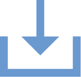
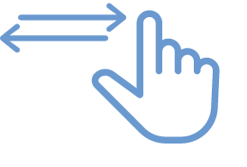

export const Highlight = ({children, color}) => (
  <h3
    style={{
      backgroundColor: color,
      borderRadius: '2px',
      color: '#000',
      paddingLeft: '1rem',
      paddingTop: '0.5rem',
      paddingBottom: '0.5rem',
    }}>
    {children}
  </h3>
);

<Highlight color="#DCDCDC">शब्द और एक्रनिम</Highlight>

| **शब्द**| **एक्रनिम**| **परिभाषा**|
|---|---|---|
| ** एक्टिवेशन चार्ज ** | एसीटी | नए ग्राहकों से कनेक्शन के लिए लिया जाने वाला भुगतान |
| ** डीजल जनरेटर ** | डीजी | बिजली पैदा करने वाला जनरेटर, जो डीज़ल से चलता है |
| ** डिस्पैच ** | | प्लांट के डिस्ट्रिब्यूशन नेटवर्क में पहुँचने वाली बिजली ** (kWh) ** |
| ** इलेक्ट्रिसिटी चार्ज ** | सीएचजी | बिजली की खपत के लिए जारी किए गए बिल की राशि |
| ** एनर्जी इफिशंट डिवाइस ** | ईईडी | बिजली का उपकरण, जो उपभोक्ताओं को एक स्कीम के तहत कंपनी द्वारा दिया जा सकता है|
| ** इक्वेटेड मंथली इंस्टालमेंट्स् ** | ईएमआई | किसी ऋण या स्थगित शुल्क के लिए हर माह किया जाने वाला भुगतान |
| ** जनरेशन ** | | ऊर्जा स्रोतों (सोलर और ** डीज़ल जनरेटर **) से पैदा हुई बिजली ** (kWh) ** |
| ** किलोवाट ** | kW | बिजली या भार की एक मानक इकाई, एक हजार ** वाट के बराबर ** |
| ** किलोवाट-घंटे ** | kWh | एक घंटे के लिए एक ** kW ** संचालन के बराबर ऊर्जा |
| ** मैक्ज़िमम पॉवर पॉइंट टैकर ** | एमपीपीटी | सौर ऊर्जा के उत्पादन को मॉड्यूलेट करने वाला उपकरण |
| ** माइक्रो एंटरप्राइज़ डेवलपमेंट ** | एमईडी | बहुत छोटा व्यवसाय, जिसे कंपनी सहायता देती है |
| ** मिनी ग्रिड कम्युनिकेशन एंड ऑपरेशन मेनेजमेंट सुइट ** | एमकॉम्स | मिनी ग्रिड चलाने वालों के लिए इलेक्ट्रॉनिक टूल्स का सेट, जिससे वे अपना व्यवसाय बढ़ा सकते हैं। ** 
| ** पॉइंट ऑफ सेल ** | पीओएस | फील्ड एजेंट को ग्राहक से प्राप्त नकद राशि | 
| ** टर्न अराउंड टाइम ** |  टैट |  गराहक से प्राप्त अनुरोध पर ध्यान देने और उसे पूरा करने में फील्ड एजेंट द्वारा लिया गया समय |
| ** वॉट ** | डब्ल्यू | पॉवर या लोड की मानक इकाई |

 

<Highlight color="#DCDCDC">स्मार्ट फोन एप्प के आइकॉन</Highlight>

 

	Tapping: the user should may on a particular area to explore the functionality

 
 

	Scroll: the user may scroll up-down to explore the page

 
 

	Data Entry: the user may fill in data to update the information on the application

 
 

	Down: Direction in which the page would move on scrolling

 
 

	Left-Right Navigation: the may user swipe left or right to navigate through a functionality

 
 

	Rotate Screen: Insists the user to rotate the screen to view the given page

