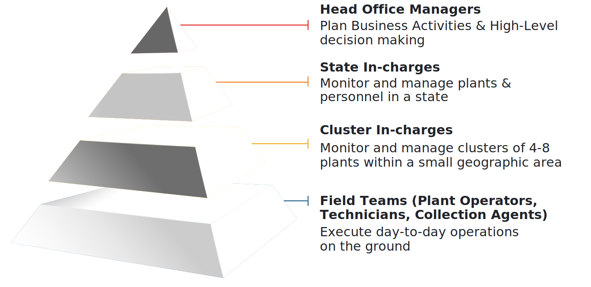

## 1.2.1. प्रयोजन
मिनी ग्रिड से जुड़े सभी पक्षों (स्टेकहोल्डर) को भलीभाँति संप्रेषण (कम्युनिकेशन) के लिए प्लेटफॉर्म प्रदान करना एमकॉम्स का लक्ष्य है। इसमें कामकाज का निश्चित क्रम (वर्कफ्लो) है, आसान इंटरफेस है, अन्य लोगों (थर्ड पार्टी) के हार्डवेअर ऑपरेट किए जा सकते हैं। डेटा अपने आप बहुत तेजी से एकत्रित होता है और पारदर्शी (ट्रांसपरेंट) तथा भरोसेमंद रिकॉर्ड तैयार होता है।

## 1.2.2. फंक्शनलिटीज़ (यानी कौन-कौन से कार्य किए जा सकते हैं)
एमकॉम्स को दो महत्वपूर्ण सिद्धांतों के आधार पर डिज़ाइन किया गया है। इन्हें चित्र 1 में दिखाया गया है।

#### चित्र 1 : एमकॉम्स के लिए बुनियादी डिज़ाइन सिद्धान्त

<table>
    <tr>
        <th>सटीक और व्यापक रिकॉर्ड रखते हुए</th>
        <th>वास्तविक समय संचार, नियंत्रण, और अद्यतन</th>
    </tr>
    <tr>
        <td>
            <ul>
                <li>जिसमें ऐतिहासिक तकनीकी और वित्तीय डेटा, उपयोगकर्ता की जानकारी, पौधों की विशिष्टताओं, प्रणाली में बदलाव आदि के केंद्रीकृत डेटाबेस शामिल हैं।</li>
            </ul>
        </td>
        <td>
            <ul>
                <li>किसी भी नोड से जारी किए गए आदेशों का सटीक रूप से प्रचार और वितरण, सभी उपयोगकर्ताओं को नवीनतम जानकारी प्रदान करने के लिए</li>
            </ul>
        </td>
    </tr>
</table>

सिस्टम द्वारा किए जाने वाले उच्च स्तर के कार्य चित्र 2 में बताए गए हैं।

#### चित्र 2 : एमकॉम्स की उच्च स्तरीय सुविधाएँ 

एमकॉम्स को इस प्रकार डिज़ाइन किया गया है कि व्यवसाय की सब तरह से निगरानी हो सके। बिजली की बिक्री, वित्तीय स्थिति, तकनीकी स्थिति और ग्राहक की मांग का विश्लेषण करने की व्यवस्था की गई है। इस तरह सभी प्रकार की जानकारी एक ही स्थान पर मिलने से मिनी ग्रिड चलाने वाले अपने प्रोजेक्ट के कामकाज को अच्छी तरह समझ सकते हैं।

## 1.2.3. उपयोगकर्ता (यूज़र्स)
मिनी ग्रिड व्यवसाय बहुमुखी है। इसमें अनेक कर्मचारियों और हितार्थियों (स्टेकहोल्डर) की भूमिकाएँ शामिल हैं। इन सभी उपयोगकर्ता समूहों की जरूरतें एमकॉम्स से पूरी हो सकती हैं। इनके कार्यप्रवाह (वर्कफ्लो) के बारे में आगे के सेक्शन में विस्तार से बताया गया है।

### 1.2.3.1. कंपनी के कर्मचारी
कामकाज में दक्षता और व्यवसाय के लक्ष्य प्राप्त करने के लिए टीम के हर सदस्य की भूमिका को स्पष्ट करना बहुत जरूरी होता है। मिनी ग्रिड ऑपरेशन में कर्मचारियों के पद का क्रम क्या रहेगा, यह चित्र 3 में दिखाया गया है और विस्तृत विवरण टेबल 1 में दिया गया है।

#### Figure 3: मिनी ग्रिड परिचालन में पदों का क्रम  

#### टेबल 1: मिनी ग्रिड कर्मचारियों की भूमिकाओं और जिम्मेदारियों का विवरण

<table>
  <tr>
    <th>पदनाम (डेज़िग्नेशन)</th>
    <th>भूमिका</th>
    <th>जिम्मेदारियाँ</th>
  </tr>
  <tr>
    <td><b>ऑपरेटर</b></td>
    <td>मिनी-ग्रिड प्लांट की सातों दिन चौबीसों घंटे (24x7) देखरेख करना।</td>
	<td>
		<ul>
                  <li> प्लांट के उपकरणों (इक्विपमेंट) की देखरेख, जिससे प्लांट भलीभाँति चलता रहे।</li>
                  <li> प्लांट रुक जाने (ट्रिप होने) के बाद बिजली फिर चालू करना। </li>
                  <li> प्लांट से संबंधित रूटीन डेटा रिकॉर्ड करना, जैसे प्लांट की मीटर रीडिंग।</li>
		  <li> प्लांट पर आने वाले ग्राहकों की शिकायत सुनना और दूर करना।</li>
               </ul>
	</td>
  </tr>
  <tr>
    <td><b>टेक्निशन</b></td>
    <td>ग्राहकों की या प्लांट की टेक्निकल समस्याओं को दूर करना।</td>
    	<td>
		<ul>
			<li> ग्राहक की कनेक्शन संबंधी समस्याओं को दूर करना।</li>
			<li> मिनी ग्रिड के सभी उपकरणों (इक्विपमेंट) की खराबियों का पता लगाना और उन्हें ठीक करना।</li>
			<li> नए उपभोक्ताओं को नेटवर्क से जोड़ना।</li>
			<li> ग्राहकों की बिजली की खपत रिकॉर्ड करना।</li>
		</ul>
	</td>
  </tr>
  <tr>
	<td><b>ग्राहक सेवा एजेंट (सीएसए)</b></td>
	<td>ग्राहक और बिक्री से संबंधित कार्य करना।</td>
	<td>
		<ul>
			<li> आवंटित किए गए क्षेत्र में संभावित ग्राहकों के बीच मिनी ग्रिड सेवाओं और योजनाओं की मार्केटिंग करना।</li>
			<li> ग्राहकों को बिल देना, उनसे बिल की राशि प्राप्त करना और उस राशि को जमा कराना। </li>
			<li> बिल का भुगतान न मिलने पर हस्तक्षेप करना। </li>
			<li> ग्राहकों की शिकायतें और कठिनाइयों को दूर करना। </li>
			<li> पैकेज को अपग्रेड / डाउनग्रेड करने के ग्राहकों के अनुरोध पूरे करना </li>
		</ul>
	</td>
  </tr>
  <tr>
	<td><b>समूह प्रभारी (क्लस्टर-इन-चार्ज) </b></td>
	<td> समूह में शामिल सभी प्लांट के परिचालन (ऑपरेशंस) और उनमें काम कर रहे कर्मचारियों पर निगाह रखना। </td>
	<td>
		<ul>
			<li> समूह के सभी प्लांट से हुई बिक्री का ध्यान रखना और समस्याओं को सामने लाना। </li>
			<li> समूह की परिचालन लागत का पता लगाना और बताना कि वे ठीक हैं या नहीं। </li>
			<li> लंबित (पेंडिंग) कार्यों पर ध्यान देना और उन्हें अपनी फील्ड टीम के बीच बाँटना। </li>
			<li> प्लांट के उपकरणों (इक्विपमेंट) की देखरेख करना और बदलने की जरूरत हो तो बदलने का इंतज़ाम करना। </li>
			<li> कर्मचारियों के प्रशिक्षण संबंधी कार्य देखना। </li>
		</ul>
	</td>
  </tr>
  <tr>
	<td><b>राज्य प्रभारी (स्टेट इन-चार्ज)</b></td>
	<td>राज्य प्रभारी प्लांट के परिचालन (ऑपरेशंस) पर निगाह रखना।</td>
	<td>
		<ul>
			<li> हर महीने के व्यवसाय के लक्ष्य तय करना और लक्ष्य की ओर बढ़ने में हुई प्रगति का ध्यान रखना। ये लक्ष्य राजस्व (रेवेन्यू) के भी होंगे और ग्राहकों की संख्या के भी। </li>
			<li> राज्य के सभी प्लांट में स्कीमों और आगे बढ़ने के उपायों में तालमेल बनाए रखना। </li>
			<li> प्रधान कार्यालय के लिए विक्रय और परिचालन (ऑपरेशंस) की रिपोर्टें तैयार करना।</li>
			<li> नए कर्मचारियों की भर्ती की योजना बनाना।</li>
			<li> कामकाज बढ़ाने, नए प्लांट लगाने और नए कर्मचारी भर्ती करने की योजना बनाना तथा तालमेल स्थापित करना।</li>
		</ul>
	</td>
  </tr>
  <tr>
	<td><b>प्रधान कार्यालय प्रबंधक</b></td>
	<td>सभी महत्वपूर्ण बातों पर निर्णय लेना। साथ ही कामकाज की व्यवस्था और कामकाज में वृद्धि के लिए कार्य करना।</td>
	<td>
		<ul>
			<li> कामकाज बढ़ाने के तरीके और उपाय खोजना। </li>
			<li> आय-व्यय रिपोर्टों का मिलान करना। </li>
			<li> सभी प्लांट की तकनीकी स्थिति की एक-दूसरे से तुलना करना और उनके सर्वोत्तम उपयोग के लिए जरूरी व्यवस्था कराना।</li>
			<li> नए पैकेज और सेवाएँ तैयार कराना।</li>
			<li> व्यवसाय बढ़ाने के रणनीतिक, तकनीकी और वित्तीय उपायों की योजना बनाना</li>
		</ul>
	</td>
  </tr>
</table>

### 1.2.3.2. मिनी ग्रिड ग्राहक
मिनी ग्रिड की एक खास बात यह है कि यह कई प्रकार के ग्राहकों की जरूरत पूरी कर सकता है चाहे उनकी बिजली की जरूरत किसी भी प्रकार की हो। जैसे, रहवासी मकानों की बिजली की जरूरत का स्तर बहुत साधारण होता है। उन्हें शाम को कुछ साधारण उपकरण (इक्विपमेंट) चलाने होते हैं, जबकि दुकानों को दिन में सबसे ज्यादा बिजली की जरूरत होती है। वाणिज्यिक प्रतिष्ठानों में विशेष प्रकार के उपकरण (इक्विपमेंट) लगे होने से उन्हें बहुत ज्यादा लोड वाले कनेक्शन की जरूरत पड़ती है।

परंतु सभी उपभोक्ताओं की बुनियादी जरूरतें एक जैसी होती हैं। उन्हें अपना बिल और बिजली की खपत देखनी होती हैं। बिजली कंपनी के चेताने वाले संदेश और सूचनाएँ प्राप्त करनी होती हैं। अपने खाते को अपडेट कराना होता है और कोई गड़बड़ी होने पर किसी से संपर्क करना होता है। एमकॉम्स का लक्ष्य है कि इस प्रकार की सभी सूचनाओं का आदान-प्रदान आसान हो जाए और ग्राहकों को जिस प्रकार की सूचना और सहायता की जरूरत हो, वह माँगने पर उन्हें मिल जाए।

### 1.1.1.3 एक्सेस की अनुमति
अलग-अलग तरह के उपयोगकर्ताओं की सिस्टम के डेटाबेस और प्रबंधन संबंधी कार्यों (मेनेजमेंट फंक्शनलिटी) तक पहुँचने की आवश्यकता का स्तर अलग-अलग होगा। इसलिए एमकॉम्स का एक मूल घटक है हर उपयोगकर्ता की एक्सेस की अनुमति तय करना। इससे न केवल इसका उपयोग आसान हो जाएगा, क्योंकि हर उपयोगकर्ता अपने से संबंधित सामग्री पर ही ध्यान देगा, बल्कि संवेदनशील (सेंसिटिव) डेटा सुरक्षित रहेगा।

उदाहरण के लिए
* ग्राहक सिर्फ स्वयं के बिल देख पाएँ, किसी दूसरे के नहीं।
* प्लांट ऑपरेटर सिर्फ अपने प्लांट का डेटा रिकॉर्ड करें।
* देखरेख संबंधी कार्य और उपकरणों (इक्विपमेंट) के परिचालन (ऑपरेशंस) का नियंत्रण समूह प्रभारी या राज्य प्रभारी के हाथों में हो न कि प्लांट के ग्राहक सेवा एजेंट या टेक्निशन के हाथों में।
* बैंक में जमा राशियों और व्ययों की रिपोर्ट केवल उच्च स्तरीय प्रबंधक ही देख सकें।

इस मैनुअल में एमकॉम्स सिस्टम के सभी फीचर बताए गए हैं। सर्वोच्च उपयोगकर्ता (उदाहरण के लिए कंपनी के सीईओ) ही सभी फीचर देख सकेंगे। कोई अन्य उपयोगकर्ता अपने पद के अनुसार इनके किसी भाग (सब-सेट) को ही देख सकेगा। संदर्भ के अनुसार प्रकरण-दर-प्रकरण इसे स्पष्ट किया जाएगा।

## 1.2.4. संप्रेषण (कम्युनिकेशन)
यह बात पहले ही बताई जा चुकी है कि मिनी ग्रिड व्यवसाय भलीभाँति चलाने के लिए सभी संबंधित लोगों (स्टेकहोल्डर) के बीच संप्रेषण (कम्युनिकेशन) सबसे ज्यादा महत्वपूर्ण है। ऊपर से नीचे तक बढ़िया संप्रेषण की सुविधा होनी चाहिए। उदाहरण के लिए प्रधान कार्यालय के प्रबंधकों को फील्ड में अलग-अलग स्थानों पर कार्य कर रही टीम से जानकारी प्राप्त करने की सुविधा होनी चाहिए। इससे व्यवसाय का कामकाज बहुत अच्छे से चल सकता है।

कोशिश की गई है कि यह प्रयोजन निष्क्रिय संप्रेषण (पेसिव कम्युनिकेशन) से पूरा हो जाए –
* कार्य करने के क्रम (वर्क फ्लो) को इतनी अच्छी तरह दिखाया गया है कि उपयोगकर्ता को कार्य पूरा करने के बारे में मार्गदर्शन मिलता चला जाता है।
* हर रोज या निश्चित समय पर किए जाने वाले कार्यों की सूचना अपने आप मिलती रहती है।
* ऐसी व्यवस्था की गई है कि महत्वपूर्ण सूचनाएँ सबसे ऊपर रहें।
* डेटा का एकीकरण (कंसालिडेशन) शीघ्रता से होता है, जिससे सभी उपयोगकर्ताओं को नवीनतम (अप-टु-डेट) जानकारी मिलती है।
* कुछ प्रकार के लेनदेन को प्राधिकृत (ऑथराइज़) करने के लिए ग्राहकों और प्रबंधकों दोनों को ओटीपी प्राप्त होते हैं।

उपयोगकर्ताओं के बीच सक्रिय संप्रेषण (एक्टिव कम्युनिकेशन) के लिए भी कई प्रकार की व्यवस्था की गई है –
* स्मार्टफोन एप्प से सूचनाएँ और डेटा भेजा जा सकता है।
* वेब प्लेटफॉर्म से सूचनाएँ और डेटा भेजा जा सकता है।
* ई-मेल से सूचनाएँ भेजी जा सकती हैं।
* सूचनाएँ और अनुरोध एसएमएस से भेजे जा सकते हैं।

अलग-अलग उपयोगकर्ताओं की पसंद (प्रिफरेंस) अलग-अलग होती है। ऐसे में अनेक प्रकार से संप्रेषण ज्यादा महत्वपूर्ण हो जाता है। जैसे, स्मार्टफोन एप्प का उपयोग न करने वाले ग्राहकों को बिल, रसीदें और सूचनाएँ एसएमएस से प्राप्त हो जाते हैं।
