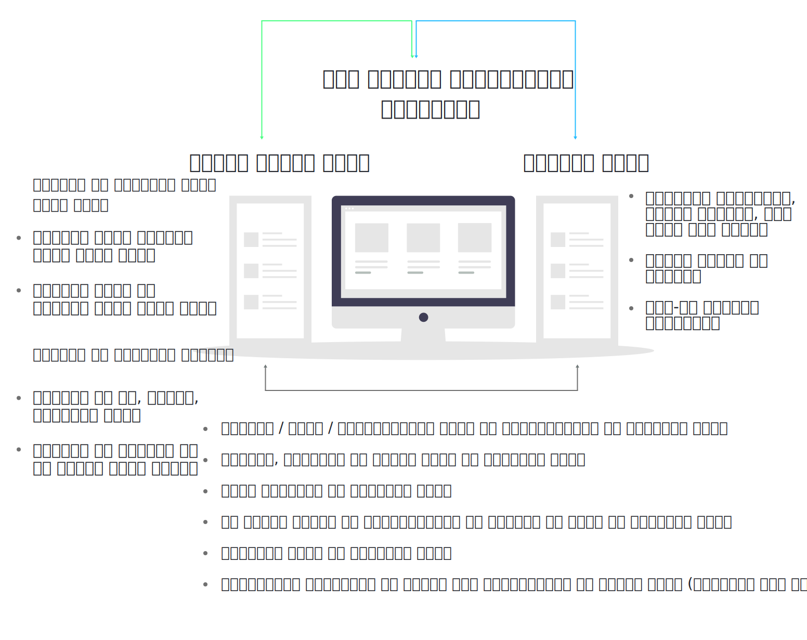
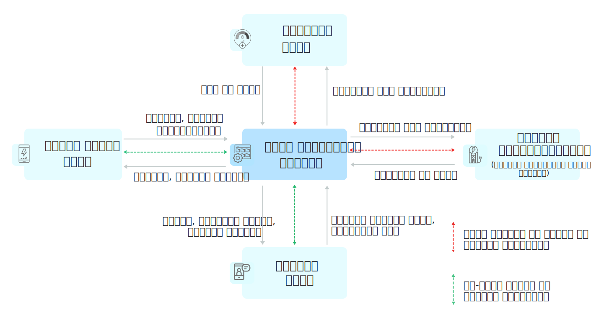

## 1.3.1. पहले स्तर का (फ्रंट एंड) इंटरफेस
मिनी ग्रिड के ग्राहक, फील्ड एजेंट और प्रबंधन वर्ग एक ही प्लेटफॉर्म पर एक ही समय एक साथ (रिअल टाइम इंटिग्रेशन) किस प्रकार रहते हैं, यह चित्र 4 में दिखाया गया है।

#### Figure 4: मकस का इंटरफ़ेस इंटीग्रेशन

आगे के सेक्शन में हर इंटरफेस के बारे में बताया गया है

### 1.3.1.1. कस्टमर एप्प
#### चित्र 5: कस्टमर पंप का स्क्रीन शॉट 

कस्टमर स्मार्टफोन एप्प में आसानी से समझ में आने वाला चित्रात्मक इंटरफेस दिया गया है, जिससे मिनी ग्रिड के ग्राहक
* यह देख सकते हैं कि उन्होंने कितनी बिजली इस्तेमाल की है, बिल कितना आया है और उन्होंने कब-कब कितना भुगतान किया है।
* रसीदें भी उसी में रखी रहती हैं।
* अपना पूरा विवरण (कस्टमर प्रोफाइल) देख सकते हैं और उसेसंपादित कर सकते हैं। 
* सर्विस और पैकेज बदलने का अनुरोध भेज सकते हैं।
* उनके खाते और बिजली की सप्लाई के बारे में या अन्य किसी प्रकार के सतर्कता संदेश और सूचनाएँ प्राप्त कर सकते हैं।

जिन ग्राहकों के पास स्मार्टफोन न हो, वे कुछ गिने-चुने कार्यों के संदेश एसएमएस से प्राप्त कर सकते हैं (देखें चित्र 6)

The customer app is fully documented in Chapter 0.

#### चित्र 6: मकस सर्विस का स्क्रीन शॉट

### 1.3.1.2. फील्ड एजेंट एप्प
#### Figure 7: Screenshot of the field agent App.

फील्ड एजेंट स्मार्टफोन एप्प मिनी ग्रिड व्यवसाय के हर स्तर के कर्मचारी को विस्तृत इंटरफेस प्रदान करता है।

ग्राउंड ड्यूटी में लगे कर्मचारी इस एप्प से
* ग्राहकों के खाते देख सकते हैं।
* लेनदेन रिकॉर्ड कर सकते हैं।
* असाइनमेंट और सूचनाएँ प्राप्त कर सकते हैं
* ग्राहकों को रजिस्टर कर सकते हैं और उनका पैकेज बदल सकते हैं।

प्रबंधन देख रहे कर्मचारी इस एप्प से
* बिक्री और व्यवसाय की स्थिति मालूम कर सकते हैं।
* अपनी फील्ड टीम से संप्रेषण (कम्युनिकेशन) कर सकते हैं।
* सामने आ रहे मुद्दों का अंदाज लगा सकते हैं और उनसे संबंधित जरूरी कार्रवाई कर सकते हैं।
* मिनी ग्रिड के तकनीकी परिचालन पर नजर रख सकते हैं।

फील्ड एजेंट एप्प के बारे में अध्याय 3 में पूरी तरह बताया गया है।

### 1.3.1.3. वेब प्लेटफॉर्म
वेब प्लेटफॉर्म एमकॉम्स का फ्रंट एंड है जिसका उपयोग समूह (क्लस्टर), राज्य और मुख्यालय (हेड क्वार्टर) की मेनेजमेंट टीम द्वारा किया जाता है। इसमें विस्तृत डैशबोर्ड तथा डेटा विश्लेषण संबंधी सुविधाएँ मौजूद रहती हैं। इसका उपयोग करने वाले डेटाबेस रिकॉर्ड को देख सकते हैं और उसे एडिट भी कर सकते हैं।

वेब इंटरफेस की विस्तृत गाइड इस मैनुअल के भावी संस्करण में शामिल की जाएगी। इस संस्करण में इसे छोड़ा गया है।

## 1.3.2. डेटा कहाँ से प्राप्त होता है और कहाँ भेजा जाता है (डेटा सोर्सेस एंड ट्रांसमिशन)
पिछले सेक्शन 1.3.1. में बताए अनुसार एमकॉम्स में कमांड और सूचना का तत्काल (रिअल टाइम) आदान-प्रदान होता है। एमकॉम्स की क्षमता को पूरी तरह समझने और उपयोग करने के लिए सूचनाओं के विविध मार्गों पर नजर डालना आवश्यक है। साथ ही यह भी देखना है कि अलग-अलग स्थानों पर मौजूद हार्डवेअर और सॉफ्टवेअर आपस में किस प्रकार संवाद करते हैं।

### 1.3.2.1. सिस्टम पर एक नज़र
सेंट्रल-डेटा-मेनेजमेंट-सिस्टम डेटा-भंडार (रिपॉज़िटरी) और कमांड-राउटर दोनों का काम करता है और किसी निश्चित उपयोगकर्ता या हार्डवेअर को सूचना भेज सकता है। हार्डवेअर के मुख्य नोड्स् और उनके बीच संदेशों के दोतरफा आदान-प्रदान को चित्र 8 में दिखाया गया है। अगले सेक्शन में डेटा कलेक्शन और ट्रांसमिशन की व्यवस्था के बारे में विस्तार से जानकारी दी गई है।

#### चित्र 8: मकस के घटकों के बीच डाटा-फ्लो

### 1.3.2.2. डेटा को मैनुअली दर्ज करना (मैनुअल डेटा इनपुट)
बिक्री और ग्राहकों से संबंधित सूचनाएँ फील्ड एजेंट और ग्राहक दोनों ही सिस्टम में दर्ज कर सकते हैं। यह सूचना बुनियादी और सबसे महत्वपूर्ण होती है और यहाँ से व्यवसाय के सभी स्तर के कर्मचारियों तक पहुँचती है।

कुछ सूचनाएँ जरूरत के अनुसार दर्ज की जाती हैं। नए ग्राहक को जोड़ना या भुगतान की सूचना दर्ज करना इसके उदाहरण हैं। अन्य प्रकार की सूचनाएँ रूटीन टाइप की होती हैं, जैसे सौर ऊर्जा उत्पादन दर्ज करना या ग्राहक के मीटर की रीडिंग लेना।

### 1.3.2.3. स्मार्ट मीटर
स्मार्ट एनर्जी मीटर से बिजली की खपत के आँकड़े क्लाउड सर्वर में चले जाते हैं जिससे डेटा अपने आप अपलोड हो जाता है और रिमोट कंट्रोल क्षमताओं का उपयोग होने लगता है। विभिन्न मीटरों की टेक्नॉलजी में कुछ-कुछ अंतर होता है, पर ये सिस्टम आमतौर पुरानी तरह के मीटरों के मुकाबले कई तरह की सुविधा देते हैं, जिन्हें चित्र 9 में दिखाया गया है।

#### चित्र 9:  स्मार्ट मीटरिंग के लाभ 

स्मार्ट मीटर के साथ संप्रेषण (कम्युनिकेशन) हार्डवेअर निर्माता के सॉफ्टवेअर और क्लाउड सर्वर के माध्यम से होता है। सर्वर से डेटा निकाला जा सकता है और निर्माता के पोर्टल और/या उनके एपीआइ के मार्फत किसी भी एक मीटर (या मीटर के समूह) को कमांड भेजे जा सकते हैं।

### 1.3.2.4 प्लांट के उपकरण (इक्विपमेंट्स्)
सप्लाइ साइड उपकरणों जैसे इन्वर्टर, बैटरी और सोलर पैनल की हालत का पूरा रिकॉर्ड मिनी ग्रिड कंट्रोल रूम में लगाए गए डेटा लॉगर से प्राप्त किया जा सकता है। इस रिकॉर्ड से प्रबंधन वर्ग (मेनेजमेंट) अपने सिस्टम के कामकाज और हालत (हेल्थ) का अंदाज लगा सकता है।

सिस्टम में ज्यादा उन्नत किस्म के (सॉफिस्टिकेटेड) सेटअप कर डेटा कलेक्शन को ऑटोमेटेड रिअल टाइम परफार्मेन्स ऑप्टिमाइजेशन और दुतरफा संप्रेषण क्षमता (टू-वे कम्युनिकेशन केपेबिलिटी) से जोड़ा जा सकता है, जिससे टेक्निशन प्लांट चलाने के कामकाज (ऑपरेशंस) को दूर से ही नियंत्रित कर सकते हैं। 

#### चित्र 9 : मिनी ग्रिड के सप्लाइ साइड उपकरणों की तकनीकी निगरानी