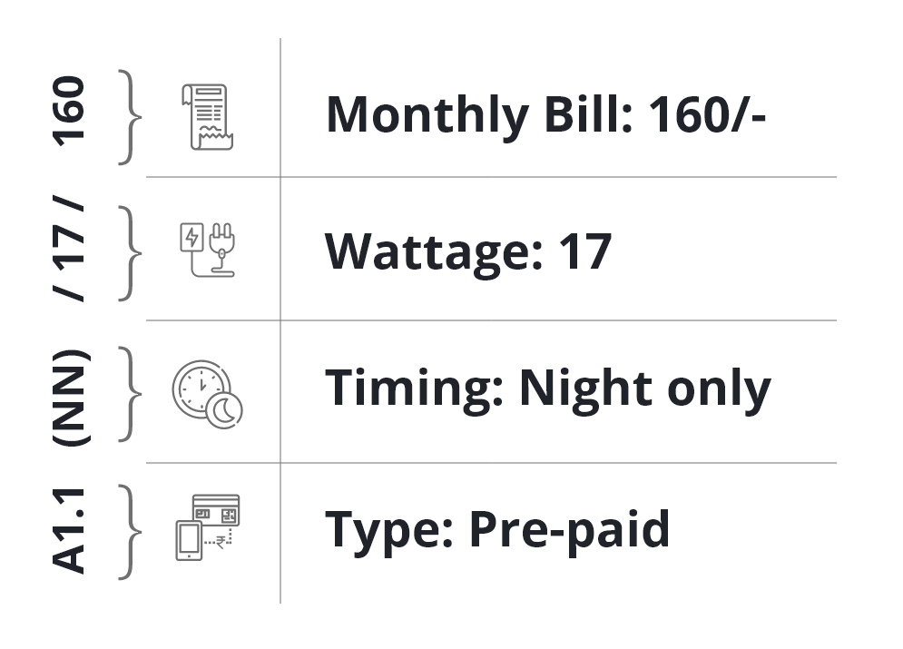
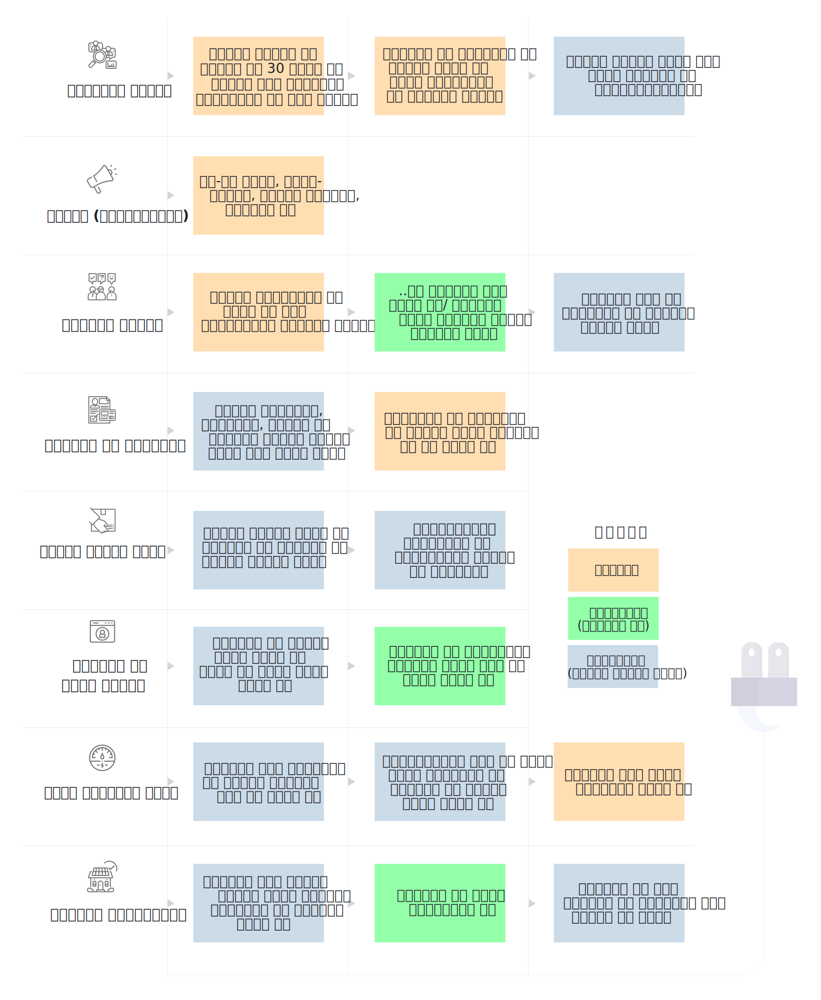
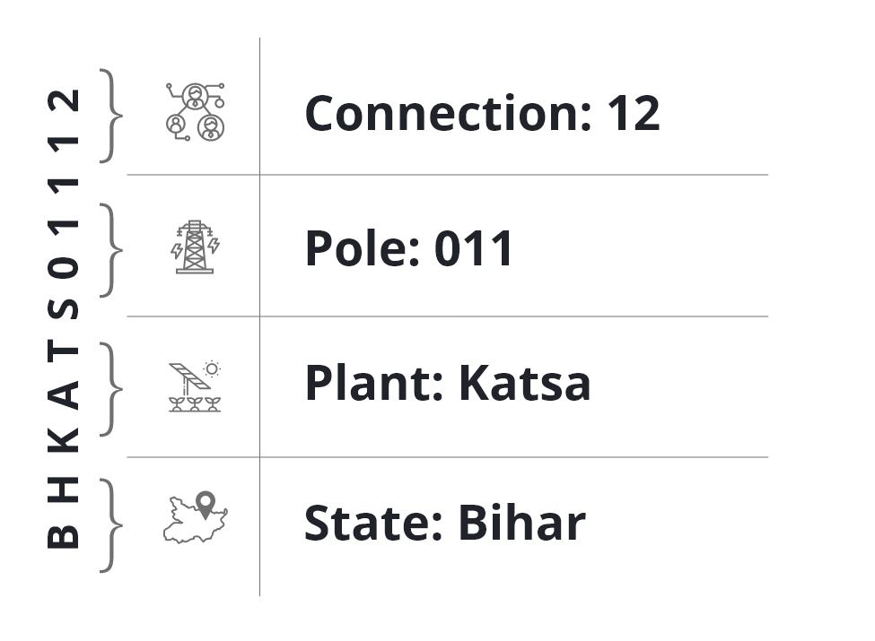
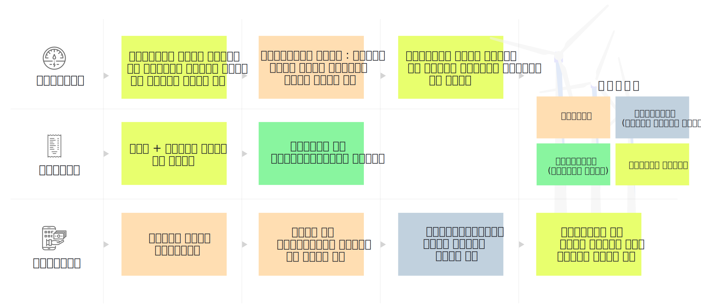
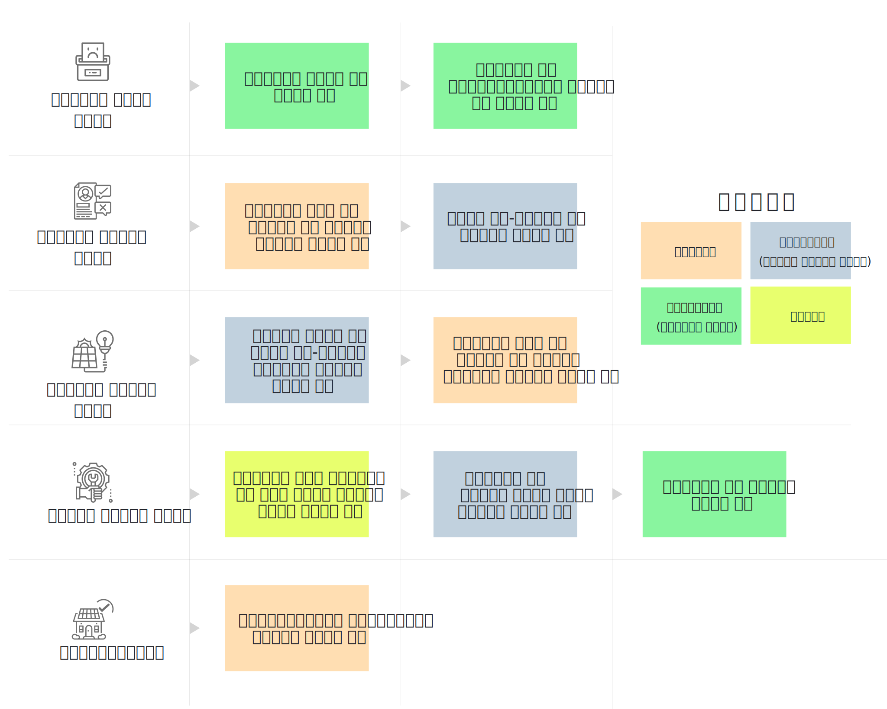

## 2.2.1. पैकेज तैयार करना
पैकेज से ग्राहक तय कर सकता है कि उसे कितनी बिजली की जरूरत है और वह कितनी कीमत चुका सकता है। पैकेज़ तैयार करने और चुनने में बिजली सप्लाइ की तीन मुख्य बातों का ध्यान रखना ही चाहिए :

* कनेक्शन अधिकतम कितना पॉवर या लोड उठा सकता है
* कनेक्शन किस समय सक्रिय रहेगा
* जितनी बिजली की खपत हुई हो, उसकी प्रति यूनिट लागत (हो तो)

हर पैकेज में ये तीनों बातें इस प्रकार शामिल की जाती हैं कि पैकेज मौजूदा और संभावित ग्राहकों की खपत के पैटर्न के अनुकूल हो और बिजली सप्लाइ करने तथा व्यवसाय की जरूरतों की लागत निकल सके। लगभग हर प्लांट आमतौर पर कई प्रकार के पैकेज ऑफर करता है।

पोस्ट-पेड पैकेजों के बिल बिलिंग-अवधि में हुई खपत के आधार पर बिलिंग-अवधि समाप्त होने के बाद तैयार किए जाते हैं। इस प्रकार के कनेक्शन में अलग तरह के मीटर लगाए जाते हैं और बिजली की जितनी खपत हुई हो, उतने के बिल बनते हैं। प्रि-पेड पैकेज में ग्राहकों को एक निश्चित राशि पहले से देनी होती है ताकि बिजली की उस स्तर की सप्लाइ बनाई रखी जा सके।

#### चित्र 10: पैकेज आईडी कंस्ट्रक्ट करने का उदहारण 

## 2.2.2. ग्राहक को ऐड करना
ग्राहक को ऐड करने की पूरी प्रक्रिया क्रमिक रूप से (स्टेप बाय स्टेप) चित्र 11 में दिखाई गई है। जो कार्य हरे या नीले रंग में दिखाए गए हैं वे एमकॉम्स एप्प से किए जाते हैं।

#### चित्र 11: ग्राहक को ऐड करने की सम्पूर्ण प्रक्रिया 

### 2.2.2.1. यूनिक कस्टमर आइडी
हर ग्राहक को उसका खाता तैयार होते ही एक यूनिक आइडी नंबर दिया जाता है। एमकॉम्स एप्प में ये नंबर बड़ी भूमिका निभाते हैं। बिजली की खपत, सभी भुगतान का विवरण (हिस्ट्री) आदि इस आइडी के अनुसार रखा जाता है।

कस्टमर आइडी का उदाहरण चित्र 12 में दिखाया गया है।

#### चित्र 12: ग्राहक के आईडी बनाने का उदाहरण 

## 2.2.3. ग्राहक का स्टेटस
ग्राहक का स्टेटस या तो “एक्टिव” हो सकता है या “इनेक्टिव”/“बैन्ड”
* एक्टिव ग्राहक वे होते हैं जिन्होंने बिल का समय पर भुगतान किया है (अर्थात् उनका उधार निर्धारित सीमा में है) और जो लगातार मिनी ग्रिड की सेवाएँ ले रहे हैं।
* इनेक्टिव / बैन्ड ग्राहक वे हैं जिनके कनेक्शन भुगतान न करने के कारण या ग्राहक की इच्छा से समाप्त कर दिए गए हैं या ऐसा भी हो सकता है कि बिजली की मांग प्लांट की क्षमता से अधिक हो गई हो और कुछ ग्राहकों को छोड़ना जरूरी हो गया हो। हालाँकि ऐसा बहुत कम होता है।

एमकॉम्स उन ग्राहकों के बारे में अपने आप बता देता है, जिन्हें डिएक्टिवेट करना है। यदि कनेक्शन के साथ स्मार्ट मीटर लगाया गया है तो डिएक्टिवेशन का कार्य अपने आप हो जाता है। 

## 2.2.4. मीटरिंग, बिलिंग और कलेक्शन
मीटरिंग, बिलिंग और कलेक्शन (एमबीसी) के माध्यम से ग्राहक इस्तेमाल की गई बिजली के लिए भुगतान करता है। इसका तरीका नीचे बताया गया है और चित्र 13 में दिखाया गया है।
* मीटरिंग
    * पुरानी तरह के मीटरों में बिल की अवधि के आखिर में नई रीडिंग नोट की जाती है।
    * स्मार्ट मीटरों (सेक्शन 1.3.2.3. देखें) में बिजली की खपत की गिनती अपने आप हो जाती है।
    * लोड लिमिटर (प्रि-पेड) कनेक्शन में मीटरिंग की जरूरत नहीं पड़ती।
* बिलिंग
    * जिन ग्राहकों के यहाँ मीटर लगे हैं, उनकी बिजली की खपत को उपयुक्त (एप्रोप्रिएट) टैरिफ से गुणा करने पर बिल की राशि निकल आती है।
    * जिन ग्राहकों के यहाँ मीटर नहीं लगे हैं, उन्हें हर महीने एक निश्चित राशि चुकानी होती है, इसलिए किसी प्रकार की गिनती करने की जरूरत नहीं होती।
    * ग्राहकों को बिल या तो इलेक्ट्रॉनिक फॉर्म में दिए जाते हैं या फील्ड एजेंट स्वयं जाकर देते हैं।
* कलेक्शन
    * ग्राहक अपने बिल का तथा अन्य बकाया राशि का भुगतान करता है।
    * भुगतान नकदी (स्वयं पीओएस जाकर) या किसी मोबाइल वॉलिट (जैसे पेटीएम) से या कार्ड से किया जा सकता है।
    * आंशिक भुगतान भी ले लिया जाता है किंतु फील्ड एजेंट को बार-बार कलेक्शन के लिए जाना पड़ता है।

#### चित्र 13: मीटरिंग, बिलिंग और कनेक्शन का वर्कफ़्लो

## 2.2.5. ग्राहक को रसीदें
पारदर्शिता (ट्रांसपरेंसि) और भरोसे के लिए जरूरी है कि बिल और भुगतान का रिकॉर्ड कंपनी और ग्राहक दोनों देख सकें। किसी भी विवाद को रोकने और सुलझाने में भी इससे सहायता मिलती है। सक्रिय उपभोक्ता (एक्टिव कंज़्यूमर) को जारी की गई रसीदें बिल के भुगतान का प्राथमिक प्रमाण (प्राइमरी प्रूफ) है। ये रसीदें कई प्रकार से जारी की जाती हैं।

* **प्रिंट आउट :**  उपभोक्ता के मांगने पर फील्ड एजेंट अपने पोर्टेबल प्रिंटर से लेनदेन की पेपर रसीद प्रिंट कर सकता है।
* **डिजिटल रिकॉर्ड :**  स्मार्टफोन एप्प वाले ग्राहक अपने सारे लेनदेन कंपनी के एजेंट की तरह ही देख सकते हैं।
* **स्क्रीनशॉट :**  जिन ग्राहकों के पास एप्प नहीं है, वे कंपनी के एजेंट से स्क्रीनशॉट मंगा सकते हैं और उसे अपने फोन में इमेज के रूप में सहेज (सेव) कर रख सकते हैं।
* **एसएमएस :**  ग्राहकों को एसएमएस अपने आप प्राप्त होते हैं जिनमें बिल की सूचना होती है और भुगतान मिलने की पुष्टि (कन्फर्मेशन) भी।

## 2.2.6. प्रोफाइल को एडिट करना
ग्राहक का रिकॉर्ड, विशेषकर उसका पता और फोन नंबर अप-टु-डेट रखना बहुत जरूरी है यानी पता या फोन नंबर बदला हो तो नया पता और नंबर रिकॉर्ड होना चाहिए। इससे ग्राहक को बिल और भुगतान की रसीदें भलीभाँति प्राप्त होती हैं और बिजली सप्लाइ में कोई बाधा हो या कंपनी की कोई प्रमोशन स्कीम हो तो उसकी सूचना भी दी जा सकती है।

कस्टमर एप्प द्वारा ग्राहक स्वयं अपनी सूचनाओं को अपडेट कर सकते हैं या फील्ड एजेंट ग्राहक की सहमति (और ओटीपी से) ऐसा कर सकते हैं।

## 2.2.7. सेवा संबंधी अनुरोध (सर्विस रिक्वेस्ट)
बिजली की सप्लाइ में बाधा आने या कनेक्शन में अन्य कोई समस्या होने पर ग्राहक सर्विस रिक्वेस्ट भेजते हैं। सर्विस रिक्वेस्ट भेजने के तरीके नीचे बताए गए हैं।

* कस्टमर एप्प में उपलब्ध सर्विस रिक्वेस्ट मॉड्यूल से, जो प्रयोग में बहुत आसान है।
* फील्ड एजेंट एप्प से, जिसमें ग्राहक सीधे फील्ड एजेंट से संपर्क करता है और एजेंट उसकी ओर से सेवा की मांग दर्ज करता है।

हर प्रकार की सेवा की मांग पूरी करने का तरीका नीचे बताया गया है।

#### चित्र 14: सेवा सम्बन्धी अनुरोधों का वर्कफ़्लो 

## 2.2.8. सिक्युरिटी डिपॉज़िट
हर नए ग्राहक से सिक्युरिटी डिपॉज़िट लिया जाता है। इसकी राशि ग्राहक के अनुमानित मासिक बिल के आधार पर तय होती है। नियमित भुगतान न होने पर कंपनी इस डिपॉज़िट में से अपनी बकाया राशि वसूलती है। कनेक्शन वापस करने पर यह राशि ग्राहक को लौटा दी जाती है। सिक्युरिटी डिपॉज़िट जमा करने का तरीका  **Error! Reference source not found.**

## 2.2.9. पैकेज बदलना
जिन उपभोक्ताओं की बिजली की जरूरत या स्थितियाँ बदलती हैं, वे अपना पैकेज बदलने का विचार कर सकते हैं। जैसे किसी घरेलू कनेक्शन वाले ग्राहक ने बिजली से चलने वाला नया सामान खरीदा हो तो वह लोड की लिमिट बढ़ाने के लिए कह सकता है या ज्यादा समय तक बिजली देते रहने का कह सकता है।

पैकेज बदलने का अनुरोध कस्टमर एप्प के माध्यम से किया जा सकता है। फील्ड एजेंट भी ग्राहक की ओर से यह अनुरोध कर सकता है। इस कार्य के निम्नलिखित चरण (स्टेप्स) हैं –

* **रिक्वेस्ट दर्ज करना:** पैकेज बदलने का अनुरोध सिस्टम में दर्ज हो जाता है।
* **अनुमोदन (अप्रूवल):** मिनी ग्रिड में यह काम देखने वाला कर्मचारी इस रिक्वेस्ट को देखता है। कुछ स्थितियों में रिक्वेस्ट अस्वीकार की जा सकती है।
* **भुगतान:** ग्राहक और कंपनी भुगतान की राशि तय करते हैं। जैसे सिक्युरिटी डिपॉज़िट की बढ़ी हुई राशि।
* **डेटाबेस को अपडेट करना:** ग्राहक को दिए गए नए पैकेज को दर्ज किया जाता है। नया पैकेज या तो तत्काल दे दिया जाता है या बिल की अगली अवधि शुरू होने पर दिया जाता है।
* **कनेक्शन को अपडेट करना:** नए पैकेज के विवरण (यानी लोड लिमिट और टाइमिंग) के अनुसार स्मार्ट मीटर को या लोड लिमिटर को दुबारा तय (रिप्रोग्राम) किया जाता है या ग्राहक को किसी अलग फीडर से जोड़ दिया जाता है।

## 2.2.10. उपहार के रूप में दी जाने वाली (कांप्लिमेंटरी) व्यावसायिक सेवाएँ
उतने ही मूल्य में अधिक सेवाएँ (वैल्यू एडेड सर्विस) यानी वे कार्य जो बिजली प्रदान करने के मूल कार्य के अलावा किए जाते हैं। ये कार्य कई प्रयोजनों से किए जाते हैं। इनसे ग्राहकों को नई सेवाएँ और नए अवसर मिलते हैं। स्थानीय समुदाय पर बहुत अच्छा प्रभाव पड़ता है। मिनी ग्रिड संचालक की छवि में निखार आता है और बिजली की बिक्री बढ़ती है।

उतने ही मूल्य में अधिक सेवाओं के तहत कुछ सेवाएँ व्यवसाय और सूक्ष्म उद्यम विकास की ओर ले जाती हैं और कुछ सेवाएँ घरों तथा व्यक्तियों को प्राप्त होती हैं। नीचे इनके दो उदाहरण दिए गए हैं।

<u>पहला उदाहरण : पानी की बिक्री</u> 
बहुत-से मिनी ग्रिड परिचालकों (ऑपरेटर) ने अपने प्लांट में पानी साफ करने की मशीनें लगाई हैं। इनसे स्थानीय लोगों को साफ और ठंडा पानी मिलता है। कमाई का साधन पैदा होता है और मिनी ग्रिड को निरंतर कमाई देने वाला ग्राहक मिल जाता है। इस कार्य में कंपनी की संलग्नता (इनवॉल्वमेंट) के अनुसार वे पानी साफ करने की इकाई के उत्पादन, बिक्री और बिजली की खपत की जानकारी रखते रहेंगे। ये कार्य करने की सुविधाएँ (फंक्शनलिटीज़) एमकॉम्स में उपलब्ध हैं।
  
<u>दूसरा उदाहरण : उपकरणों की बिक्री (एप्लायन्स प्रमोशन)</u> 
ग्राहकों को बिजली के उपकरण बेचने की कंपनी द्वारा संचालित योजनाएँ बीते समय में सफल रही हैं। इन स्कीमों से संभावित ग्राहक बिजली का कनेक्शन लेने और मौजूदा ग्राहक अपनी बिजली की खपत बढ़ाने के लिए आकर्षित होते हैं। पैकेज के अनुसार उपकरण खरीदने वाले बिजली के बिल के साथ उपकरण के मूल्य का भी किश्तों में भुगतान करते रहते हैं। उपकरण की पूरी कीमत एक साथ चुकाने के मुकाबले यह स्कीम बहुत आकर्षक होती है।