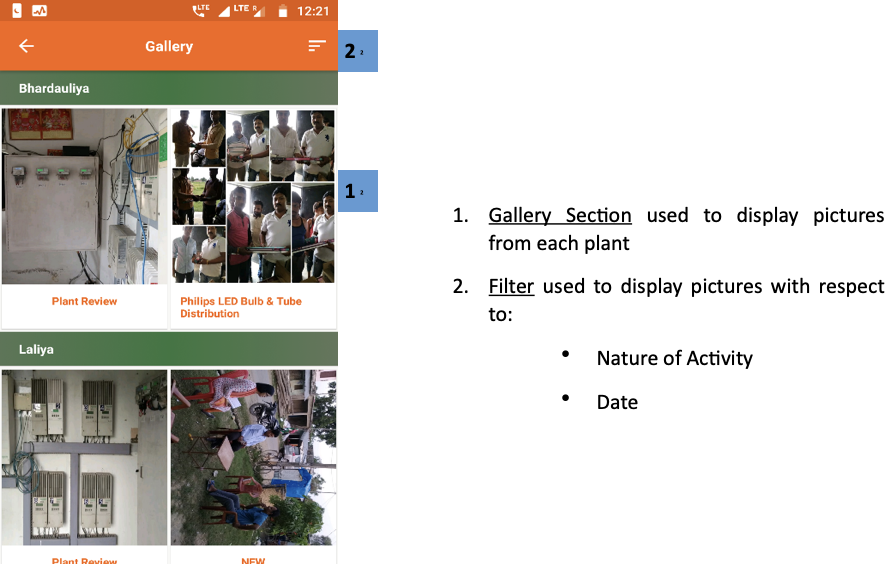
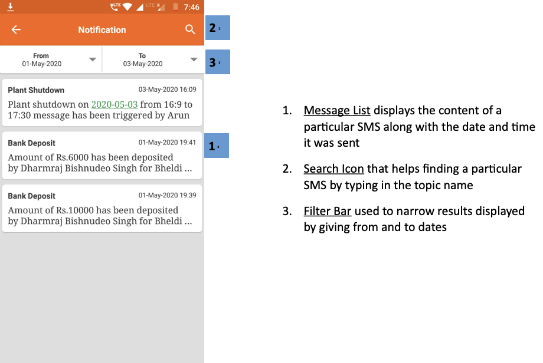
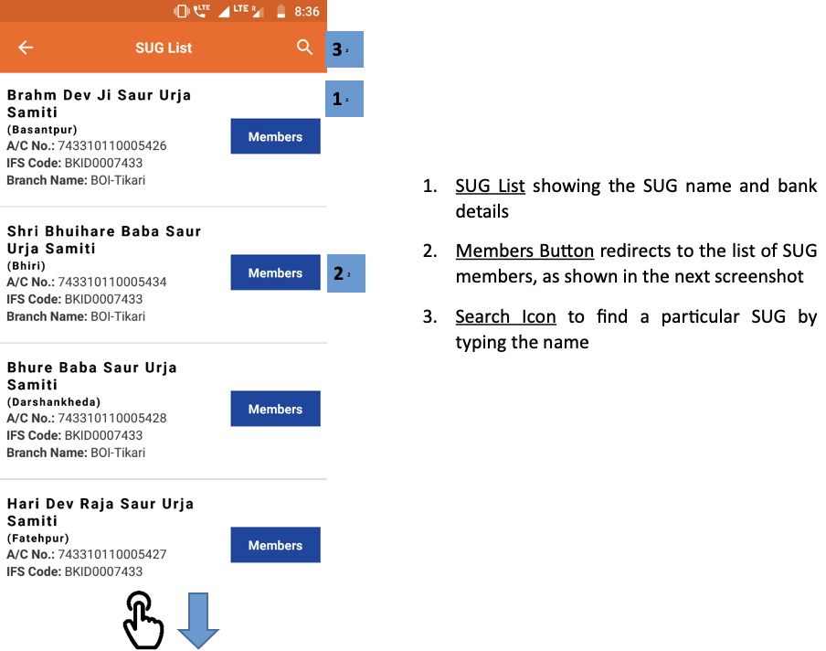
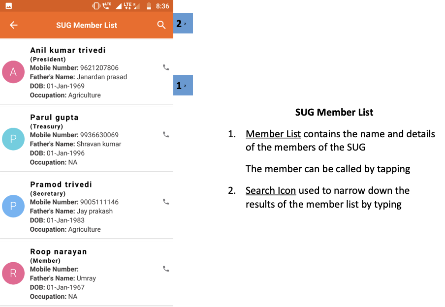

import useBaseUrl from '@docusaurus/useBaseUrl';

## 3.10.1. एक नजर

 

 

## 3.10.2. गैलरी
**फंक्शनलिटी**
* लरी सेक्शन में हर प्लांट के इमेजेस (फोटो) रहते हैं

**मुख्य-मुख्य यूज़र**
<table>
  <tr>
    <th>पदनाम</th>
    <th>मुख्य प्रयोजन</th>
    <th>उपयोग के उदाहरण</th>
  </tr>
  <tr>
    <td>समूह प्रभारी</td>
    <td>राज्य के विभिन्न प्लांट के पिक्चर देखना</td>
    <td>प्लांट के कामकाज (एक्टिविटी) के फोटो देखना</td>
  </tr>
  <tr>
    <td>राज्य प्रभारी</td>
    <td>समूह प्रभारी के समान</td>
    <td>बाहरी हितार्थियों (एक्सटर्नल स्टेकहोल्डर) को प्लान का ले-आउट दिखाना</td>
  </tr>
</table>

**पेज के डिटेल**

 

    

1.  **गैलरी अनुभाग** प्रत्येक संयंत्र से चित्र प्रदर्शित करने के लिए उपयोग किया जाता है
2.  **फ़िल्टर** के संबंध में चित्र प्रदर्शित करने के लिए उपयोग किया जाता है:
     * गतिविधि की प्रकृति
     * दिनांक

 

<!--  -->

## 3.10.3. इमेज (फोटो) ऐड करना
**फंक्शनलिटी**
* किसी प्लांट से संबंधित फोटो अपलोड किए जा सकते हैं

**मुख्य-मुख्य यूज़र**
<table>
  <tr>
    <th>पदनाम</th>
    <th>मुख्य प्रयोजन</th>
    <th>उपयोग के उदाहरण</th>
  </tr>
  <tr>
    <td>समूह प्रभारी</td>
    <td>एप्लीकेशन के डेटाबेस में पिक्चर ऐड करना</td>
    <td>किसी विशेष कार्यकलाप पर आधारित पिक्चर ऐड करना</td>
  </tr>
  <tr>
    <td>राज्य प्रभारी</td>
    <td>समूह प्रभारी के समान</td>
    <td>राज्य के किसी प्लांट की विज़िट के समय लिए गए पिक्चर ऐड करना</td>
  </tr>
</table>

**पेज के डिटेल**

 

1.   **इमेज जोड़ें** प्रासंगिक समर्थन जानकारी के साथ
2.   **इमेज अपलोड** फोन गैलरी या कैमरे से

ध्यान दें कि एक बार में केवल 5 चित्र ही जोड़े जा सकते हैं

 

<!--  -->

## 3.10.4. संपर्क सूत्र
फंक्शनलिटी
* इसमें कंपनी के लिए कार्य कर रहे हर ऑपरेटर और उनके संपर्क सूत्रों की सूची रहती है

**नेविगेशन**

इस पेज पर मेन मैन्यू से भी पहुँचा जा सकता है। विवरण के लिए 3.4.7. देखें।

## 3.10.5. सूचनाएँ (नोटिफिकेशन्स)
**फंक्शनलिटी**
* इस सेक्शन में यूज़र सभी प्राप्त और प्रेषित एसएमएस देख सकता है।

**मुख्य-मुख्य यूज़र**
<table>
  <tr>
    <th>पदनाम</th>
    <th>मुख्य प्रयोजन</th>
    <th>उपयोग के उदाहरण</th>
  </tr>
  <tr>
    <td>सभी कर्मचारी</td>
    <td>कंपनी द्वारा भेजे गए एसएमएस संदेशों देखना</td>
    <td>कंपनी की ओर से भेजे गए एसएमएस को वेरिफाइ करना, चाहे एजेंट ने एसएमएस अपने फोन से डिलीट कर दिए हों।</td>
  </tr>
</table>

**पेज के डिटेल**

 

      

1.  **संदेश सूची** एक विशेष एसएमएस की सामग्री को प्रदर्शित करता है जिस तारीख और समय के साथ इसे भेजा गया था
2.  **सर्च आइकॉन** जो विषय नाम में टाइप करके एक विशेष एसएमएस खोजने में मदद करता है
3.  **फ़िल्टर बार** से और तारीखों को प्रदर्शित करके संकीर्ण परिणामों के लिए उपयोग किया जाता है

 

<!--  -->

## 3.10.6. प्लांट बंद रहने (शट-डाउन) के संदेश
**फंक्शनलिटी**
* यूज़र ग्राहकों के एक छोटे समूह को एसएमएस भेजकर प्लांट बद रहने के बारे में चेता सकता है

**मुख्य-मुख्य यूज़र**
<table>
  <tr>
    <th>पदनाम</th>
    <th>मुख्य प्रयोजन</th>
    <th>उपयोग के उदाहरण</th>
  </tr>
  <tr>
    <td>समूह प्रभारी</td>
    <td>प्लांट के ग्राहकों को प्लांट बंद रहने की अवधि सूचित करना</td>
    <td>सभी ग्राहकों को संदेश कि मेन्टेनेन्स के लिए प्लांट को अगले तीन घंटे तक बंद रखना होगा</td>
  </tr>
  <tr>
    <td>राज्य प्रभारी</td>
    <td>समूह प्रभारी के समान</td>
    <td>समूह प्रभारी के समान</td>
  </tr>
</table>

**पेज के डिटेल**

 

    

1.  **इनपुट विवरण** एसएमएस भेजने के लिए डेटा जमा करने को पूरा करने के लिए
2.  **एसएमएस टेम्पलेट** जो भेजे गए संदेश का वर्णन करता है
3.  **सबमिट करें** संदेश भेजता है

 

<!--  -->

## 3.7.10. एसयूजी
**फंक्शनलिटी**
* एसयूजी सेक्शन विभिन्न प्लांट के उपभोक्ता-समूह (पूल) की पहचान कर समूह बनाता है
* यह सेक्शन केवल एचसीएलएफ एजेंटों को उपलब्ध है

**मुख्य-मुख्य यूज़र**
<table>
  <tr>
    <th>पदनाम</th>
    <th>मुख्य प्रयोजन</th>
    <th>उपयोग के उदाहरण</th>
  </tr>
  <tr>
    <td>ऑपरेटर</td>
    <td>किसी प्लांट के सभी एक्टिव एसयूजी के बारे में रिपोर्ट मेन्टेन करना</td>
    <td>एसयूजी सदस्यों की सूची रिव्यू करना और संबंधित सदस्य से संपर्क करना</td>
  </tr>
  <tr>
    <td>सीएसए</td>
    <td>ऑपरेटर के समान</td>
    <td>ऑपरेटर के समान</td>
  </tr>
  <tr>
    <td>समूह प्रभारी</td>
    <td>ऑपरेटर के समान</td>
    <td>ऑपरेटर के समान</td>
  </tr>
</table>

**पेज के डिटेल**

 

    

1.  **एसयूजी सूची** एसयूजी नाम और बैंक विवरण दिखाते हुए
2.  **सदस्य बटन** SUG सदस्यों की सूची में रीडायरेक्ट करता है, जैसा कि अगले स्क्रीनशॉट में दिखाया गया है
3.  **सर्च आइकन** नाम लिखकर किसी विशेष SUG को खोजने के लिए

 
 

      

** SUG सदस्य सूची **
1.  **सदस्य सूची** में SUG के सदस्यों का नाम और विवरण होता है

सदस्य को टैप करके बुलाया जा सकता है

2.  **खोज चिह्न** टाइपिंग द्वारा सदस्य सूची के परिणामों को कम करने के लिए उपयोग किया जाता है

 

<!-- 

 -->

