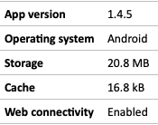
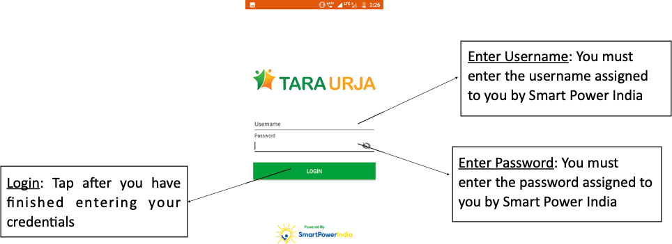

* फील्ड एजेंट एप्प एंड्राइट सिस्टम पर काम करता है।
* इसे गूगल प्ले स्टोर या अन्य किसी एप्प स्टोर से डाउनलोड किया जा सकता है।

	##### चित्र फील्ड एजेंट ऐप का आइकॉन 
	

* यूज़र को सर्च बार में Tara टाइप कर चित्र में दिखाए गए आइकॉन को सिलेक्ट करना होगा।
* हार्डवेअर संबंधी जरूरत नीचे बताई गई है।

	##### टेबल :  फील्ड एजेंट एप्प इंस्टाल करने के लिए क्या जरूरी है
	

* एप्लीकेशन खोलने पर यूज़र लॉग-इन विवरण पर पहुँचता है।
	

