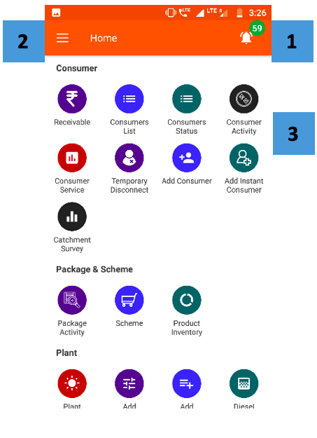
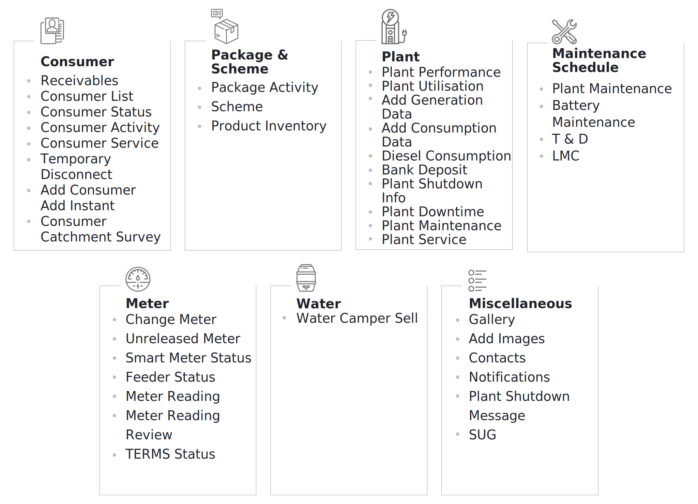
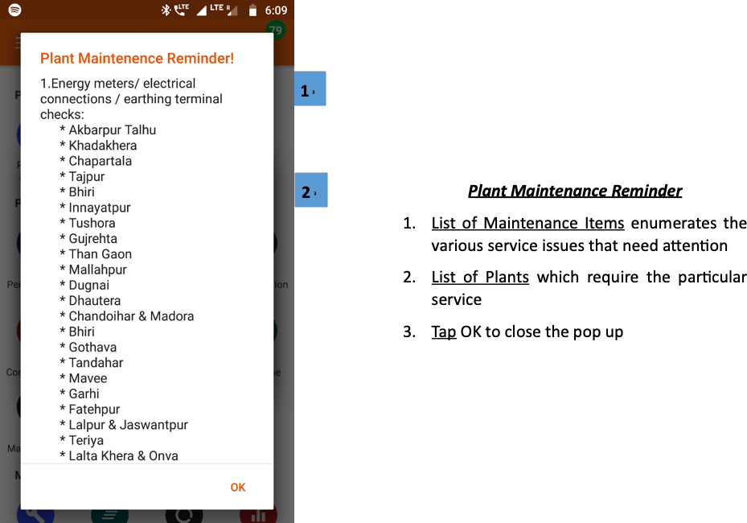
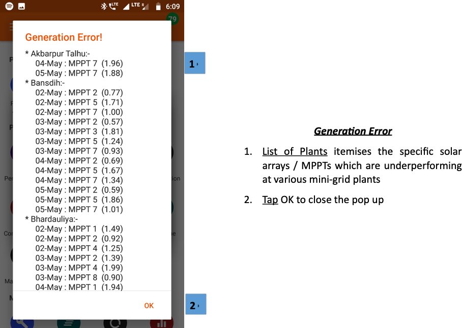
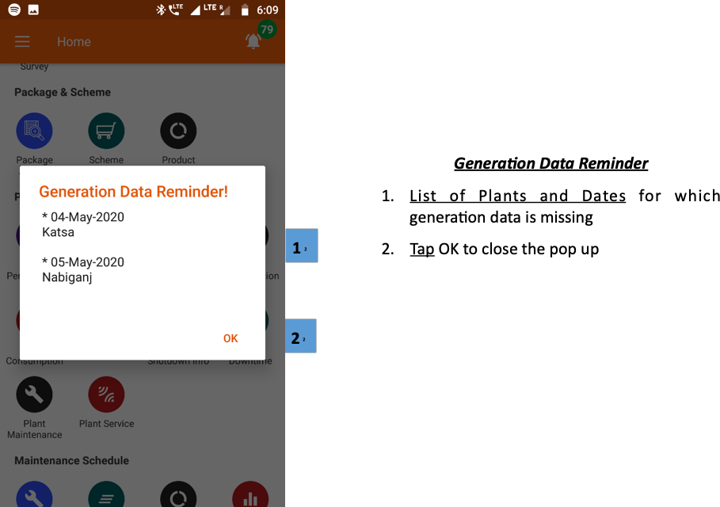
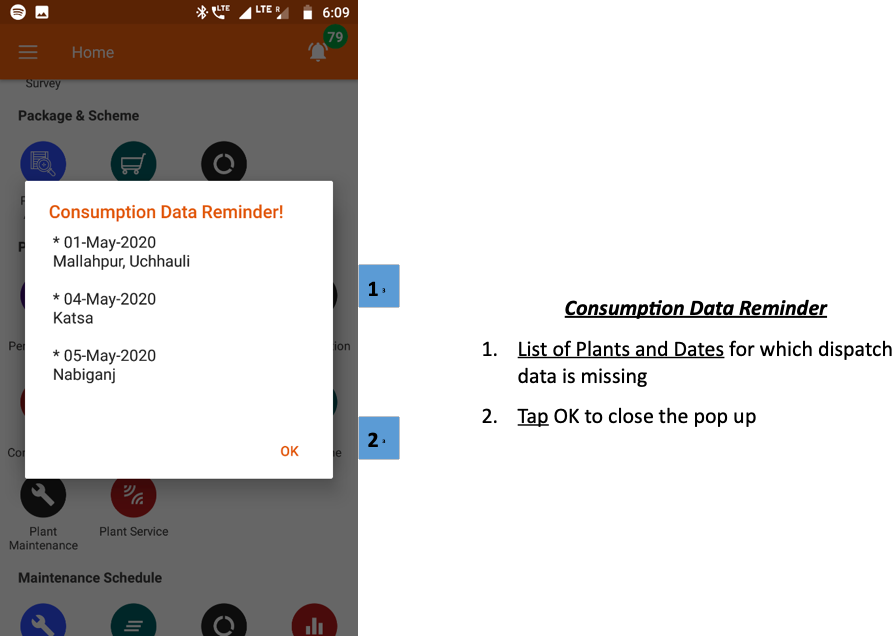
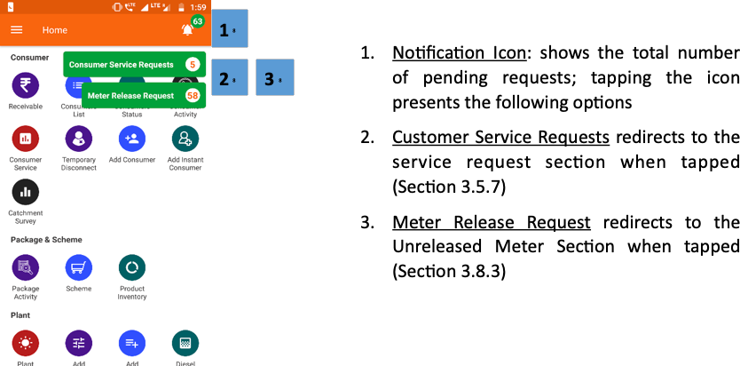

import useBaseUrl from '@docusaurus/useBaseUrl';
export const Clear = ({children}) => (
  

    {children}
  

);

## 3.3.1. एक नजर (ओवरव्यू)
* लॉग-इन करने के बाद यूज़र के सामने सबसे पहले होम स्क्रीन आता है। 
* एप्लीकेशन की अलग-अलग फंक्शनलिटी तक सर्क्युलर मॉड्यूल के जरिए पहुँचा जा सकता है।
* इनके आइकॉन को कंज़्यूमर, पैकेज, स्कीम आदि हेडिंग के अंतर्गत रखा गया है।नीचे दिया गया चित्र देखें

 
 

<Clear>

1. <u>अधिसूचना आइकन</u> (घंटी के आकार का आइकन) 3.3.3 अनुभाग में समझाया गया है 
2. <u>मुख्य मेनू</u> (तीन क्षैतिज रेखाएं) अनुभाग 3.4 में समझाया गया है
3. <u>मॉड्यूल आइकन </u> विभिन्न एप्लिकेशन कार्यात्मकताओं का उपयोग करने के लिए; शीर्षकों को उपभोक्ता, पैकेज और योजना आदि के अंतर्गत वर्गीकृत किया जाता है।

</Clear>
 

<!--   -->

##### चित्र फील्ड एजेंट ऐप के सेक्शन का हैडिंग

## 3.3.2. पॉप-अप सूचनाएँ (नोटिफिकेशन्स)
**फंक्शनलिटी**

* लॉग-इन करने पर यूज़र को एक या दो पॉप-अप अपने आप दिखाई दे सकते हैं।
* इन पॉप-अप में यूज़र का ध्यान बकाया कार्यों की ओर दिलाया जाता है।
* तत्काल महत्व के मामलों पर भी सूचनाएँ भेजी जा सकती हैं, जैसे कोरोना वाइरस से बचाव के लिए जरूरी सतर्कता।

**पेज के डिटेल** 

मुख्य-मुख्य पॉप-अप सूचनाएँ नीचे बताई गई हैं –

| प्लांट मेंटेनेंस रिमाइंडर|जनरेशन एरर| खपत डेटा अनुस्मारक | जनरेशन डेटा रिमाइंडर |
|--|--|--|--|
| विभिन्न संयंत्रों में तकनीकी सर्विसिंग मुद्दों पर चिंता | उपयोगकर्ताओं को सौर पीढ़ी में विसंगतियों के लिए सचेत करें | अपूर्ण उपभोग डेटा लॉगिंग पर एक उपयोगकर्ता को सूचित करता है | अपूर्ण पीढ़ी डेटा लॉगिंग पर एक उपयोगकर्ता को सूचित करता है |

 
 

<Clear>

***संयंत्र रखरखाव अनुस्मारक***
1. <u> रखरखाव वस्तुओं की सूची </u> ध्यान देने की जरूरत है कि विभिन्न सेवा मुद्दों की गणना करता है
2. <u> संयंत्र की सूची </u> जिसमें विशेष सेवा की आवश्यकता होती है
3. <u> पॉप-अप को बंद करने के लिए </u> ok टैप करें

</Clear>
 

 

<Clear>

*** जनरेशन एरर ***
1. <u> प्लांट की सूची </u> विशिष्ट सौर सरणियों / MPPT को बढ़ाता है जो विभिन्न मिनीग्रिड्स में अविकसित हैं
2. <u> पॉप-अप को बंद करने के लिए </u> ok टैप करें

</Clear>
 

 

<Clear>

*** जनरेशन डेटा अनुस्मारक ***
1. <u> प्लांट और डेट्स की सूची </u> जिसके लिए उत्पादन डेटा गायब है
2. <u> पॉप-अप को बंद करने के लिए </u> ok टैप करें

</Clear>
 

 

<Clear>

*** खपत डेटा अनुस्मारक ***
1. <u> संयंत्र और तारीखों की सूची </u> जिसके लिए प्रेषण डेटा गायब है
2. <u> पॉप-अप को बंद करने के लिए </u> ok टैप करें

</Clear>
 

<!-- 

 

 -->

## 3.3.3. सूचनाओं के (नोटिफिकेशन्स) आइकॉन
**फंक्शनलिटी**
* यह दिखाता है कि ग्राहकों के कितने सेवा-अनुरोध और मीटर रिलीज़ करने के कितने अनुरोध अभी पूरे नहीं हुए (एक्टिव) हैं।
* टैप करने पर सभी अनुरोध की सूची मिल जाती है।
* ज्यादातर पेज पर यह आइकॉन रखा गया है।

**पेज के डिटेल**

 
 

<Clear>

1. <u> अधिसूचना चिह्न: </u> लंबित अनुरोधों की कुल संख्या दर्शाता है; आइकन को टैप करने से निम्नलिखित विकल्प प्रस्तुत होते हैं
2. <u> ग्राहक सेवा अनुरोध </u> टैप किए जाने पर सेवा अनुरोध अनुभाग में अनुप्रेषित (Section 3.5.7)
3. <u> मीटर रिलीज़ अनुरोध </u> अप्रयुक्त मीटर सेक्शन पर अनुप्रेषित करता है जब टैप किया जाता है (Section 3.8.3)

</Clear>
 

<!--  -->

