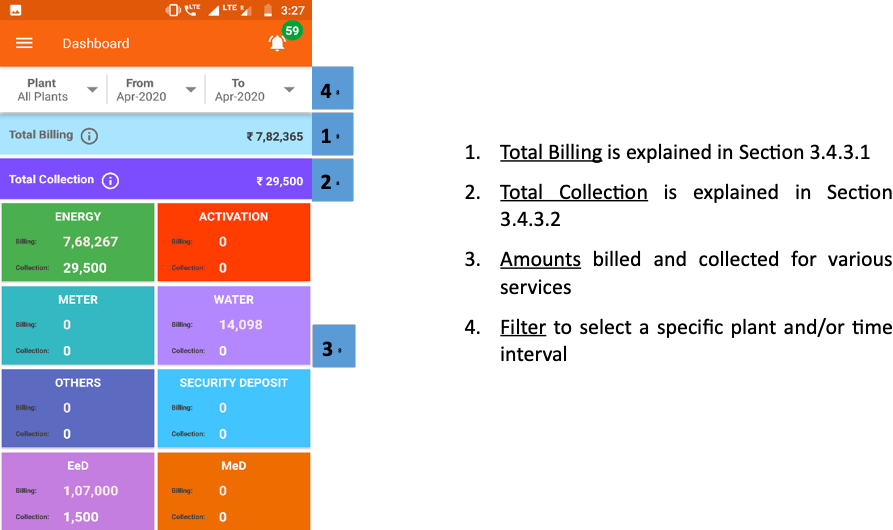
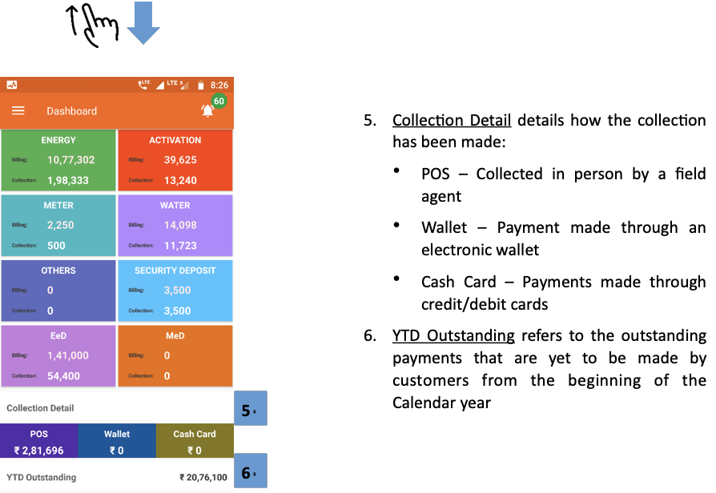
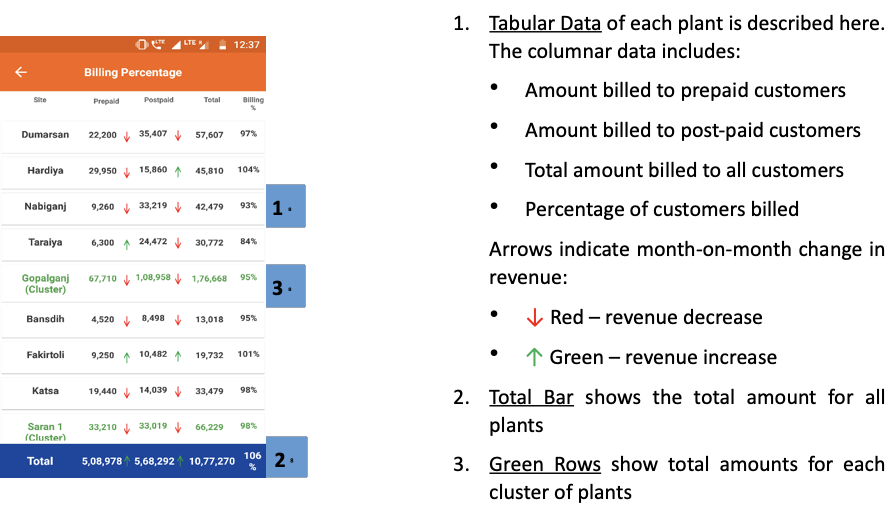
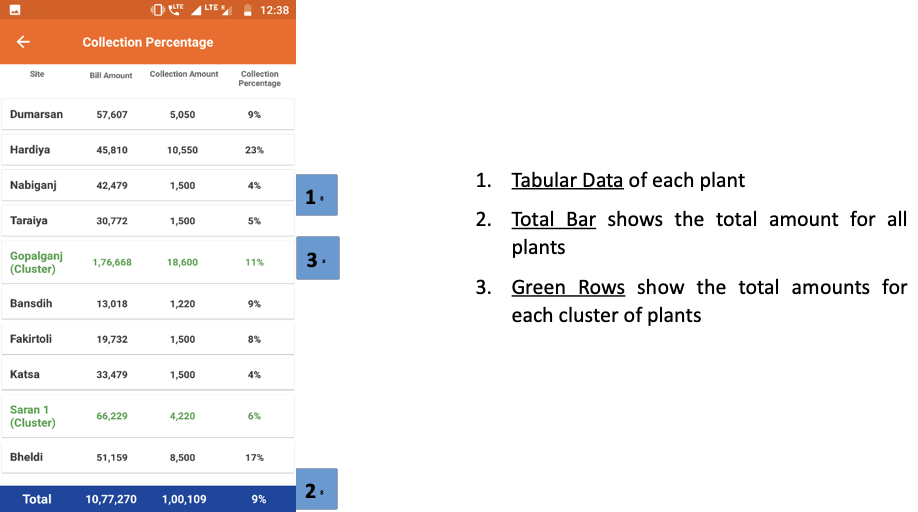
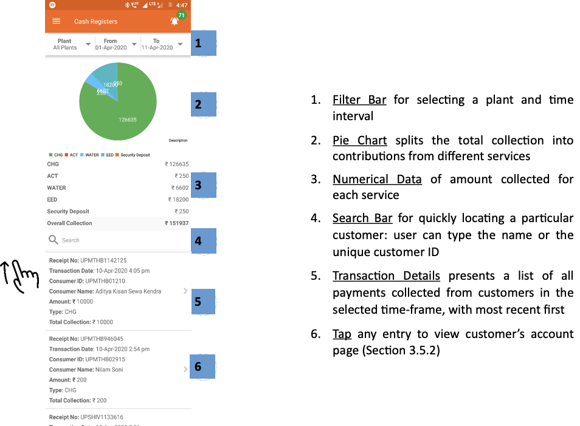
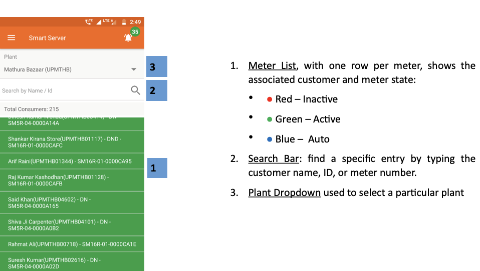
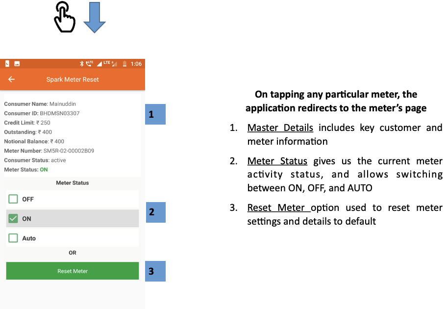
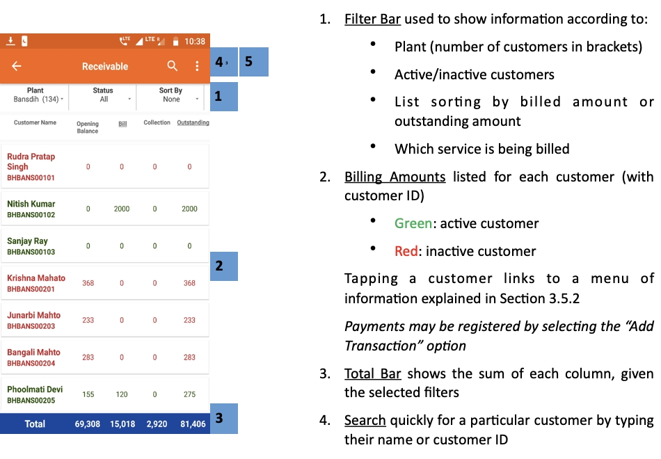
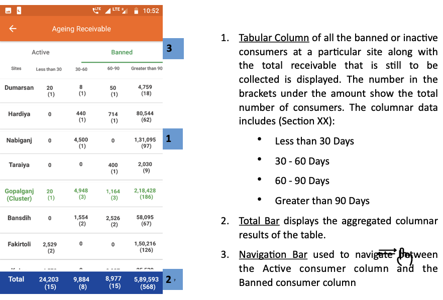

import useBaseUrl from '@docusaurus/useBaseUrl';
export const Highlight = ({children, color}) => (
  
    {children}
  
);

## 3.4.1. एक नजर (ओवरव्यू)
* मुख्य मेन्यू में खास-खास सेक्शन तक जाने के शॉर्टकट नीचे बताए अनुसार दिए गए हैं।

	##### चित्र: मुख्या मेनू के शॉर्टकट
	
	  

	

* किसी भी पेज से यहाँ दो तरह से पहुँचा जा सकता है
	* स्क्रीन में बायें ऊपर की ओर दिए आइकॉन को टैप कर
	* स्क्रीन के बायें किनारे से दाहिनी ओर स्वाइप करके

		

## 3.4.2. होम
यूज़र होम स्क्रीन (सेक्शन 3.3) पर वापस आ जाता है।

## 3.4.3. डैशबोर्ड
**फंक्शनलिटी**
* कंपनी को विभिन्न स्रोतों से प्राप्त कलेक्शन और बिलिंग का डेटा एक नजर में सामने आ जाता है।
* भुगतान प्राप्त और रिकॉर्ड होने के साथ-साथ अपडेट होता रहता है।

**मुख्य-मुख्य यूज़र**
<table>
  <tr>
    <th>पदनाम</th>
    <th>मुख्य प्रयोजन</th>
    <th>उपयोग के उदाहरण</th>
  </tr>
  <tr>
    <td>सीएसए</td>
    <td>हर एक प्लांट से किए जाने वाले कलेक्शन को देखना</td>
    <td>गिनती करना कि जितनी राशि के बिल जारी हुए हैं, उसमें से कितने प्रतिशत राशि बकाया है।</td>
  </tr>
  <tr>
    <td>समूह प्रभारी</td>
    <td>किसी निश्चित समयावधि में जारी बिल और प्राप्त राशि का विवरण देखना</td>
    <td>समूह (क्लस्टर) में अलग-अलग सेवाओं (बिजली, कनेक्शन, पानी आदि) से प्राप्त राशि का पता लगाना</td>
  </tr>
  <tr>
    <td>राज्य प्रभारी</td>
    <td>पोर्टफोलियो के चालू बिल और प्राप्त राशि देखना</td>
    <td>राज्य के हर प्लांट के कुल राजस्व (रेवेन्यू) और प्राप्त होने वाली अनुमानित नकदी (कैश फ्लो) का पता लगाना</td>
  </tr>
</table>

**पेज के डिटेल**
 

    

> 1. ** कुल बिलिंग ** को Section 3.4.3.1 में समझाया गया है
> 2. ** कुल संचय ** अनुभाग 3.4.3.2 में समझाया गया है
> 3. **Amounts** billed and collected for various services
> 4. ** एक विशिष्ट संयंत्र और / या समय अंतराल का चयन करने के लिए ** फ़िल्टर करें

 

 

    

> 5. ** संग्रह विस्तार ** विवरण संग्रह कैसे बनाया गया है:
>       - पीओएस - एक क्षेत्र एजेंट द्वारा व्यक्ति में एकत्रित
>       - वॉलेट - एक इलेक्ट्रॉनिक वॉलेट के माध्यम से भुगतान
>       - कैश कार्ड - नकद / डेबिट कार्ड के माध्यम से भुगतान
> 6. ** कुल संचय ** अनुभाग 3.4.3.2 में समझाया गया है

 

<!-- 

 -->

### 3.4.3.1. बिल की कुल राशि (टोटल बिलिंग)
**फंक्शनलिटी**
* टोटल बिलिंग पेज में हर साइट से प्राप्त राजस्व (रेवेन्यू) का सारांश दिया गया है।

**पेज के डिटेल**
 

1. ** प्रत्येक कारख़ाना का सारणीबद्ध डेटा ** यहाँ वर्णित है। स्तंभ डेटा में शामिल हैं:
    * प्रीपेड ग्राहकों को दी जाने वाली राशि
    * पोस्ट-पेड ग्राहकों को दी जाने वाली राशि
    * कुल सभी ग्राहकों के लिए बिल की गई राशि
    * ग्राहकों का प्रतिशत जो बिल किया गया था

एरो रेवेन्यू में मासिक परिवर्तन का संकेत देता है:
* <Highlight color="#FF0000"> ↓ </Highlight> लाल - राजस्व में कमी
* <Highlight color="#008000"> ↑ </Highlight> हरा - राजस्व में वृद्धि
2. ** कुल बार ** सभी कारख़ाना के लिए कुल राशि दर्शाता है
3. ** हरे पंक्ति ** कारख़ाना के प्रत्येक समूह के लिए कुल मात्रा दिखाती हैं

 

<!--  -->

### 3.4.3.2 कुल प्राप्त राशि (टोटल कलेक्शन)
**फंक्शनलिटी**
* टोटल कलेक्शन पेज में हर साइट के प्राप्त राशि का सारांश दिया होता है।

**पेज के डिटेल**
 

    

1. ** प्रत्येक योजना का सारणीबद्ध डेटा **
2. ** कुल बार ** सभी कारख़ाना के लिए कुल राशि दिखाता है
3. ** हरे पंक्ति ** कारख़ाना के प्रत्येक समूह के लिए कुल मात्रा दिखाती हैं

 

<!--  -->

## 3.4.4. कैश रजिस्टर
**फंक्शनलिटी**
* कैश रजिस्टर में हर ग्राहक के सभी लेनदेन का पूरा विवरण रहता है।
* भुगतान होने और रिकॉर्ड तैयार होने के साथ-साथ यह रजिस्टर अपडेट होता जाता है।
* कुल प्राप्त राशि का सारांश पाइ चार्ट में देखने को मिलता है।

**मुख्य-मुख्य यूज़र**
<table>
  <tr>
    <th>पदनाम</th>
    <th>मुख्य प्रयोजन</th>
    <th>उपयोग के उदाहरण</th>
  </tr>
  <tr>
    <td>ग्राहक सेवा एजेंट</td>
    <td>ग्राहक के बिल और भुगतान का पता लगाना</td>
    <td>किसी बिल का कब भुगतान हुआ और निश्चित रीति से हुआ या नहीं, इससे संबंधित समस्याओं को सुलझाना</td>
  </tr>
  <tr>
    <td>समूह प्रभारी</td>
    <td>निश्चित समयावधि में प्राप्त राशि (कलेक्शन) का सारांश</td>
    <td>क्लस्टर के सभी प्लांटों में विभिन्न सेवाओं (बिजली, कनेक्शन, पानी आदि) से प्राप्त राशि का पता लगाना</td>
  </tr>
  <tr>
    <td>राज्य प्रभारी</td>
    <td>राज्य भर में प्राप्त राशि (कलेक्शन) का सारांश</td>
    <td>पूरे राज्य में विभिन्न सेवाओं से प्राप्त राशि का पता लगाना</td>
  </tr>
</table>

**पेज के डिटेल**
 

    

1. ** फिल्टर बार ** संयंत्र और समय अंतराल का चयन करने के लिए
2. ** पाई चार्ट ** अलग-अलग सेवाओं से योगदान में कुल संग्रह को विभाजित करता है
3. प्रत्येक सेवा के लिए एकत्रित राशि का **संख्यात्मक डेटा**
4. ** खोज बार ** एक ग्राहक को तुरंत पता लगाने के लिए: उपयोगकर्ता नाम या अद्वितीय ग्राहक आईडी टाइप कर सकता है।
5. ** लेन-देन का विवरण ** सबसे हाल ही में सबसे पहले के साथ, चयनित समय-सीमा में ग्राहकों से एकत्र किए गए भुगतानों की एक सूची प्रस्तुत करते हैं
6. ग्राहक के खाता पृष्ठ को देखने के लिए किसी भी प्रविष्टि पर **टैप** करें (Section 3.5.2)

 

<!--  -->

## 3.4.5. स्पार्क सर्वर
**फंक्शनलिटी**
* स्मार्ट स्पार्क मीटर का डेटा कुछ सीमा तक देखा जा सकता है।
* यूज़र यहाँ से ही मीटर को चालू और बंद कर सकता है।

**मुख्य-मुख्य यूज़र**

<table>
  <tr>
    <th>पदनाम</th>
    <th>मुख्य प्रयोजन</th>
    <th>उपयोग का उदाहरण</th>
  </tr>
  <tr>
    <td>टेक्निशन</td>
    <td>प्लांट के किसी निश्चित ग्राहक के मीटर की स्थिति रिव्यू करना</td>
    <td>जाँच करना कि बिजली बंद रहने पर मीटर अपने आप बंद होता है या नहीं।</td>
  </tr>
  <tr>
    <td>सीएसए</td>
    <td>टेक्निशन के समान</td>
    <td>किसी निश्चित मीटर के स्टेटस की जाँच करना</td>
  </tr>
  <tr>
    <td>समूह प्रभारी</td>
    <td>किसी निश्चित ग्राहक या ग्राहक समूह के लिए मीटर की स्थिति नियंत्रित करना</td>
    <td>किसी ग्राहक के खराब उपकरण (एप्लायंस) का असर बिजली वितरण के समूचे नेटवर्क पर होने पर उस ग्राहक का मीटर बंद करना</td>
  </tr>
  <tr>
    <td>राज्य प्रभारी</td>
    <td>समूह प्रभारी के समान</td>
    <td>कोई तकनीकी आपत्ति आने पर राज्य के बहुत सारे मीटर एक ही समय पर बंद करना</td>
  </tr>
</table>

**पेज के डिटेल**

## 3.4.6. प्राप्त होने वाली राशियाँ (रिसीवेबल्स)
**फंक्शनलिटी**
* किसी प्लांट के प्रत्येक ग्राहक को जारी बिल और बकाया राशि रिसीवेबल्स सेक्शन में दिखाई देती हैं।
* ग्राहकों से प्राप्त भुगतान को दर्ज कर एजेंट अपने बेलेंस को अपडेट कर सकते हैं।
* जो यूज़र कई प्लांट का डेटा देख सकते हैं, उन्हें कोई निश्चित प्लांट सिलेक्ट करने पर ही डेटा दिखाई देगा।

**मुख्य-मुख्य यूज़र**
<table>
  <tr>
    <th>पदनाम </th>
    <th>मुख्य प्रयोजन</th>
    <th>उपयोग के उदाहरण</th>
  </tr>
  <tr>
    <td>ऑपरेटर</td>
    <td>ग्राहक एक्टिव है या नहीं, यह देखना</td>
    <td>कनेक्शन संबंधी किसी समस्या की शिकायत लेकर प्लांट पर आए ग्राहक की शिकायत का कारण पता लगाना</td>
  </tr>
  <tr>
    <td>ग्राहक सेवा एजेंट</td>
    <td>प्लांट के प्रत्येक ग्राहक से प्राप्त होने वाले अनुमानति राजस्व और बकाया राशि को देखना</td>
    <td>तय करना कि बकाया राशि के निपटान के लिए बिक्री टीम को किस ग्राहक (या पूर्व ग्राहक) के पास भेजना चाहिए।</td>
  </tr>
  <tr>
    <td>समूह प्रभारी</td>
    <td>निश्चित समयावधि में प्राप्त राशि (कलेक्शन) का सारांश</td>
    <td>चालू माह में विभिन्न प्लांट से प्राप्त राशि की तुलना करना</td>
  </tr>
  <tr>
    <td>राज्य प्रभारी</td>
    <td>ज्यादा बकाया राशि वाले ग्राहकों पर नजर डालना</td>
    <td>किसी खाते को बंद या दुबारा चालू करते समय ग्राहक के शुरू से आखिर तक के भुगतान को देखना</td>
  </tr>
</table>

**नेविगेशन**
ध्यान रखें कि इस पेज पर होम स्क्रीन से सीधे ही पहुँचा जा सकता है – देखें सेक्शन 3.4.2

**पेज के डिटेल**

### 3.4.6.1. प्राप्य राशियाँ कितने समय से बकाया हैं (एजिंग रिसिवेबल्स)
**फंक्शनलिटी**
* एजिंग रिसिवेबल्स सेक्शन में किसी प्लांट के एक्टिव और प्रतिबंधित (बैन्ड) ग्राहकों की अलग-अलग सूची मिलती है, जिनकी ओर कंपनी की राशि बकाया है।
* दो सूचियाँ होती हैं – एक्टिव और बैन्ड

इस फंक्शनलिटी से निम्नलिखित पेज देखे जा सकते हैं –

| सक्रिय | प्रतिबंधित |
|--|--|
| हर संयंत्र के लिए सक्रिय उपभोक्ता आंकड़ों की विस्तृत सूची | हर संयंत्र के लिए प्रतिबंधित उपभोक्ताओं की विस्तृत सूची |

## 3.4.7. संपर्क सूत्र (कांटैक्ट)
**फंक्शनलिटी**
* कांटैक्ट पेज में कंपनी के कर्मचारियों की सूची उनके पदनाम (डेज़िग्नेशन) और मोबाइल नंबर के साथ दी गई है।
* परिचालक (ऑपरेटर्स) जिस कंपनी और राज्य में कार्य कर रहे हैं, उस आधार पर उन्हें बाँटा गया है।

**मुख्य-मुख्य यूज़र**

<table>
  <tr>
    <th>पदनाम</th>
    <th>मुख्य प्रयोजन</th>
    <th>उपयोग का उदाहरण</th>
  </tr>
  <tr>
    <td>सभी कर्मचारी</td>
    <td>हर कर्मचारी के मोबाइल नंबर की जानकारी</td>
    <td>कंपनी में कार्यरत अन्य एजेंट द्वारा किए गए निर्णय का सत्यापन (वेरिफाइ) करना</td>
  </tr>
</table>

 

**पेज के डिटेल**
