## 3.5.1. एक नजर (ओवरव्यू)

 
 

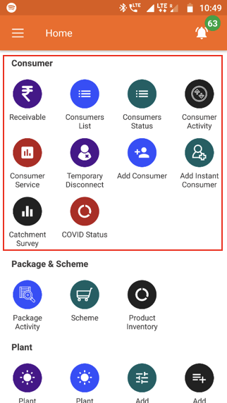
 
## 3.5.2. खाते के विवरण (अकाउन्ट डिटेल्स)
**फंक्शनलिटी**
* ग्राहक के प्रोफाइल, पैकेज और उसके द्वारा किए गए समस्त भुगतान की पूरी जानकारी अकाउन्ट डिटेल्स पेज से मिलती है।

**मुख्य-मुख्य यूज़र**
<table>
  <tr>
    <th>पदनाम</th>
    <th>मुख्य प्रयोजन</th>
    <th>उपयोग का उदाहरण</th>
  </tr>
  <tr>
    <td>ऑपरेटर</td>
    <td>ग्राहक के एक्टिव होने की पुष्टि करना</td>
    <td>तय करना कि बिक्री टीम को बकाया राशियों के सेटलमेंट के लिए किस ग्राहक (या पूर्व ग्राहक) के पास जाना चाहिए</td>
  </tr>
  <tr>
    <td>टेक्निशन</td>
    <td>किसी ग्राहक की मीटर रीडिंग का डेटा रिव्यू करना</td>
    <td>मीटर रीडिंग डेटा को रिव्यू कर देखना कि बिजली के उपकरणों (एपरेटस) पर ज्यादा लोड तो नहीं आ रहा है</td>
  </tr>
  <tr>
    <td>ग्राहक सेवा एजेंट</td>
    <td>प्लांट के हर ग्राहक से अनुमानित राजस्व और बकाया राशियाँ देखना</td>
    <td>तय करना कि बिक्री टीम को बकाया राशियों के सेटलमेंट के लिए किस ग्राहक (या पूर्व ग्राहक) के पास जाना चाहिए</td>
  </tr>
  <tr>
    <td>समूह प्रभारी</td>
    <td>निश्चित समय अंतराल (टाइम इंटरवल) में प्राप्त राशि (कलेक्शन) का विवरण</td>
    <td>विभिन्न प्लांट से चालू माह के दौरान प्राप्त कलेक्शन की तुलना करना</td>
  </tr>
  <tr>
    <td>राज्य प्रभारी</td>
    <td>बहुत अधिक बकाया राशि वाले ग्राहकों के खाते देखना</td>
    <td>भुगतान प्राप्त करते समय ग्राहक की ओर बकाया राशि की पुष्टि करना और विगत में भुगतान किए बिलों के बारे में भ्रम को दूर करना</td>
  </tr>
</table>

* सूचनाएँ कई टैब में रखी जाती हैं, जिनके बारे में नीचे बताया गया है

	> ** इस पृष्ठ पर नेविगेट करने पर एक नोट **
	> 
	> यह पृष्ठ ऑन-ग्राउंड ऑपरेशंस के लिए केंद्रीय है, और इसका उपयोग अक्सर बिक्री एजेंटों द्वारा व्यक्तिगत ग्राहकों के साथ संबंधों के प्रबंधन में किया जाता है। 
	> हालाँकि, होम स्क्रीन पर इस मॉड्यूल के लिए कोई आइकन नहीं है। इसके बजाय, फ़ील्ड एजेंट इस पृष्ठ से यहां तक ​​पहुंचने में सक्षम होंगे:
	> * किसी विशेष संयंत्र का नकदी रजिस्टर (Section 3.4.4)
	> * ग्राहक सूची (Section 3.5.4)
	> * ग्राहक की स्थिति सूची (Section 3.5.5)

**पेज के डिटेल**

खाता-विवरण (अकाउंट डिटेल) पेज में कई टैब होते हैं, जिनमें ग्राहक से संबंधित जानकारी का सारांश होता है –

| प्रोफ़ाइल| लेन-देन| कैश लेजर| सुरक्षा और जमाकर्ता लेजर| मीटर अध्ययन| सेवा|
|---|---|---|---|---|---|
| विस्तृत खाता जानकारी | व्यक्तिगत भुगतान की कालानुक्रमिक सूची | बिलों, भुगतानों और शेष राशि का रिकॉर्ड चलाना | सुरक्षा शुल्क और भुगतान का रिकॉर्ड | मीटर रीडिंग से ऊर्जा की खपत के आंकड़े | सेवा अनुरोध इतिहास और पूर्ण जानकारी |

एक टैब से दूसरे में जाने के लिए या तो नेविगेशन बार का उपयोग करना होता है या स्क्रीन को आड़ी तरह से (हॉरिजॉन्टलि) स्वाइप करना होता है।

ऊपर बताए गए प्रत्येक टैब की चर्चा अगले सेक्शनों में की गई है।

### 3.5.2.1. प्रोफाइल टैब
**फंक्शनलिटी**
* प्रोफाइल टैब सिलेक्टेड ग्राहक और उसके खाते की पूरी जानकारी दिखाती है।
* यूज़र कुछ सूचनाएँ अपडेट / एडिट कर सकता है।

**पेज के डिटेल**

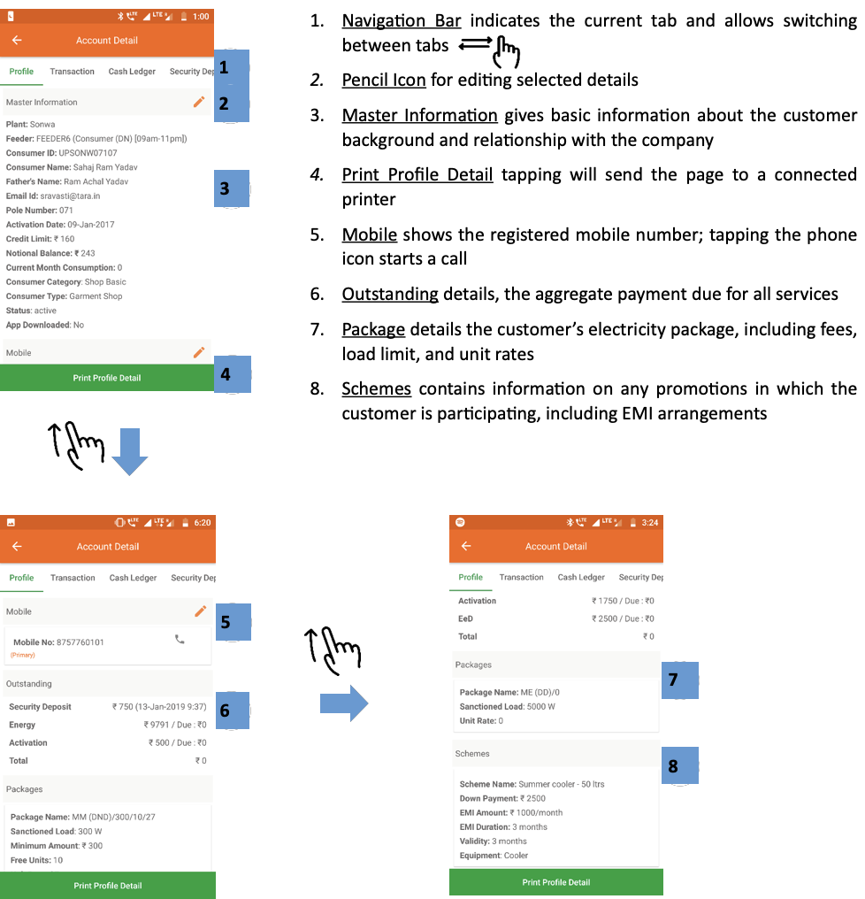

 जो भी जानकारी एडिट की जाए, उसकी ग्राहक की ओर से ओटीपी के माध्यम से पुष्टि अनिवार्य है।

### 3.5.2.2. लेनदेन (ट्रांजेक्शन) टैब
**फंक्शनलिटी**
* ट्रांजेक्शन पेज में प्रत्येक ग्राहक के भुगतान का वृत्तांत (हिस्ट्री) प्राप्त होता है।
* भुगतान और रिकॉर्ड होने के साथ-साथ उसी समय (रिअल टाइम) अपडेट होता जाता है।

**पेज के डिटेल**

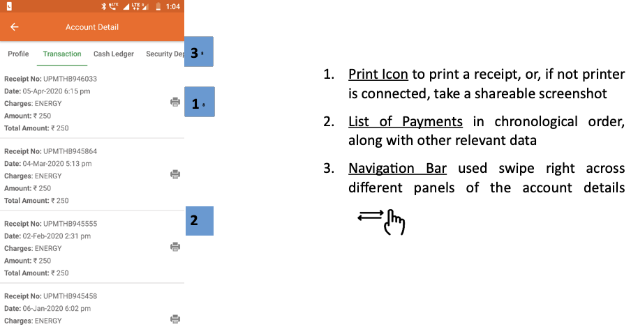

### 3.5.2.3. कैश लेज़र टैब
**फंक्शनलिटी**
* सिलेक्ट किए गए ग्राहकों के पिछले बिल, भुगतान तथा उनकी ओर बकाया राशि का चालू रिकॉर्ड प्राप्त होता है।

**पेज के डिटेल**

### 3.5.2.4. सिक्युरिटी डिपॉज़िट लेज़र टैब
**फंक्शनलिटी**
* सिलेक्ट किए ग्राहकों के सिक्युरिटी डिजॉज़िट का रिकॉर्ड प्राप्त होता है।

**पेज के डिटेल**

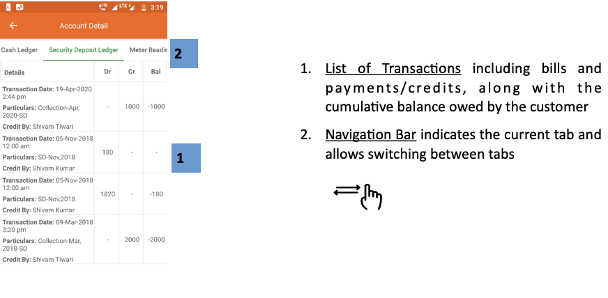

### 3.5.2.5. मीटर रीडिंग लेज़र टैब
**फंक्शनलिटी**
* ग्राहक के बिजली मीटर की रीडिंग की तारीख के क्रम में सूची।
* सिर्फ उन्हीं ग्राहकों की, जिन्हें मीटर दिए गए हैं।

**पेज के डिटेल**

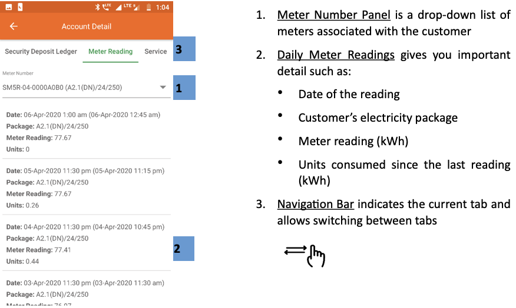

### 3.5.2.6. सर्विस टैब
**फंक्शनलिटी**
* ग्राहक ने सेवा के लिए जो अनुरोध किया हो और उस पर फील्ड टीम की ओर से जो कार्रवाई की गई हो, उसका रिकॉर्ड

**पेज के डिटेल**

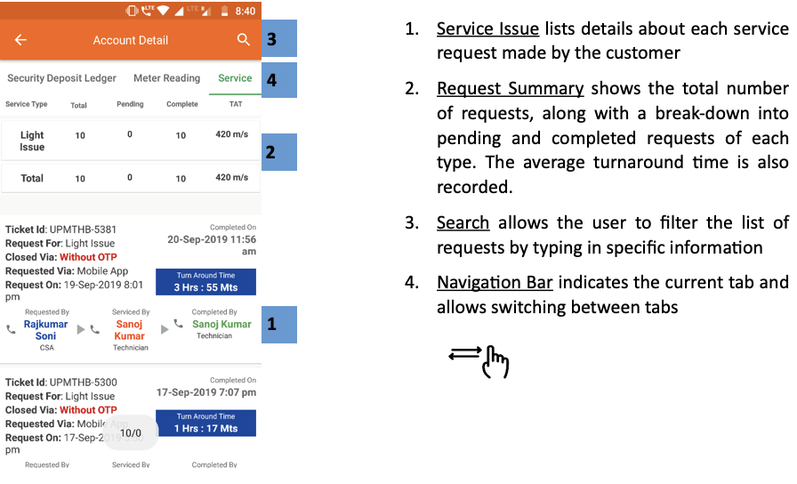

## 3.5.3. प्राप्त होने वाली राशियाँ (रिसीवेबल्स)
**फंक्शनलिटी**
* इस सेक्शन में ग्राहकों से प्राप्त होने वाली राशि दिखाई देती है। यहाँ एजेंट ग्राहकों से प्राप्त भुगतान को दर्ज कर सकते हैं।

**नेविगेशन**

इस पेज पर मैन मेन्यू से भी जा सकते हैं। इसके बारे में अधिक जानकारी 3.4.6. में दी गई है।

## 3.5.4. उपभोक्ताओं की सूची
**फंक्शनलिटी**
* उपभोक्ताओं की सूची में हर प्लांट के एक्टिव और इनेक्टिव उपभोक्ता दिखाई देते हैं।
* किसी प्लांट को सिलेक्ट करने पर उपभोक्ताओं की सूची और भुगतान न हुए बिलों का रिकॉर्ड यूज़र के सामने आता है।

**मुख्य-मुख्य यूज़र**
<table>
  <tr>
    <th>पदनाम</th>
    <th>मुख्य प्रयोजन</th>
    <th>उपयोग का उदाहरण</th>
  </tr>
  <tr>
    <td>टेक्निशन</td>
    <td>प्लांट के एक्टिव सदस्यों की सूची तक पहुँच</td>
    <td>किसी उपभोक्ता का कंज्यूमर आइडी चेक करना</td>
  </tr>
  <tr>
    <td>सीएसए</td>
    <td>टेक्निशन के समान </td>
    <td>एक्टिव उपभोक्ताओं की संख्या देखना</td>
  </tr>
  <tr>
    <td>समूह प्रभारी</td>
    <td>समूह के सदस्यों की कुल संख्या और विवरण</td>
    <td>समूह के ग्राहकों के बारे में निश्चित अवधि की कोई रिपोर्ट तैयार करना</td>
  </tr>
  <tr>
    <td>राज्य प्रभारी</td>
    <td>राज्य के ग्राहकों की कुल संख्या और विवरण</td>
    <td>राज्य के ग्राहकों के बारे में निश्चित अवधि की कोई रिपोर्ट तैयार करना</td>
  </tr>
</table>

**पेज के डिटेल**

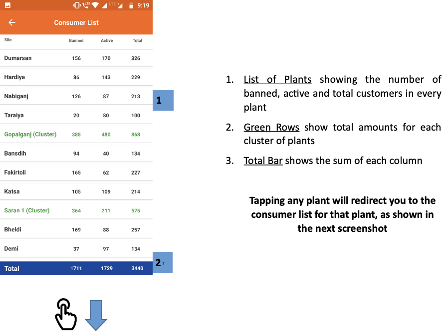

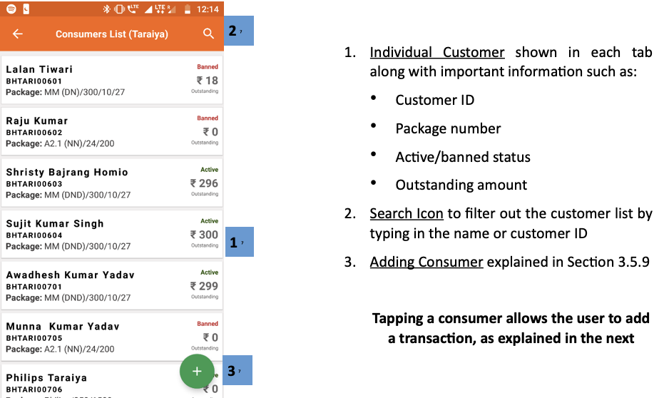

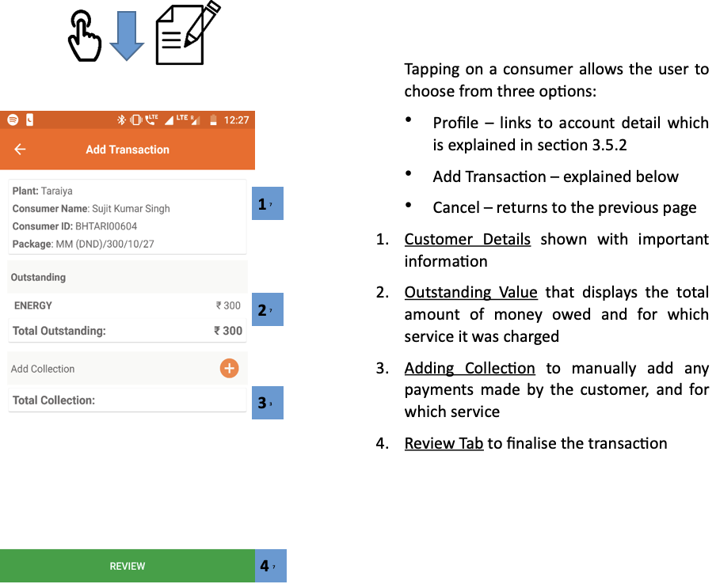

## 3.5.5. उपभोक्ता का स्टेटस
**फंक्शनिलिटी**
* कन्ज़यूमर स्टेटस सेक्शन से पता चलता है कि ग्राहक को डिस्ट्रिब्यूशन नेटवर्क से जोड़ने का कार्य कहाँ तक पूरा हुआ है।
* इंस्टालेशन स्टेटस को चार हिस्सों में बाँटा गया है। ये हैं – खंभा, मकान में तार, सर्विस वायर और रिव्यू
* इस सेक्शन में यह भी दिखाई देता है कि हर प्लांट में पैकेज के कितने अनुरोध अस्वीकार किए गए हैं।
* यह फंक्शनलिटी केवल एचसीएलएफ यूज़र को प्राप्त है। 

**मुख्य-मुख्य यूज़र**
<table>
  <tr>
    <th>पदनाम </th>
    <th>मुख्य प्रयोजन</th>
    <th>उपयोग का उदाहरण</th>
  </tr>
  <tr>
    <td>सीएसए</td>
    <td>सभी ग्राहकों के मीटर इंस्टाल करने के स्टेटस का मूल्यांकन करना</td>
    <td>महीने के अंत में बाकी रही मीटर रीडिंग रिव्यू की संख्या रिपोर्ट करना</td>
  </tr>
  <tr>
    <td>समूह प्रभारी</td>
    <td>सीएसए के समान</td>
    <td>समूह में ग्राहकों के यहाँ हार्डवेअर इंस्टाल करने का स्टेटस रिव्यू करना</td>
  </tr>
  <tr>
    <td>राज्य प्रभारी</td>
    <td>सीएसए के समान</td>
    <td>ग्राहक सेवा की गुणवत्ता बढाने के लिए प्लांट में ऑडिट अभियान शुरू करना</td>
  </tr>
</table>

**पेज के डिटेल**

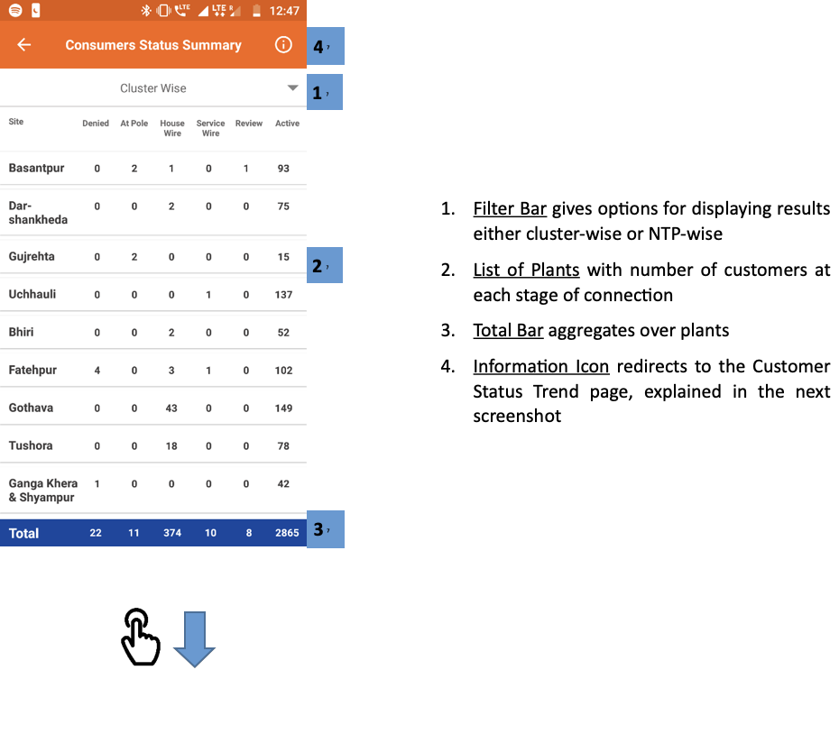

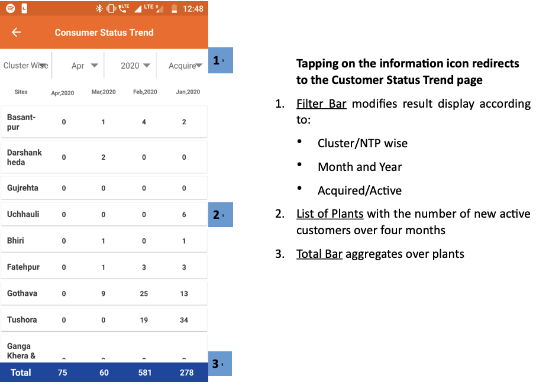

## 3.5.6. उपभोक्ता की एक्टिविटी 
**फंक्शनलिटी**
* ग्राहक के बिजली के कनेक्शन को बंद (डिएक्टिवेट) और दुबारा चालू (रिएक्टिवेट) करने के लिए इंटरफेस।
* क्रमिक रूप से अनुमोदन के बाद परिवर्तन स्वीकृत होता है।
* हर प्लांट के एक्टिविटी संबंधी परिवर्तन का विवरण दर्ज होता है। 

**मुख्य-मुख्य यूज़र**
<table>
  <tr>
    <th>पदनाम</th>
    <th>मुख्य प्रयोजन</th>
    <th>उपयोग का उदाहरण</th>
  </tr>
  <tr>
    <td>टेक्निशन</td>
    <td>ग्राहक के स्टेटस को अनुरोध के अनुसार बदलना</td>
    <td>देखना कि किस ग्राहक का कनेक्शन चालू/बंद करना है और उस अनुसार उनके कनेक्शन में बदलाव करना </td>
  </tr>
  <tr>
    <td>सीएसए</td>
    <td>टेक्निशन के समान</td>
    <td>टेक्निशन के समान</td>
  </tr>
  <tr>
    <td>समूह प्रभारी</td>
    <td>ग्राहक के स्टेटस बदलने के अनुरोध को दर्ज करना और फील्ड स्टाफ को असाइन करना</td>
    <td>एप्प का प्रयोग कर देखना कि आवश्यक परिवर्तन करने के लिए फील्ड एजेंट उपलब्ध है या नहीं</td>
  </tr>
  <tr>
    <td>राज्य प्रभारी</td>
    <td>राज्य के प्लांट के ग्राहकों से प्राप्त अनुरोध अनुमोदित करना</td>
    <td>जाँच करना कि परिवर्तन के कितने अनुरोध लंबित (पेंडिंग) हैं और किन-किन प्लांट पर।</td>
  </tr>
</table>

**पेज के डिटेल**
ज़्यूमर एक्टिविटी पेज कई टैब में रखा गया है, जिसका प्रोसेस अकाउंट स्टेटस चेंज की तरह है। 

| अनुरोध | प्रक्रिया में | समीक्षा | पूरे किए गए |
|---|---|---|---|
| De- / पुनः सक्रियण के लिए एक ग्राहक पंजीकृत करें | उन ग्राहकों की सूची जिनके कनेक्शन पर ध्यान देने की आवश्यकता है | कार्रवाई की पुष्टि की गई है | सभी ग्राहक की ऐतिहासिक सूची de- / पुनः सक्रियण विवरण |

### 3.5.6.1. रिक्वेस्ट टैब
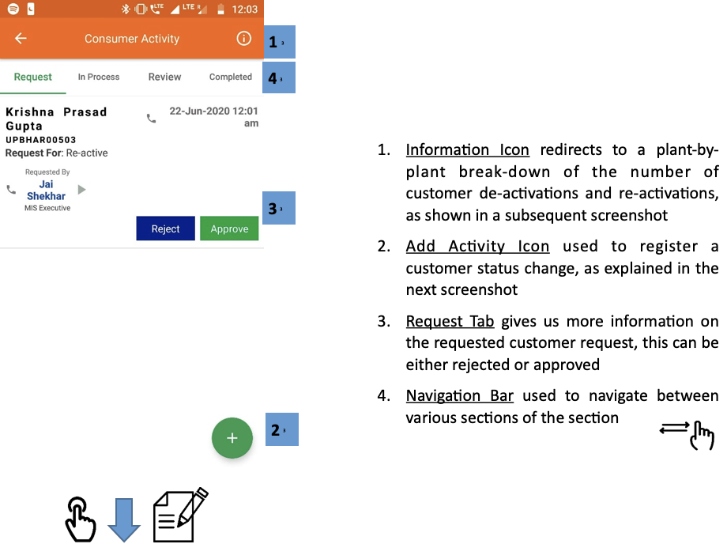

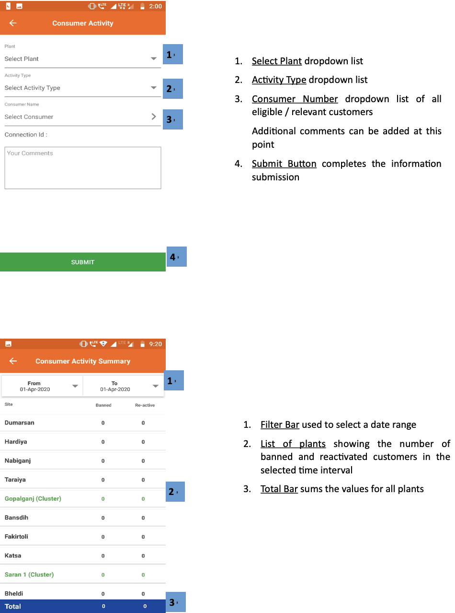

### 3.5.6.2. इन प्रोसेस टैब
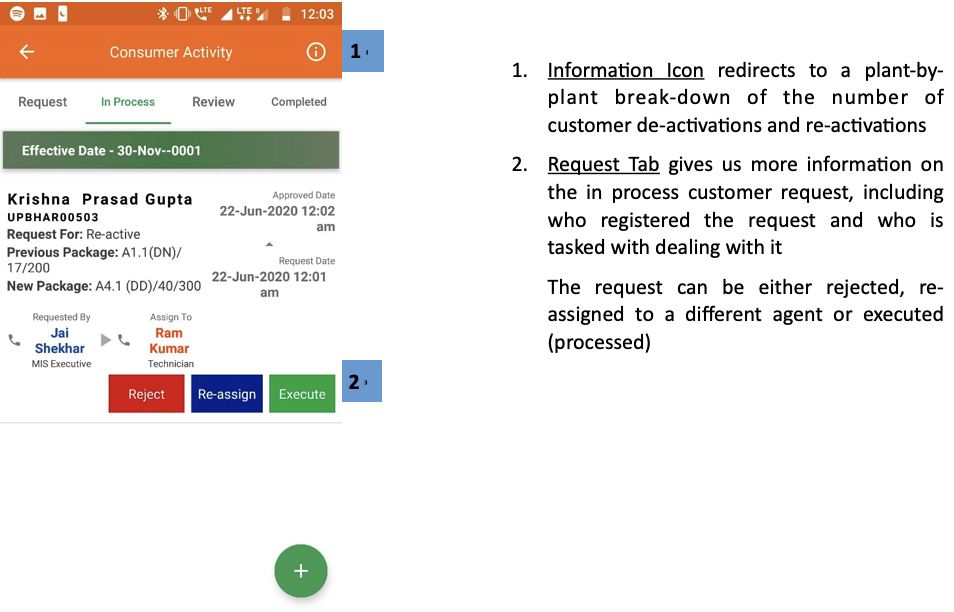

### 3.5.6.3. रिव्यू टैब
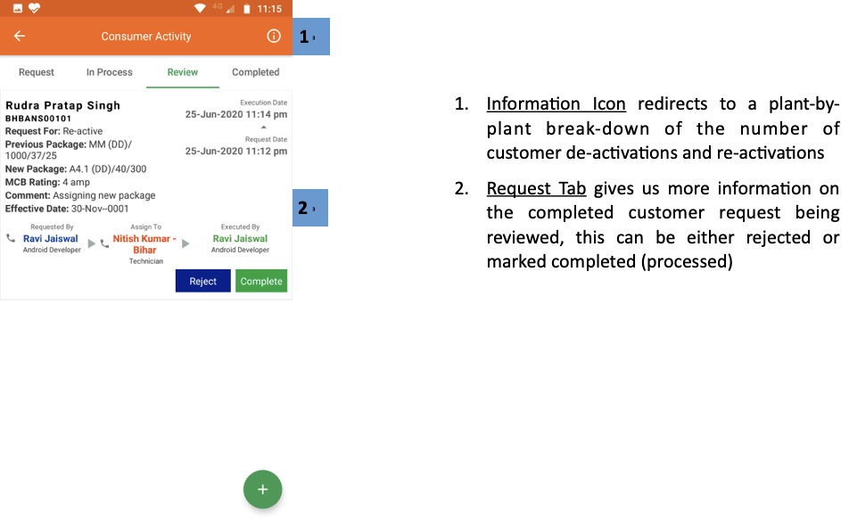

### 3.5.6.4. कंप्लिटेड टैब

## 3.5.7. उपभोक्ता सेवा
**फंक्शनलिटी**
* ग्राहक सेवा के मौजूदा अनुरोध के पूरे होने की स्थिति देखना। इसमें तकनीकी और गैर-तकनीकी दोनों के प्रकार के अनुरोध शामिल हैं 
* सेवा संबंधी नए अनुरोध जोड़ना
* बकाया रहे अनुरोध कार्रवाई के लिए फील्ड कर्मचारियों को सौंपना
* पूरे हो चुके अनुरोध को बंद करना

**मुख्य-मुख्य यूज़र**
<table>
  <tr>
    <th>पदनाम</th>
    <th>मुख्य प्रयोजन</th>
    <th>प्रयोग के उदाहरण</th>
  </tr>
  <tr>
    <td>टेक्निशन</td>
    <td>उन्हें असाइन किए गए सेवा संबंधी अनुरोध रिव्यू करना</td>
    <td>लंबित (पेंडिंग) रिक्वेस्ट को आगे बढ़ाना, जो इस बात पर निर्भर करेगा कि वे कब दर्ज हुए थे और किस कार्य से संबंधित हैं</td>
  </tr>
  <tr>
    <td>सीएसए</td>
    <td>टेक्निशन के समान</td>
    <td>ग्राहक से फोन पर बात कर समझना कि उनकी समस्या क्या है और हल होने पर उसे पूर्ण के रूप में चिह्नित करना</td>
  </tr>
  <tr>
    <td>समूह प्रभारी</td>
    <td>समूह के सभी ग्राहकों के अनुरोध देखना</td>
    <td>लंबित (पेंडिंग) अनुरोध रिव्यू करना और आगे की कार्रवाई के लिए कर्मचारियों को सौंपना</td>
  </tr>
  <tr>
    <td>राज्य प्रभारी</td>
    <td>राज्य में सेवा संबंधी अनुरोध के आँकड़ों की पूरी जानकारी प्राप्त करना</td>
    <td>कर्मचारियों द्वारा कार्रवाई में लगने वाले समय संबंधी लक्ष्य और ग्राहक संतुष्टि संबंधी लक्ष्य पर नजर रखना</td>
  </tr>
</table>

**पेज के डिटेल**

| रिपोर्ट | अनुरोध | पूरे किए गए |
|---|---|---|
| पूर्ण और लंबित सेवा अनुरोधों पर अवलोकन आँकड़े | लंबित अनुरोधों और कर्मियों के असाइनमेंट की विस्तृत सूची | सभी पूर्ण अनुरोधों का रिकॉर्ड |

### 3.5.7.1. रिपोर्ट टैब
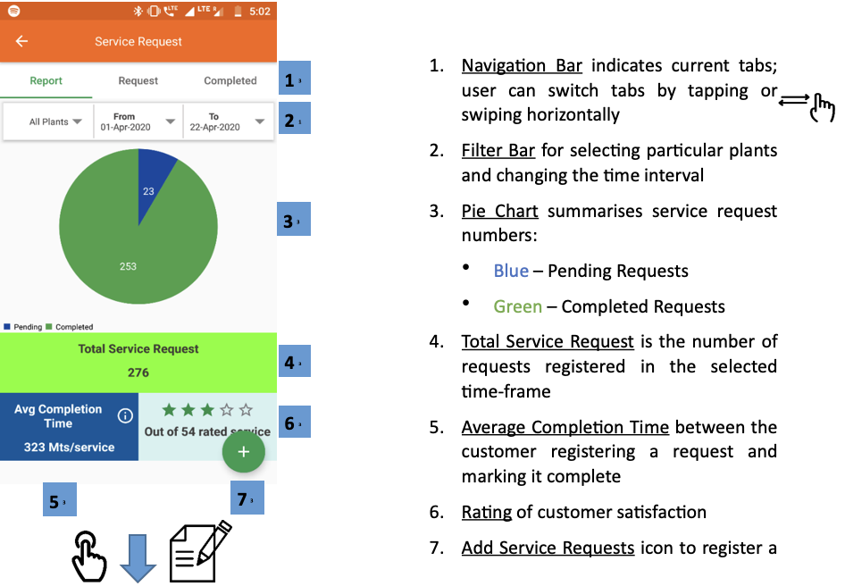

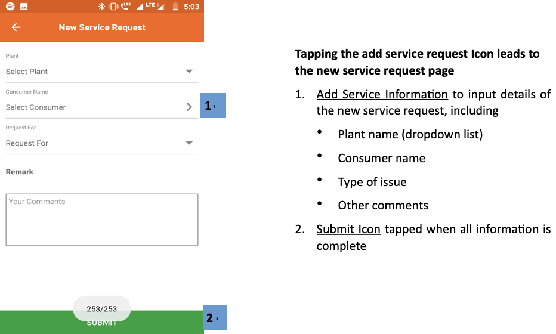

### 3.5.7.2. रिक्वेस्ट टैब
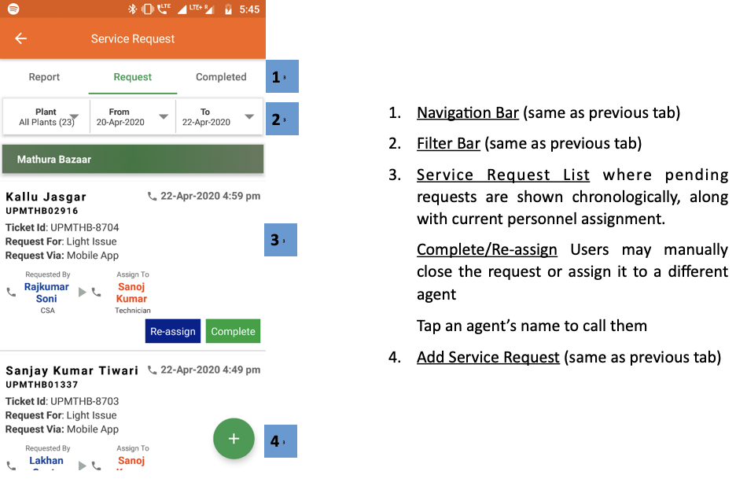

### 3.5.7.3. कार्य पूर्ण होने का (कंप्लिटेड) टैब
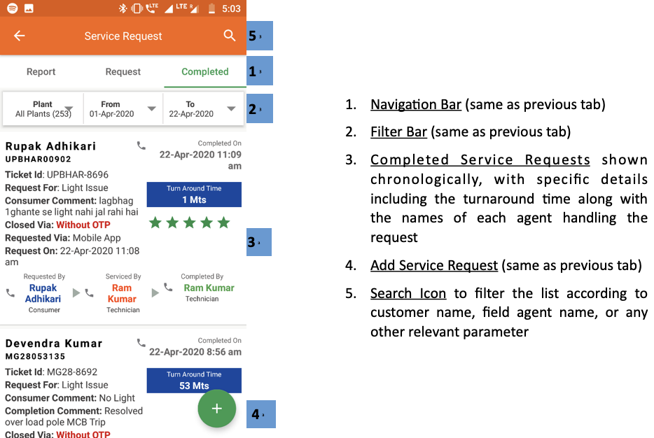

## 3.5.8. अस्थायी (टेंपरेरी) डिस्कनेक्ट
**फंक्शनलिटी**
* इससे यूज़र किसी निश्चित ग्राहक की बिजली सप्लाइ दूर से (रिमोटली) बंद कर सकता है।
* यह फंक्शनिलिटी केवल ताराऊर्जा उपयोग करने वालों को दी गई है।

**मुख्य-मुख्य यूज़र**
<table>
  <tr>
    <th>पदनाम</th>
    <th>मुख्य प्रयोजन</th>
    <th>उपयोग के उदाहरण</th>
  </tr>
  <tr>
    <td>टेक्निशन</td>
    <td>किसी प्लांट के किसी ग्राहक को डिस्कनेक्ट करना</td>
    <td>बिजली की मांग बढ़ने से प्लांट रुक जाने (ट्रिप हो जाने) पर ज्यादा लोड वाले ग्राहकों को तब तक डिस्कनेक्ट किए रहना, जब तक कि सिस्टम पूरी तरह से चालू न हो जाए। </td>
  </tr>
  <tr>
    <td>समूह प्रभारी</td>
    <td>किसी प्लांट के सभी ग्राहकों को डिस्कनेक्ट करना</td>
    <td>नेटवर्क के रख-रखाव (मेन्टेनेन्स) के समय सुरक्षा की दृष्टि से सभी ग्राहकों को डिस्कनेक्ट करना</td>
  </tr>
</table>

**पेज के डिटेल**
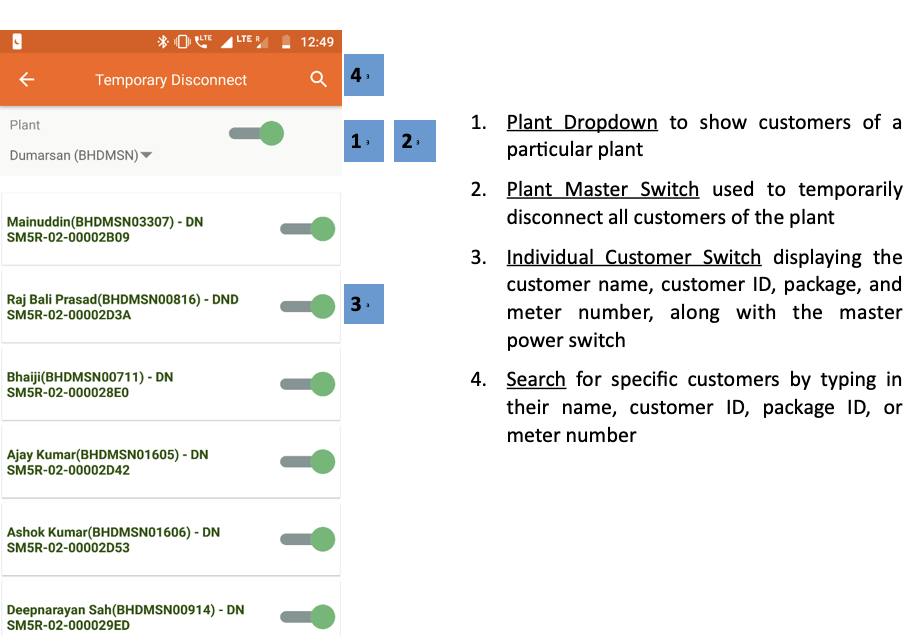

## 3.5.9. ग्राहक को ऐड करना
**फंक्शनलिटी**
* एमकॉम्स सिस्टम में नए ग्राहक का खाता बनाना

**मुख्य-मुख्य यूज़र**
<table>
  <tr>
    <th>पदनाम</th>
    <th>मुख्य प्रयोजन</th>
    <th>उपयोग के उदाहरण</th>
  </tr>
  <tr>
    <td>टेक्निशन</td>
    <td>उपभोक्ता को कंपनी के डेटाबेस में जोड़ना</td>
    <td>जो ग्राहक खाता बनाने के लिए स्मार्टफोन एप्प से रिक्वेस्ट नहीं कर सकते उन्हें मैनुअली जोड़ना</td>
  </tr>
  <tr>
    <td>सीएसए</td>
    <td>टेक्निशन के समान</td>
    <td>टेक्निशन के समान</td>
  </tr>
  <tr>
    <td>समूह प्रभारी</td>
    <td>टेक्निशन के समान</td>
    <td>टेक्निशन के समान</td>
  </tr>
  <tr>
    <td>राज्य प्रभारी</td>
    <td>टेक्निशन के समान</td>
    <td>टेक्निशन के समान</td>
  </tr>
</table>

**पेज के डिटेल**
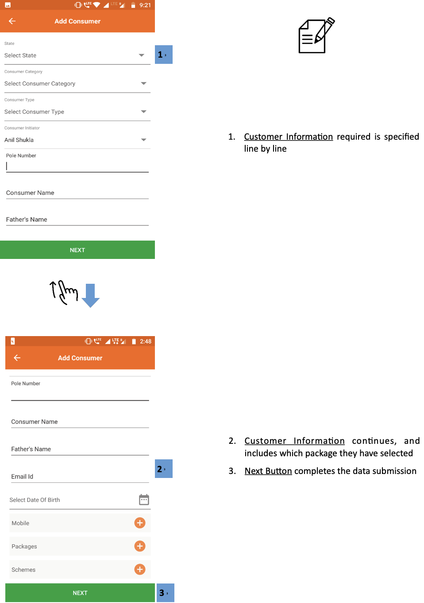

## 3.5.10. ग्राहक को तत्काल ऐड करना
**फंक्शनलिटी**
* एमकॉम्स सिस्टम में नए ग्राहक का तत्काल खाता बनाना, जिसके लिए केवल कुछ महत्वपूर्ण जानकारी रिकॉर्ड करनी होती है।
* यह फंक्शनिलिटी केवल तारा ऊर्जा यूज़र को दी गई है।

**मुख्य-मुख्य यूज़र**
<table>
  <tr>
    <th>पदनाम</th>
    <th>मुख्य प्रजोजन</th>
    <th>उपयोग के उदाहरण</th>
  </tr>
  <tr>
    <td>सीएसए</td>
    <td>नए ग्राहक को तत्काल कंपनी के डेटाबेस में जोड़ना</td>
    <td>किसी स्थान पर भर्ती अभियान के समय कई संभावित ग्राहक शीघ्रता से रजिस्टर होना चाहते हैं।</td>
  </tr>
  <tr>
    <td>समूह प्रभारी</td>
    <td>सीएसए के समान</td>
    <td>सीएसए के समान</td>
  </tr>
  <tr>
    <td>राज्य प्रभारी</td>
    <td>सीएसए के समान</td>
    <td>सीएसए के समान</td>
  </tr>
</table>

**पेज के डिटेल**
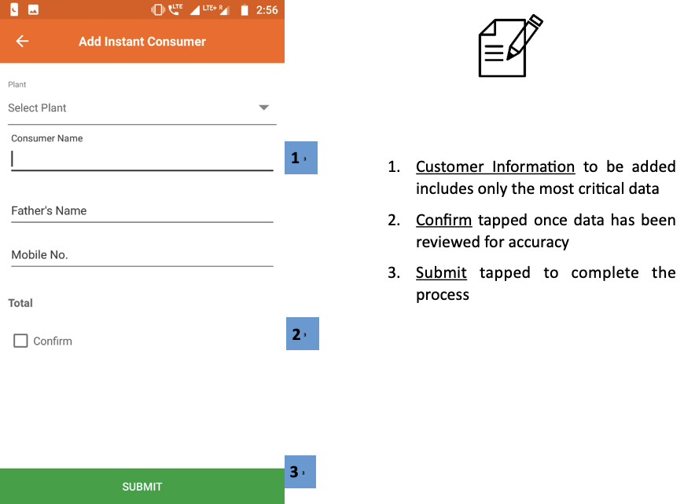

## 3.5.11. ग्राहक प्राप्त करने के लिए (कैचमेंट) सर्वे
**फंक्शनलिटी**
* कैचमेंट सर्वे सेक्शन प्लांट के सभी ग्राहकों और संभावित ग्राहकों का संक्षिप्त विवरण दर्शाता है।
* ‘कैचमेंट’ रखने का प्रयोजन है धीरे-धीरे ग्राहकों के व्यवहार की समीक्षा करना।
* संभावित ग्राहकों तक पहुँचने के लिए किए गए प्रयास की विस्तृत सूची भी इससे प्राप्त होती है। 

**मुख्य-मुख्य यूज़र**
<table>
  <tr>
    <th>पदनाम</th>
    <th>मुख्य प्रजोजन</th>
    <th>उपयोग के उदाहरण</th>
  </tr>
  <tr>
    <td>ऑपरेटर</td>
    <td>बिजली उपभोक्ताओं द्वारा सर्वे में दिए गए उत्तर रिकॉर्ड करना</td>
    <td>कनेक्शन के लिए प्लांट में आकर पूछताछ करने वाले स्थानीय व्यक्ति का इंटरव्यू लेना</td>
  </tr>
  <tr>
    <td>टेक्निशन</td>
    <td>ऑपरेटर के समान</td>
    <td>मौजूदा ग्राहक का प्रोफाइल और संपर्क विवरण अपडेट करना</td>
  </tr>
  <tr>
    <td>सीएसए</td>
    <td>ऑपरेटर के समान</td>
    <td>बिजली की जरूरत और उपयोग के पैटर्न को समझने के लिए कैचमेंट एरिया के लोगों से बातचीत करना</td>
  </tr>
  <tr>
    <td>समूह प्रभारी</td>
    <td>ऑपरेटर के समान</td>
    <td>समूह के एक्टिव, इनेक्टिव और संभावित ग्राहकों की संख्या का रिव्यू करना</td>
  </tr>
</table>

**पेज के डिटेल**
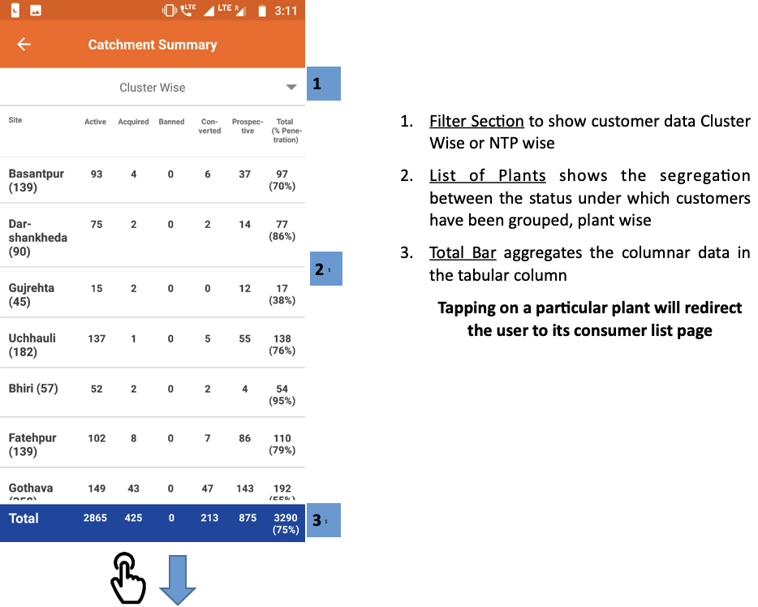

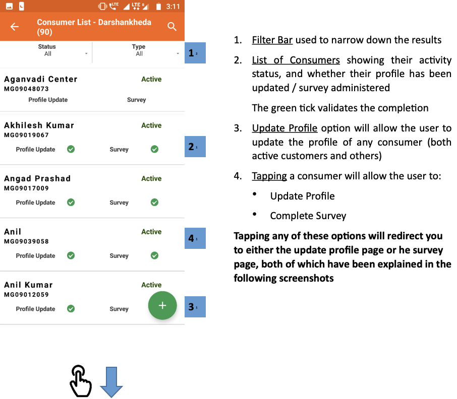

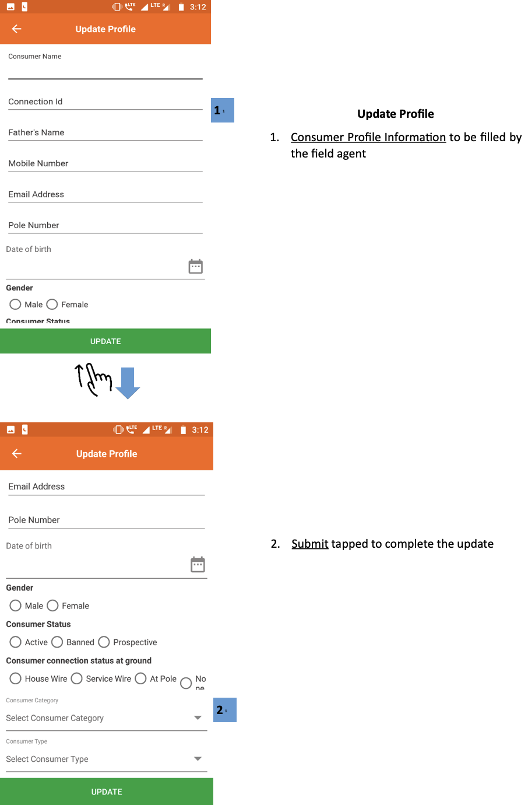

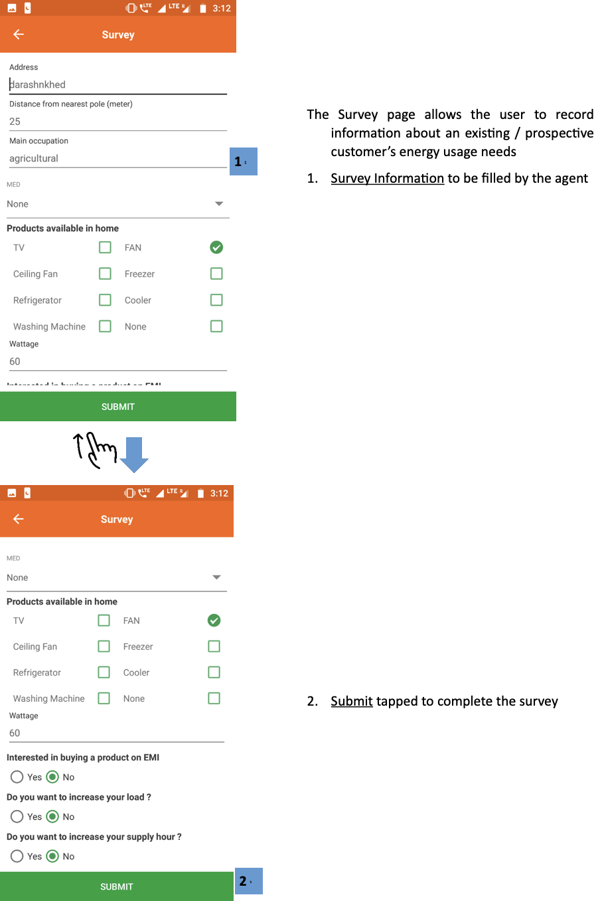

## 3.5.12. चोरी की शिकायत
**फंक्शनलिटी**
* इस फंक्शनलिटी से मिनी ग्रिड से चोरी हुई बिजली का डेटा जाँच-पड़ताल के लिए दर्ज हो जाता है 
* यह फंक्शनलिटी केवल एचसीएलएफ यूज़र को मिलती है।

**मुख्य-मुख्य यूज़र **
<table>
  <tr>
    <th>पदनाम</th>
    <th>मुख्य प्रयोजन</th>
    <th>प्रयोग के उदाहरण</th>
  </tr>
  <tr>
    <td>ऑपरेटर</td>
    <td>संभावित चोरी दर्ज करना ताकि उस पर कार्रवाई हो सके</td>
    <td>प्लांट में आने वाले ग्राहक की शिकायत दर्ज करना</td>
  </tr>
  <tr>
    <td>टेक्निशन</td>
    <td>चोरी की लंबित (पेंडिंग) शिकायतें देखना</td>
    <td>समूह प्रभारी के बताए अनुसार डिस्ट्रिब्यूशन नेटवर्क के केबल चेक करना</td>
  </tr>
  <tr>
    <td>सीएसए</td>
    <td>ऑपरेटर के समान</td>
    <td>बिना स्वीकृति वाले नए कैबल दिखाई देने पर शिकायत दर्ज करना</td>
  </tr>
  <tr>
    <td>समूह प्रभारी</td>
    <td>चोरी की शिकायतों का रिव्यू करना और पड़ताल के लिए फील्ड स्टाफ को असाइन करना</td>
    <td>किसी निश्चित अवधि की चोरी की सभी शिकायतों को रिव्यू करना</td>
  </tr>
</table>

**पेज के डिटेल**

| लंबित | प्रक्रिया में | पूरे किए गए |
|---|---|---|
| चोरी की रिपोर्ट जो बताई जाती है | चोरी की रिपोर्ट जो वर्तमान में जांच की जा रही है | चोरी की रिपोर्ट जो उचित तरीके से निपटाया गया है |

### 3.5.12.1. पेंडिंग टैब
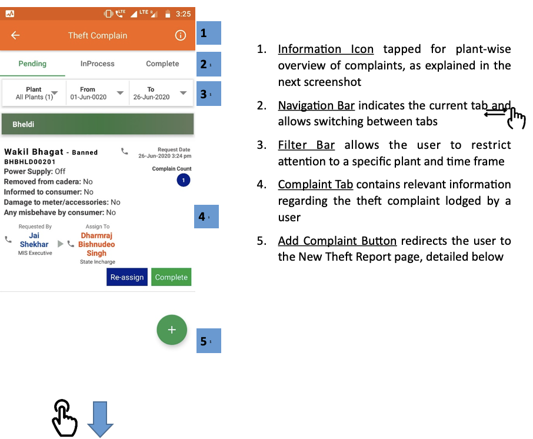

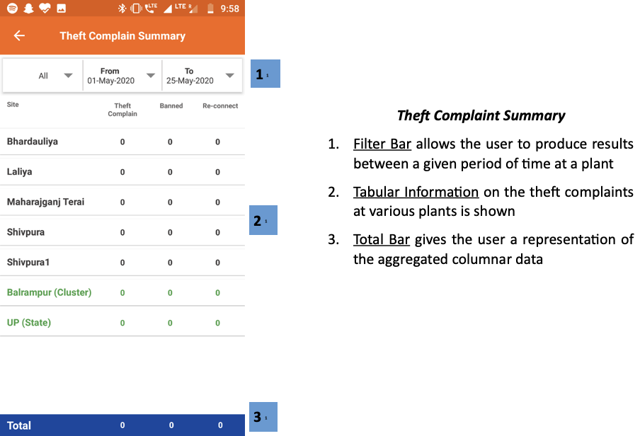

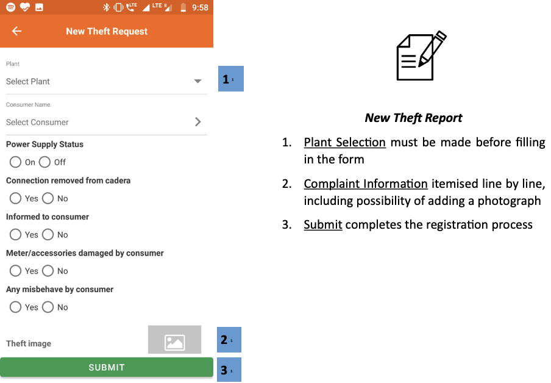

### 3.5.12.2. प्रक्रिया टैब में
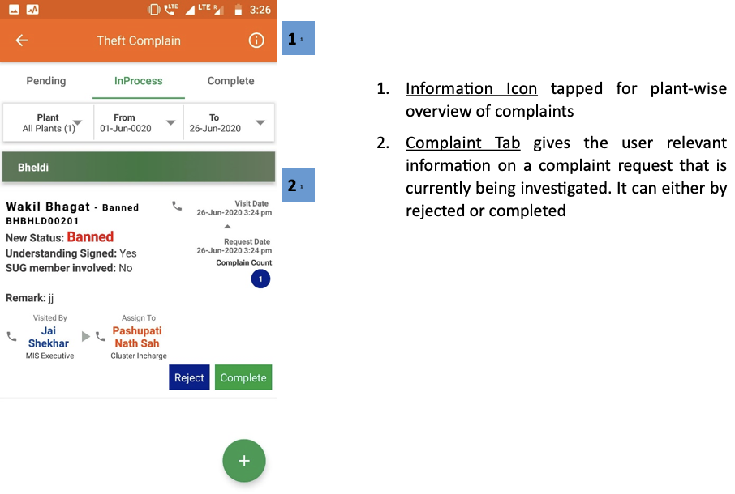

### 3.5.12.3. कंप्लिटेड टैब
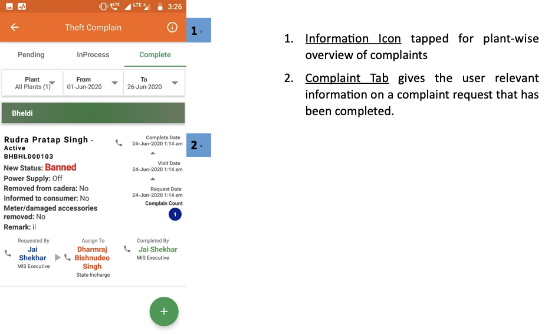

## 3.5.13. कूपन डिस्काउंट
**फंक्शनलिटी**
* प्लांट के कर्मचारी ग्राहकों के लिए कूपन तैयार कर सकते हैं।
* रिडीम किए गए कूपनों की संख्या मालूम होती है।

**मुख्य-मुख्य यूज़र**
<table>
  <tr>
    <th>पदनाम</th>
    <th>मुख्य प्रयोजन</th>
    <th>उपयोग के उदाहरण</th>
  </tr>
  <tr>
    <td>ऑपरेटर</td>
    <td>ग्राहकों की ओर से कूपन कोड जनरेट करना</td>
    <td>जिन ग्राहकों के पास स्मार्ट फोन नहीं है, उन्हें कंपनी के प्रमोशन ऑफर प्राप्त करने में मदद करना</td>
  </tr>
  <tr>
    <td>टेक्निशन</td>
    <td>ऑपरेटर के समान</td>
    <td>ऑपरेटर के समान</td>
  </tr>
  <tr>
    <td>सीएसए</td>
    <td>ऑपरेटर के समान</td>
    <td>ऑपरेटर के समान</td>
  </tr>
  <tr>
    <td>समूह प्रभारी</td>
    <td>ऐसे ग्राहकों का पता लगाना जिनके कूपन की अवधि समाप्त हो रही है</td>
    <td>ऐसे ग्राहकों से संपर्क करना जिन्होंने कूपन जनरेट तो किए हैं किंतु रिडीम नहीं किए हैं</td>
  </tr>
  <tr>
    <td>राज्य प्रभारी</td>
    <td>विभिन्न प्लांट में कूपन स्कीम के परिणाम पर निगाह रखना</td>
    <td>इस योजना में शामिल हुए पात्र ग्राहकों के अनुपात की गिनती करना</td>
  </tr>
</table>

**पेज के डिटेल**
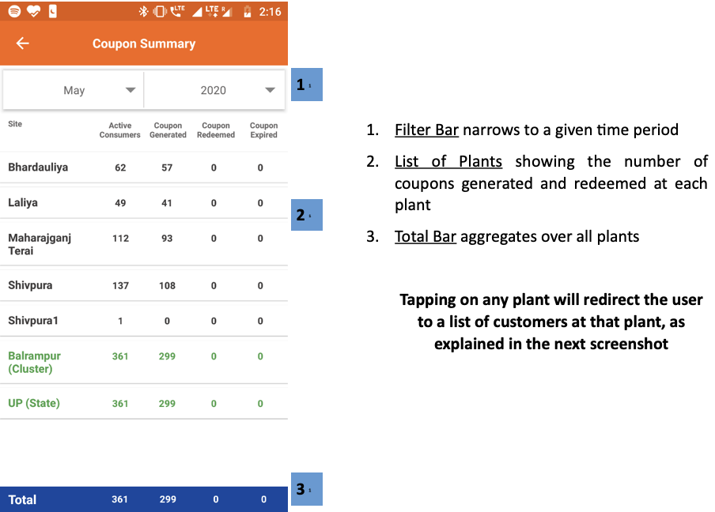

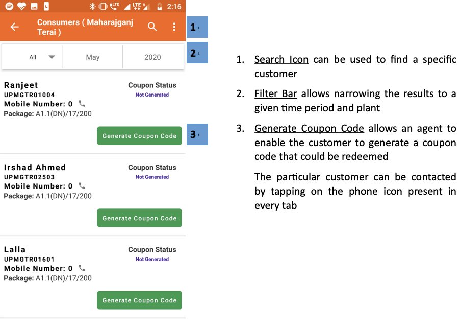

