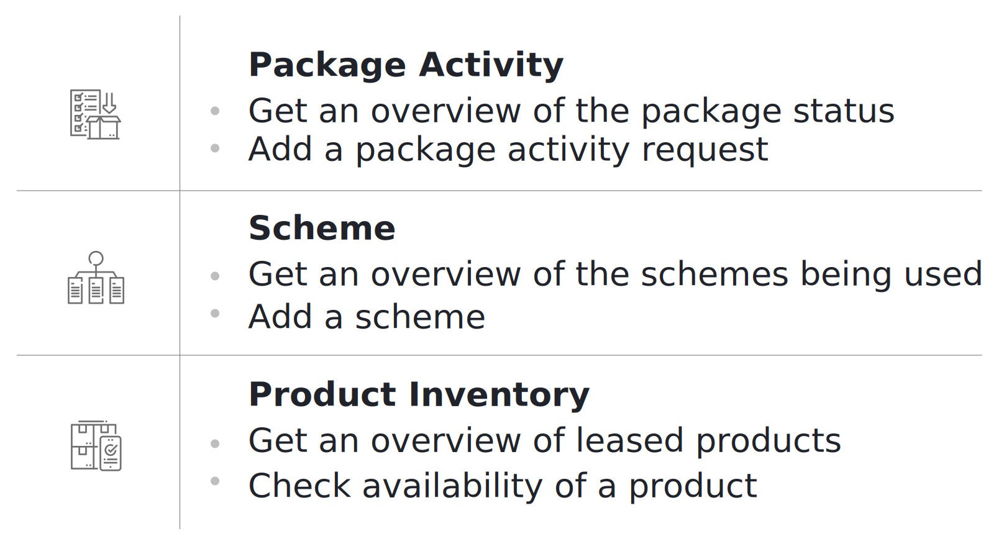
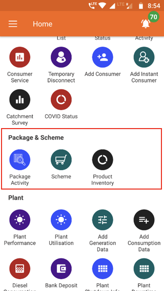

## 3.6.1. एक नजर (ओवरव्यू)

  

 
## 3.6.2. पैकेज एक्टिविटी
**फंक्शनलिटी**
* पैकेज एक्टिविटी सेक्शन ग्राहक को असाइन किए गए पैकेज को बदलने का इंटरफेस है।
* बदलाव कई क्रमिक अप्रूवल के बाद होता है, जिसका विवरण संबंधित एजेंट को प्राप्त होता है। 
* प्रत्येक प्लांट के पैकेज चेंज का विवरण तैयार हो जाता है।

**मुख्य-मुख्य यूज़र**
<table>
  <tr>
    <th>पदनाम</th>
    <th>मुख्य प्रयोजन</th>
    <th>उपयोग के उदाहरण</th>
  </tr>
  <tr>
    <td>टेक्निशन</td>
    <td>पैकेज बदलने के ग्राहक के अनुरोध को पूरा करना</td>
    <td>कनेक्शन को अपग्रेड/डाउनग्रेड करने की जरूरत वाले ग्राहकों की सूची रिव्यू करना</td>
  </tr>
  <tr>
    <td>सीएसए</td>
    <td>पैकेज बदलने का अनुरोध दर्ज करना और देखना</td>
    <td>स्मार्ट फोन का उपयोग न करने वाले ग्राहक की ओर से पैकेज बदलने का अनुरोध दर्ज करना</td>
  </tr>
  <tr>
    <td>समूह प्रभारी</td>
    <td>प्राप्त अनुरोध देखना और उन्हें फील्ड कर्मचारियों को असाइन करना</td>
    <td>फील्ड एजेंट को सूचित करना कि ग्राहकों के साथ फॉलोअप करना उनकी जिम्मेदारी है।</td>
  </tr>
  <tr>
    <td>राज्य प्रभारी</td>
    <td>राज्य के सभी प्लांट के अनुरोध देखना</td>
    <td>देखना कि किन-किन प्लांट पर पैकेज बदलने के कितने अनुरोध लंबित (पेंडिंग) हैं</td>
  </tr>
</table>

**पेज के डिटेल**

| Request| In Process| Review| Completed|
|---|---|---|---|
| Information on package request| Lists requests that are being worked on| Completed requests that are awaiting approval| Details of historical package requests|

### 3.6.2.1. रिक्वेस्ट टैब

### 3.6.2.2. इन प्रोसेस टैब

### 3.6.2.3. रिव्यू टैब

### 3.6.2.4. कंप्लिटेड टैब

## 3.6.3. स्कीम
**फंक्शनिलिटी**
* बिजली कनेक्शन के साथ बिजली के उपकरण देने की प्रमोशनल स्कीम में भाग ले रहे ग्राहकों की सूची
* नए ग्राहकों को स्कीम से जोड़ने का विकल्प (ऑप्शन)

**मुख्य-मुख्य यूज़र**
<table>
  <tr>
    <th>पदनाम</th>
    <th>मुख्य प्रयोजन</th>
    <th>उपयोग के उदाहरण</th>
  </tr>
  <tr>
    <td>सीएसए</td>
    <td>भाग लेने वाले ग्राहकों की सूची चेक करना</td>
    <td>किसी ग्राहक के अनुरोध करने पर उसे स्कीम में शामिल करना</td>
  </tr>
  <tr>
    <td>समूह प्रभारी</td>
    <td>सीएसए के समान</td>
    <td>चेक करना कि किन-किन ग्राहकों से स्कीम का पैसा आना बाकी है</td>
  </tr>
  <tr>
    <td>राज्य प्रभारी</td>
    <td>राज्य में चल रही स्कीमों का मूल्यांकन करना</td>
    <td>विभिन्न योजनाओं की लोकप्रियता का मूल्यांकन करना</td>
  </tr>
</table>

**पेज के डिटेल**

## 3.6.4. उत्पादों की सूची (प्रॉडक्ट इन्वेन्टरी)
**फंक्शनलिटी**
* ग्राहकों के लिए तैयार योजनाओं के अंतर्गत कंपनी के गोदाम में रखे सभी इलेक्ट्रिक सामान प्रदर्शित होते हैं। 

**मुख्य-मुख्य यूज़र**
<table>
  <tr>
    <th>पदनाम</th>
    <th>मुख्य प्रयोजन</th>
    <th>उपयोग के उदाहरण</th>
  </tr>
  <tr>
    <td>ऑपरेटर</td>
    <td>कंपनी के गोदाम में रखा सामान देखना</td>
    <td>ग्राहक की ओर से चेक करना कि कोई निश्चित सामान स्कीम के अंतर्गत उपलब्ध है या नहीं।</td>
  </tr>
  <tr>
    <td>टेक्निशन</td>
    <td>ऑपरेटर के समान</td>
    <td>ऑपरेटर के समान</td>
  </tr>
  <tr>
    <td>सीएसए</td>
    <td>ऑपरेटर के समान</td>
    <td>ऑपरेटर के समान</td>
  </tr>
  <tr>
    <td>समूह प्रभारी</td>
    <td>ऑपरेटर के समान</td>
    <td>जिस सामान की ज्यादा मांग हो उसे खरीदने का अनुरोध भेजना</td>
  </tr>
  <tr>
    <td>राज्य प्रभारी</td>
    <td>Same as Operator</td>
    <td>गोदाम में रखा सामान चेक कर तय करना कि क्या नई खरीद करना है।</td>
  </tr>
</table>

**पेज के डिटेल**

