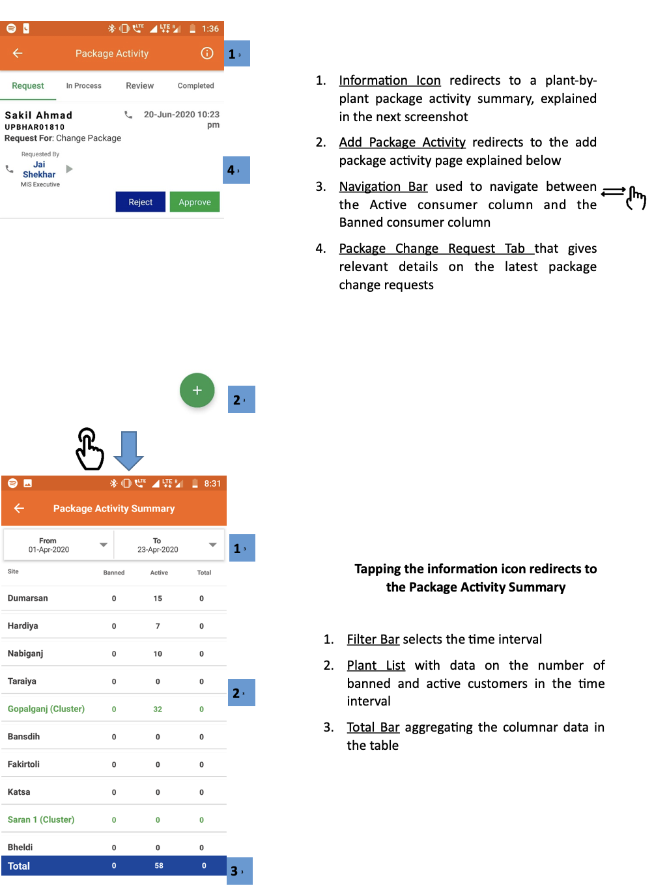
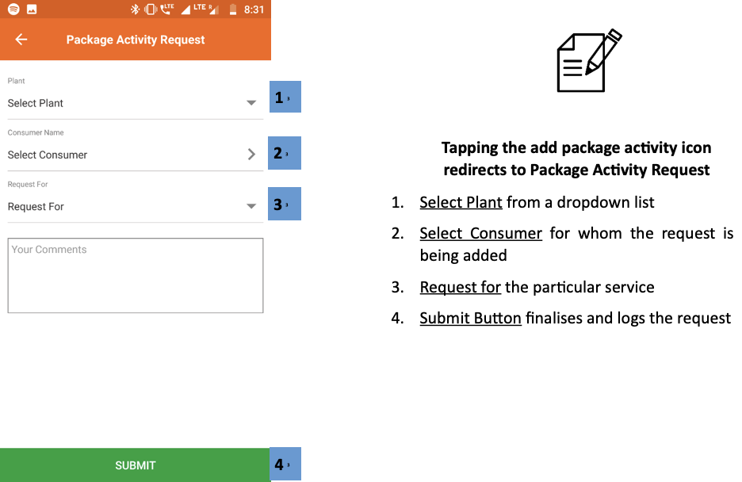
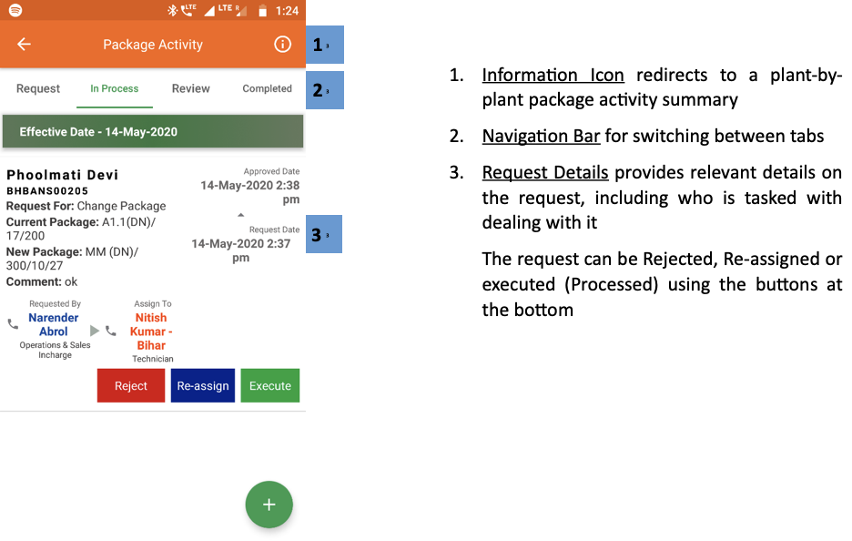
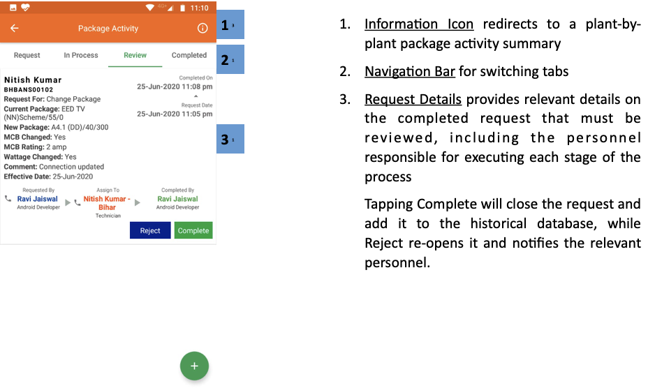
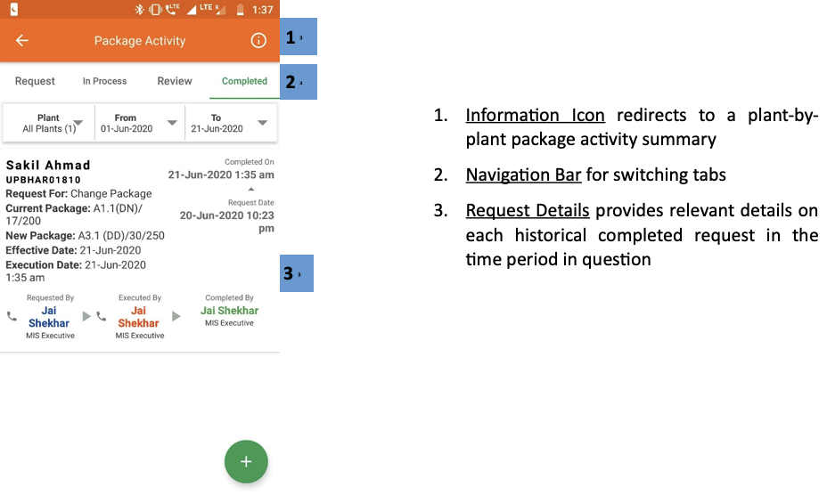
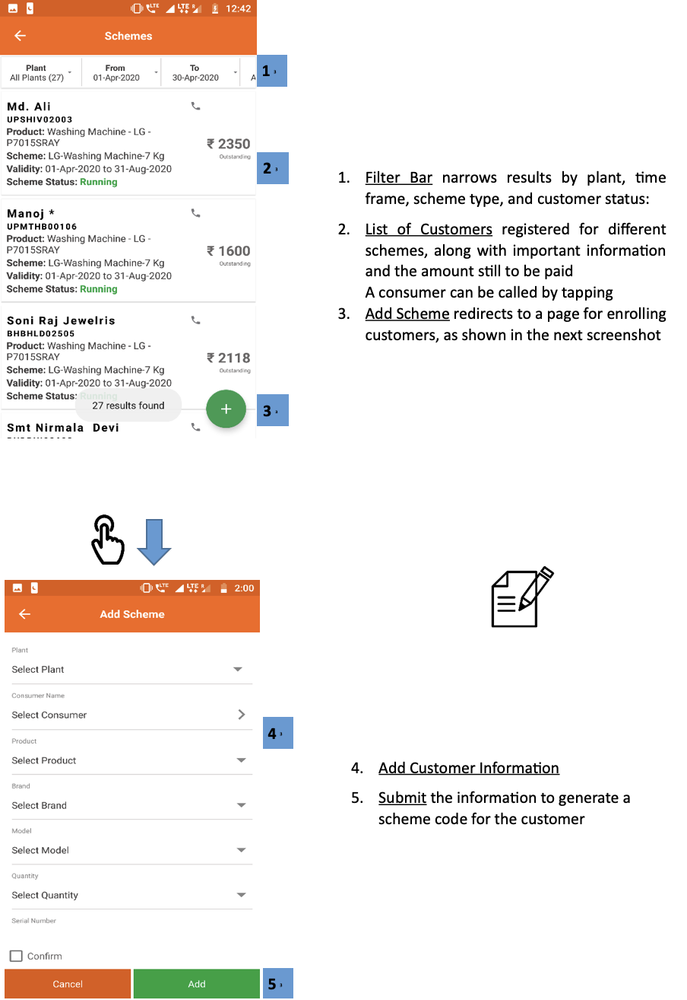
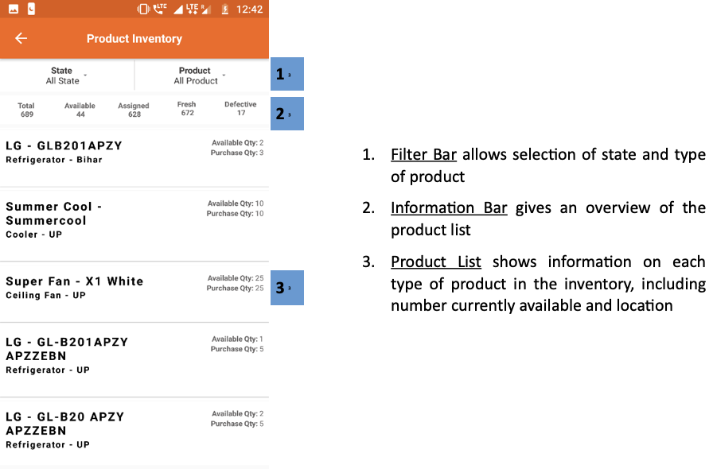

import useBaseUrl from '@docusaurus/useBaseUrl';
export const Highlight = ({children, color}) => (
  
    {children}
  
);

## 3.6.1. एक नजर (ओवरव्यू)

 

 

 
## 3.6.2. पैकेज एक्टिविटी
**फंक्शनलिटी**
* पैकेज एक्टिविटी सेक्शन ग्राहक को असाइन किए गए पैकेज को बदलने का इंटरफेस है।
* बदलाव कई क्रमिक अप्रूवल के बाद होता है, जिसका विवरण संबंधित एजेंट को प्राप्त होता है। 
* प्रत्येक प्लांट के पैकेज चेंज का विवरण तैयार हो जाता है।

**मुख्य-मुख्य यूज़र**
<table>
  <tr>
    <th>पदनाम</th>
    <th>मुख्य प्रयोजन</th>
    <th>उपयोग के उदाहरण</th>
  </tr>
  <tr>
    <td>टेक्निशन</td>
    <td>पैकेज बदलने के ग्राहक के अनुरोध को पूरा करना</td>
    <td>कनेक्शन को अपग्रेड/डाउनग्रेड करने की जरूरत वाले ग्राहकों की सूची रिव्यू करना</td>
  </tr>
  <tr>
    <td>सीएसए</td>
    <td>पैकेज बदलने का अनुरोध दर्ज करना और देखना</td>
    <td>स्मार्ट फोन का उपयोग न करने वाले ग्राहक की ओर से पैकेज बदलने का अनुरोध दर्ज करना</td>
  </tr>
  <tr>
    <td>समूह प्रभारी</td>
    <td>प्राप्त अनुरोध देखना और उन्हें फील्ड कर्मचारियों को असाइन करना</td>
    <td>फील्ड एजेंट को सूचित करना कि ग्राहकों के साथ फॉलोअप करना उनकी जिम्मेदारी है।</td>
  </tr>
  <tr>
    <td>राज्य प्रभारी</td>
    <td>राज्य के सभी प्लांट के अनुरोध देखना</td>
    <td>देखना कि किन-किन प्लांट पर पैकेज बदलने के कितने अनुरोध लंबित (पेंडिंग) हैं</td>
  </tr>
</table>

**पेज के डिटेल**

| अनुरोध | प्रक्रिया में | समीक्षा | पूरे किए गए |
|---|---|---|---|
| पैकेज अनुरोध पर सूचना | सूची अनुरोधों पर काम किया जा रहा है | स्वीकृत अनुरोध का इंतजार कर रहे हैं | ऐतिहासिक पैकेज अनुरोधों का विवरण |

### 3.6.2.1. रिक्वेस्ट टैब

 

 
1.  **सूचना आइकन** एक संयंत्र द्वारा संयंत्र पैकेज गतिविधि सारांश में पुनर्निर्देशित, अगले स्क्रीनशॉट में समझाया गया है
2.  **पैकेज गतिविधि जोड़ें** नीचे बताए गए पैकेज गतिविधि पेज पर रीडायरेक्ट करें
3.  **नेविगेशन बार** सक्रिय उपभोक्ता कॉलम और प्रतिबंधित उपभोक्ता कॉलम के बीच नेविगेट करने के लिए उपयोग किया जाता है

4.  **पैकेज परिवर्तन अनुरोध टैब** जो नवीनतम पैकेज परिवर्तन अनुरोधों पर प्रासंगिक विवरण देता है

 
 

    

**Tapping the information icon redirects to the Package Activity Summary**

1.  **फ़िल्टर बार** समय अंतराल का चयन करता है
2.  **प्लांट सूची** समय अंतराल में प्रतिबंधित और सक्रिय ग्राहकों की संख्या पर डेटा के साथ
3.  **कुल बार** तालिका में स्तंभ डेटा एकत्र करना

 
 

 
**पैकेज पैकेज गतिविधि आइकन टैप करने से पैकेज गतिविधि अनुरोध को पुनर्निर्देशित किया जाता है**

1.  **ड्रॉपडाउन सूची से प्लांट** का चयन करें
2.  **उपभोक्ता का चयन करें** जिसके लिए अनुरोध जोड़ा जा रहा है
3.  **विशेष सेवा के लिए** अनुरोध
4. **सबमिट बटन** अनुरोध को अंतिम रूप देता है और लॉग करता है

 

<!-- 

 -->

### 3.6.2.2. इन प्रोसेस टैब

 

1.  **सूचना आइकन** प्लांट-बाय-प्लांट पैकेज गतिविधि सारांश को पुनर्निर्देशित करता है
2.  **नेविगेशन बार** टैब के बीच स्विच करने के लिए
3.  **अनुरोध विवरण** अनुरोध पर प्रासंगिक विवरण प्रदान करता है, जिसमें इसके साथ काम करने वाले को सौंपा गया है

अनुरोध को नीचे दिए गए बटन का उपयोग करके अस्वीकृत, पुनः नियत या निष्पादित (संसाधित) किया जा सकता है

 

<!--   -->

### 3.6.2.3. रिव्यू टैब

 

1.  **सूचना आइकन** प्लांट-बाय-प्लांट पैकेज गतिविधि सारांश को पुनर्निर्देशित करता है
2.  **नेविगेशन बार**, स्विचिंग टैब के लिए
3.  **अनुरोध विवरण** प्रक्रिया के प्रत्येक चरण को निष्पादित करने के लिए जिम्मेदार कर्मियों सहित, समीक्षा किए जाने वाले पूर्ण अनुरोध पर प्रासंगिक विवरण प्रदान करता है

टैपिंग कम्प्लीट रिक्वेस्ट को बंद कर देगा और इसे ऐतिहासिक डेटाबेस में जोड़ देगा, जबकि रिजेक्ट इसे फिर से खोल देता है और संबंधित कर्मियों को सूचित करता है।

 

<!--  -->

### 3.6.2.4. कंप्लिटेड टैब

 

    

1.  **सूचना आइकन** एक संयंत्र-दर-पौधे पैकेज गतिविधि सारांश पर पुनर्निर्देशित करता है
2.  **नेविगेशन बार** टैब स्विच करने के लिए
3.  **अनुरोध विवरण** प्रश्न में समयावधि में प्रत्येक ऐतिहासिक पूर्ण अनुरोध पर प्रासंगिक विवरण प्रदान करता है

 

<!--   -->

## 3.6.3. स्कीम
**फंक्शनिलिटी**
* बिजली कनेक्शन के साथ बिजली के उपकरण देने की प्रमोशनल स्कीम में भाग ले रहे ग्राहकों की सूची
* नए ग्राहकों को स्कीम से जोड़ने का विकल्प (ऑप्शन)

**मुख्य-मुख्य यूज़र**
<table>
  <tr>
    <th>पदनाम</th>
    <th>मुख्य प्रयोजन</th>
    <th>उपयोग के उदाहरण</th>
  </tr>
  <tr>
    <td>सीएसए</td>
    <td>भाग लेने वाले ग्राहकों की सूची चेक करना</td>
    <td>किसी ग्राहक के अनुरोध करने पर उसे स्कीम में शामिल करना</td>
  </tr>
  <tr>
    <td>समूह प्रभारी</td>
    <td>सीएसए के समान</td>
    <td>चेक करना कि किन-किन ग्राहकों से स्कीम का पैसा आना बाकी है</td>
  </tr>
  <tr>
    <td>राज्य प्रभारी</td>
    <td>राज्य में चल रही स्कीमों का मूल्यांकन करना</td>
    <td>विभिन्न योजनाओं की लोकप्रियता का मूल्यांकन करना</td>
  </tr>
</table>

**पेज के डिटेल**

 

    

1.   **फ़िल्टर बार** संयंत्र, समय सीमा, योजना प्रकार और ग्राहक की स्थिति के अनुसार परिणाम देता है:
2.   **ग्राहकों की सूची** विभिन्न योजनाओं के लिए पंजीकृत, महत्वपूर्ण जानकारी और भुगतान की जाने वाली राशि के साथ

एक उपभोक्ता को टैप करके बुलाया जा सकता है

3.   **योजना जोड़ें** ग्राहकों को नामांकन के लिए एक पृष्ठ पर पुनर्निर्देशित करता है, जैसा कि अगले स्क्रीनशॉट में दिखाया गया है

 
 

4.   **ग्राहक जोड़ें** जानकारी
5.   **सबमिट करें** ग्राहक के लिए स्कीम कोड जनरेट करने की जानकारी

 

<!--  -->

## 3.6.4. उत्पादों की सूची (प्रॉडक्ट इन्वेन्टरी)
**फंक्शनलिटी**
* ग्राहकों के लिए तैयार योजनाओं के अंतर्गत कंपनी के गोदाम में रखे सभी इलेक्ट्रिक सामान प्रदर्शित होते हैं। 

**मुख्य-मुख्य यूज़र**
<table>
  <tr>
    <th>पदनाम</th>
    <th>मुख्य प्रयोजन</th>
    <th>उपयोग के उदाहरण</th>
  </tr>
  <tr>
    <td>ऑपरेटर</td>
    <td>कंपनी के गोदाम में रखा सामान देखना</td>
    <td>ग्राहक की ओर से चेक करना कि कोई निश्चित सामान स्कीम के अंतर्गत उपलब्ध है या नहीं।</td>
  </tr>
  <tr>
    <td>टेक्निशन</td>
    <td>ऑपरेटर के समान</td>
    <td>ऑपरेटर के समान</td>
  </tr>
  <tr>
    <td>सीएसए</td>
    <td>ऑपरेटर के समान</td>
    <td>ऑपरेटर के समान</td>
  </tr>
  <tr>
    <td>समूह प्रभारी</td>
    <td>ऑपरेटर के समान</td>
    <td>जिस सामान की ज्यादा मांग हो उसे खरीदने का अनुरोध भेजना</td>
  </tr>
  <tr>
    <td>राज्य प्रभारी</td>
    <td>Same as Operator</td>
    <td>गोदाम में रखा सामान चेक कर तय करना कि क्या नई खरीद करना है।</td>
  </tr>
</table>

**पेज के डिटेल**

 

    

1.  **फ़िल्टर बार** राज्य और उत्पाद के प्रकार के चयन की अनुमति देता है
2.  **सूचना बार** उत्पाद सूची का अवलोकन देता है
3.  **उत्पाद सूची** वर्तमान में उपलब्ध संख्या और स्थान सहित इन्वेंट्री में प्रत्येक प्रकार के उत्पाद के बारे में जानकारी दिखाता है

 

<!--  -->
