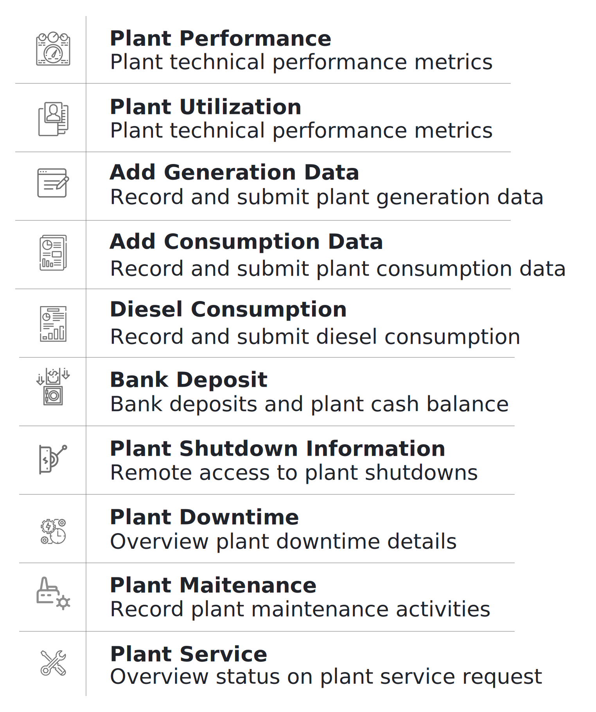

## 3.7.1. एक नजर
इस सेक्शन में नीचे बताई हुई फंक्शनलिटी हैं

  

 
## 3.7.2. प्लांट का परफार्मेन्स
**फंक्शनलिटी**
* प्लांट परफार्मेन्स सेक्शन में तकनीकी परफार्मेन्स मापदंडों (मैट्रिक्स) का पता चलता है।

**मुख्य-मुख्य यूज़र**
<table>
  <tr>
    <th>पदनाम</th>
    <th>मुख्य प्रयोजन</th>
    <th>उपयोग के उदाहरण</th>
  </tr>
  <tr>
    <td>ऑपरेटर</td>
    <td>किसी निश्चित प्लांट के डेटा लॉग को चेक करना</td>
    <td>सुनिश्चित करना कि डेटाबेस और ग्राउंड मेज़रमेंट एक समान है।</td>
  </tr>
  <tr>
    <td>टेक्निशन</td>
    <td>प्लांट में लगे उपकरणों का परफार्मेन्स आँकना</td>
    <td>प्लांट की उपकरणों की दक्षता (इफिशंसि) की गणना करना</td>
  </tr>
  <tr>
    <td>सीएसए</td>
    <td>चेक करना कि निश्चित समयावधि में कितनी यूनिट की बिक्री हुई</td>
    <td>चालू माह में बिकी यूनिट की पिछले माह बिकी यूनिट से तुलना करना</td>
  </tr>
  <tr>
    <td>समूह प्रभारी</td>
    <td>प्लांटों के तकनीकी परफार्मेन्स की एक-दूसरे के साथ तुलना करना</td>
    <td>टेक्निशन के समान</td>
  </tr>
  <tr>
    <td>राज्य प्रभारी</td>
    <td>समूह-प्रभारी के समान</td>
    <td>प्लांट के उपयोग की गणना करना तथा और ग्राहक जोड़े जा सकते हों तो सूचना देना</td>
  </tr>
</table>

**पेज के डिटेल**

**जनरेशन डेटा**

**खपत का डेटा**

## 3.7.3. प्लांट का उपयोग
**फंक्शनलिटी**
* प्लांट यूटिलाइजेशन सेक्शन में हर प्लांट के तकनीकी परफार्मेन्स के मापदंड (मेट्रिक्स) और बिजली की खपत का विवरण रहता है।
* यह फंक्शनलिटी केवल एचसीएलएफ एजेंटों के पास होती है।

**मुख्य-मुख्य यूज़र**
<table>
  <tr>
    <th>पदनाम</th>
    <th>मुख्य प्रयोजन</th>
    <th>उपयोग के उदाहरण</th>
  </tr>
  <tr>
    <td>टेक्निशन</td>
    <td>प्लांट के उपकरणों का परफार्मेन्स आँकना</td>
    <td>प्लांट की तथा वितरण की दक्षता (इफिशंसि) की गणना करना</td>
  </tr>
  <tr>
    <td>समूह प्रभारी</td>
    <td>चेक करना कि उपयोगकर्ताओं के अलग-अलग समूहों ने कितनी यूनिट की खपत की है।</td>
    <td>सूक्ष्म उद्यमों (माइक्रो एंटरप्राइजेस) की बिजली की हर महीने की मांग की तुलना करना</td>
  </tr>
  <tr>
    <td>राज्य प्रभारी</td>
    <td>विभिन्न प्लांटों के तकनीकी परफार्मेन्स की तुलना करना</td>
    <td>प्लांट के उपयोग की गणना करना तथा और ग्राहक जोड़े जा सकते हों तो सूचना देना</td>
  </tr>
</table>

**पेज के डिटेल**

## 3.7.4. उत्पादन का डेटा दर्ज करना
**फंक्शनलिटी**
* ऐड जनरेशन डेटा मॉड्यूल से यूज़र बिजली उत्पादन का डेटा कंपनी के डेटाबेस में दर्ज कर सकता है

**मुख्य-मुख्य यूज़र**
<table>
  <tr>
    <th>पदनाम</th>
    <th>मुख्य प्रयोजन</th>
    <th>उपयोग के उदाहरण</th>
  </tr>
  <tr>
    <td>ऑपरेटर</td>
    <td>किसी निश्चित तारीख के उत्पादन का डेटा दर्ज करना</td>
    <td>हर सोलर एमपीपीटी से जनरेट हुई यूनिट की हर दिन रीडिंग लेना और एप्प में रिकॉर्ड करना</td>
  </tr>
  <tr>
    <td>टेक्निशन</td>
    <td>ऑपरेटर के समान</td>
    <td>ऑपरेटर के समानr</td>
  </tr>
  <tr>
    <td>समूह प्रभारी</td>
    <td>ऑपरेटर के समान</td>
    <td>ऑपरेटर के समान</td>
  </tr>
  <tr>
    <td>राज्य प्रभारी</td>
    <td>ऑपरेटर के समान</td>
    <td>ऑपरेटर के समान</td>
  </tr>
</table>

**पेज के डिटेल**

## 3.7.5. खपत का डेटा दर्ज करना
**फंक्शनलिटी**
* ऐड कंज़म्पशन डेटा मॉड्यूल से यूज़र प्लांट से प्रेषित बिजली का डेटा कंपनी के डेटाबेस में दर्ज कर सकता है।

**मुख्य-मुख्य यूज़र**
<table>
  <tr>
    <th>पदनाम</th>
    <th>मुख्य प्रयोजन</th>
    <th>उपयोग के उदाहरण</th>
  </tr>
  <tr>
    <td>ऑपरेटर</td>
    <td>किसी निश्चित तारीख को प्रेषित बिजली का डेटा दर्ज करना</td>
    <td>रोज हर फीडर की रीडिंग लेना और एप्प में रिकॉर्ड करना</td>
  </tr>
  <tr>
    <td>टेक्निशन</td>
    <td>ऑपरेटर के समान</td>
    <td>ऑपरेटर के समान</td>
  </tr>
  <tr>
    <td>समूह प्रभारी</td>
    <td>ऑपरेटर के समान</td>
    <td>ऑपरेटर के समान</td>
  </tr>
  <tr>
    <td>राज्य प्रभारी</td>
    <td>ऑपरेटर के समान</td>
    <td>ऑपरेटर के समान</td>
  </tr>
</table>

**पेज के डिटेल**

## 3.7.6. डीज़ल की खपत
**फंक्शनलिटी**
* डीज़ल कंज़्मप्शन सेक्शन में यूज़र प्लांट के ईंधन खर्च का विवरण रसीदों के फोटो के साथ दर्ज कर सकता है
* पिछले खर्च और डीज़ल जनरेटर के उपयोग का डेटा भी देखा जा सकता है
* ईंधन खर्च की प्रधान कार्यालय द्वारा प्रतिपूर्ति (रिइंबर्समेंट) की जाती है

**मुख्य-मुख्य यूज़र**
<table>
  <tr>
    <th>पदनाम</th>
    <th>मुख्य प्रयोजन</th>
    <th>उपयोग के उदाहरण</th>
  </tr>
  <tr>
    <td>समूह प्रभारी</td>
    <td>डीज़ल के खर्च और उपयोग का रिकॉर्ड मेन्टेन करना</td>
    <td>समूह के किसी प्लांट के लिए डीज़ल की खरीदी दर्ज करना</td>
  </tr>
  <tr>
    <td>राज्य प्रभारी</td>
    <td>विभिन्न प्लांट में डीज़ल पर हुए खर्च और उपयोग का रिव्यू करना</td>
    <td>विभिन्न प्लांट / विभिन्न समय की ईंधन क्षमता की तुलना कर यह चेक करना कि ईंधन की चोरी तो नहीं हो रही है</td>
  </tr>
</table>

 

**पेज के डिटेल**

## 3.7.7. बैंक में डिपॉज़िट
**फ्क्शनलिटी**
* ग्राहकों से प्राप्त नकदी को कंपनी के बैंक अकाउंट में जमा करने की सूचना देने का इंटरफेस 
* विगत में जमा की गई राशियों का रिकॉर्ड और विवरण देखा जा सकता है। साथ में प्लांट में रखी नकदी का रिकॉर्ड भी मिलता है।

**मुख्य-मुख्य यूज़र**
<table>
  <tr>
    <th>पदनाम</th>
    <th>मुख्य प्रयोजन</th>
    <th>उपयोग के उदाहरण</th>
  </tr>
  <tr>
    <td>सीएसए</td>
    <td>बैंक में जमा की गई नई राशियाँ दर्ज करना </td>
    <td>ग्राहकों से प्राप्त नकदी कंपनी के बैंक अकाउंट में जमा करना</td>
  </tr>
  <tr>
    <td>समूह प्रभारी</td>
    <td>समूह के प्लांट से प्राप्त हो रही नकदी (कैश फ्लो) देखना</td>
    <td>चेक करना कि ग्राहकों से प्राप्त नकदी में से कितनी अब तक फील्ड एजेंट के पास है और बैंक में जमा की जानी है</td>
  </tr>
  <tr>
    <td>राज्य प्रभारी</td>
    <td>राज्य के प्लांट से प्राप्त हो रही नकदी (कैश फ्लो) देखना</td>
    <td>सुनिश्चित करना कि बैंक में जमा हो रही राशियाँ ठीक हैं और समय पर जमा हो रही हैं</td>
  </tr>
</table>

**पेज के डिटेल**

पेज में निम्नलिखित टैब रखे गए हैं -

| Bank Deposit| In Hand Cash Report| Bank Deposit Review|
|---|---|---|
| Detailed list of historical bank deposits| Plant-wise overview of collections and deposits| Overview of all the bank deposits made and confirmed|

### 3.7.7.1. बैंक डिपॉज़िट टैब

### 3.7.7.2. प्लांट में रखी नकदी (इन-हैंड कैश) रिपोर्ट टैब

### 3.7.7.3. बैंक डिपॉज़िट रिव्यू टैब

## 3.7.8. प्लांट शट-डाउन की सूचना
**फंक्शनलिटी**
* प्लांट शट-डाउन सूचना से यूज़र किसी निश्चित प्लांट के निश्चित फीडर को मैनुअली बंद कर सकता है

**मुख्य-मुख्य यूज़र**
<table>
  <tr>
    <th>पदनाम</th>
    <th>मुख्य प्रयोजन</th>
    <th>उपयोग के उदाहण</th>
  </tr>
  <tr>
    <td>समूह प्रभारी</td>
    <td>बिजली की आपूर्ति अस्थायी रूप से बंद करना</td>
    <td>निश्चित समय-अवधि के लिए किसी फीडर को मेन्टेन्स के लिए बंद करना</td>
  </tr>
  <tr>
    <td>राज्य प्रभारी</td>
    <td>समूह-प्रभारी के समान</td>
    <td>समूह प्रभारी के समान</td>
  </tr>
</table>

**पेज के डिटेल**

## 3.7.9. प्लांट का रख-रखाव (मेन्टेनेन्स)
**फंक्शनलिटी**
* Allows the users to log technical maintenance activities which have happened at a plant

**मुख्य-मुख्य यूज़र**
<table>
  <tr>
    <th>पदनाम</th>
    <th>मुख्य प्रयोजन</th>
    <th>उपयोग के उदाहरण</th>
  </tr>
  <tr>
    <td>समूह प्रभारीसमूह प्रभारी</td>
    <td>प्लांट के रख-रखाव संबंधी कार्य को दर्ज करना</td>
    <td>डीज़ल जनरेटर सर्विसिंग या पीवी पैनल की मरम्मत की सूचना दर्ज करना</td>
  </tr>
  <tr>
    <td>राज्य प्रभारी</td>
    <td>समूह प्रभारी के समान</td>
    <td>समूह प्रभारी के समान</td>
  </tr>
</table>

**पेज के डिटेल**

## 3.7.10. डीज़ल जनरेटर (डीजी) लॉग
**फंक्शनलिटी**
* डीजी लॉग सेक्शन से यूज़र डीज़ल जनरेटर के परफार्मेन्स और रन-टाइम का पता लगाता है

**मुख्य-मुख्य यूज़र**
<table>
  <tr>
    <th>पदनाम</th>
    <th>मुख्य प्रयोजन</th>
    <th>उपयोग के उदाहरण</th>
  </tr>
  <tr>
    <td>ऑपरेटर</td>
    <td>दर्ज करना कि डीज़ल जनरेटर कितने समय चला और उससे कितने यूनिट बिजली पैदा हुई</td>
    <td>जब-जब भी डीज़ल जनरेटर चालू किया जाए, हर बार रिकॉर्ड करना</td>
  </tr>
  <tr>
    <td>टेक्निशन</td>
    <td>ऑपरेटर के समान</td>
    <td>ऑपरेटर के समान</td>
  </tr>
  <tr>
    <td>सीएसए</td>
    <td>ऑपरेटर के समान</td>
    <td>ऑपरेटर के समान</td>
  </tr>
  <tr>
    <td>समूह प्रभारी</td>
    <td>विभिन्न प्लांट में जनरेटर का उपयोग देखना</td>
    <td>चेक करना कि विभिन्न प्लांटों की बैकअप जनरेटर पर निर्भरता समय-समय पर किस प्रकार बदलती रहती है</td>
  </tr>
  <tr>
    <td>राज्य प्रभारी</td>
    <td>समूह-प्रभारी की तरह</td>
    <td>समूह-प्रभारी की तरह</td>
  </tr>
</table>

**पेज के डिटेल**

