import useBaseUrl from '@docusaurus/useBaseUrl';

## 3.7.1. एक नजर
इस सेक्शन में नीचे बताई हुई फंक्शनलिटी हैं

 

 

 
## 3.7.2. प्लांट का परफार्मेन्स
**फंक्शनलिटी**
* प्लांट परफार्मेन्स सेक्शन में तकनीकी परफार्मेन्स मापदंडों (मैट्रिक्स) का पता चलता है।

**मुख्य-मुख्य यूज़र**
<table>
  <tr>
    <th>पदनाम</th>
    <th>मुख्य प्रयोजन</th>
    <th>उपयोग के उदाहरण</th>
  </tr>
  <tr>
    <td>ऑपरेटर</td>
    <td>किसी निश्चित प्लांट के डेटा लॉग को चेक करना</td>
    <td>सुनिश्चित करना कि डेटाबेस और ग्राउंड मेज़रमेंट एक समान है।</td>
  </tr>
  <tr>
    <td>टेक्निशन</td>
    <td>प्लांट में लगे उपकरणों का परफार्मेन्स आँकना</td>
    <td>प्लांट की उपकरणों की दक्षता (इफिशंसि) की गणना करना</td>
  </tr>
  <tr>
    <td>सीएसए</td>
    <td>चेक करना कि निश्चित समयावधि में कितनी यूनिट की बिक्री हुई</td>
    <td>चालू माह में बिकी यूनिट की पिछले माह बिकी यूनिट से तुलना करना</td>
  </tr>
  <tr>
    <td>समूह प्रभारी</td>
    <td>प्लांटों के तकनीकी परफार्मेन्स की एक-दूसरे के साथ तुलना करना</td>
    <td>टेक्निशन के समान</td>
  </tr>
  <tr>
    <td>राज्य प्रभारी</td>
    <td>समूह-प्रभारी के समान</td>
    <td>प्लांट के उपयोग की गणना करना तथा और ग्राहक जोड़े जा सकते हों तो सूचना देना</td>
  </tr>
</table>

**पेज के डिटेल**

 

 
1.  **Filter Bar** selects a time interval
2.  **List of Plants** and associated technical information, including:
    * Plant PV capacity
    * Units generated, dispatched, and billed
    * Solar generation utilisation
    * In-plant and distribution efficiencies
3.  **Total Bar** aggregates the columnar values

Tapping a plant opens an option of viewing detailed generation or dispatch (“consumption”) data. This is explained in the next screenshots.

 
    

<!--   -->

**जनरेशन डेटा**

 

 

> किसी विशेष संयंत्र में उत्पन्न ऊर्जा को तारीख के क्रम में दिखाया गया है
>
> पीवी एमपीपीटी की संख्या प्लांटों में भिन्न होगी

 

<!-- 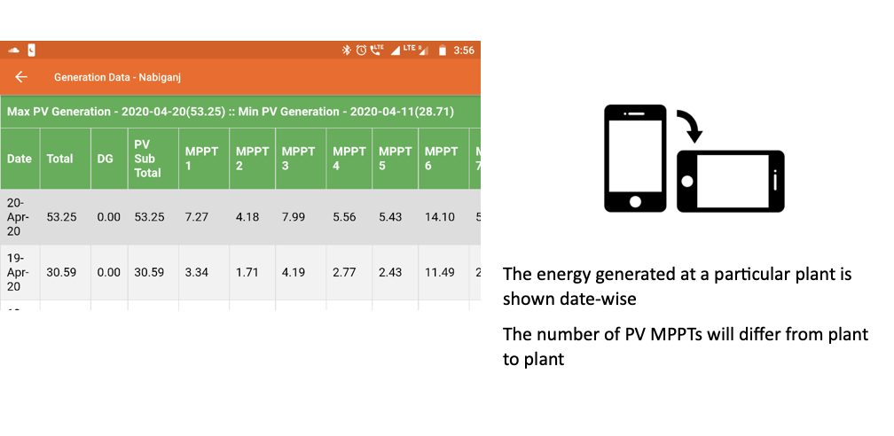 -->

**खपत का डेटा**

 

 

> एक विशेष संयंत्र से भेजी गई ऊर्जा ("भस्म") तिथि के क्रम में दर्शाई गई है
>
> फीडरों की संख्या अलग-अलग होगी

 

<!-- 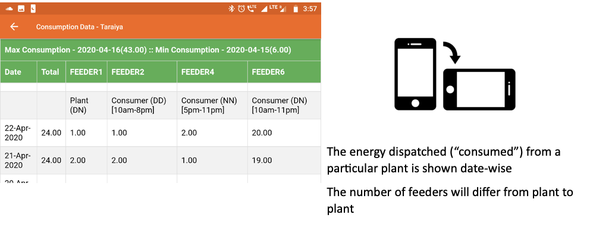 -->

## 3.7.3. प्लांट का उपयोग
**फंक्शनलिटी**
* प्लांट यूटिलाइजेशन सेक्शन में हर प्लांट के तकनीकी परफार्मेन्स के मापदंड (मेट्रिक्स) और बिजली की खपत का विवरण रहता है।
* यह फंक्शनलिटी केवल एचसीएलएफ एजेंटों के पास होती है।

**मुख्य-मुख्य यूज़र**
<table>
  <tr>
    <th>पदनाम</th>
    <th>मुख्य प्रयोजन</th>
    <th>उपयोग के उदाहरण</th>
  </tr>
  <tr>
    <td>टेक्निशन</td>
    <td>प्लांट के उपकरणों का परफार्मेन्स आँकना</td>
    <td>प्लांट की तथा वितरण की दक्षता (इफिशंसि) की गणना करना</td>
  </tr>
  <tr>
    <td>समूह प्रभारी</td>
    <td>चेक करना कि उपयोगकर्ताओं के अलग-अलग समूहों ने कितनी यूनिट की खपत की है।</td>
    <td>सूक्ष्म उद्यमों (माइक्रो एंटरप्राइजेस) की बिजली की हर महीने की मांग की तुलना करना</td>
  </tr>
  <tr>
    <td>राज्य प्रभारी</td>
    <td>विभिन्न प्लांटों के तकनीकी परफार्मेन्स की तुलना करना</td>
    <td>प्लांट के उपयोग की गणना करना तथा और ग्राहक जोड़े जा सकते हों तो सूचना देना</td>
  </tr>
</table>

**पेज के डिटेल**

 

 

> प्रत्येक घटक और चर के लिए उपयोग डेटा को दर्शाया गया है।
>
> उपयोग प्रतिशत प्लांट से प्लांट में भिन्न होगा

 

<!-- 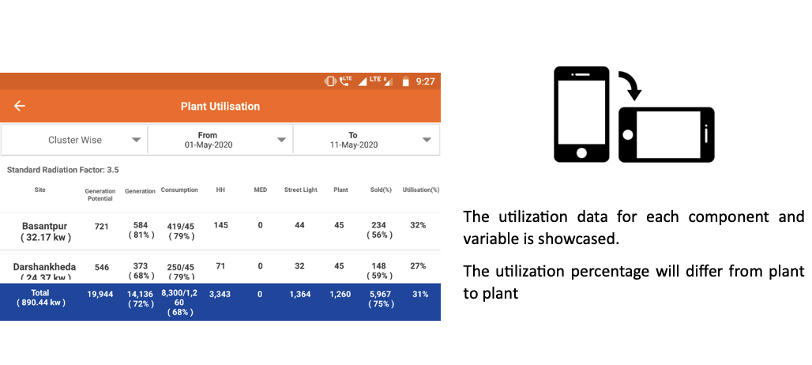 -->

## 3.7.4. उत्पादन का डेटा दर्ज करना
**फंक्शनलिटी**
* ऐड जनरेशन डेटा मॉड्यूल से यूज़र बिजली उत्पादन का डेटा कंपनी के डेटाबेस में दर्ज कर सकता है

**मुख्य-मुख्य यूज़र**
<table>
  <tr>
    <th>पदनाम</th>
    <th>मुख्य प्रयोजन</th>
    <th>उपयोग के उदाहरण</th>
  </tr>
  <tr>
    <td>ऑपरेटर</td>
    <td>किसी निश्चित तारीख के उत्पादन का डेटा दर्ज करना</td>
    <td>हर सोलर एमपीपीटी से जनरेट हुई यूनिट की हर दिन रीडिंग लेना और एप्प में रिकॉर्ड करना</td>
  </tr>
  <tr>
    <td>टेक्निशन</td>
    <td>ऑपरेटर के समान</td>
    <td>ऑपरेटर के समानr</td>
  </tr>
  <tr>
    <td>समूह प्रभारी</td>
    <td>ऑपरेटर के समान</td>
    <td>ऑपरेटर के समान</td>
  </tr>
  <tr>
    <td>राज्य प्रभारी</td>
    <td>ऑपरेटर के समान</td>
    <td>ऑपरेटर के समान</td>
  </tr>
</table>

**पेज के डिटेल**

 

    

1.   **संयंत्र चयन** पहले कदम के रूप में किया जाना चाहिए
2.   **तिथि चयन** डेटा इनपुट के लिए (केवल नारंगी डॉट्स के साथ तारीखों का चयन किया जा सकता है, और सबसे पुराना डेटा पहले दर्ज किया जाना चाहिए)

वांछित तिथि का दोहन अगले स्क्रीनशॉट में दिखाए गए डेटा जोड़ पृष्ठ पर रीडायरेक्ट करता है

 
 

      

1.   **जेनरेशन डेटा एंट्री** एमपीपीटी-वार की जाती है
2.   **डेटा हैडर** संयंत्र और तारीख से मिलकर पृष्ठ के शीर्ष पर दिए गए हैं

 
 

      

1.   **पुष्टि करें और सबमिट करें** दर्ज किए गए डेटा की सटीकता की जांच की

 

<!-- 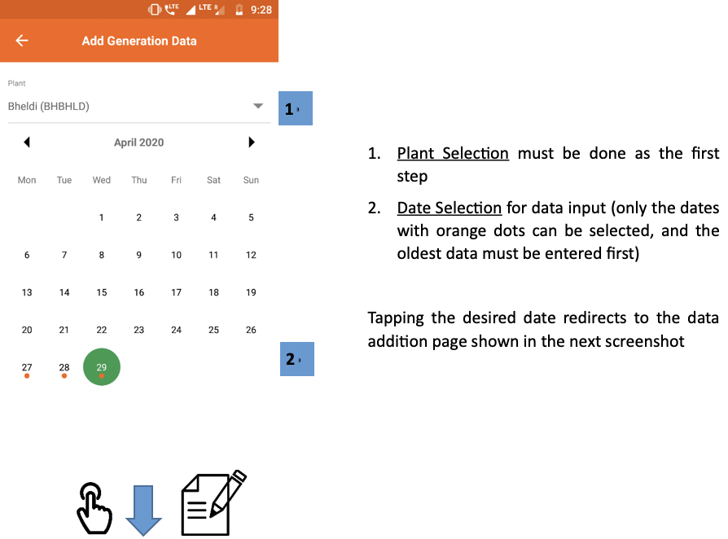

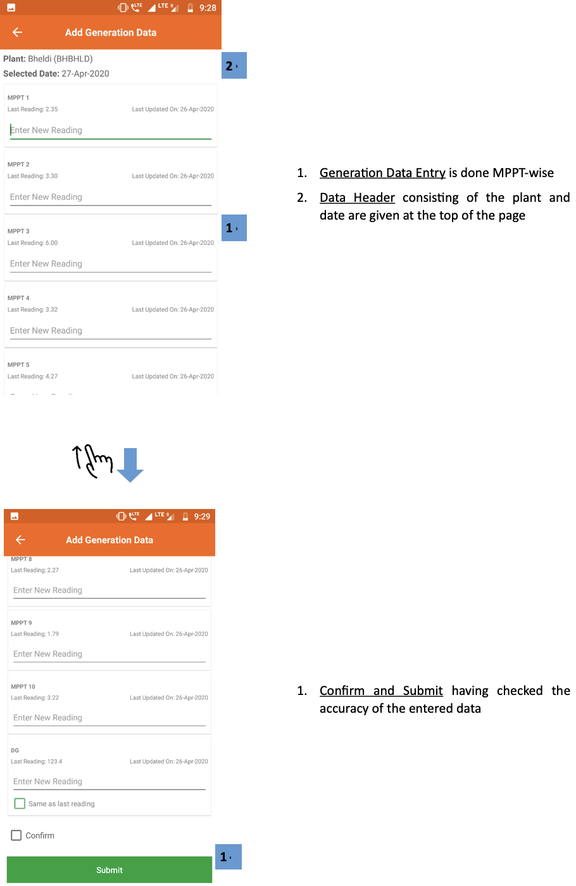 -->

## 3.7.5. खपत का डेटा दर्ज करना
**फंक्शनलिटी**
* ऐड कंज़म्पशन डेटा मॉड्यूल से यूज़र प्लांट से प्रेषित बिजली का डेटा कंपनी के डेटाबेस में दर्ज कर सकता है।

**मुख्य-मुख्य यूज़र**
<table>
  <tr>
    <th>पदनाम</th>
    <th>मुख्य प्रयोजन</th>
    <th>उपयोग के उदाहरण</th>
  </tr>
  <tr>
    <td>ऑपरेटर</td>
    <td>किसी निश्चित तारीख को प्रेषित बिजली का डेटा दर्ज करना</td>
    <td>रोज हर फीडर की रीडिंग लेना और एप्प में रिकॉर्ड करना</td>
  </tr>
  <tr>
    <td>टेक्निशन</td>
    <td>ऑपरेटर के समान</td>
    <td>ऑपरेटर के समान</td>
  </tr>
  <tr>
    <td>समूह प्रभारी</td>
    <td>ऑपरेटर के समान</td>
    <td>ऑपरेटर के समान</td>
  </tr>
  <tr>
    <td>राज्य प्रभारी</td>
    <td>ऑपरेटर के समान</td>
    <td>ऑपरेटर के समान</td>
  </tr>
</table>

**पेज के डिटेल**

 

    

1.   **संयंत्र चयन** पहले कदम के रूप में किया जाना चाहिए
2.   **तिथि चयन** डेटा इनपुट के लिए (केवल नारंगी डॉट्स के साथ तारीखों का चयन किया जा सकता है, और सबसे पुराना डेटा पहले दर्ज किया जाना चाहिए)

अगले स्क्रीनशॉट में दिखाए गए डेटा जोड़ पृष्ठ पर वांछित दिनांक को पुनर्निर्देशित करना

 
 

      

1.   **डेटा हैडर** संयंत्र और तारीख से मिलकर पृष्ठ के शीर्ष पर दिए गए हैं
2.   **उपभोग डेटा प्रविष्टि** फीडर के क्रम में किया जाता है, संदर्भ के लिए दिखाए गए पिछले रीडिंग के विवरण के साथ
3.   **पुष्टि करें और सबमिट करें** दर्ज किए गए डेटा की सटीकता की जांच की

 

<!-- 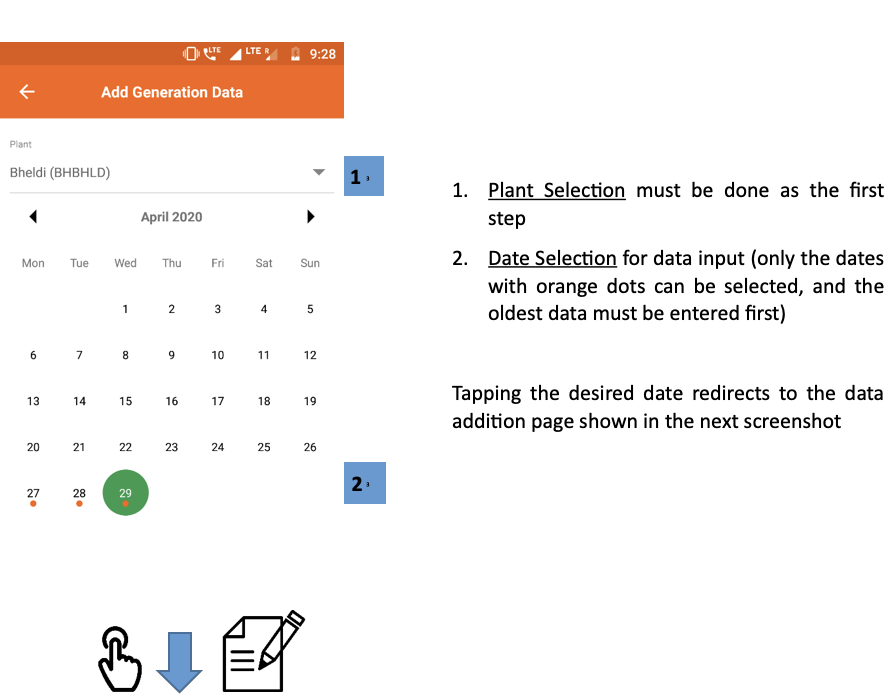

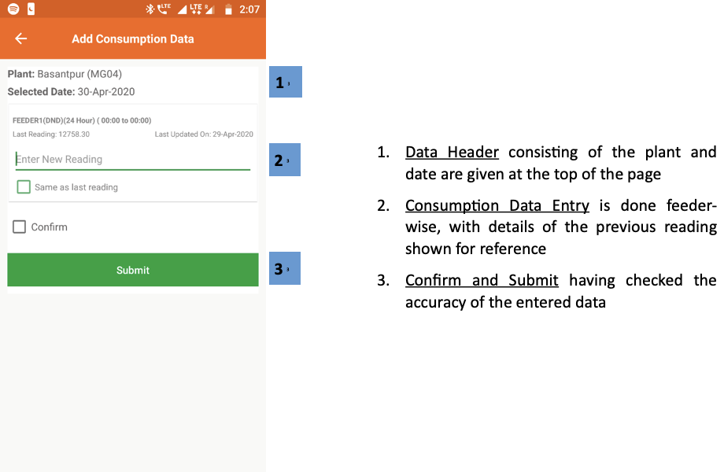 -->

## 3.7.6. डीज़ल की खपत
**फंक्शनलिटी**
* डीज़ल कंज़्मप्शन सेक्शन में यूज़र प्लांट के ईंधन खर्च का विवरण रसीदों के फोटो के साथ दर्ज कर सकता है
* पिछले खर्च और डीज़ल जनरेटर के उपयोग का डेटा भी देखा जा सकता है
* ईंधन खर्च की प्रधान कार्यालय द्वारा प्रतिपूर्ति (रिइंबर्समेंट) की जाती है

**मुख्य-मुख्य यूज़र**
<table>
  <tr>
    <th>पदनाम</th>
    <th>मुख्य प्रयोजन</th>
    <th>उपयोग के उदाहरण</th>
  </tr>
  <tr>
    <td>समूह प्रभारी</td>
    <td>डीज़ल के खर्च और उपयोग का रिकॉर्ड मेन्टेन करना</td>
    <td>समूह के किसी प्लांट के लिए डीज़ल की खरीदी दर्ज करना</td>
  </tr>
  <tr>
    <td>राज्य प्रभारी</td>
    <td>विभिन्न प्लांट में डीज़ल पर हुए खर्च और उपयोग का रिव्यू करना</td>
    <td>विभिन्न प्लांट / विभिन्न समय की ईंधन क्षमता की तुलना कर यह चेक करना कि ईंधन की चोरी तो नहीं हो रही है</td>
  </tr>
</table>

 

**पेज के डिटेल**

 

1.   **फ़िल्टर बार** ईंधन खर्च और उपयोग की समीक्षा के लिए एक समय अंतराल का चयन करता है
2.   **सारांश** ईंधन उपयोग और खर्चों के बारे में मुख्य डेटा-पॉइंट देता है

शीर्ष दाईं ओर स्थित सूचना आइकन संयंत्र-दर-संयंत्र तुलना में पुनर्निर्देशित करता है, जैसा कि अगले स्क्रीनशॉट में बताया गया है

3.   **खरीद की सूची** विवरण डीजल खरीद
4.   **उपभोग डेटा जोड़ें** बटन उपयोगकर्ता को एक नया ईंधन खर्च प्रस्तुत करने की अनुमति देता है, जैसा कि बाद के स्क्रीनशॉट में समझाया गया है
5.   **फ़िल्टर बटन** में फ़िल्टर बार के समान कार्यक्षमता है

 
 

डीज़ल उपभोग पृष्ठ जोड़ें उपयोगकर्ता को नए ईंधन खर्चों को रिकॉर्ड करने की अनुमति देता है

3.  **खपत डेटा** कंपनी के रिकॉर्ड और प्रतिपूर्ति के लिए जोड़ा जाना चाहिए
4.  **चालान नंबर** बिल पर पाया जा सकता है
5.  **बिल चित्र** को प्रमाण के रूप में जोड़ा जाना चाहिए

 
 

      

4.  **पुष्टि करें** जानकारी की समीक्षा के बाद टैप किया जाना चाहिए
5.  **सबमिट करें** डेटा प्रविष्टि को पूरा करने के लिए टैप किया गया

 
 

  

यह पृष्ठ उपयोगकर्ता को प्रत्येक संयंत्र के लिए हाल के डीजल खर्चों को देखने की अनुमति देता है

1.  **फ़िल्टर बार** ब्याज की तिथि निर्दिष्ट करने के लिए
2.  **प्लांट की सूची** ईंधन खर्च पर मासिक डेटा के साथ
3.  **ग्रीन पंक्तियाँ** एकत्रित क्लस्टर डेटा दिखाती हैं
4.  **कुल बार** सभी प्लांट को एकत्रित करता है

 

<!-- 

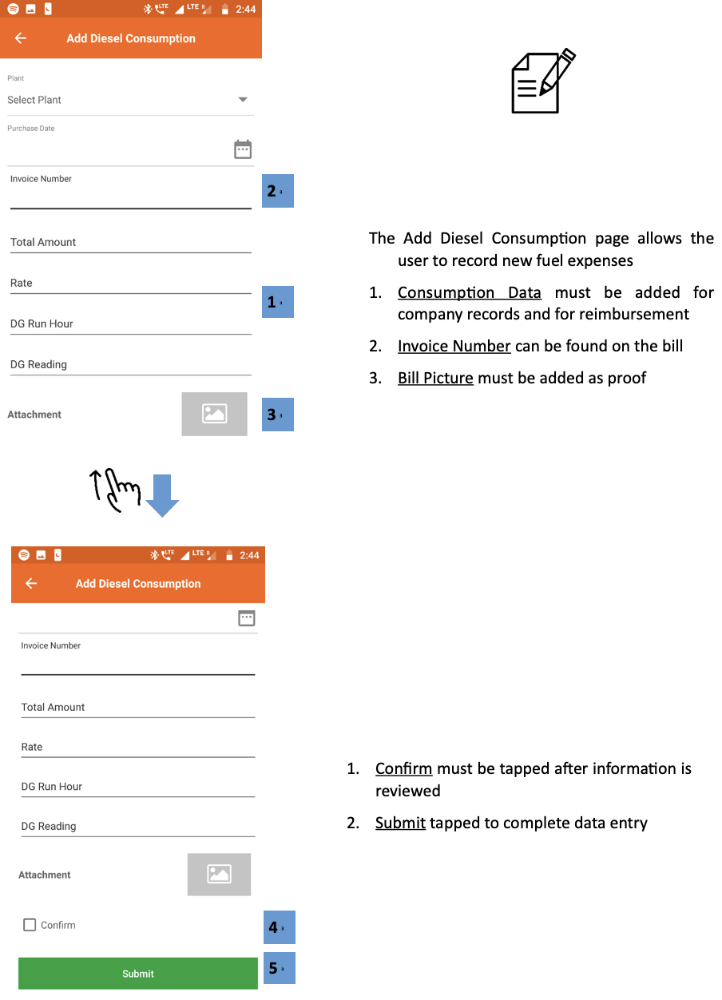

 -->

## 3.7.7. बैंक में डिपॉज़िट
**फ्क्शनलिटी**
* ग्राहकों से प्राप्त नकदी को कंपनी के बैंक अकाउंट में जमा करने की सूचना देने का इंटरफेस 
* विगत में जमा की गई राशियों का रिकॉर्ड और विवरण देखा जा सकता है। साथ में प्लांट में रखी नकदी का रिकॉर्ड भी मिलता है।

**मुख्य-मुख्य यूज़र**
<table>
  <tr>
    <th>पदनाम</th>
    <th>मुख्य प्रयोजन</th>
    <th>उपयोग के उदाहरण</th>
  </tr>
  <tr>
    <td>सीएसए</td>
    <td>बैंक में जमा की गई नई राशियाँ दर्ज करना </td>
    <td>ग्राहकों से प्राप्त नकदी कंपनी के बैंक अकाउंट में जमा करना</td>
  </tr>
  <tr>
    <td>समूह प्रभारी</td>
    <td>समूह के प्लांट से प्राप्त हो रही नकदी (कैश फ्लो) देखना</td>
    <td>चेक करना कि ग्राहकों से प्राप्त नकदी में से कितनी अब तक फील्ड एजेंट के पास है और बैंक में जमा की जानी है</td>
  </tr>
  <tr>
    <td>राज्य प्रभारी</td>
    <td>राज्य के प्लांट से प्राप्त हो रही नकदी (कैश फ्लो) देखना</td>
    <td>सुनिश्चित करना कि बैंक में जमा हो रही राशियाँ ठीक हैं और समय पर जमा हो रही हैं</td>
  </tr>
</table>

**पेज के डिटेल**

पेज में निम्नलिखित टैब रखे गए हैं -

| बैंक जमा | हाथ में कैश रिपोर्ट | बैंक जमा की समीक्षा |
|---|---|---|
| ऐतिहासिक बैंक जमा की विस्तृत सूची | संग्रह और जमा का पौध-वार अवलोकन | सभी बैंक जमाओं का अवलोकन और पुष्टि की गई |

### 3.7.7.1. बैंक डिपॉज़िट टैब

 

1.   **नेविगेशन बार** वर्तमान टैब को इंगित करता है और टैप या स्वाइप करके स्विच करने की अनुमति देता है

2.   **फ़िल्टर बार** एक विशेष संयंत्र और समय अवधि का चयन करता है
3.   **जमाकर्ताओं की सूची** रसीद तस्वीर के साथ प्रत्येक बैंक जमा का विवरण
4.   **बैंक जमा डेटा जोड़ें** एक पृष्ठ पर पुनर्निर्देशित करता है जो उपयोगकर्ता को अगले स्क्रीनशॉट में दिखाए गए नए बैंक जमा को इनपुट करने की अनुमति देता है
5.   **सर्च आइकन** का उपयोग किसी विशेष रिकॉर्ड को खोजने के लिए किया जाता है

 
 

    

1.   **बैंक जमा विवरण** एजेंट द्वारा भरा जाना है
2.   **सबमिट करें** फ़ॉर्म को पूरा करने के लिए टैप किया गया

 

<!-- 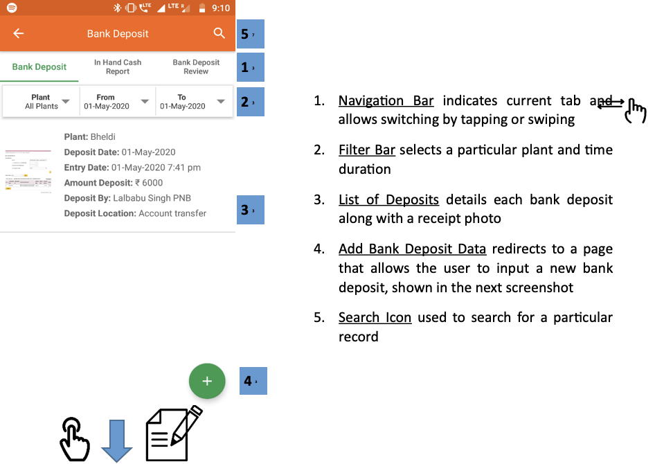

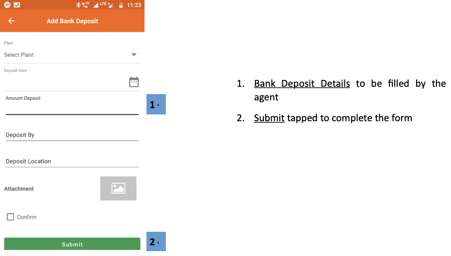 -->

### 3.7.7.2. प्लांट में रखी नकदी (इन-हैंड कैश) रिपोर्ट टैब

 

1.   **नेविगेशन बार** वर्तमान टैब को इंगित करता है और टैप या स्वाइप करके स्विच करने की अनुमति देता है

2.   **फ़िल्टर बार** एक विशेष समय अवधि का चयन करता है
3.   **प्लांट की सूची** कुल संग्रह, जमा, और संयंत्र में शेष नकदी की मात्रा के साथ
4.   **कुल बार** सभी प्लांट पर समुच्चय
5.   **हरी पंक्तियाँ** समूहों पर कुल

 

<!--  -->

### 3.7.7.3. बैंक डिपॉज़िट रिव्यू टैब

 

1.   **नेविगेशन बार** वर्तमान टैब को इंगित करता है और टैप या स्वाइप करके स्विच करने की अनुमति देता है

2.   **फ़िल्टर बार** एक विशेष समय अवधि का चयन करता है
3.   **प्लांट की सूची** कुल जमा और किसी भी विसंगतियों के साथ प्राप्त जमा
4.   **कुल बार** सभी प्लांट पर समुच्चय
5.   **हरी पंक्तियाँ** समूहों पर कुल

 

<!-- 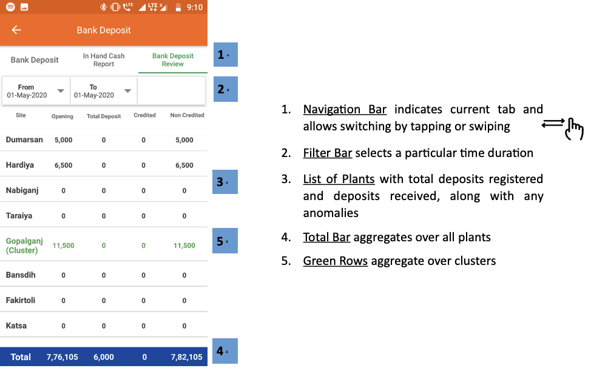 -->

## 3.7.8. प्लांट शट-डाउन की सूचना
**फंक्शनलिटी**
* प्लांट शट-डाउन सूचना से यूज़र किसी निश्चित प्लांट के निश्चित फीडर को मैनुअली बंद कर सकता है

**मुख्य-मुख्य यूज़र**
<table>
  <tr>
    <th>पदनाम</th>
    <th>मुख्य प्रयोजन</th>
    <th>उपयोग के उदाहण</th>
  </tr>
  <tr>
    <td>समूह प्रभारी</td>
    <td>बिजली की आपूर्ति अस्थायी रूप से बंद करना</td>
    <td>निश्चित समय-अवधि के लिए किसी फीडर को मेन्टेन्स के लिए बंद करना</td>
  </tr>
  <tr>
    <td>राज्य प्रभारी</td>
    <td>समूह-प्रभारी के समान</td>
    <td>समूह प्रभारी के समान</td>
  </tr>
</table>

**पेज के डिटेल**

 

    

1.   **संयंत्र विवरण** (प्लांट नाम और फीडर) ड्रॉप-डाउन सूचियों से चुना गया
2.   **सबमिट करें** संयंत्र के सभी विवरण भरने के बाद टैप किया जाना चाहिए

 
 

    

1.   **दिनांक फ़िल्टर** एक विशेष तिथि पर संयंत्र की स्थिति को देखने के लिए लागू किया जाना चाहिए
2.   **प्लांट स्थिति** किसी विशेष तिथि को टैप करने पर, उपयोगकर्ता को स्क्रीनशॉट में दिए गए प्लांट फीडर स्टेटस पेज पर भेज दिया जाएगा।
3.   **सबमिट करें** सभी प्लांट विवरण भरने के बाद टैप किया जाना चाहिए

 
 

    

1.   **फीडर की स्थिति** एक विशेष तिथि के लिए प्रदर्शित की जाती है, फीडरों को व्यक्तिगत रूप से अपने संबंधित चेकबॉक्स को अनचेक करके बंद किया जाना चाहिए
2.   **सबमिट करें** प्रक्रिया को पूरा करने के लिए

 

<!-- 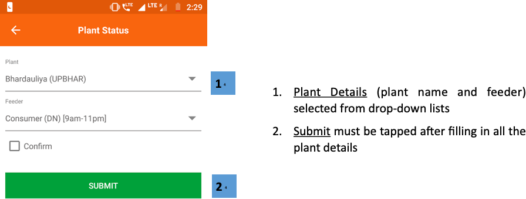

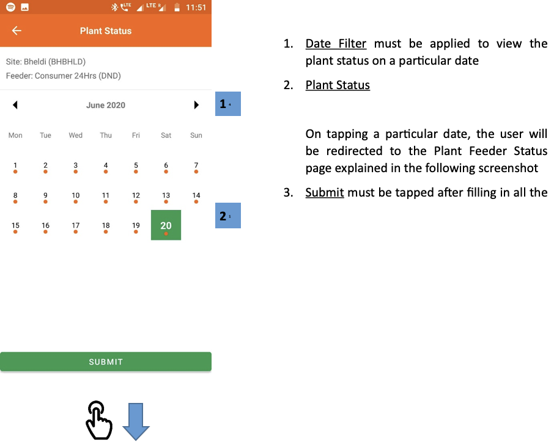

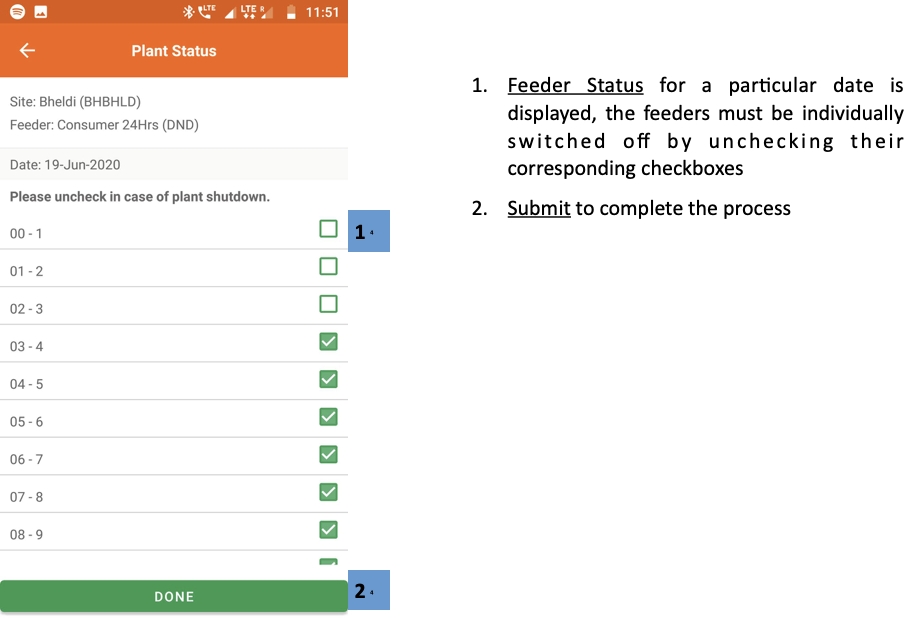 -->

## 3.7.9. प्लांट का रख-रखाव (मेन्टेनेन्स)
**फंक्शनलिटी**
* Allows the users to log technical maintenance activities which have happened at a plant

**मुख्य-मुख्य यूज़र**
<table>
  <tr>
    <th>पदनाम</th>
    <th>मुख्य प्रयोजन</th>
    <th>उपयोग के उदाहरण</th>
  </tr>
  <tr>
    <td>समूह प्रभारीसमूह प्रभारी</td>
    <td>प्लांट के रख-रखाव संबंधी कार्य को दर्ज करना</td>
    <td>डीज़ल जनरेटर सर्विसिंग या पीवी पैनल की मरम्मत की सूचना दर्ज करना</td>
  </tr>
  <tr>
    <td>राज्य प्रभारी</td>
    <td>समूह प्रभारी के समान</td>
    <td>समूह प्रभारी के समान</td>
  </tr>
</table>

**पेज के डिटेल**

 

    

1.  **रखरखाव गतिविधि जोड़ें** जानकारी (गतिविधि के प्रकार के आधार पर प्रपत्र अपडेट)

 
 

    

2.   **रिमार्क** मुद्दे के संबंध में अतिरिक्त जानकारी देने के लिए उपयोगकर्ता द्वारा बनाया गया
3.   **अटैचमेंट** फोटो को मुद्दे के प्रमाण के रूप में जोड़ा जाना चाहिए

On completion of the data input, confirm
and submit to complete the process

 

<!-- 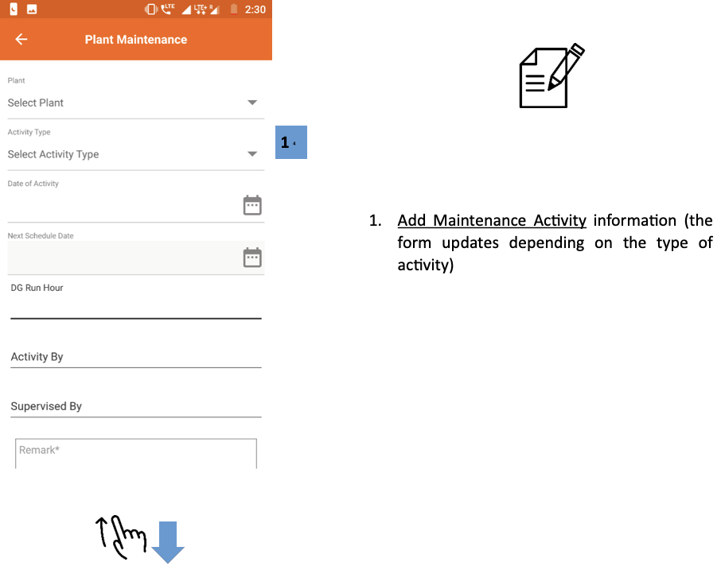

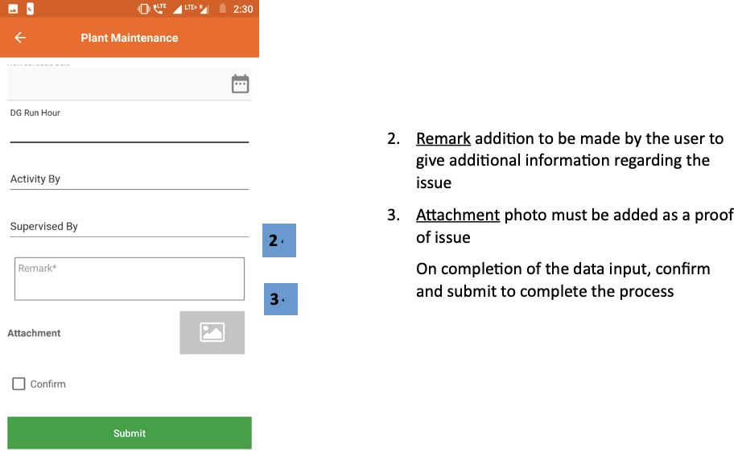 -->

## 3.7.10. डीज़ल जनरेटर (डीजी) लॉग
**फंक्शनलिटी**
* डीजी लॉग सेक्शन से यूज़र डीज़ल जनरेटर के परफार्मेन्स और रन-टाइम का पता लगाता है

**मुख्य-मुख्य यूज़र**
<table>
  <tr>
    <th>पदनाम</th>
    <th>मुख्य प्रयोजन</th>
    <th>उपयोग के उदाहरण</th>
  </tr>
  <tr>
    <td>ऑपरेटर</td>
    <td>दर्ज करना कि डीज़ल जनरेटर कितने समय चला और उससे कितने यूनिट बिजली पैदा हुई</td>
    <td>जब-जब भी डीज़ल जनरेटर चालू किया जाए, हर बार रिकॉर्ड करना</td>
  </tr>
  <tr>
    <td>टेक्निशन</td>
    <td>ऑपरेटर के समान</td>
    <td>ऑपरेटर के समान</td>
  </tr>
  <tr>
    <td>सीएसए</td>
    <td>ऑपरेटर के समान</td>
    <td>ऑपरेटर के समान</td>
  </tr>
  <tr>
    <td>समूह प्रभारी</td>
    <td>विभिन्न प्लांट में जनरेटर का उपयोग देखना</td>
    <td>चेक करना कि विभिन्न प्लांटों की बैकअप जनरेटर पर निर्भरता समय-समय पर किस प्रकार बदलती रहती है</td>
  </tr>
  <tr>
    <td>राज्य प्रभारी</td>
    <td>समूह-प्रभारी की तरह</td>
    <td>समूह-प्रभारी की तरह</td>
  </tr>
</table>

**पेज के डिटेल**

 

      

1.   **फ़िल्टर बार** समय अवधि का चयन करने के लिए
2.   **प्लांट की सूची** समय अंतराल में उत्पन्न रन घंटे और इकाइयाँ दिखाना
3.   **कुल बार** सभी प्लांट पर समुच्चय

 
 

      

एक विशेष संयंत्र के दोहन को एक विस्तृत DG रन लॉग में पुनर्निर्देशित करता है

1.   **डीजी लॉग** डीजी द्वारा चलाए जा रहे सभी उदाहरणों का विवरण
2.   **डीजी लॉग एंट्री जोड़ें** उपयोगकर्ताओं को अगले स्क्रीनशॉट में समझाया गया डीजी रनटाइम डेटा इनपुट करने की अनुमति देता है

 
 

        

1.   **डीजी लॉगिंग** उपयोगकर्ता द्वारा जोड़ी गई जानकारी
2.   **सबमिट करें** प्रविष्टि को पूरा करने के लिए टैप किया गया

 

<!-- 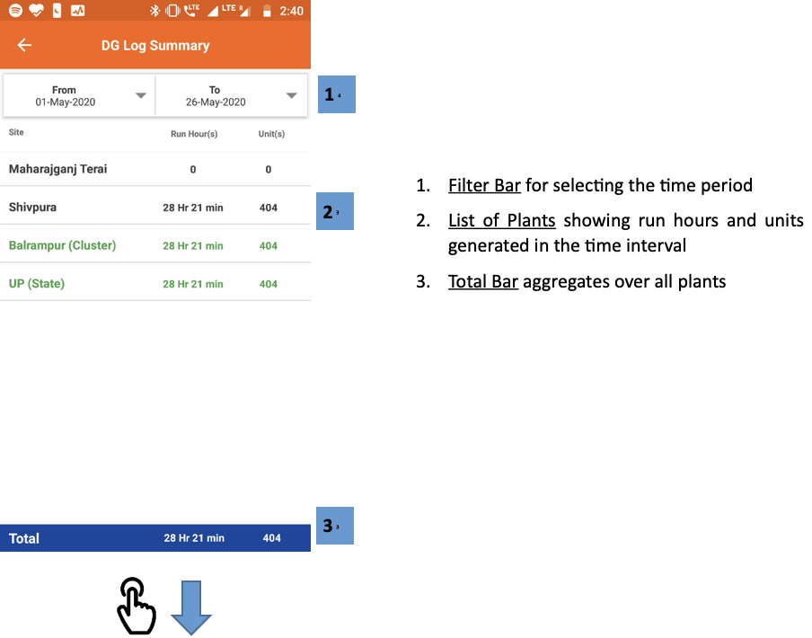

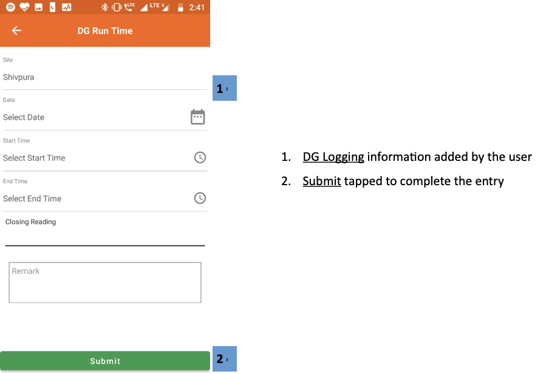 -->
