import useBaseUrl from '@docusaurus/useBaseUrl';
export const Highlight = ({children, color}) => (
  
    {children}
  
);

## 3.8.1. एक नजर (ओवरव्यू)

 

  

## 3.8.2. मीटर बदलना
**फंक्शनलिटी**
* यूज़र ग्राहक के बिजली मीटर को बदलने का अनुरोध कर सकता है

**मुख्य-मुख्य यूज़र**
<table>
  <tr>
    <th>पदनाम</th>
    <th>मुख्य प्रयोजन</th>
    <th>उपयोग के उदाहरण</th>
  </tr>
  <tr>
    <td>समूह प्रभारी</td>
    <td>ग्राहक का मीटर बदलने का अनुरोध करना</td>
    <td>खराब मीटर का विवरण दर्ज करना और उसे बंद करना</td>
  </tr>
  <tr>
    <td>राज्य प्रभारी</td>
    <td>समूह प्रभारी के समान</td>
    <td>समूह प्रभारी के समान</td>
  </tr>
</table>

**ज के डिटेल**

 

  

1.   **ग्राहक जानकारी** इनपुट होने के लिए
2.   **मीटर की जानकारी** स्वचालित रूप से पॉप्युलेट होगी, साथ ही नए मीटर का चयन करने का विकल्प
3.   **समीक्षा** प्रक्रिया को पूरा करने के लिए टैप किया गया

 

<!-- 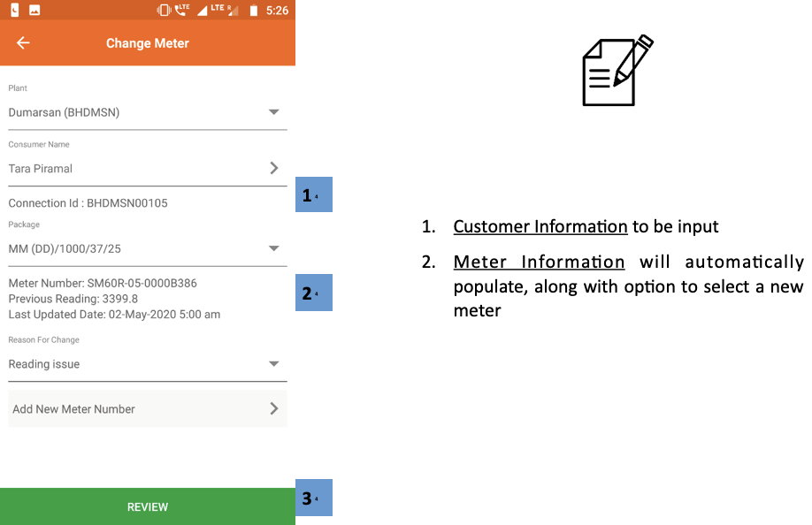 -->

## 3.8.3. रिलीज़ न किए गए मीटर
**फंक्शनलिटी**
* पता लगता है कि कितने मीटर बदले जा चुके हैं और कितने बदलने का कार्य पेंडिंग है 
* ये मीटर निकाले जाने हैं क्योंकि ये खराब हैं या ग्राहक ने जितना भुगतान किया था, वह पूरा हो गया है
* मीटर या तो गोदाम में ले जाया जाता है या किसी अन्य ग्राहक को असाइन कर दिया जाता है

**मुख्य-मुख्य यूज़र**
<table>
  <tr>
    <th>पदनाम</th>
    <th>मुख्य प्रयोजन</th>
    <th>उपयोग के उदाहरण</th>
  </tr>
  <tr>
    <td>समूह प्रभारी</td>
    <td>मीटर बदलने के पेंडिंग रहे अनुरोध देखना और फील्ड एजेंटों को असाइन करना</td>
    <td>उस एजेंट से संपर्क करना, जिसे मीटर बदलने का कार्य असाइन किया गया हो</td>
  </tr>
  <tr>
    <td>राज्य प्रभारी</td>
    <td>मीटर बदलने का  अनुरोध देखना और अनुरोध पूरा होने की सूचना देना</td>
    <td>चेक करना कि मीटर बदलने के कितने असाइनमेन्ट पेंडिंग हैं</td>
  </tr>
</table>

**ज के डिटेल**

इस पेज में निम्नलिखित टैब हैं -

| विचाराधीन | समीक्षा | पूरे किए गए |
|---|---|---|
| लंबित मीटर अनुरोधों को देखें, एजेंट को असाइन करें और पूरा किया गया चिह्न | पूर्ण मीटर अनुरोधों की सूची | ऐतिहासिक पूर्ण और स्वीकृत मीटर अनुरोधों की सूची |

### 3.8.3.1. पेंडिंग टैब

 

1.  **नेविगेशन बार** वर्तमान टैब को इंगित करता है और टैप या स्वाइप करके स्विच करने की अनुमति देता है

2.   **लंबित मीटर सूची** प्रत्येक मीटर पर जानकारी के साथ। एजेंटों को उनके नामों पर टैप करके बुलाया जा सकता है
3.   **टास्क बटन** का उपयोग फील्ड एजेंटों को कार्य आवंटित करने और मीटर के नए स्थान को पंजीकृत करने के लिए किया जाता है

The task can be either reassigned to a different agent or executed (processed) towards reviewing on completion

 

<!-- 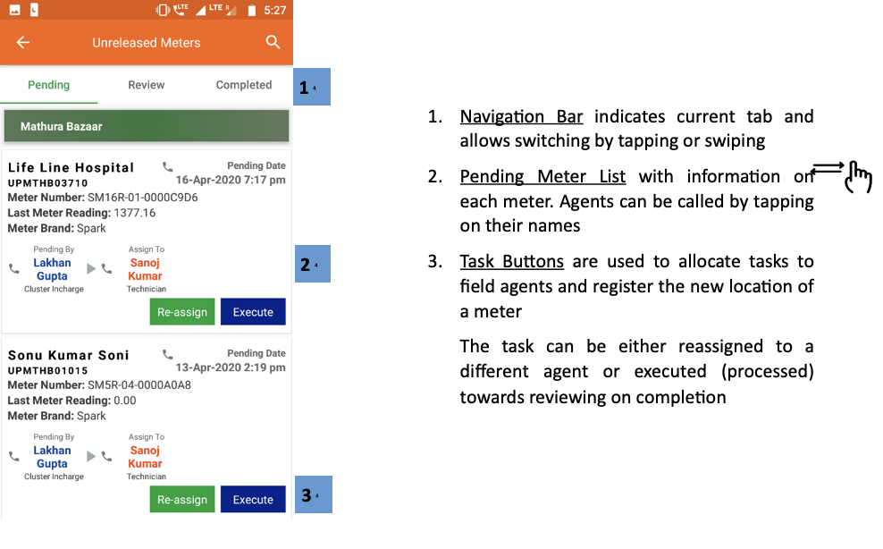 -->

### 3.8.3.2. रिव्यू टैब

 

1.  **नेविगेशन बार** वर्तमान टैब को इंगित करता है और टैप या स्वाइप करके स्विच करने की अनुमति देता है

2.   **समीक्षा मीटर सूची** प्रत्येक पूर्ण मीटर गतिविधि की जानकारी के साथ जो कि समीक्षा लंबित है
3.   **टास्क बटन** पूर्ण कार्यों की पुष्टि करने के लिए उपयोग किया जाता है

 

<!-- 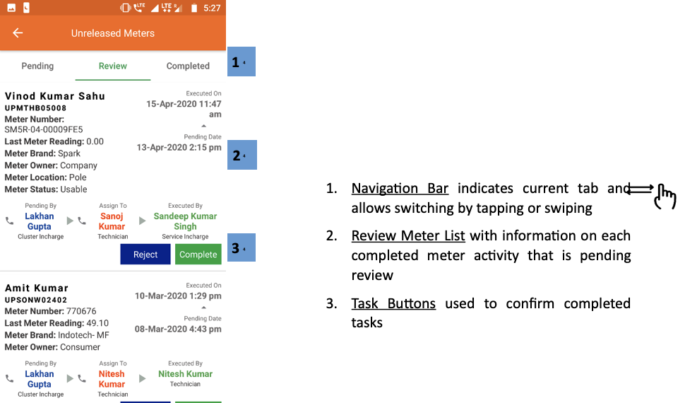 -->

### 3.8.3.3. कम्प्लिटेड टैब

 

  

1.  **नेविगेशन बार** वर्तमान टैब को इंगित करता है और टैप या स्वाइप करके स्विच करने की अनुमति देता है

2.   ** जारी की गई मीटर सूची ** प्रत्येक पूर्ण मीटर रिलीज गतिविधि की जानकारी के साथ
3.   ** फ़िल्टर बार ** संयंत्र और समय अंतराल द्वारा परिणाम संकीर्ण करने के लिए

 

<!-- 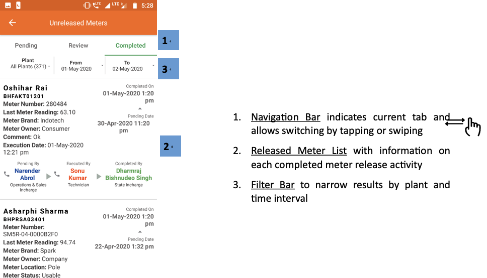 -->

## 3.8.4. स्मार्ट मीटर स्टेटस
**फंक्शनलिटी**
* स्मार्ट स्मार्ट मीटर के डेटा तक सीमित पहुँच मिलती है
* इससे यूज़र दूर से (रिमोटली) मीटर चालू और बंद कर सकता है
* अधिक जानकारी के लिए सेक्शन 3.4.5 देखें

## 3.8.5. स्मार्ट फीडर स्टेटस
**फंक्शनलिटी**
* स्मार्ट फीडर सेक्शन में यूज़र स्मार्ट फीडर को एप्प के जरिए रि-सेट कर सकता है या कन्फिगरेशन बदल सकता है

**मुख्य-मुख्य यूज़र**
<table>
  <tr>
    <th>पदनाम</th>
    <th>मुख्य प्रयोजन</th>
    <th>उपयोग के उदाहरण</th>
  </tr>
  <tr>
    <td>समूह प्रभारी</td>
    <td>किसी निश्चित फीडर के सभी ग्राहकों के मीटर की स्थिति नियंत्रित करना</td>
    <td>कोई तकनीकी इमरजेंसी आ जाने पर बड़ी संख्या में मीटर बंद करना</td>
  </tr>
  <tr>
    <td>राज्य प्रभारी</td>
    <td>समूह प्रभारी के समान</td>
    <td>उस ग्राहक का मीटर बंद करना जिसके खराब उपकरणों का पूरे वितरण नेटवर्क पर असर पड़ रहा हो</td>
  </tr>
</table>

**ज के डिटेल**

 

  

1.   **विवरण दर्ज करें** संयंत्र और फीडर संख्या के लिए
2.   **सबमिट करें** अगले पृष्ठ पर जारी रखने के लिए

ध्यान दें कि प्लांट के चयन के बाद फीडर एंट्री टैब केवल दिखाएगा

 
 

       

1.  **फीडर सूचना** दिखाई गई
2.  **मीटर स्थिति** के बीच चुना जा सकता है:
    * बंद
    * चालू
    * ऑटो

उपयोगकर्ता रीसेट बटन टैप करके अपनी डिफ़ॉल्ट स्थिति में मीटर को रीसेट भी कर सकता है

 

<!-- 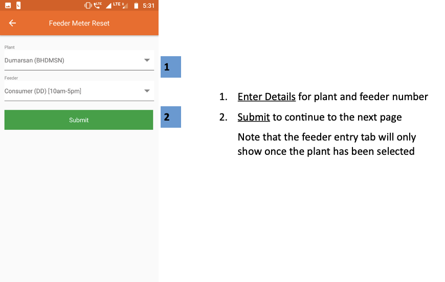

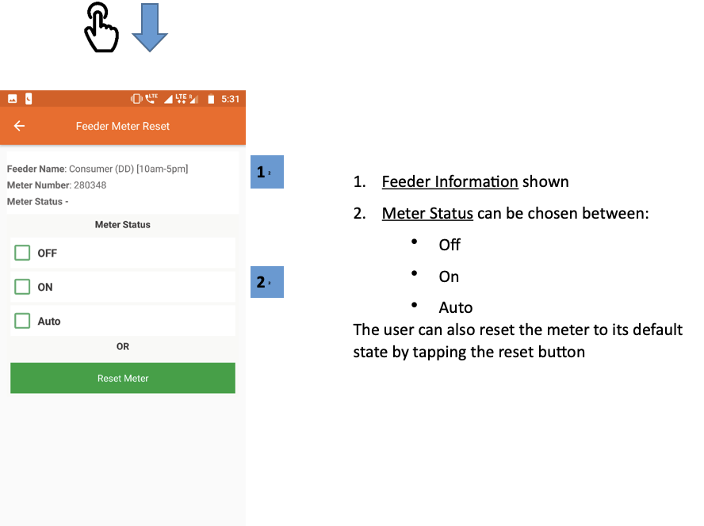 -->

## 3.8.6. मीटर रीडिंग
**फंक्शनलिटी**
* मीटर रीडिंग सेक्शन बिजली के मीटर की रीडिंग दिखाता है, जिसकी हर प्लांट में जरूरत पड़ती है

**मुख्य-मुख्य यूज़र**
<table>
  <tr>
    <th>पदनाम</th>
    <th>मुख्य प्रयोजन</th>
    <th>उपयोग के उदाहरण</th>
  </tr>
  <tr>
    <td>टेक्निशन</td>
    <td>देखना कि किस ग्राहक के मीटर की रीडिंग लेना है</td>
    <td>प्लान करना कि महीना खत्म होने के पहले किन-किन ग्राहकों के पास जाना है</td>
  </tr>
  <tr>
    <td>सीएसए</td>
    <td>टेक्निशन के समान</td>
    <td>टेक्निशन के समान</td>
  </tr>
  <tr>
    <td>समूह प्रभारी</td>
    <td>चेक करना कि कितने मीटर की रीडिंग पेंडिंग है</td>
    <td>मीटर रीडिंग के बचे हुए कार्य की याद दिलाने के लिए फील्ड एजेंटों से संपर्क करना</td>
  </tr>
  <tr>
    <td>राज्य प्रभारी</td>
    <td>समूह प्रभारी के समान</td>
    <td>समूह प्रभारी के समान</td>
  </tr>
</table>

**ज के डिटेल**

 

  

1.  **प्लांट की सूची**, प्रत्येक संयंत्र में मैन्युअल रूप से पढ़ने वाले मीटरों की संख्या के साथ, और मीटर की संख्या अभी भी लंबित पठन है
2.   **ग्रीन पंक्तियाँ** क्लस्टर के लिए डेटा एकत्र करता है
3.   **कुल बार** सभी प्लांट पर समुच्चय

किसी विशेष प्लांट का दोहन उपयोगकर्ता को लंबित मीटरों की एक सूची दिखाता है, जैसा कि अगले स्क्रीनशॉट में दिखाया गया है (ध्यान दें कि यह कार्यक्षमता महीने के 24 वें दिन के बाद ही उपलब्ध है)

 
 

       

1.  **सर्च आइकन** उपयोगकर्ता को एक संयंत्र में सूचीबद्ध उपभोक्ताओं को अलग करने की अनुमति देता है
2.  **उपभोक्ता सूची** पिछले रीडिंग मानों और खपत इकाइयों के संदर्भ में एजेंट को उपभोक्ता उपभोग इतिहास की समीक्षा करने में सक्षम बनाता है

 

<!-- 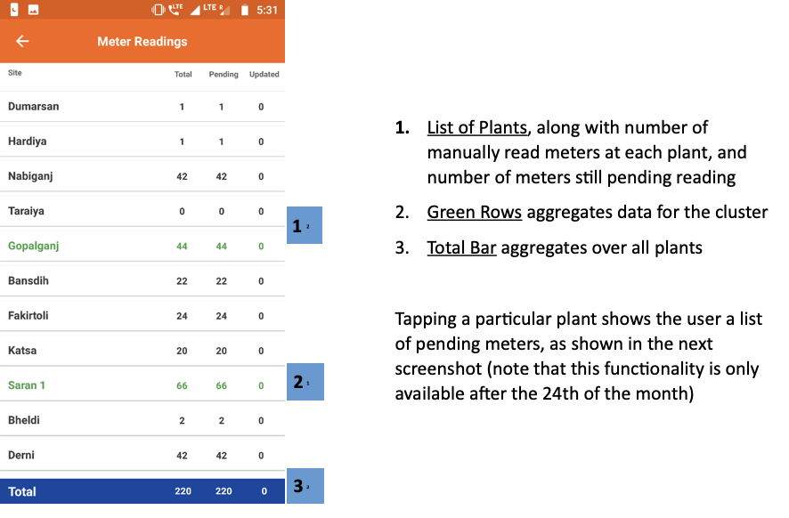

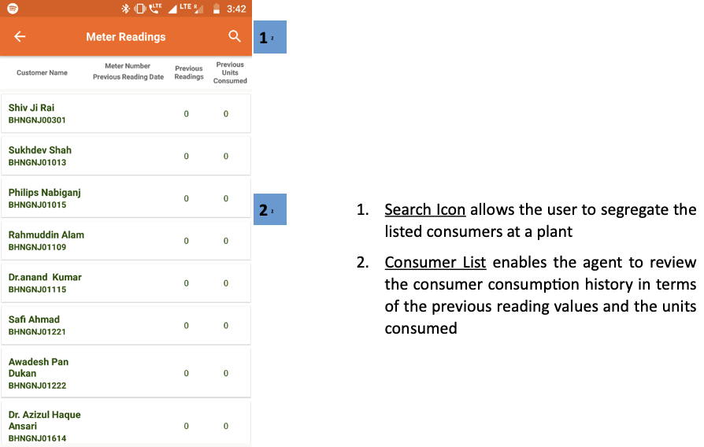 -->

## 3.8.7. मीटर रीडिंग रिव्यू
**फंक्शनलिटी**
* मीटर रीडिंग रिव्यू सेक्शन दिखाता है कि हर प्लांट में कितने मीटर रीडिंग रिव्यू पेंडिंग हैं
* मीटर रीडिंग का कार्य एजेंट महीने की शुरुआत या आखिर में करते हैं। जिन घरों में स्मार्ट मीटर नहीं लगे हैं, उनकी बिजली की खपत रिकॉर्ड करने के लिए यह कार्य किया जाता है

**मुख्य-मुख्य यूज़र**
<table>
  <tr>
    <th>पदनाम</th>
    <th>मुख्य प्रयोजन</th>
    <th>उपयोग के उदाहरण</th>
  </tr>
  <tr>
    <td>सीएसए</td>
    <td>गिनती करना कि कितने उपभोक्ताओं की मीटर रीडिंग बाकी है</td>
    <td>गिनती करना कि महीने में कितनी रीडिंग रिव्यू पूरी की गई</td>
  </tr>
  <tr>
    <td>समूह प्रभारी</td>
    <td>जिन उपभोक्ताओं की मीटर रीडिंग पेंडिंग है, उनका रिव्यू करना </td>
    <td>गिनती करना कि समूह में कितने रिव्यू बाकी है</td>
  </tr>
  <tr>
    <td>राज्य प्रभारी</td>
    <td>समूह प्रभारी के समान</td>
    <td>गिनती करना कि किसी प्लांट के कितने रिव्यू बाकी है</td>
  </tr>
</table>

**ज के डिटेल**

 

       

1.  **मीटर रीडिंग स्वीकृतियां** एक सारणीबद्ध कॉलम में दी गई हैं, जिसमें प्रासंगिक डेटा दिए गए हैं
2.  **ग्रीन पंक्तियाँ** प्रत्येक क्लस्टर के लिए डेटा का प्रतिनिधित्व करती हैं जो वे प्रतिनिधित्व करते हैं
3.  ** कुल बार ** स्तंभ डेटा एकत्र करता है

किसी विशेष संयंत्र पर टैप करने से उपयोगकर्ता को एक कार्यक्षमता मिलेगी जो कि हर महीने की 24 तारीख के बाद उपलब्ध होती है

 

<!-- 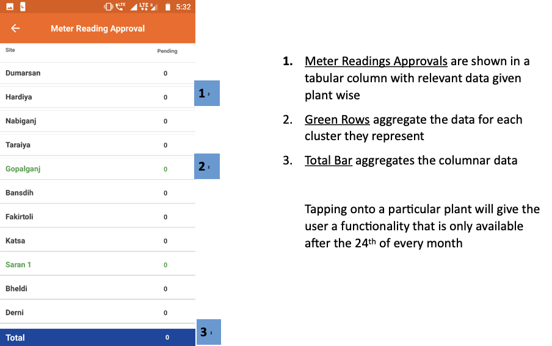 -->

## 3.8.8. टर्म्स स्टेटस
**फंक्शनलिटी**
* स्मार्ट टर्म्स मीटर डेटा तक पहुँच मिलती है
* यूज़र दूर से (रिमोटली) ग्राहक का मीटर चालू और बंद कर सकता है

**मुख्य-मुख्य यूज़र**
<table>
  <tr>
    <th>पदनाम</th>
    <th>मुख्य प्रयोजन</th>
    <th>उपयोग के उदाहरण</th>
  </tr>
  <tr>
    <td>ऑपरेटर</td>
    <td>ग्राहक के मीटर के बारे में जानकारी प्राप्त करना और उसका मीटर नियंत्रित करना</td>
    <td>पड़ताल करना कि ग्राहक का मीटर बंद (ट्रिप ऑफ) क्यों हुआ है, उदाहरण के लिए डिएक्टिवेटेड</td>
  </tr>
  <tr>
    <td>टेक्निशन</td>
    <td>ऑपरेटर के समान</td>
    <td>मीटर चालू या बंद करना</td>
  </tr>
  <tr>
    <td>सीएसए</td>
    <td>ऑपरेटर के समान</td>
    <td>टेक्निशन के समान</td>
  </tr>
  <tr>
    <td>समूह प्रभारी</td>
    <td>ऑपरेटर के समान</td>
    <td>टेक्निशन के समान</td>
  </tr>
  <tr>
    <td>राज्य प्रभारी</td>
    <td>ऑपरेटर के समान</td>
    <td>टेक्निशन के समान</td>
  </tr>
</table>

**ज के डिटेल**

 

       

1.  **प्लांट का चयन** ग्राहक की सूची दिखाने के लिए किया जाना चाहिए
2.  **ग्राहक की सूची** एक विशेष संयंत्र की
    * <Highlight color="#FF0000">लाल</Highlight> -—निष्क्रिय ग्राहक
    * <Highlight color="#008000">हरा</Highlight> — सक्रिय ग्राहक
3.  **खोज चिह्न** का उपयोग उपभोक्ता सूची को नाम या मीटर संख्या में टाइप करके फ़िल्टर करने के लिए किया जाता है

ग्राहक के मीटर को उस मीटर के मीटर नियंत्रण पृष्ठ पर पुनर्निर्देशित करना, जो अगले स्क्रीनशॉट में दिखाया गया है

 
 

       

1.   **ग्राहक सूचना** ग्राहक और निर्दिष्ट TERMS मीटर पर प्रासंगिक जानकारी प्रदान करता है
2.   **मीटर स्थिति** को चालू, बंद या रीसेट बटन पर टैप करके बदला जा सकता है

 

<!-- 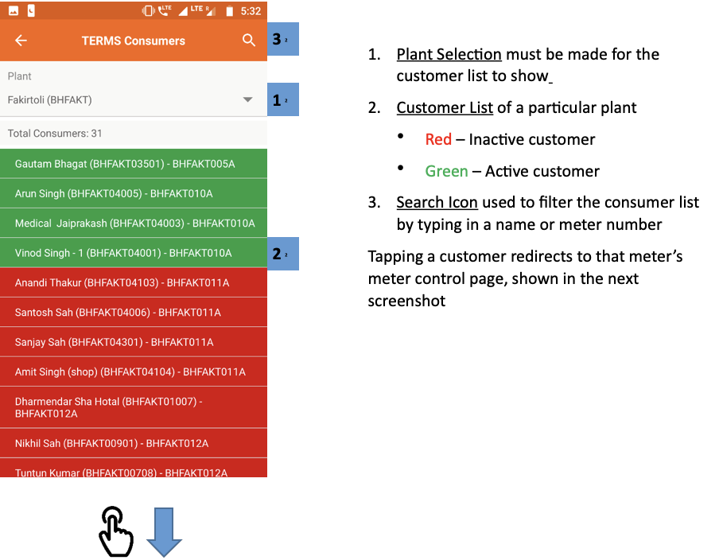

 -->

## 3.8.9. बैटरी मेन्टेनेन्स
**फंक्शनलिटी**
* बैटरी मेन्टेनेन्स सेक्शन से हर प्लांट के बैटरी बैंक का विवरण मिलता है 
* इससे यूज़र बैटरी पैक को चालू या बंद कर सकता है

**मुख्य-मुख्य यूज़र**
<table>
  <tr>
    <th>पदनाम</th>
    <th>मुख्य प्रयोजन</th>
    <th>उपयोग के उदाहरण</th>
  </tr>
  <tr>
    <td>टेक्निशन</td>
    <td>बैटरी बैंक की स्थिति बदलना</td>
    <td>प्लांट की बैटरी को चालू या बंद करना</td>
  </tr>
  <tr>
    <td>समूह प्रभारी</td>
    <td>टेक्निशन के समान</td>
    <td>टेक्निशन के समान</td>
  </tr>
  <tr>
    <td>राज्य प्रभारी</td>
    <td>चेक करना कि सभी बैटरी ऑनलाइन हैं</td>
    <td>हर प्लांट में उपलब्ध बैटरी पैक की संख्या के बारे में रिपोर्ट तैयार करना</td>
  </tr>
</table>

**ज के डिटेल**

 

    

1.  **सर्च आइकन** का उपयोग प्लांट की सूची को दिखाने के लिए किया जा सकता है
2.   **फ़िल्टर बार** एक विशेष संयंत्र और समय अवधि का चयन करता है
3.   **प्लांट लिस्ट** प्रत्येक प्लांट की बैटरी स्थिति पर प्रासंगिक जानकारी प्रदर्शित करता है

प्लांट टैब पर टैप करने से उपयोगकर्ता को प्लांट के बैटरी बैंक नियंत्रण पृष्ठ पर पुनः निर्देशित किया जाएगा, जिसे अगले स्क्रीनशॉट में समझाया गया है

 
 

1.  **बैटरी बैंक की स्थिति** को संयंत्र में बैटरी बैंक को चालू और बंद करने के लिए इस्तेमाल किया जा सकता है

 

<!-- 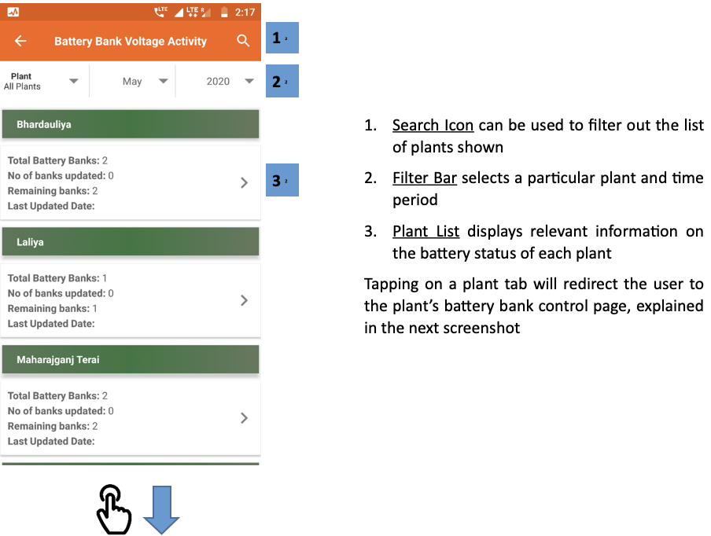

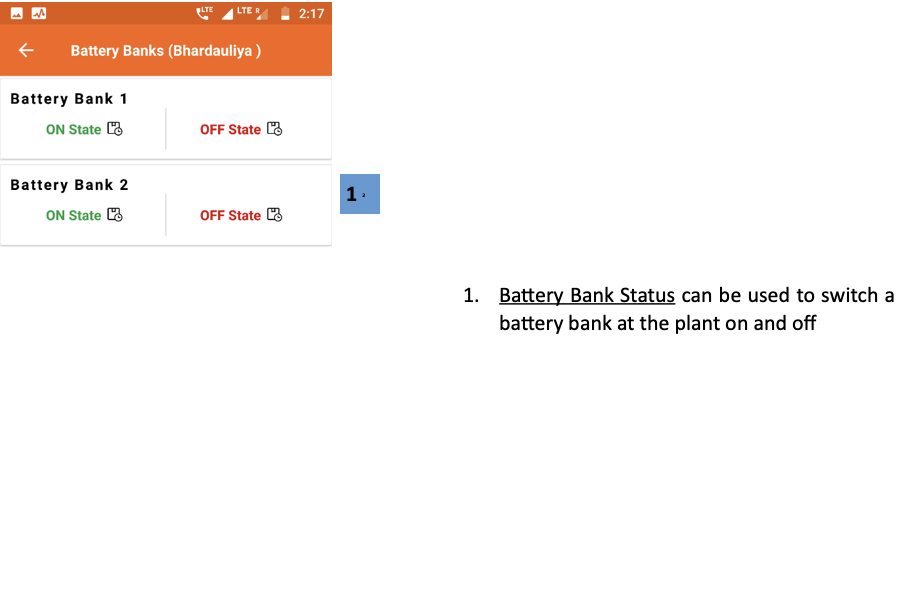 -->
