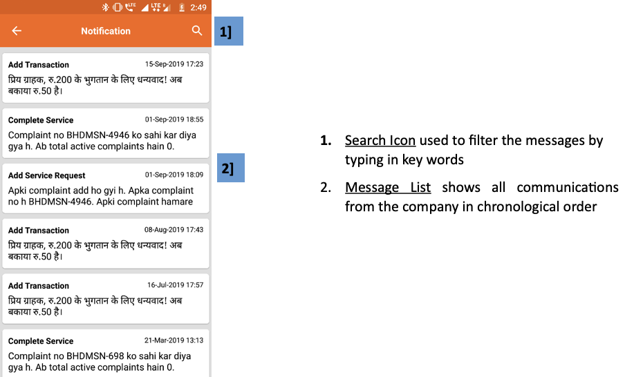

import useBaseUrl from '@docusaurus/useBaseUrl';

**फंक्शनलिटी**
* नोटिफिकेशन पेज में कंपनी द्वारा अब तक दी गई सभी सूचनाओं की सूची दी जाती है। इसमें सतर्कता संदेश (एलर्ट), भुगतान की रसीदें, प्लांट बंद रहने के संदेश आदि शामिल हैं।
* इन संदेशों की एसएमएस कॉपी भी यूज़र को मिलती है। यह ध्यान रखना चाहिए कि एक बार यहाँ स्टोर होने के बाद इन्हें डिलीट नहीं किया जा सकता।

**पेज के डिटेल**

 

    

1.  **खोज आइकन** कुंजी शब्दों में लिखकर संदेशों को फ़िल्टर करने के लिए उपयोग किया जाता है
2.  **संदेश सूची** कालानुक्रमिक क्रम में कंपनी के सभी संचार को दर्शाता है

 

<!--  -->
