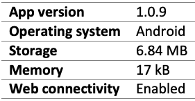
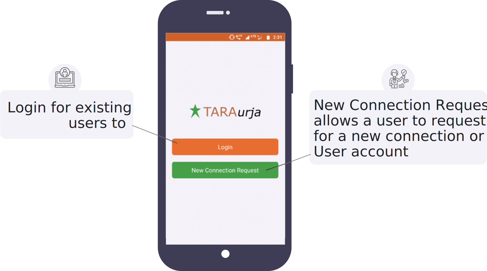
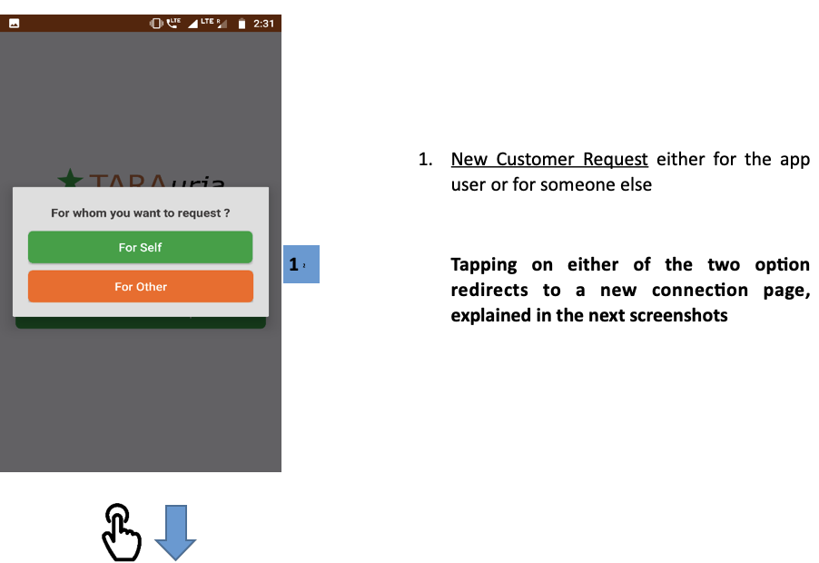
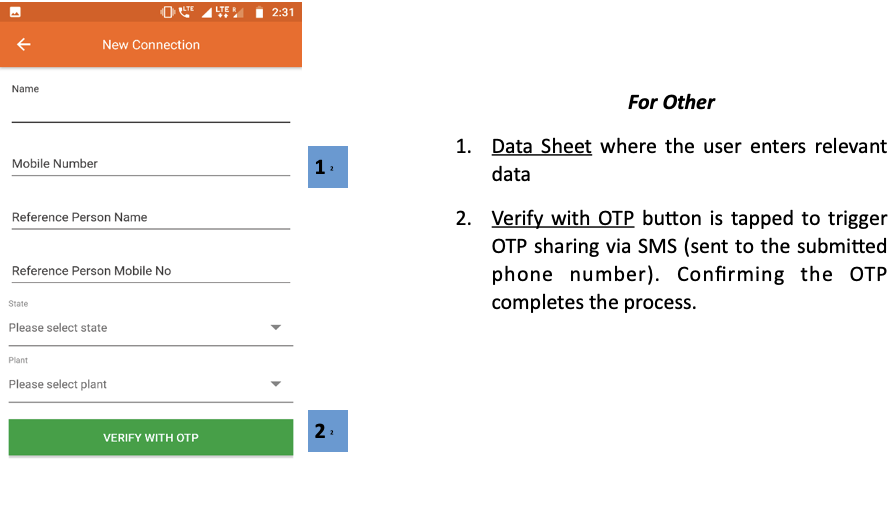
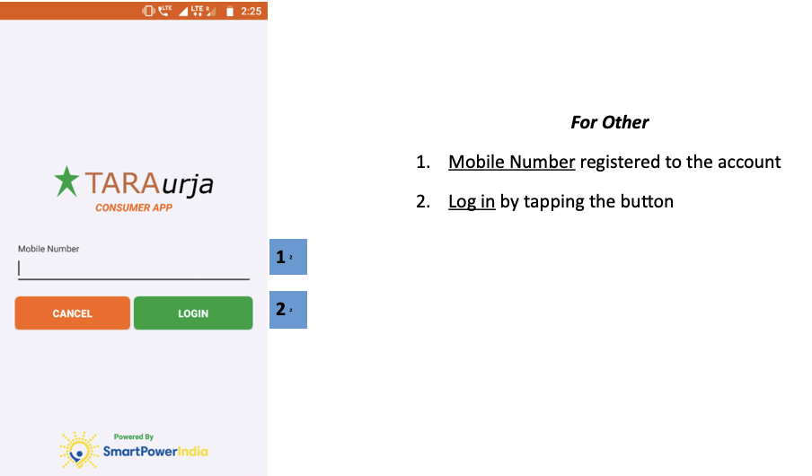

import useBaseUrl from '@docusaurus/useBaseUrl';

* कस्टमर एप्प एंड्राइड ऑपरेटिंग सिस्टम पर काम करता है।
* हार्डवेअर कैसा होना चाहिए, यह टेबल में बताया गया है।
	##### टेबल 2 : कस्टमर एप्प के लिए आवश्यक हार्डवेअर
	

* यह एप्प गूगल प्ले स्टोर या अन्य किसी एप्प स्टोर से डाउनलोड किया जा सकता है।
	* एप्प ढूंढने के लिए यूज़र को सर्च बार में “TARAurja” टाइप करना होगा।
		##### चित्र: कस्टमर एप्प का आइकॉन
		
* एप्लीकेशन खोलने पर यूज़र के सामने लॉग-इन विवरण आएगा, जिसका स्क्रीनशॉट नीचे दिया गया है।
	

## 4.2.1. नए कनेक्शन के लिए अनुरोध
**फंक्शनलिटी**
* यहाँ यूज़र नए कनेक्शन या नए खाते का अनुरोध दर्ज कर सकता है।
* यह यूज़र के लिए भी हो सकता है और किसी अन्य के लिए भी।

**पेज के डिटेल**

 

  

1.  **नया ग्राहक अनुरोध** या तो ऐप उपयोगकर्ता के लिए या किसी और के लिए

** किसी भी दो विकल्प पर टैप करके एक नए कनेक्शन पेज पर रीडायरेक्ट करता है, अगले स्क्रीनशॉट में समझाया गया है **

 
 

  

**अपने लिए**

1.  **डेटा शीट** जहां उपयोगकर्ता प्रासंगिक डेटा दर्ज करता है
2.  **ओटीपी के साथ सत्यापित करें** बटन को एसएमएस के माध्यम से ओटीपी साझा करने (सबमिट किए गए फोन नंबर पर भेजा गया) को ट्रिगर करने के लिए टैप किया गया है। ओटीपी की पुष्टि करने की प्रक्रिया पूरी होती है।

 
 

  

**अन्य के लिए**

1.  **डेटा शीट** जहां उपयोगकर्ता प्रासंगिक डेटा दर्ज करता है
2.  **ओटीपी के साथ सत्यापित करें** बटन को एसएमएस के माध्यम से ओटीपी साझा करने (सबमिट किए गए फोन नंबर पर भेजा गया) को ट्रिगर करने के लिए टैप किया गया है। ओटीपी की पुष्टि करने की प्रक्रिया पूरी होती है।

 

<!-- 

 -->

## 4.2.2. लॉग-इन
**फंक्शनलिटी**
* लॉग-इन पेज से मौजूदा ग्राहक सुरक्षित रूप से अपने खाते तक जा सकते हैं

**पेज के डिटेल**

 

  

**अन्य के लिए**

1.  **मोबाइल नंबर** खाते में पंजीकृत है
2.  **लॉग इन** बटन टैप करके

 

<!--  -->

