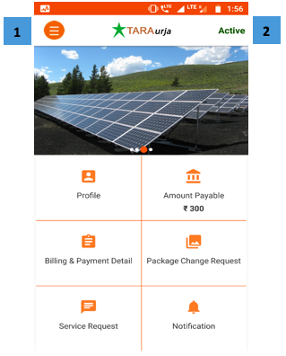

import useBaseUrl from '@docusaurus/useBaseUrl';

**फंक्शनलिटी**
* डैशबोर्ड यानी एप्प का होम स्क्रीन
* इसमें वे सब कार्य बताए गए हैं, जो ग्राहक इस एप्प पर कर सकता है। इनकी जानकारी नीचे दी गई है।

**पेज के डिटेल**
<!--

-->
 

  

1.  **मुख्य मेनू** आइकन (Section 0 देखें)
2.  **स्थिति** उपभोक्ता का: या तो सक्रिय या निष्क्रिय

 
  

