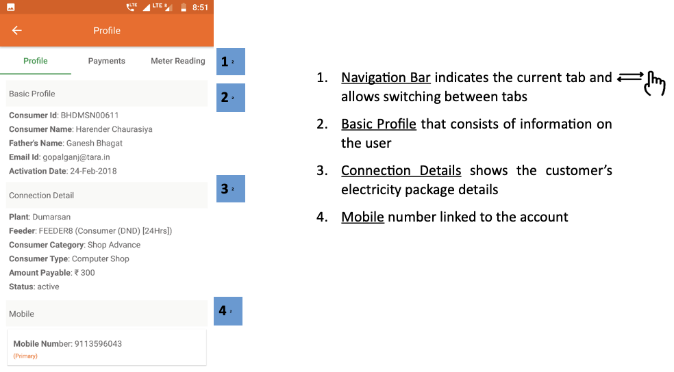
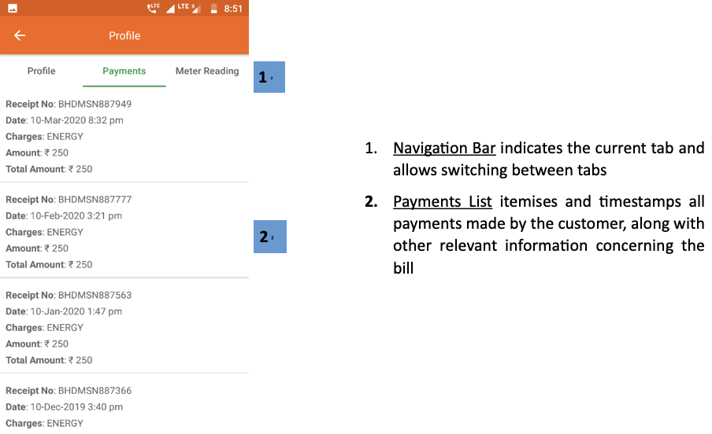
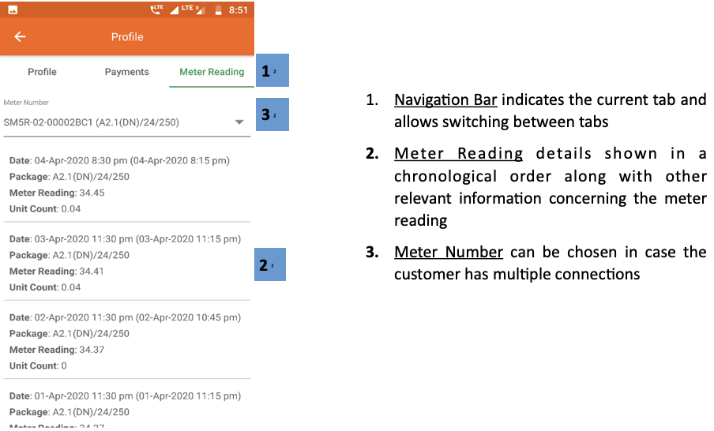

import useBaseUrl from '@docusaurus/useBaseUrl';
export const Clear = ({children}) => (
  

    {children}
  

);

**फंक्शनलिटी**
* प्रोफाइल पेज से यूज़र अपने खाते के विवरण तक पहुँच सकता है।
* इसमें स्वयं का विवरण, विगत भुगतान और बिजली की खपत की जानकारी मिल जाती है।

| प्रोफाइल | भुगतान | मीटर रीडिंग |
|---|---|---|
| उपभोक्ता के प्रोफाइल विवरण के साथ | व्यक्तिगत भुगतान की कालानुक्रमिक सूची | ऊर्जा खपत का कालानुक्रमिक रिकॉर्ड |

## 4.5.1. प्रोफाइल
**फंक्शनलिटी**
* इस सेक्शन में यूज़र के प्रोफाइल संबंधी महत्वपूर्ण जानकारी रहती है।

**पेज के डिटेल**

 

<Clear>

1.  <u>नेविगेशन बार</u> वर्तमान टैब को इंगित करता है और टैब के बीच स्विच करने की अनुमति देता है

    

2.  <u>मूल प्रोफ़ाइल</u> जिसमें उपयोगकर्ता की जानकारी होती है
3.  <u>कनेक्शन विवरण</u> ग्राहक के बिजली पैकेज विवरण दिखाता है
4.  <u>मोबाइल</u> खाता से जुड़ा नंबर

</Clear>
 

<!--  -->

## 4.5.2 भुगतान
**फंक्शनलिटी**
* भुगतान पेज में ग्राहक को जारी किए गए बिलों और ग्राहक द्वारा किए गए भुगतान का रिकॉर्ड तारीख के क्रम (क्रोनलॉजिकल ऑर्डर) में प्राप्त होता है।

**पेज के डिटेल**

 

<Clear>

1.  <u>नेविगेशन बार</u> वर्तमान टैब को इंगित करता है और टैब के बीच स्विच करने की अनुमति देता है
2.  <u>भुगतान सूची</u> बिल से संबंधित अन्य प्रासंगिक जानकारी के साथ ग्राहक द्वारा किए गए सभी भुगतानों की सूची और टाइमस्टैम्प

</Clear>
 

<!--  -->

## 4.5.3. मीटर रीडिंग
**फंक्शनलिटी**
* मीटर रीडिंग पेज में ग्राहक की बिजली की खपत का विवरण तारीख के क्रम (क्रॉनलॉजिकल ऑर्डर) में दिया होता है।
* कनेक्शन के अनुसार मीटर रीडिंग की बारंबारता (फ्रिक्वेंसि) अलग-अलग होती है।

**पेज के डिटेल**

 

<Clear>

1.  <u>नेविगेशन बार</u> वर्तमान टैब को इंगित करता है और टैब के बीच स्विच करने की अनुमति देता है
2.  <u>मीटर रीडिंग</u> मीटर रीडिंग से संबंधित अन्य प्रासंगिक जानकारी के साथ एक कालानुक्रमिक क्रम में दिखाया गया विवरण
3.  <u>मीटर नंबर</u> ग्राहक के कई कनेक्शन होने की स्थिति में चुना जा सकता है

</Clear>
 

<!--  -->

