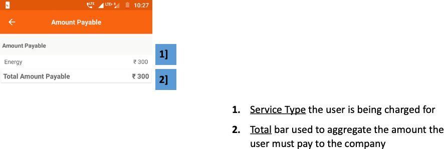

import useBaseUrl from '@docusaurus/useBaseUrl';
export const Clear = ({children}) => (
  

    {children}
  

);

**फंक्शनलिटी**
* अमाउंट पेयबल सेक्शन बताता है कि ग्राहक की ओर कितनी राशि बकाया है जो उसे कंपनी को चुकाना ही है।
* हर सेवा के लिए देय राशि अलग-अलग बताई जाती है।

**पेज के डिटेल**

 

<Clear>

1.  <u>सेवा प्रकार</u> उपयोगकर्ता के लिए शुल्क लिया जा रहा है
2.  <u>कुल बार</u> का उपयोग उस राशि को एकत्र करने के लिए किया जाता है जिसे उपयोगकर्ता को कंपनी को भुगतान करना होगा

</Clear>
 

<!--  -->
