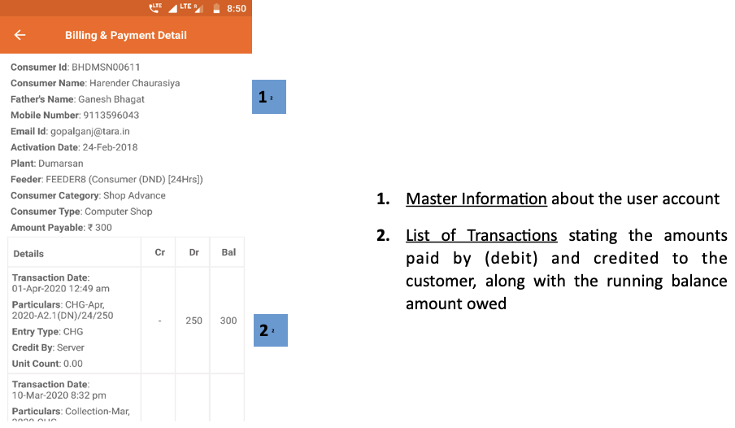

import useBaseUrl from '@docusaurus/useBaseUrl';
export const Clear = ({children}) => (
  

    {children}
  

);

**फंक्शनलिटी**
* बिलिंग और पेमेंट डिटेल पेज में उन सारे लेनदेन (जमा और नामे या क्रेडिट और डेबिट) का विवरण मिलता है जो यूज़र के खाते में हुए हैं।
* ग्राहक के खाते की जानकारी भी संक्षेप में दी जाती है।

**पेज के डिटेल**

 

<Clear>

1.  <u>मास्टर जानकारी</u> उपयोगकर्ता खाते के बारे में
2.  <u>लेन-देन की सूची</u> चलित शेष राशि के साथ, (डेबिट) द्वारा भुगतान की गई राशि ग्राहक को श्रेय दिया जाता है

</Clear>
 

<!--  -->