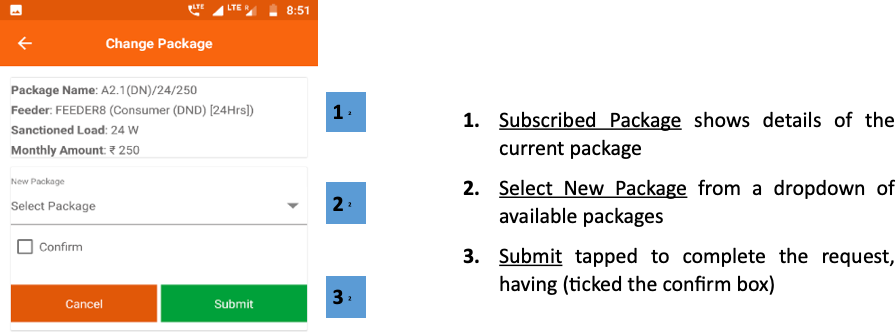

import useBaseUrl from '@docusaurus/useBaseUrl';
export const Clear = ({children}) => (
  

    {children}
  

);

**फंक्शनलिटी**
* पैकेज चेंज रिक्वेस्ट सेक्शन में ग्राहक अपने पैकेज को अपग्रेड/डाउनग्रेड कर सकता है। 
* इसमें ग्राहक के पिछले पैकेजों की सूची भी रहती है। 

**पेज के डिटेल**

 

<Clear>

1.  <u>सब्स्क्राइब्ड पैकेज लिस्ट</u> पिछले पैकेजों का विवरण दिखाता है

**पैकेज सूची आइटम पर टैप करने से परिवर्तन पैकेज अनुभाग में पुनर्निर्देशित होता है, जिसे निम्नलिखित स्क्रीनशॉट में समझाया गया है**

</Clear>
 
 

<Clear>

1.  <u>सब्स्क्राइब्ड पैकेज</u> वर्तमान पैकेज का विवरण दिखाता है
2.  <u>नए पैकेज का चयन करें</u> उपलब्ध पैकेजों की ड्रॉप डाउन से
3.  <u>सबमिट करें</u> अनुरोध को पूरा करने के लिए टैप किया गया है, (पुष्टि बॉक्स पर टिक किया गया है)

</Clear>
 

<!-- 

 -->
