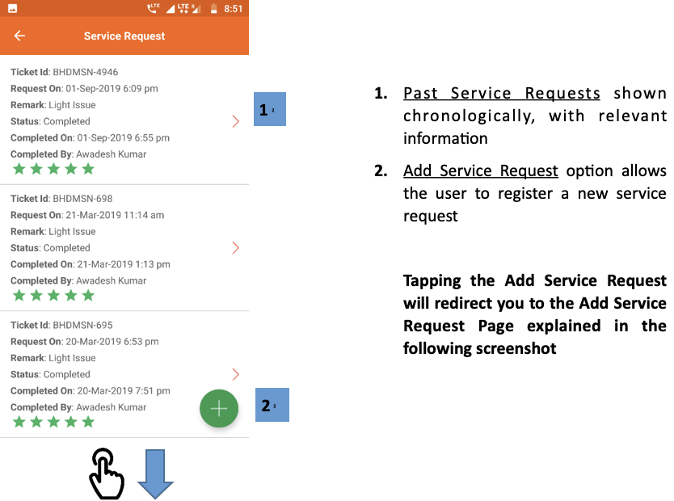
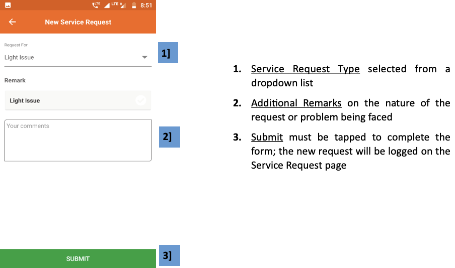

import useBaseUrl from '@docusaurus/useBaseUrl';
export const Clear = ({children}) => (
  

    {children}
  

);

**फंक्शनलिटी**
* सर्विस रिक्वेस्ट पेज में ग्राहक कंपनी से नई सेवा की मांग दर्ज कर सकता है।
* पिछले अनुरोध भी इसमें दिखाई देते हैं।

**पेज के डिटेल**

 

<Clear>

1.  <u>पिछले सेवा अनुरोध</u> प्रासंगिक जानकारी के साथ कालानुक्रमिक रूप से दिखाए गए हैं
2.  <u>सेवा अनुरोध जोड़ें</u> विकल्प उपयोगकर्ता को एक नई सेवा अनुरोध को पंजीकृत करने की अनुमति देता है

    **सेवा जोड़ें अनुरोध को टैप करने से आप निम्नलिखित स्क्रीनशॉट में बताए गए सेवा अनुरोध पृष्ठ पर पहुंच जाएंगे।**

</Clear>
 
 

<Clear>

1.  <u>सेवा अनुरोध</u> ड्रॉपडाउन सूची से चयनित प्रकार
2.  <u>अतिरिक्त टिप्पणी</u> अनुरोध या समस्या का सामना करने की प्रकृति पर
3.  <u>सबमिट करें</u> फॉर्म को पूरा करने के लिए टैप किया जाना चाहिए; नया अनुरोध सेवा अनुरोध पृष्ठ पर लॉग इन किया जाएगा

</Clear>
 

<!-- 

 -->