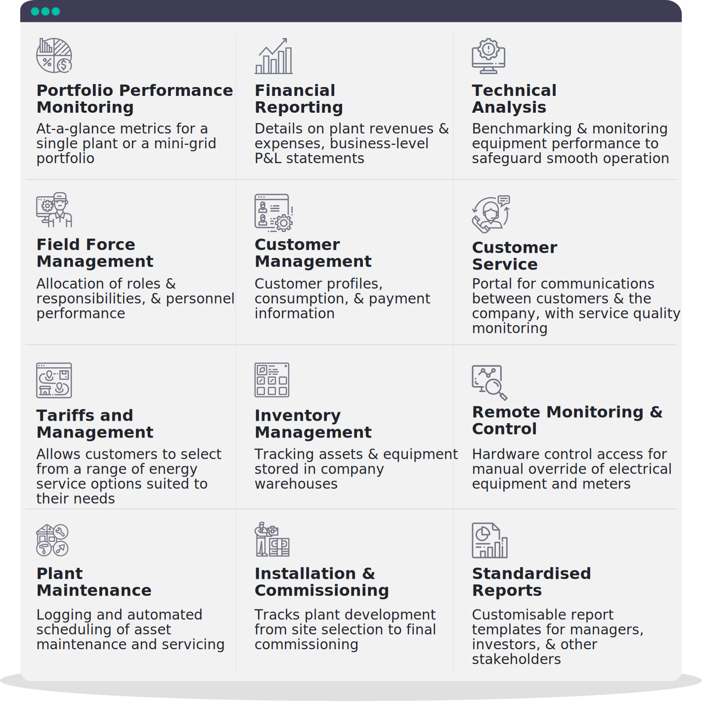
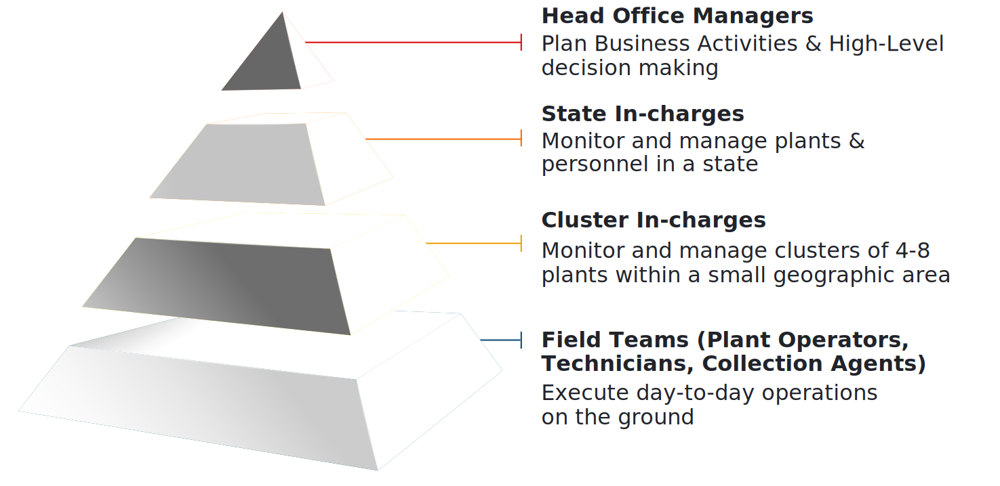

## 1.2.1. Purpose
The goal of MCOMS is to provide a platform for different mini-grid stakeholders to effectively communicate, through standardised workflows, easy-to-use interfaces, third-party hardware interoperability, rapid and automated data aggregation, and transparent and reliable record-keeping.

## 1.2.2. Functionalities
MCOMS is built upon two critical design principles, shown in Figure 1.

<table>
    <tr>
        <th>Accurate and comprehensive record keeping</th>
        <th>Real-time communication, control, and updates</th>
    </tr>
    <tr>
        <td>
            <ul>
            <li>Including centralised databases of historical technical and financial data, user information, plant specifications, system changes, etc.</li>
            </ul>
        </td>
        <td>
            <ul>
            <li>Accurately propagating and distributing commands issued from any node, to provide up-to-date information to all users</li>
            </ul>
        </td>
    </tr>
</table>

High-level system functionalities are detailed in Figure 2.

#### FIGURE 2:HIGH-LEVEL COMS FUNCTIONALITIES. 

MCOMS is designed to cover all aspects of business monitoring, and places sales and finance metrics alongside technical performance and analysis of trends in customer demand. This synthesis of information gives mini-grid developers a deeper understanding of their projects’ operations.

## 1.2.3. Users
Mini-grid businesses are multi-faceted, with many personnel and stakeholder roles. MCOMS caters to these user groups’ requirements and workflows, as described in the following sections.

### 1.2.3.1. Company Personnel
To achieve operational efficiency and business performance, it is critical to clearly define the roles for each team member. The personnel hierarchy of a mini-grid operator is sketched in Figure 3, followed by a detailed description in Table 1.

#### Figure 3: Typical mini-grid operator organisational hierarchy.

#### Table 1: Description of the roles and responsibilities of mini-grid personnel.

<table>
  <tr>
    <th>Designation</th>
    <th>Role</th>
    <th>Responsibilities</th>
  </tr>
  <tr>
    <td><b>Operator</b></td>
    <td>An operator is present 24x7 to look after the mini-grid plant</td>
	<td>
		<ul>
                  <li>Monitor plant equipment to ensure correct operation</li>
                  <li> Restore electricity supply after plant trips </li>
                  <li> Record routine operations data, such as plant meter readings</li>
		  <li> Handle complaints of customers who come to the plant</li>
               </ul>
	</td>
  </tr>
  <tr>
    <td><b>Technician</b></td>
    <td>A technician addresses technical issues encountered by customers or at the plant</td>
    	<td>
		<ul>
			<li>Respond to customer connection problems</li>
			<li> Diagnose and fix equipment faults throughout the mini-grid</li>
			<li> Connect new consumers to the network</li>
			<li> Record customer energy consumption</li>
		</ul>
	</td>
  </tr>
  <tr>
	<td><b>Customer Service Agent (CSA)</b></td>
	<td>A CSA manages customer relationships and conducts sales activities</td>
	<td>
		<ul>
			<li>Market mini-grid services and schemes to potential customers in the catchment area</li>
			<li> Issue bills and collect payment from customers, and make deposits</li>
			<li> Intervene in the case of non-payment</li>
			<li> Respond to customer complaints or difficulties faced</li>
			<li> Administer requested package upgrades / downgrades</li>
		</ul>
	</td>
  </tr>
  <tr>
	<td><b>Cluster In-charge</b></td>
	<td>A Cluster In-charge supervises personnel and operations at several nearby plants</td>
	<td>
		<ul>
			<li>Track the sales performance of plants in the cluster and highlight problems</li>
			<li> Track and verify operational costs borne by the cluster</li>
			<li> Monitor pending tasks, and allocate them to members of the field team</li>
			<li> Arrange for any maintenance or equipment replacement</li>
			<li> Handle personnel training</li>
		</ul>
	</td>
  </tr>
  <tr>
	<td><b>State In-charge</b></td>
	<td>A State In-charge supervises operations at all plants within a state</td>
	<td>
		<ul>
			<li>Create monthly business performance targets, including revenue and customer numbers, and track progress towards them</li>
			<li> Coordinate schemes and initiatives between all plants within the state</li>
			<li> Create sales and operations reports for the head office</li>
			<li> Create recruitment plans</li>
			<li> Coordinate and plan portfolio expansion, construction, and recruitment</li>
		</ul>
	</td>
  </tr>
  <tr>
	<td><b>Head Office Manager</b></td>
	<td>Head Office Managers are key decision-makers who manage portfolio and business development</td>
	<td>
		<ul>
			<li>Develop strategies and initiatives to enhance business performance</li>
			<li> Reconcile expenses and earnings reports</li>
			<li> Perform cross-plant analyses of technical health, and arrange interventions to optimise the asset portfolio</li>
			<li> Create new packages and services</li>
			<li> Plan the strategic, technical, and financial elements of business expansion</li>
		</ul>
	</td>
  </tr>
</table>

### 1.2.3.2. Mini-grid Customers
One of the strengths of mini-grids is their ability to cater to a variety of consumer segments with different energy needs and expectations. For example, while a household may require modest levels of power to run simple appliances in the evening, shops’ peak consumption may be in the daytime, while commercial enterprises with specialised equipment will require a much higher load allowance.

That said, all electricity consumers share the same basic requirements of monitoring their bills and consumption history, receiving alerts and notifications from the electricity supplier, updating their account details, and getting in touch when something is amiss. MCOMS aims to facilitate these kinds of communications, and ensure that customers are kept in the loop with easy access to all the information and service support that they need.

### 1.2.3.3. Access Permissions
Different users of MCOMS will require different levels of access to the system’s databases and management functionality. As such, a core component of MCOMS is the ability to set the access permissions for each user. This not only simplifies the interface, allowing each user to focus on content relevant to them, but also ensures that sensitive data is secure.

For example:
* Customers should only be able to view their own bills, and not those of other customers.
* Plant operators should only be able to input and record data pertaining to their plant.
* Maintenance activities and control of equipment operation should be in the hands of the cluster or state in-charge, rather than plant CSAs and technicians.
* Bank deposits and expense reports for the portfolio should be visible to upper management only.

This manual documents all of the MCOMS system’s features which would be visible to the top-level user (e.g. the company CEO). A given reader may be able to only access some subset of these features, depending on their designation; this will be clear from the context on a case-by-case basis.

## 1.2.4. Communication
As already noted, communications between stakeholders are of central importance to the smooth running of a mini-grid business. Effectively connecting different levels of the business, for instance allowing managers in the head office to gather information from distributed field teams, underpins efficient operations.

Wherever possible, this is achieved through passive communications:
* Well-structured workflows which guide the user in completing tasks
* Automatically generated notifications for routine or scheduled activities
* Automated prioritisation of information according to internally programmed logic
* Rapid data consolidation so that all users have access to up-to-date information
* OTPs for customers and managers to authorise certain transactions

There are also various mechanisms for active communication between users:
* Notifications and data entry pushed via the smartphone apps
* Notifications and data entry pushed via the web platform
* Notifications pushed through email
* Notifications and requests pushed through SMS

Multi-modal communications are especially important when different users will have different preferences. For example, those customers who cannot use the smartphone app will receive bills, receipts, and notifications via SMS.