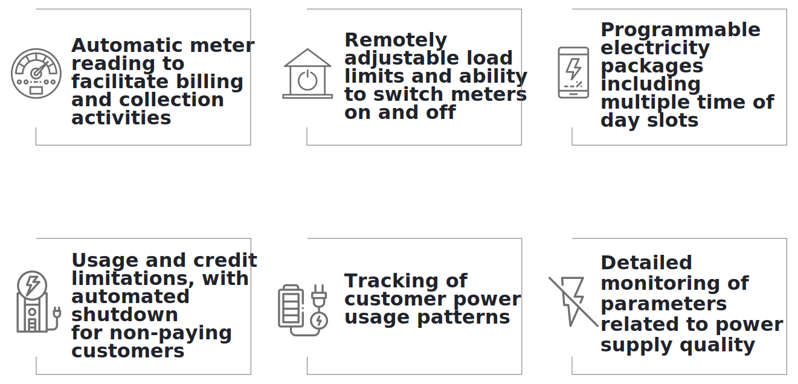

## 1.3.1 Front-end Interfaces
The real-time integration of mini-grid customers, field agents, and management onto a single information platform is shown in Figure 4.

#### Figure 4: Integration of MCOMS interfaces.

The following sections describe each interface.

### 1.3.1.1. Customer App
#### Figure 5: Screenshot of the customer app.

The customer smartphone app provides an intuitive graphical interface through which mini-grid customers can:
* View their consumption, billing, and payment history
* Store receipts
* View and edit their customer profile
* Register service and package change requests.
* Directly contact mini-grid field personnel
* Receive alerts and notifications about their account, electricity supply, or other operational matters.

Customers without smartphones can avail some limited functionality through SMS (see Figure 6).

The customer app is fully documented in Chapter 0.

#### Figure 6: Screenshot of SMS services.

### 1.3.1.2. Field Agent App
#### Figure 7: Screenshot of the field agent App.

The field agent smartphone app provides a comprehensive interface for mini-grid personnel at all levels of the business hierarchy.

For personnel on the ground, the app allows:
* Viewing customer accounts
* Recording transactions
* Receiving assignments and notifications
* Registering customers and changing their package

For management personnel, the app allows:
* Tracking sales and business performance
* Communication with the field team
* Identifying emerging issues requiring intervention
* Monitoring technical operation of the mini-grid

The field agent app is fully documented in Chapter 3.

### 1.3.1.3 Web Platform
The web platform is the primary MCOMS front-end for use by the management teams at cluster, state, and HQ levels. It provides detailed dashboards and data analysis functionalities, and allows users to view and edit database records.

A detailed guide to the web interface will be included in a future edition of this manual, but in this edition it is omitted.

## 1.3.2. Data Sources and Transmission
The MCOMS components discussed in the preceding Section 1.3.1 all exchange commands and information in real time. To fully appreciate and leverage the potential of MCOMS, it is necessary to get a basic overview of the various information pipelines, and how distributed hardware and software talk to each other.

### 1.3.2.1. System Overview
The central data management system acts both as a data repository and a command router, and can push information and notifications to specific users or hardware. Principal hardware nodes and the two-way interactions between them are depicted in Figure 8. The following sections describe data collection and transmission mechanisms in more depth.

#### Figure 8: Data flow between MCOMS components.

### 1.3.2.2. Manual Data Input
Sales and customer-related information is entered into the system by field agents and customers. This critical ground intelligence is then relayed to all levels of the business hierarchy. 

Some activities are input subject to requirement – example include adding new customers or registering payments. Others are routine activities, such as logging solar energy generation or performing customer meter readings.

### 1.3.2.3. Smart Meters
Smart energy meters connect the demand side to cloud servers for automated data upload and remote-control capabilities. While specific technologies differ, such systems generally offer a variety of advantages over conventional meter setups, as captured in Figure 9.

#### Figure 9: Benefits of smart metering.

Communication with smart meters typically operates through the hardware manufacturer’s software and cloud servers. Data can be pulled from the servers and commands issued to individual meters (or collections thereof) through the manufacturer’s portal and/or through their APIs.

### 1.3.2.4. Plant Equipment
A detailed record on the state of supply-side equipment—including inverters, batteries, and solar panels—can be collected from data-loggers installed in the mini-grid control room. Such records allow plant management to assess performance and health of their systems.

More sophisticated setups may combine data collection with automated real-time performance optimisation, as well as two-way communication capabilities which allow technicians to remotely control plant operations.
