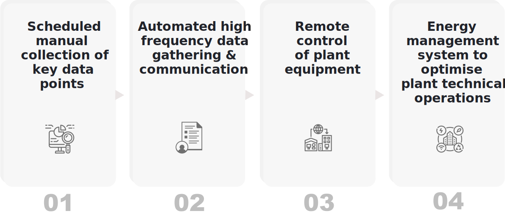

#### Figure 10: Technical monitoring of mini-grid supply-side equipment.

This section provides some guidance about navigating and using the remainder of this manual.

**Chapter 2: Mini-grid Operations and Their Workflows** outlines core operating principles of running a mini-grid, and elaborates the various tasks and responsibilities pertaining to mini-grid personnel and mini-grid customers. The functionality discussed in the following chapters will be founded on a familiarity with this material.

**Chapter 3: Field Agent App** provides a detailed guide to the smartphone application used by mini-grid employees. The app provides a wide range of functionality, and constitutes the bulk of this manual. Each “module” of the app is introduced in a separate sub-section, which states the purpose of the module, its key users and use cases, along with a step-by-step explanation of how to navigate it.

**Chapter 4: Customer App** consists of a working guide to the customer application. As with Chapter 3, each functionality is explained in depth, for the benefit of both customers and field agents who are assisting customers in using the app.

