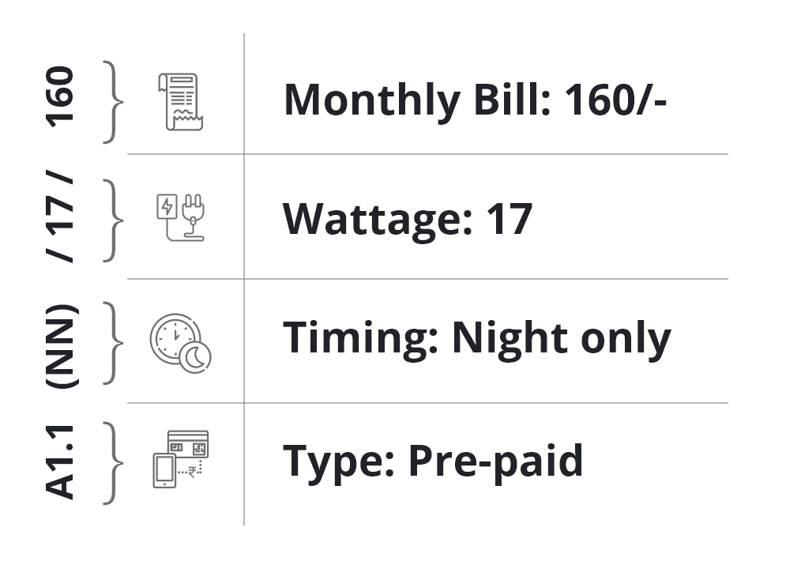
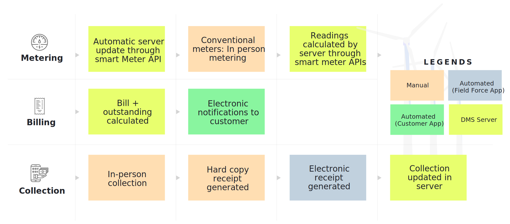
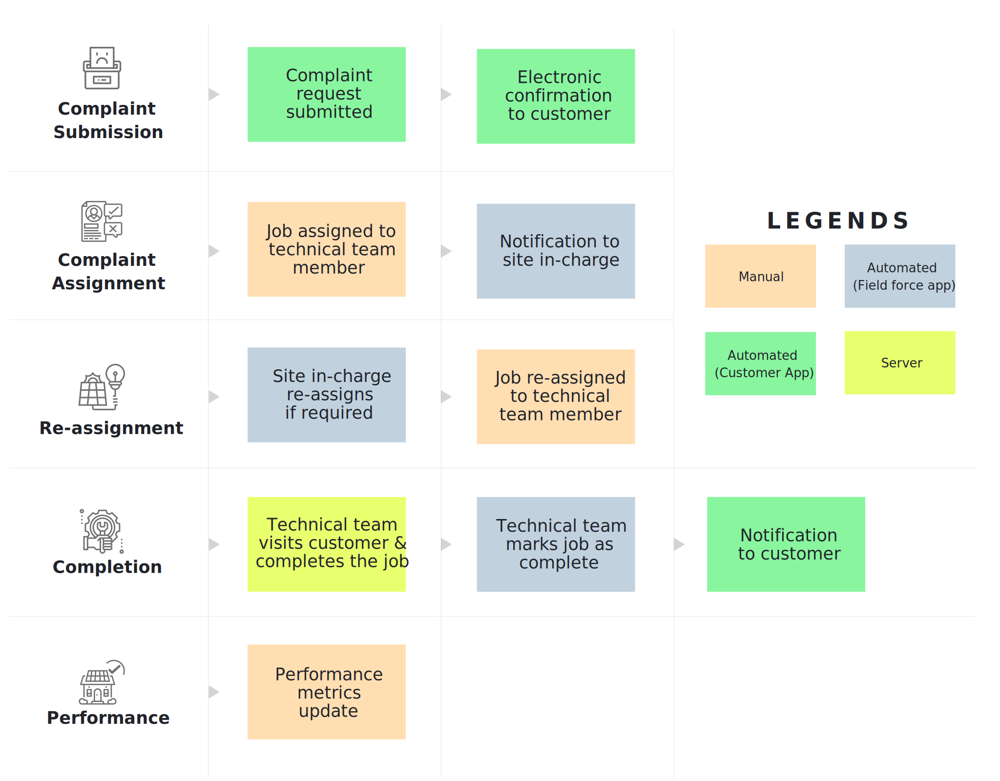

## 2.2.1. Creating Packages
Packages allow customers to prioritise their electricity needs and balance them against price for different levels of service. In designing and choosing packaged, three major supply characteristics must be considered:

* The maximum power or load supported by the connection
* The timings during which the connection is active
* The tariff per unit of energy consumed, if any

A package combines allowances in these three dimensions, in a way that is designed to suit the consumption patterns of existing and potential customers, while covering the cost of electricity supply and business requirements. Multiple packages are generally offered at a given plant. 

Post-paid packages are billed at the end of each billing period after energy has been consumed; these connections are typically metered and the bill depends on the amount of consumption. Pre-paid packages require the customer to pay a fixed amount in advance to maintain a given level of supply availability.

#### Figure 10: Package ID construction example.

## 2.2.1. Customer Acquisition
The step-by-step customer acquisition process is depicted in Figure 11. Note that all steps coloured green or blue are done through the MCOMS apps.

#### Figure 11: Adding customers detailed workflow.

### 2.2.2.1. Unique Customer IDs
Each customer is assigned a unique identification number the moment their account is created. These numbers play a pivotal role in the structure of MCOMS, as the databases for energy consumption, payment history, etc. are indexed according to this ID. 
An example customer ID is shown in Figure 12.

#### Figure 12: Customer ID construction example.

## 2.2.3. Customer Status
A customer’s status can be either “active” or “inactive”/”banned”:
* Active customers have kept up to date with bills (i.e. have not exceeded their credit limit), and are continuing to avail the services of the mini-grid.
* Inactive / banned customers are those whose connection has been terminated – either because of non-payment, or the customer’s preference, or in rare cases because electricity demand is exceeding the plant capacity and customers must be dropped.

MCOMS automatically flags customers who are to be deactivated; when the customer is connected through a smart meter, this process can be automatic.

## 2.2.4. Metering, Billing, and Collection
Metering, billing, and collection (MBC) is the process by which a customer pays for the electricity they have consumed. The process is summarised below and illustrated in Figure 13.
* Metering
	* For customers with conventional energy meters, the new reading is noted at the end of the billing period.
	* For customers with smart meters (see Section 1.3.2.3), energy consumption is automatically calculated.
	* For customers with load limiters (pre-paid), no metering is necessary.
* Billing
	* For metered customers, energy consumption is multiplied by the appropriate tariff to arrive at the final bill.
	* For unmetered customers, the bill is a fixed amount per month so no calculation is necessary.
	* Bills are delivered to customers either electronically or in person by field agents.
* Collection
	* The customer makes payment against their bill, as well as any outstanding debt.
	* Payment can be made in person in cash (point of sale (POS)), through a mobile wallet (e.g. PayTM), or by card.
	* Partial payments are acceptable, but will require repeated field agent visits.

#### Figure 13: Metering, billing, and collection workflow.

## 2.2.5. Customer Receipts
Ensuring that company and customers alike have access to records of bills and payments is important for transparency and trust, and for forestalling / resolving payment disputes. Customer receipts are the primary proof of billing for any active consumer, and come in a variety of formats:

* **Print-out:** a paper receipt of a transaction can be printed by field agents upon request, using a portable printer.
* **Digital record:** customers using the smartphone app gain access to their complete transaction history, as seen by company agents.
* **Screenshot:** customers without the app may request a screenshot of the receipt from a company agent, to be saved as an image file.
* **SMS:** customers may automatically receive SMS messages notifying them of bills and confirming payment received.

## 2.2.6. Editing Profiles
It is important to maintain up-to-date customer records, including information like address and contact number. This ensures that customers can receive bills and payment receipts, and be informed of any service disruptions or company promotions.

Customers may update their own information through the customer app, or field agents may do so with approval (and an OTP) from the customer.

## 2.2.7. Service Requests
Service requests are made by customers when they experience supply disruptions or other issues with their electricity connection. Service requests can be made though:

* The customer app, which has an easy-to-use service request module
* The field agent app, where the customer contacts the company field agent directly, and the agent logs the service request on their behalf

The processing of every Service Request made by all customers is as follows:

#### Figure 14: Service requests workflow.

## 2.2.8. Security Deposits
A refundable security deposit is typically taken from every new customer, with the amount depending on their anticipated monthly bill. In the event of a lapse in regular payments, the company can recoup the outstanding amount form the deposit. Otherwise, the deposit is refunded in full when a customer discontinues their subscription. The process for collecting the security deposit is illustrated in **Error! Reference source not found.**

## 2.2.9. Package Changes
Customers whose energy requirements or circumstances change may shift to a different package. For example, a household may upgrade to a higher load limit after buying new electrical appliances, or may opt for longer hours of access.

A package change can be initiated via the customer app, or by a field agent on behalf of the customer. The main steps of the process are:

* **Logging the request:** the package change request is registered in the system
* **Approval:** the request is screened by the appropriate mini-grid employee; in some circumstances the request may be rejected
* **Payment:** the customer and company settle necessary payments, such as changing the security deposit
* **Database update:** the customer’s assigned package is updated; the change may be implemented immediately or at the beginning of the next billing period
* **Connection update:** smart meter or load limiter is reprogrammed with the new package details (namely load limit and timing), or the customer is connected to a different feeder

## 2.2.10. Complementary Business Services
Value-added services are those activities which go beyond the core role of providing electricity. These activities are intended to serve multiple purposes: to bring value and opportunities to customers, to positively impact the local community, to raise the profile of the mini-grid operator, and to increase electricity sales.

Some value-added services are geared towards businesses and micro-enterprise development, while others are more focussed on households and personal use. Two examples are given.

#### Example 1: Water Sales
Many mini-grid operators have established water treatment units at their plants. These provide the amenity of clean and chilled water to the local community, while generating economic activity and acting as a dependable electricity consumer for the mini-grid. Depending on the company’s level of involvement, they may wish to keep track of the water treatment unit’s throughput, sales and electricity consumption. Such functionalities are available through MCOMS.

#### Example 2: Appliance Promotion
Company-run schemes offering electrical appliances to customers have been successful in the past. Such schemes are intended attract potential customers to avail an electricity connection, and increase the consumption levels of existing customers. Buyers can pay for their appliances as a package bundled with their electricity bill, which is much more attractive than paying the whole lump sum up front.
