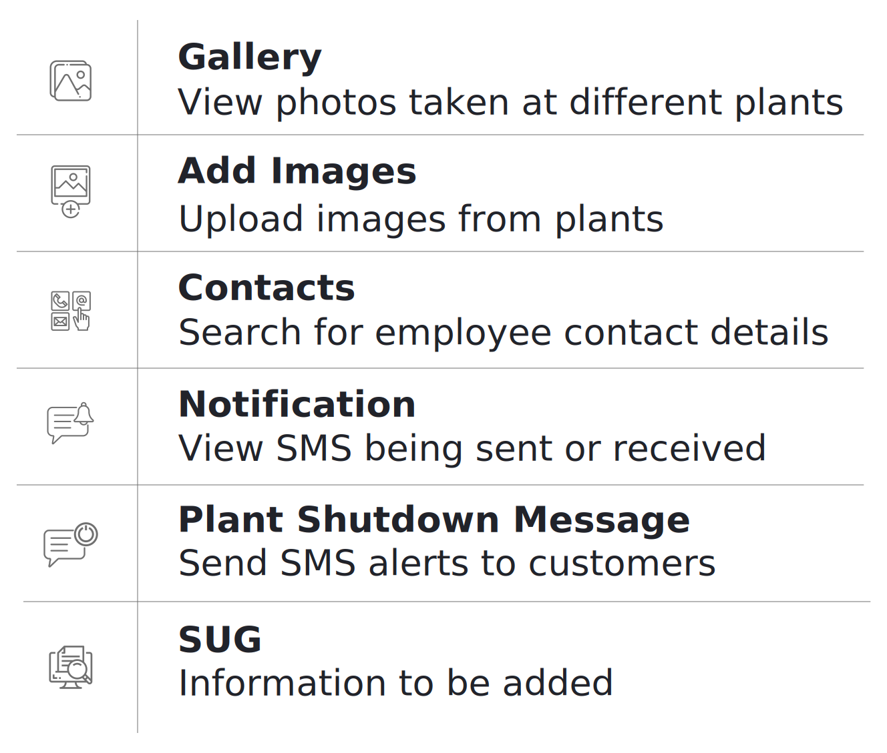
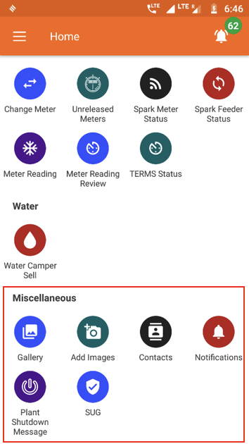

## Overview

  

## Gallery
**Functionality**
* The Gallery Section contains images of each plant

**Key Users**
<table>
  <tr>
    <th>Designation</th>
    <th>Main Purpose</th>
    <th>Example Use Case</th>
  </tr>
  <tr>
    <td>Cluster In-charge</td>
    <td>To view pictures from various plants within the state</td>
    <td>Viewing photos of an activity at the plant</td>
  </tr>
  <tr>
    <td>State In-charge</td>
    <td>Same as Cluster In-charge</td>
    <td>Showing external stakeholders the plant layout</td>
  </tr>
</table>

**Page Details**

## Add Images
**Functionality**
* For uploading photos relevant to a particular plant

**Key Users**
<table>
  <tr>
    <th>Designation</th>
    <th>Main Purpose</th>
    <th>Example Use Case</th>
  </tr>
  <tr>
    <td>Cluster In-charge</td>
    <td>To add pictures onto the application data base</td>
    <td>To add pictures based on a particular type of an activity</td>
  </tr>
  <tr>
    <td>State In-charge</td>
    <td>Same as Cluster In-charge</td>
    <td>To add pictures from a visit that had taken place to a plant in the state</td>
  </tr>
</table>

**Page Details**

## Contacts
Functionality
* Lists every operator working for the company along with their contact details

**Navigation**

This page is also accessible from the Main Menu: Refer to Section 3.4.7 for details.

## Notifications
**Functionality**
* The Notification Section allows the user to view all the SMS messages that have been sent or received

**Key Users**
<table>
  <tr>
    <th>Designation</th>
    <th>Main Purpose</th>
    <th>Example Use Case</th>
  </tr>
  <tr>
    <td>All Employees</td>
    <td>Access to the SMS messages sent by the company</td>
    <td>To verify an SMS sent by the company even if the agent might have deleted the SMS off the phone memory</td>
  </tr>
</table>

**Page Details**

## Plant Shutdown Message
**Functionality**
* Allows user to send an SMS to a subset of customers, warning them of a plant shutdown

**Key Users**
<table>
  <tr>
    <th>Designation</th>
    <th>Main Purpose</th>
    <th>Example Use Case</th>
  </tr>
  <tr>
    <td>Cluster In-charge</td>
    <td>To notify customers at a plant about a scheduled shut down</td>
    <td>Messaging all customers that the plant requires maintenance for the next three hours</td>
  </tr>
  <tr>
    <td>State In-charge</td>
    <td>Same as Cluster In-charge</td>
    <td>Same as Cluster In-charge</td>
  </tr>
</table>

**Page Details**

## SUG
**Functionality**
* The SUG Section identifies and creates consumer pools in various plants
* The section is only available for HCLF agents

**Key Users**
<table>
  <tr>
    <th>Designation</th>
    <th>Main Purpose</th>
    <th>Example Use Case</th>
  </tr>
  <tr>
    <td>Operator</td>
    <td>Maintaining a report on all the active SUGs at a plant</td>
    <td>Reviewing the list of SUG members and contacting the relevant member</td>
  </tr>
  <tr>
    <td>CSA</td>
    <td>Same as Operator</td>
    <td>Same as Operator</td>
  </tr>
  <tr>
    <td>Cluster In-charge</td>
    <td>Same as Operator</td>
    <td>Same as Operator</td>
  </tr>
</table>

**Page Details**

