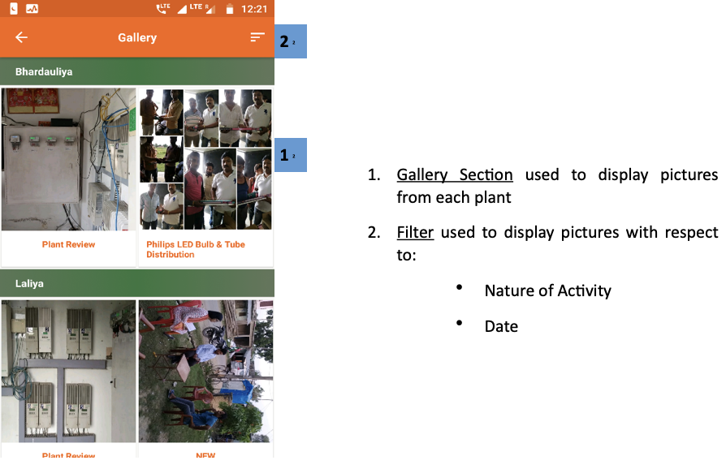
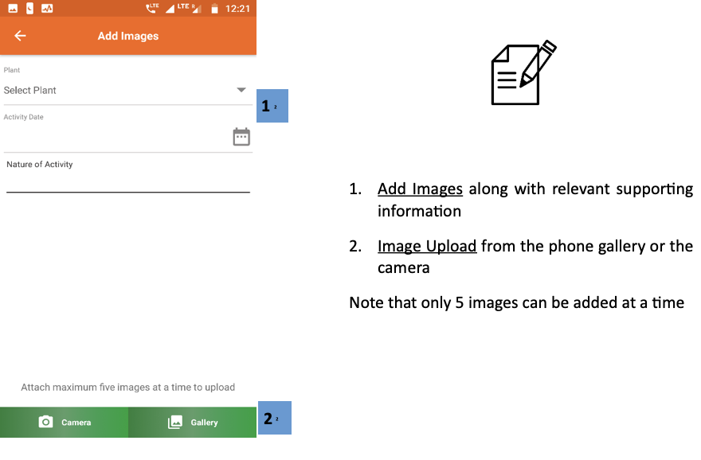
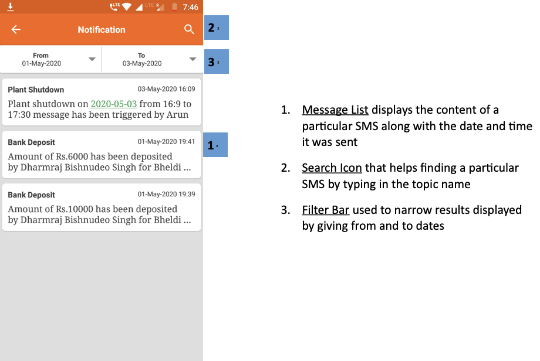
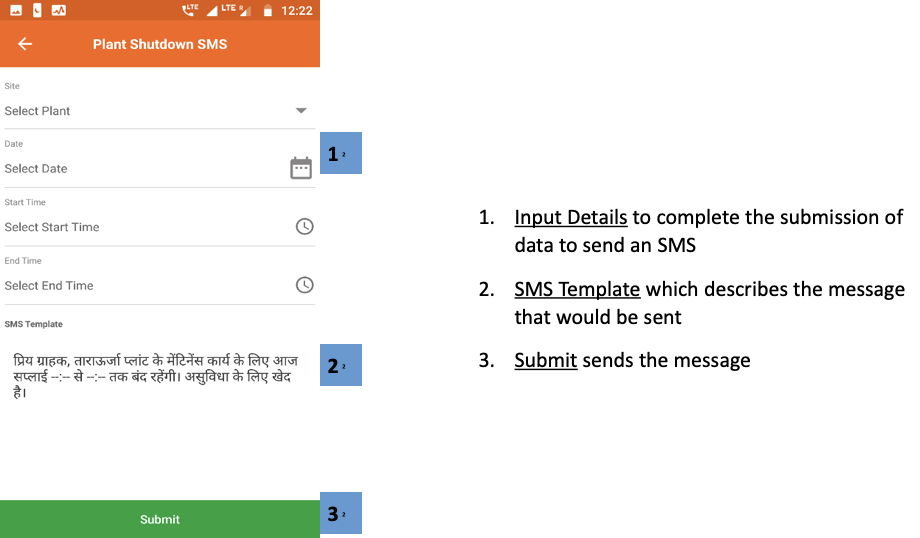
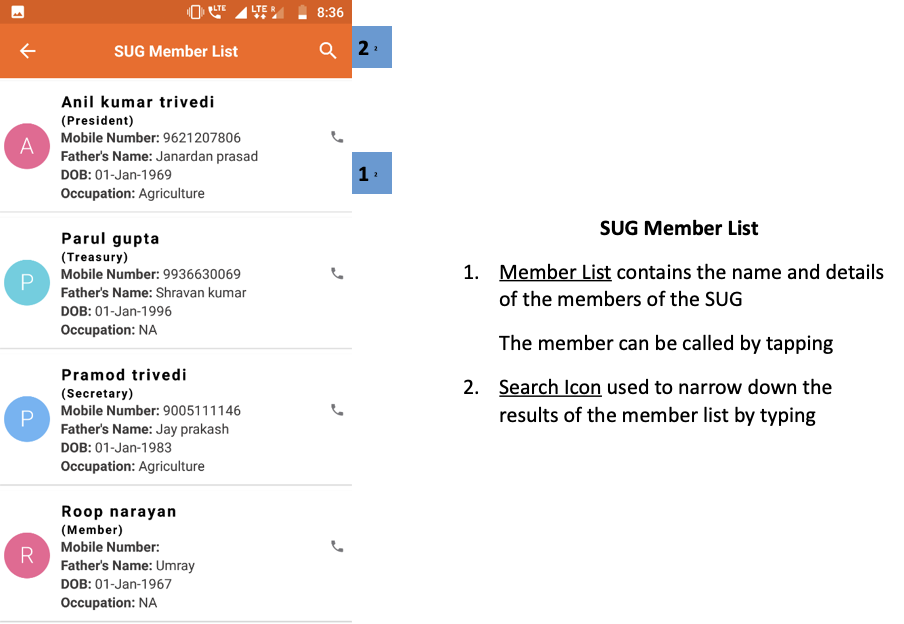

import useBaseUrl from '@docusaurus/useBaseUrl';

## 3.10.1. Overview

 

 

## 3.10.2. Gallery
**Functionality**
* The Gallery Section contains images of each plant

**Key Users**
<table>
  <tr>
    <th>Designation</th>
    <th>Main Purpose</th>
    <th>Example Use Case</th>
  </tr>
  <tr>
    <td>Cluster In-charge</td>
    <td>To view pictures from various plants within the state</td>
    <td>Viewing photos of an activity at the plant</td>
  </tr>
  <tr>
    <td>State In-charge</td>
    <td>Same as Cluster In-charge</td>
    <td>Showing external stakeholders the plant layout</td>
  </tr>
</table>

**Page Details**

 

    

1.  **Gallery Section** used to display pictures from each plant
2.  **Filter** used to display pictures with respect to:
    * Nature of Activity
    * Date

 

<!--  -->

## 3.10.3. Add Images
**Functionality**
* For uploading photos relevant to a particular plant

**Key Users**
<table>
  <tr>
    <th>Designation</th>
    <th>Main Purpose</th>
    <th>Example Use Case</th>
  </tr>
  <tr>
    <td>Cluster In-charge</td>
    <td>To add pictures onto the application data base</td>
    <td>To add pictures based on a particular type of an activity</td>
  </tr>
  <tr>
    <td>State In-charge</td>
    <td>Same as Cluster In-charge</td>
    <td>To add pictures from a visit that had taken place to a plant in the state</td>
  </tr>
</table>

**Page Details**

 

1.  **Add Images** along with relevant supporting information
2.  **Image Upload** from the phone gallery or the camera

Note that only 5 images can be added at a time

 

<!--  -->

## 3.10.4. Contacts
Functionality
* Lists every operator working for the company along with their contact details

**Navigation**

This page is also accessible from the Main Menu: Refer to Section 3.4.7 for details.

## 3.10.5. Notifications
**Functionality**
* The Notification Section allows the user to view all the SMS messages that have been sent or received

**Key Users**
<table>
  <tr>
    <th>Designation</th>
    <th>Main Purpose</th>
    <th>Example Use Case</th>
  </tr>
  <tr>
    <td>All Employees</td>
    <td>Access to the SMS messages sent by the company</td>
    <td>To verify an SMS sent by the company even if the agent might have deleted the SMS off the phone memory</td>
  </tr>
</table>

**Page Details**

 

      

1.  **Message List** displays the content of a particular SMS along with the date and time it was sent
2.  **Search Icon** that helps finding a particular SMS by typing in the topic name
3.  **Filter Bar** used to narrow results displayed by giving from and to dates

 

<!--  -->

## 3.10.6. Plant Shutdown Message
**Functionality**
* Allows user to send an SMS to a subset of customers, warning them of a plant shutdown

**Key Users**
<table>
  <tr>
    <th>Designation</th>
    <th>Main Purpose</th>
    <th>Example Use Case</th>
  </tr>
  <tr>
    <td>Cluster In-charge</td>
    <td>To notify customers at a plant about a scheduled shut down</td>
    <td>Messaging all customers that the plant requires maintenance for the next three hours</td>
  </tr>
  <tr>
    <td>State In-charge</td>
    <td>Same as Cluster In-charge</td>
    <td>Same as Cluster In-charge</td>
  </tr>
</table>

**Page Details**

 

    

1.  **Input Details** to complete the submission of data to send an SMS
2.  **SMS Template** which describes the message that would be sent
3.  **Submit** sends the message

 

<!--  -->

## 3.10.7. SUG
**Functionality**
* The SUG Section identifies and creates consumer pools in various plants
* The section is only available for HCLF agents

**Key Users**
<table>
  <tr>
    <th>Designation</th>
    <th>Main Purpose</th>
    <th>Example Use Case</th>
  </tr>
  <tr>
    <td>Operator</td>
    <td>Maintaining a report on all the active SUGs at a plant</td>
    <td>Reviewing the list of SUG members and contacting the relevant member</td>
  </tr>
  <tr>
    <td>CSA</td>
    <td>Same as Operator</td>
    <td>Same as Operator</td>
  </tr>
  <tr>
    <td>Cluster In-charge</td>
    <td>Same as Operator</td>
    <td>Same as Operator</td>
  </tr>
</table>

**Page Details**

 

    

1.  **SUG List** showing the SUG name and bank details
2.  **Members Button** redirects to the list of SUG members, as shown in the next screenshot
3.  **Search Icon** to find a particular SUG by typing the name

 
 

      

**SUG Member List**
1.  **Member List** contains the name and details of the members of the SUG

The member can be called by tapping

2.  **Search Icon** used to narrow down the results of the member list by typing

 

<!-- 

 -->

