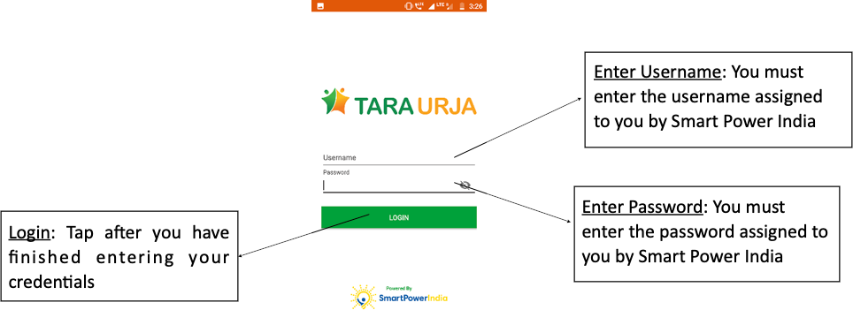

* The field agent app runs on the Android operating system
* It can be downloaded from the Google Play store and other app repositories.

	##### Figure: Field agent app icon.
	

* The user should type “Tara” into the search bar and select the app shown in the figure.
* Hardware requirements are shown below.

	##### Table: Field agent app installation requirements.
	

* Upon opening the application, the user is prompted for their login credentials.
	

