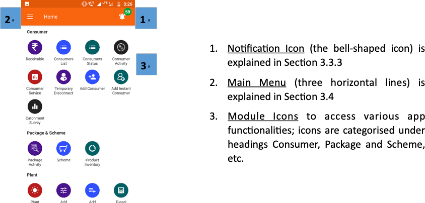
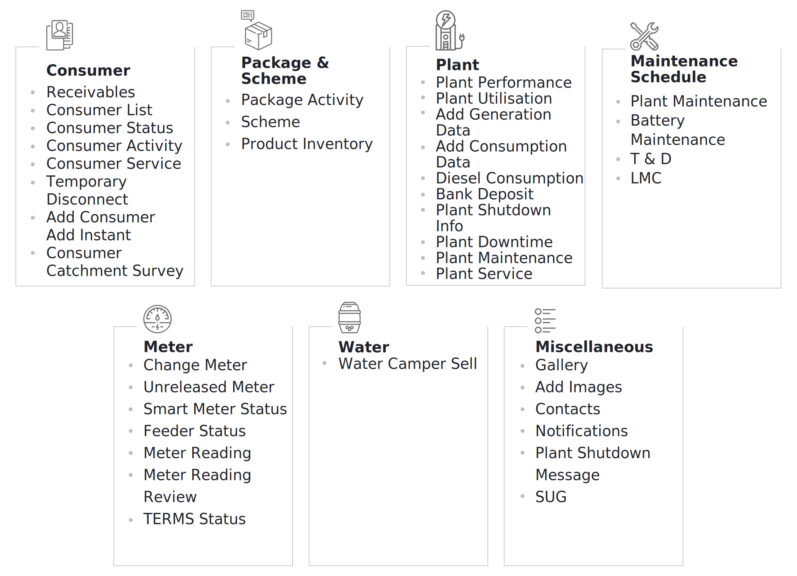
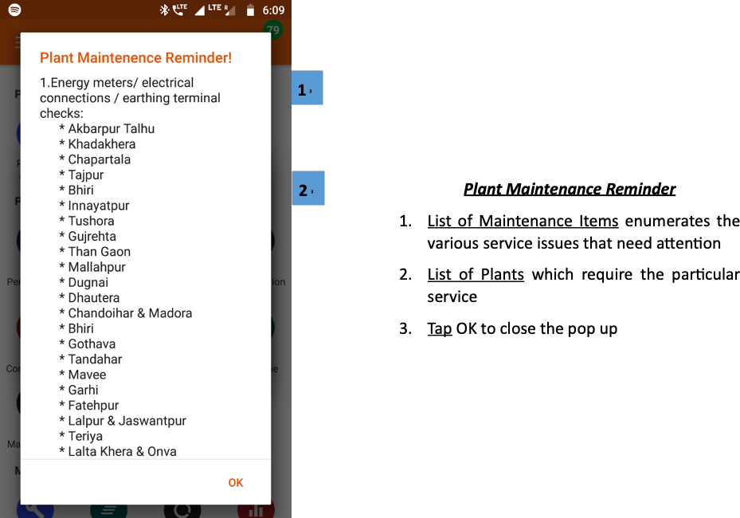
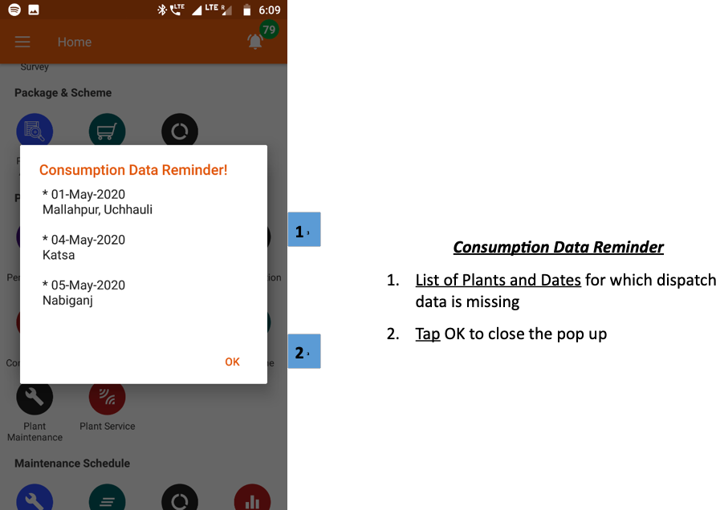
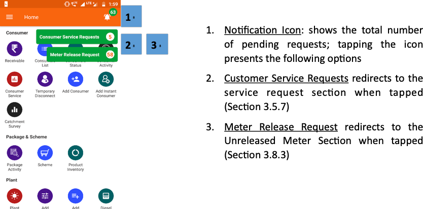

import useBaseUrl from '@docusaurus/useBaseUrl';

## 3.3.1. Overview
* The Home Screen is the first page the user views upon logging in.
* The various functionalities of the application are accessible via the circular module icons.
* These icons are organised under several headings for ease of navigation, see the figure

 
 

1.  **Notification Icon** (the bell-shaped icon) is explained in Section 3.3.3
2.  **Main Menu** (three horizontal lines) is explained in Section 3.4
3.  **Module Icons** to access various app functionalities; icons are categorised under headings Consumer, Package and Scheme, etc.

 

<!--   -->

##### FIGURE: FIELD AGENT APP SECTION HEADINGS.

## 3.3.2. Pop-up Notifications
**Functionality**
* Upon logging in, the user may see one or more automatic pop-ups.
* These pop-ups notify the user about outstanding tasks which require attention.
* The notifications may also alert the user of specific urgent issues like coronavirus precautions.

**Page Details** 

The main types of pop-up notifications are elaborated below.

| Plant Maintenance Reminder|Generation Error| Consumption Data Reminder| Generation Data Reminder|
|--|--|--|--|
|Concerns technical servicing issues across various plants| Alert users to anomalies in solar generation| Notifies a user on incomplete consumption data logging| Notifies a user on incomplete generation data logging|

 
 

  

**Plant Maintenance Reminder**

1.  **List of Maintenance** Items enumerates the various service issues that need attention
2.  **List of Plants** which require the particular service
3.  **Tap** OK to close the pop up

 

 

    

**Generation Error**

1.  **List of Plants** itemises the specific solar arrays / MPPTs which are underperforming at various mini-grid plants
2.  **Tap** OK to close the pop up

 

 

  

**Generation Data Reminder**

1.  **List of Plants and Dates** for which generation data is missing
2.  **Tap** OK to close the pop up

 

 

    

**Consumption Data Reminder**

1.  **List of Plants and Dates** for which dispatch data is missing
2.  **Tap** OK to close the pop up

 

<!-- 

 

 

 -->

## 3.3.3. Notifications Icon
**Functionality**
* Shows the number of active Customer Service Requests and Meter Release Requests.
* Tapping navigates to a detailed list of requests.
* This icon is present on most pages.

**Page Details**

 
 

    

1.  **Notification Icon**: shows the total number of pending requests; tapping the icon presents the following options
2.  **Customer Service Requests** redirects to the service request section when tapped (Section 3.5.7)
3.  **Meter Release Request** redirects to the Unreleased Meter Section when tapped (Section 3.8.3)

 

<!--  -->

