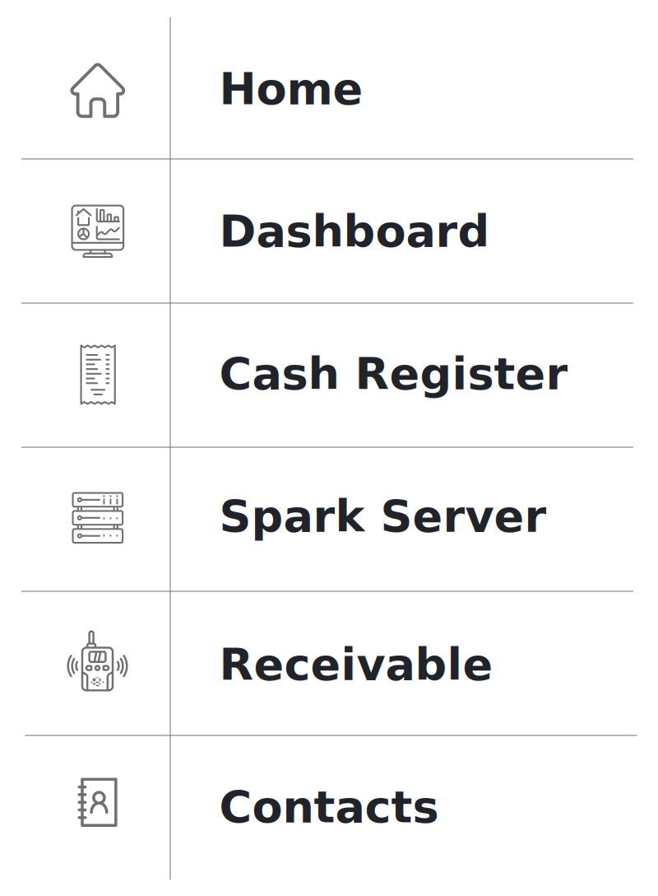
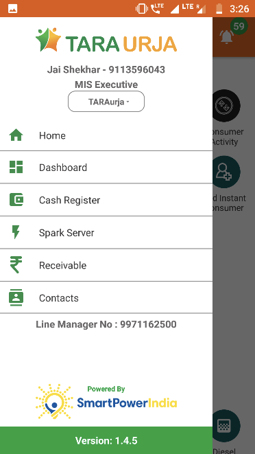

## Overview
* The Main Menu provides shortcuts to the key sections, shown below.

	##### FIGURE: MAIN MENU SHORTCUTS.
	
	  

	

* It can be accessed from any page in two ways:
	* Tapping the icon at the upper left of the screen, or
	* Swiping right from the left edge of the screen

		

## Home
Returns user to the Home Screen (Section 3.3).

## Dashboard
**Functionality**
* Provides at-a-glance collection and billing data from various sources of the company
* Updated in real time as payments are made and recorded

**Key Users**
<table>
  <tr>
    <th>Designation</th>
    <th>Main Purpose</th>
    <th>Example Use Case</th>
  </tr>
  <tr>
    <td>CSA</td>
    <td>Reviewing the plant-wide collections that need to made</td>
    <td>Assessing the percentage of billed revenue which is still outstanding</td>
  </tr>
  <tr>
    <td>Cluster In-charge</td>
    <td>Summary of billing and collections in a specified time interval</td>
    <td>Tracking amount collected for different services (energy, connection, water, etc.) in the cluster</td>
  </tr>
  <tr>
    <td>State In-charge</td>
    <td>View current billing and collection for the portfolio</td>
    <td>Tracking total revenue, and the expected cash-flow from collections at each plant in the State</td>
  </tr>
</table>

**Page Details**

### Total Billing
**Functionality**
* The Total Billing page summarises the revenue from each site

**Page Details**

### Total Collection
**Functionality**
* The Total Collection page summarises collections at each site

**Page Details**

## Cash Register
**Functionality**
* The Cash Register page provides a historical account of each customer’s transactions
* It is updated in real time as payments are made and recorded
* A pie chart summarises the aggregate collections

**Key Users**
<table>
  <tr>
    <th>Designation</th>
    <th>Main Purpose</th>
    <th>Example Use Case</th>
  </tr>
  <tr>
    <td>CSA</td>
    <td>Tracking customer bills and payments</td>
    <td>Resolving disagreements about whether or when a bill was paid via a particular method or not</td>
  </tr>
  <tr>
    <td>Cluster In-charge</td>
    <td>Summary of collections in a specified time interval</td>
    <td>Tracking amount collected for different services (energy, connection, water, etc.) for plants in the cluster</td>
  </tr>
  <tr>
    <td>State In-charge</td>
    <td>Summary of collections within the state</td>
    <td>Tracking amount collected for different services for the entire state</td>
  </tr>
</table>

**Page Details**

### Spark Server
**Functionality**
* Gives limited access to smart Spark meter data
* The user may remotely switch meters on and off from here

**Key Users**

<table>
  <tr>
    <th>Designation</th>
    <th>Main Purpose</th>
    <th>Example Use Case</th>
  </tr>
  <tr>
    <td>Technician</td>
    <td>Review the status of the meter associated with a particular customer at the plant</td>
    <td>Checking whether the meter has automatically tripped into the off state</td>
  </tr>
  <tr>
    <td>CSA</td>
    <td>Same as Technician</td>
    <td>Checking the status of a particular meter</td>
  </tr>
  <tr>
    <td>Cluster In-charge</td>
    <td>Control the state of the meter for a particular customer or group of customers</td>
    <td>Shutting off the meter of a customer whose faulty appliance is impacting the whole distribution network</td>
  </tr>
  <tr>
    <td>State In-charge</td>
    <td>Same as Cluster In-charge</td>
    <td>Shutting down multiple meters at one time in the state of a technical emergency</td>
  </tr>
</table>

**Page Details**

### Receivable
**Functionality**
* The receivables section displays the bills and balance for every customer at a given plant
* Agents may register payments from customers to update their balance
* For users with access to multiple plants, information will only be displayed once a particular plant is selected

**Key Users**
<table>
  <tr>
    <th>Designation</th>
    <th>Main Purpose</th>
    <th>Example Use Case</th>
  </tr>
  <tr>
    <td>Operator</td>
    <td>Validate whether a customer is active</td>
    <td>Checking the cause when a customer comes to the plant to complain of a connection issue</td>
  </tr>
  <tr>
    <td>CSA</td>
    <td>View the expected revenue and outstanding from each customer at the plant</td>
    <td>Prioritising which customers (or ex-customers) the sales team should approach for settling arrears</td>
  </tr>
  <tr>
    <td>Cluster In-charge</td>
    <td>Summary of collections in a given time interval</td>
    <td>Comparing different plants’ collection performance for the current month</td>
  </tr>
  <tr>
    <td>State In-charge</td>
    <td>View customers with high outstanding accounts</td>
    <td>Reviewing customer payment history when deciding whether to deactivate or reactivate an account</td>
  </tr>
</table>

**Navigation**
Note that this page is also accessible directly from the Home Screen – see Section 3.4.2

**Page Details**

### Aging Receivables
**Functionality**
* The Aging Receivables section displays separate lists of active and banned customers of a particular plant that are yet to pay their dues to the company.
* There are two lists – Active and Banned

The following are the pages that can be viewed through this functionality:

| Active | Banned |
|--|--|
|Detailed list of Active consumer statistics for every plant| Detailed list of Banned consumers for every plant|

## Contacts
**Functionality**
* The contacts page is a list of all company personnel, along with details such as their designation and mobile number
* The operators have been divided based on the company and the state they are working in

**Key Users**

<table>
  <tr>
    <th>Designation</th>
    <th>Main Purpose</th>
    <th>Example Use Case</th>
  </tr>
  <tr>
    <td>All Employees</td>
    <td>Access to individual employees contact</td>
    <td>To verify a decision made by another agent working at the company</td>
  </tr>
</table>

