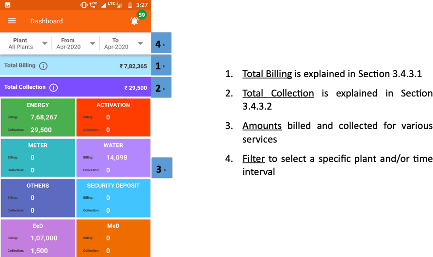
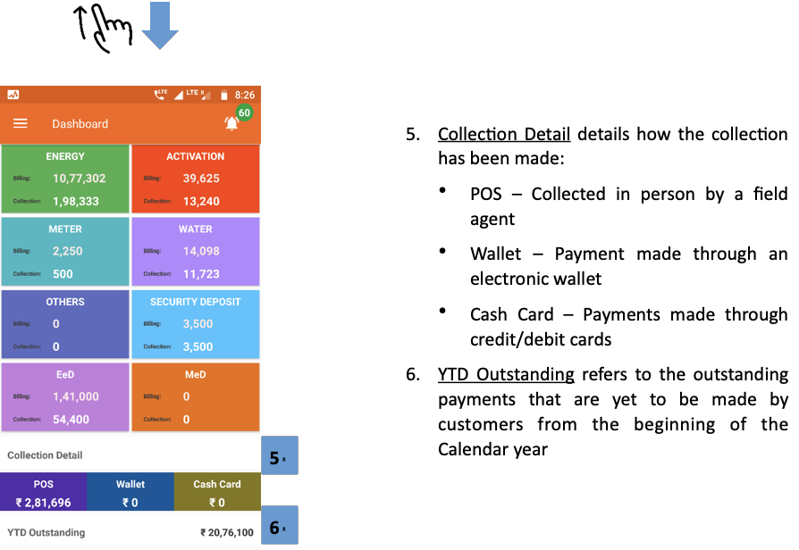
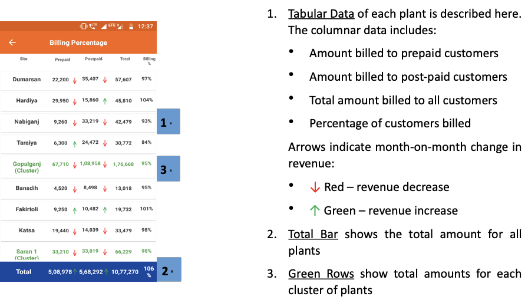
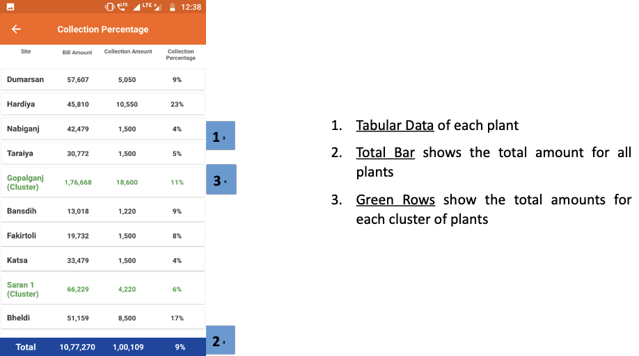
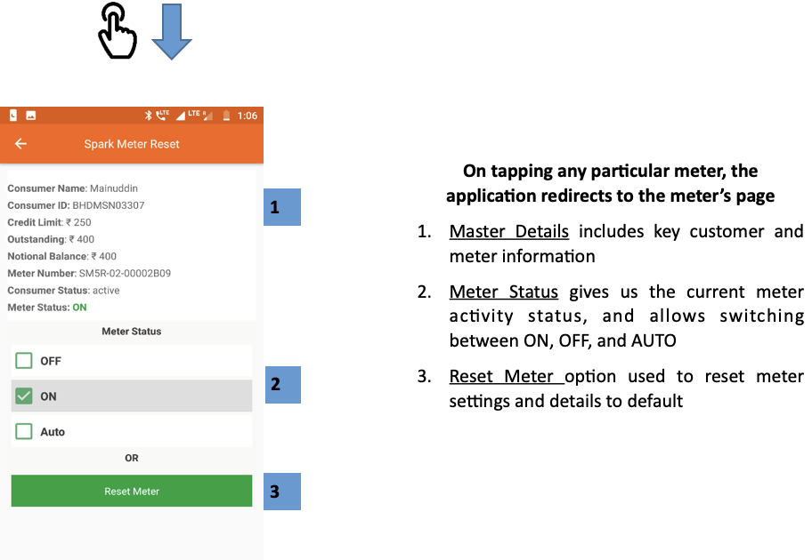
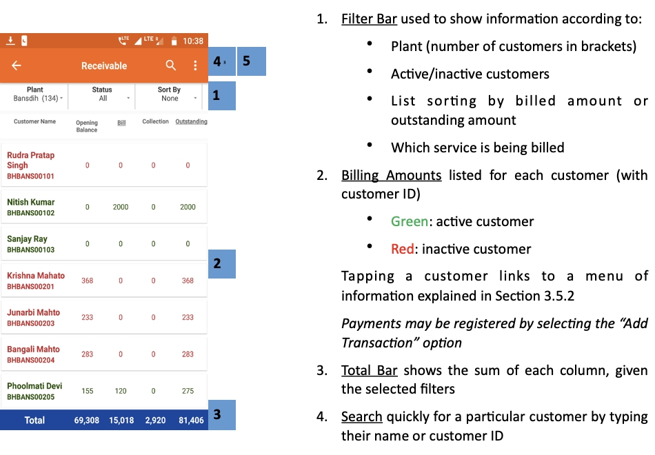
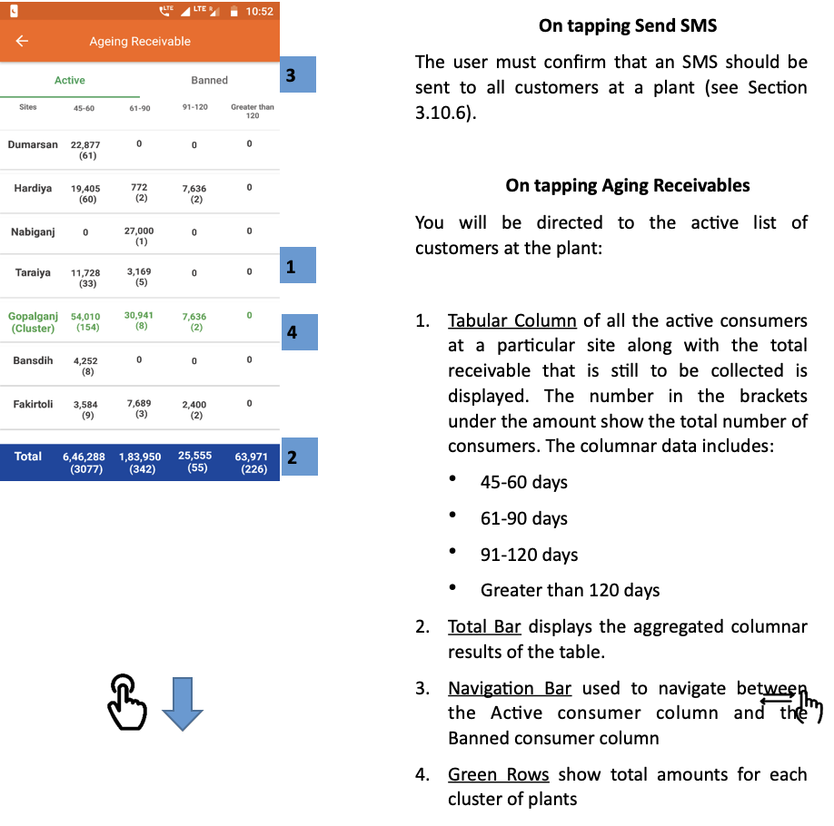
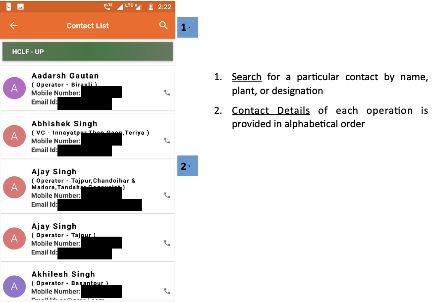

import useBaseUrl from '@docusaurus/useBaseUrl';
export const Highlight = ({children, color}) => (
  
    {children}
  
);

## 3.4.1. Overview
* The Main Menu provides shortcuts to the key sections, shown below.

##### FIGURE: MAIN MENU SHORTCUTS.
 

 

* It can be accessed from any page in two ways:
	* Tapping the icon at the upper left of the screen, or
	* Swiping right from the left edge of the screen

		

## 3.4.2. Home
Returns user to the Home Screen (Section 3.3).

## 3.4.3. Dashboard
**Functionality**
* Provides at-a-glance collection and billing data from various sources of the company
* Updated in real time as payments are made and recorded

**Key Users**
<table>
  <tr>
    <th>Designation</th>
    <th>Main Purpose</th>
    <th>Example Use Case</th>
  </tr>
  <tr>
    <td>CSA</td>
    <td>Reviewing the plant-wide collections that need to made</td>
    <td>Assessing the percentage of billed revenue which is still outstanding</td>
  </tr>
  <tr>
    <td>Cluster In-charge</td>
    <td>Summary of billing and collections in a specified time interval</td>
    <td>Tracking amount collected for different services (energy, connection, water, etc.) in the cluster</td>
  </tr>
  <tr>
    <td>State In-charge</td>
    <td>View current billing and collection for the portfolio</td>
    <td>Tracking total revenue, and the expected cash-flow from collections at each plant in the State</td>
  </tr>
</table>

**Page Details**

 

1. **Total Billing** is explained in Section 3.4.3.1
2. **Total Collection** is explained in Section 3.4.3.2
3. **Amounts** billed and collected for various services
4. **Filter** to select a specific plant and/or time interval

 

 

5.  **Collection Detail** details how the collection has been made:
    * POS — Collected in person by a field agent
    * Wallet — Payment made through an electronic wallet
    * Cash Card — Payments made through credit/debit cards
6.  **YTD Outstanding** refers to the outstanding payments that are yet to be made by customers from the beginning of the Calendar year

 

<!-- 

 -->

### 3.4.3.1. Total Billing
**Functionality**
* The Total Billing page summarises the revenue from each site

**Page Details**

 

1.  **Tabular Data** of each plant is described here. The columnar data includes:
    * Amount billed to prepaid customers
    * Amount billed to post-paid customers
    * Total amount billed to all customers
    * Percentage of customers billed

Arrows indicate month-on-month change in revenue:
* <Highlight color="#FF0000"> ↓ </Highlight> Red -- revenue decrease
* <Highlight color="#008000"> ↑ </Highlight> Green -- revenue increase
2.  **Total Bar** shows the total amount for all plants
3.  **Green Rows** show total amounts for each cluster of plants

 

<!--  -->

### 3.4.3.2. Total Collection
**Functionality**
* The Total Collection page summarises collections at each site

**Page Details**

 

1.  **Tabular Data** of each plant
2.  **Total Bar** shows the total amount for all plants
3.  **Green Rows** show the total amounts for each cluster of plants

 

<!--  -->

## 3.4.4. Cash Register
**Functionality**
* The Cash Register page provides a historical account of each customer’s transactions
* It is updated in real time as payments are made and recorded
* A pie chart summarises the aggregate collections

**Key Users**
<table>
  <tr>
    <th>Designation</th>
    <th>Main Purpose</th>
    <th>Example Use Case</th>
  </tr>
  <tr>
    <td>CSA</td>
    <td>Tracking customer bills and payments</td>
    <td>Resolving disagreements about whether or when a bill was paid via a particular method or not</td>
  </tr>
  <tr>
    <td>Cluster In-charge</td>
    <td>Summary of collections in a specified time interval</td>
    <td>Tracking amount collected for different services (energy, connection, water, etc.) for plants in the cluster</td>
  </tr>
  <tr>
    <td>State In-charge</td>
    <td>Summary of collections within the state</td>
    <td>Tracking amount collected for different services for the entire state</td>
  </tr>
</table>

**Page Details**

 

1.  **Filter Bar** for selecting a plant and time interval
2.  **Pie Chart** splits the total collection into contributions from different services
3.  **Numerical Data** of amount collected for each service
4.  **Search Bar** for quickly locating a particular customer: user can type the name or the unique customer ID
5.  **Transaction Details** presents a list of all payments collected from customers in the selected time-frame, with most recent first
6.  **Tap** any entry to view customer's account page (Section 3.5.2)

 

<!--  -->

## 3.4.5. Spark Server
**Functionality**
* Gives limited access to smart Spark meter data
* The user may remotely switch meters on and off from here

**Key Users**

<table>
  <tr>
    <th>Designation</th>
    <th>Main Purpose</th>
    <th>Example Use Case</th>
  </tr>
  <tr>
    <td>Technician</td>
    <td>Review the status of the meter associated with a particular customer at the plant</td>
    <td>Checking whether the meter has automatically tripped into the off state</td>
  </tr>
  <tr>
    <td>CSA</td>
    <td>Same as Technician</td>
    <td>Checking the status of a particular meter</td>
  </tr>
  <tr>
    <td>Cluster In-charge</td>
    <td>Control the state of the meter for a particular customer or group of customers</td>
    <td>Shutting off the meter of a customer whose faulty appliance is impacting the whole distribution network</td>
  </tr>
  <tr>
    <td>State In-charge</td>
    <td>Same as Cluster In-charge</td>
    <td>Shutting down multiple meters at one time in the state of a technical emergency</td>
  </tr>
</table>

**Page Details**

 

1.  **Meter List**, with one row per meter, shows the associated customer and meter state:
    - <Highlight color="#FF0000"> * </Highlight>Red - Inactive
    - <Highlight color="#008000"> * </Highlight> Green - Active
    - <Highlight color="#0000FF"> * </Highlight> Blue - Auto
2.  **Search Bar**: find a specific entry by typing the customer name, ID, or meter number.
3.  **Plant Dropdown** used to select a particular plant

 
 

**On tapping any particular meter, the application redirects to the meter’s page**

1.  **Master Details** includes key customer and meter information
2.  **Meter Status** gives us the current meter activity status, and allows switching between ON, OFF, and AUTO
3.  **Reset Meter** option used to reset meter settings and details to default

 

<!-- 

 -->

## 3.4.6. Receivable
**Functionality**
* The receivables section displays the bills and balance for every customer at a given plant
* Agents may register payments from customers to update their balance
* For users with access to multiple plants, information will only be displayed once a particular plant is selected

**Key Users**
<table>
  <tr>
    <th>Designation</th>
    <th>Main Purpose</th>
    <th>Example Use Case</th>
  </tr>
  <tr>
    <td>Operator</td>
    <td>Validate whether a customer is active</td>
    <td>Checking the cause when a customer comes to the plant to complain of a connection issue</td>
  </tr>
  <tr>
    <td>CSA</td>
    <td>View the expected revenue and outstanding from each customer at the plant</td>
    <td>Prioritising which customers (or ex-customers) the sales team should approach for settling arrears</td>
  </tr>
  <tr>
    <td>Cluster In-charge</td>
    <td>Summary of collections in a given time interval</td>
    <td>Comparing different plants’ collection performance for the current month</td>
  </tr>
  <tr>
    <td>State In-charge</td>
    <td>View customers with high outstanding accounts</td>
    <td>Reviewing customer payment history when deciding whether to deactivate or reactivate an account</td>
  </tr>
</table>

**Navigation**
Note that this page is also accessible directly from the Home Screen – see Section 3.4.2

**Page Details**

 

1. **Filter Bar** used to show information according to:
    - Plant (number of customers in brackets)
    - Active/inactive customers
    - List sorting by billed amount or outstanding amount
    - Which service is being billed
2. **Billing Amounts** listed for each customer (with customer ID)
    - <Highlight color="#008000">Green</Highlight>: active customer
    - <Highlight color="#FF0000">Red</Highlight>: inactive customer

Tapping a customer links to a menu of information explained in Section 3.5.2
Payments may be registered by selecting the “Add Transaction” option

3. **Total Bar** shows the sum of each column, given the selected filters
4. **Search** quickly for a particular customer by typing their name or customer ID
5. **Dotted Icon** tapped to show the following options
    - Send SMS

 

<!--  -->

### 3.4.6.1. Aging Receivables
**Functionality**
* The Aging Receivables section displays separate lists of active and banned customers of a particular plant that are yet to pay their dues to the company.
* There are two lists – Active and Banned

The following are the pages that can be viewed through this functionality:

| Active | Banned |
|--|--|
|Detailed list of Active consumer statistics for every plant| Detailed list of Banned consumers for every plant|

 

**On tapping Send SMS**

The user must confirm that an SMS should be sent to all customers at a plant (see Section 3.10.6).

**On tapping Aging Receivables**

You will be directed to the active list of customers at the plant:

1. **Tabular Column** of all the active consumers at a particular site along with the total receivable that is still to be collected is displayed. The number in the brackets under the amount show the total number of consumers. The columnar data includes:
    * 45-60 days
    * 61-90 days
    * 91-120 days
    * Greater than 120 days
2. **Total Bar** displays the aggregated columnar results of the table.
3. **Navigation Bar** used to navigate between the Active consumer column and the Banned consumer column
4. **Green Rows** show total amounts for each cluster of plants

**The next screenshot displays the result on tapping ‘Banned’**

 

 

1. **Tabular Column** of all the banned or inactive consumers at a particular site along with the total receivable that is still to be collected is displayed. The number in the brackets under the amount show the total number of consumers. The columnar data includes (Section XX):
    * Less than 30 Days
    * 30-60 Days
    * 60-90 Days
    * Greater than 90 Days
2. **Total Bar** displays the aggregated columnar results of the table.
3. **Navigation Bar** used to navigate between the Active consumer column and the Banned consumer column

 

<!-- 

 -->

## 3.4.7. Contacts
**Functionality**
* The contacts page is a list of all company personnel, along with details such as their designation and mobile number
* The operators have been divided based on the company and the state they are working in

**Key Users**

<table>
  <tr>
    <th>Designation</th>
    <th>Main Purpose</th>
    <th>Example Use Case</th>
  </tr>
  <tr>
    <td>All Employees</td>
    <td>Access to individual employees contact</td>
    <td>To verify a decision made by another agent working at the company</td>
  </tr>
</table>

 
 

1.  **Search** for a particular contact by name, plant, or designation
2.  **Contact Details** of each operation is provided in alphabetical order

 

<!--  -->