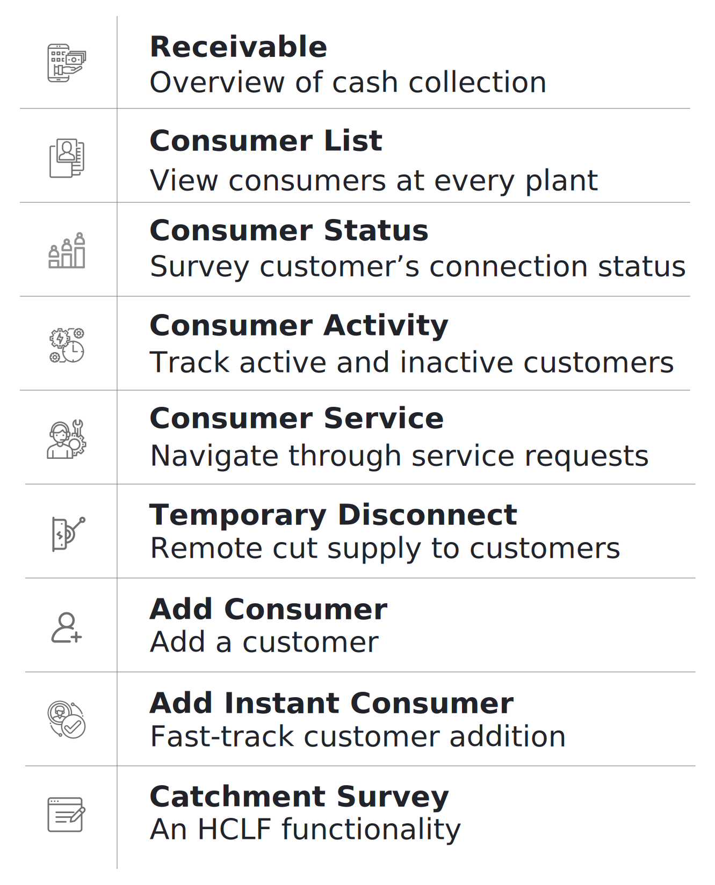

## 3.5.1. Overview

 
 

 
## 3.5.2. Account Details
**Functionality**
* The Account Detail page contains complete information on a customer’s profile, their package, and payment history.

**Key Users**
<table>
  <tr>
    <th>Designation</th>
    <th>Main Purpose</th>
    <th>Example Use Case</th>
  </tr>
  <tr>
    <td>Operator</td>
    <td>Validating the activeness of a customer</td>
    <td>Prioritising which customers (or ex-customers) the sales team should approach for settling arrears</td>
  </tr>
  <tr>
    <td>Technician</td>
    <td>Reviewing meter reading data for a specific consumer</td>
    <td>Reviewing the meter reading data to check for overload on electrical apparatus</td>
  </tr>
  <tr>
    <td>CSA</td>
    <td>View the expected revenue and outstanding from each customer at the plant</td>
    <td>Prioritising which customers (or ex-customers) the sales team should approach for settling arrears</td>
  </tr>
  <tr>
    <td>Cluster In-charge</td>
    <td>Summary of collections in a specified time interval</td>
    <td>Comparing different plants’ collection performance for the current month</td>
  </tr>
  <tr>
    <td>State In-charge</td>
    <td>View customers with high outstanding accounts</td>
    <td>Confirming a customer’s balance when collecting payment, and resolving confusion about when past bills were paid.</td>
  </tr>
</table>

* Information is organised into several tabs, detailed below.

	> **A Note on Navigating to this Page**
	> 
	> This page is central to on-ground operations, and is frequently used by sales agents in managing the relationship with individual customers. 
	> However, there is no icon for this module on the Home Screen. Instead, field agents will be able to reach this page from:
	> * The cash register of a particular plant (Section 3.4.4)
	> * The customer list (Section 3.5.4)
	> * The customer status list (Section 3.5.5)

**Page Details**

The Account Detail page is organised into several tabs, which summarise particular information about a given customer:

| Profile| Transaction| Cash Ledger| Security and Deposite Ledger| Meter Reading| Service|
|---|---|---|---|---|---|
| detailed account information| chronological list of individual payments| running record of bills, payments, and balance| running record of security charges and payments| energy consumption data from meter reading| service request history and completion information|

Switching between tabs can be done either using the top navigation bar, or simply swiping the screen horizontally.

Each of these tabs will be discussed in the following sections.

### 3.5.2.1. Profile tab
**Functionality**
* The Profile tab shows detailed information about the selected customer and their account
* Some information can be updated/edited by the user1

**Page Details**

### 3.5.2.2. Transaction tab
**Functionality**
* The Transaction page provides a historical account of each customer’s payments
* Updated in real time as payments are made and recorded

**Page Details**

### 3.5.2.3. Cash Ledger tab
**Functionality**
* Provides a running record of historical bills, payments, and outstanding dues for the selected customer.

**Page Details**

### 3.5.2.4. Security Deposit Ledger tab
**Functionality**
* Provides a record of security deposits for the selected customer.

**Page Details**

### 3.5.2.5. Meter Reading Ledger tab
**Functionality**
* A chronological list of the customer’s energy meter readings.
* Only applies to metered customers.

**Page Details**

### 3.5.2.6. Service tab
**Functionality**
* Provides a record of the service requests made by the customer, and the response by the field team.

**Page Details**

## 3.5.3. Receivable
**Functionality**
* The receivables section displays customer balances and allows agents to register payments.

**Navigation**

This page is also accessible from the Main Menu. More details can be found in Section 3.4.6.

## 3.5.4. Consumer List
**Functionality**
* The Consumer List displays the current number of active and inactive customers at each plant.
* After selecting a particular plant, the user is shown the list of customers, along with records of unpaid bills.

**Key Users**
<table>
  <tr>
    <th>Designation</th>
    <th>Main Purpose</th>
    <th>Example Use Case</th>
  </tr>
  <tr>
    <td>Technician</td>
    <td>Access to the list of active members on the plant</td>
    <td>To check the consumer ID of a particular consumer</td>
  </tr>
  <tr>
    <td>CSA</td>
    <td>Same as Technician</td>
    <td>To check the number of active customer</td>
  </tr>
  <tr>
    <td>Cluster In-charge</td>
    <td>Summary of total number of customers in the cluster</td>
    <td>To create a report on the customers served at a cluster in a given time frame</td>
  </tr>
  <tr>
    <td>State In-charge</td>
    <td>Summary of the total number of customers in the state</td>
    <td>To create a report on the customers served in a state in a given time frame</td>
  </tr>
</table>

**Page Details**

## 3.5.5. Consumer Status
**Functionality**
* The Consumer Status section tracks progress towards connecting customers to the distribution network.
* Division of installation status is made into 4 parts namely – At Pole, House wire, Service Wire and Review
* The section also displays the number of denied package requests per plant 
* This functionality is only available for HCLF users

**Key Users**
<table>
  <tr>
    <th>Designation</th>
    <th>Main Purpose</th>
    <th>Example Use Case</th>
  </tr>
  <tr>
    <td>CSA</td>
    <td>Assessing the installation status of the meters for all the customers</td>
    <td>Reporting the number of pending meter reading reviews at the end of the month</td>
  </tr>
  <tr>
    <td>Cluster In-charge</td>
    <td>Same as CSA</td>
    <td>Reviewing the status of hardware installation for customers within the cluster</td>
  </tr>
  <tr>
    <td>State In-charge</td>
    <td>Same as CSA</td>
    <td>Launching an audit drive at a plant to improve customer service quality</td>
  </tr>
</table>

**Page Details**

## 3.5.6. Consumer Activity
**Functionality**
* Provides an interface for deactivating and reactivating customer electricity connections.
* Changes undergo a chain of approval before they are accepted.
* Activity changes are summarised for each plant. 

**Key Users**
<table>
  <tr>
    <th>Designation</th>
    <th>Main Purpose</th>
    <th>Example Use Case</th>
  </tr>
  <tr>
    <td>Technician</td>
    <td>To execute requested changes to customer status</td>
    <td>Reviewing which customers need to be de-/re-activated, and making the necessary changes to their connection</td>
  </tr>
  <tr>
    <td>CSA</td>
    <td>Same as Technician</td>
    <td>Same as Technician</td>
  </tr>
  <tr>
    <td>Cluster In-charge</td>
    <td>To register a change to customer status and assign to field personnel</td>
    <td>Using the app to check with a field agent whether they are available for executing the change</td>
  </tr>
  <tr>
    <td>State In-charge</td>
    <td>Approve customer status requests at plants in the state</td>
    <td>Checking how many status change requests are pending and at which plants</td>
  </tr>
</table>

**Page Details**
The Consumer Activity page is organised into several tabs, which follow the process of the account status change.

| Request| In Process| Review| Completed|
|---|---|---|---|
|Register a customer for de-/re-activation|List of customers whose connection requires attention|Confirming the action has been completed| Historical list of all customer de-/re-activation details|

### 3.5.6.1. Request tab

### 3.5.6.2. In Process tab

### 3.5.6.2. Review tab

### 3.5.6.4. Completed tab

## 3.5.7. Consumer Service
**Functionality**
* View existing customer service requests—both technical and non-technical--at different stages of completion
* Add new service requests
* Assign outstanding requests to field personnel for follow-up
* Close requests which have been resolved

**Key Users**
<table>
  <tr>
    <th>Designation</th>
    <th>Main Purpose</th>
    <th>Example Use Case</th>
  </tr>
  <tr>
    <td>Technician</td>
    <td>To review service requests assigned to them</td>
    <td>Prioritising pending requests, depending on when they were registered and the nature of the work</td>
  </tr>
  <tr>
    <td>CSA</td>
    <td>Same as Technician</td>
    <td>Phoning customers to understand what issue is being faced, and marking a request as complete when it has been resolved</td>
  </tr>
  <tr>
    <td>Cluster In-charge</td>
    <td>To view all requests from customers in the cluster</td>
    <td>Reviewing pending requests and assigning them to personnel for follow-up</td>
  </tr>
  <tr>
    <td>State In-charge</td>
    <td>To gain an overview of service request statistics in the state</td>
    <td>Tracking targets on personnel response time and customer satisfaction</td>
  </tr>
</table>

**Page Details**

| Report| Request| Completed|
|---|---|---|
|Overview statistics on completed and pending service requests| Detailed list of pending requests and personnel assignments| Record of all completed requests|

### 3.5.7.1. Report tab

### 3.5.7.2. Request tab

### 3.5.7.3. Completed tab

## 3.5.8. Temporary Disconnect
**Functionality**
* Allows a user to remotely disconnect the supply of particular customers
* This functionality is only available for TaraUrja users

**Key Users**
<table>
  <tr>
    <th>Designation</th>
    <th>Main Purpose</th>
    <th>Example Use Case</th>
  </tr>
  <tr>
    <td>Technician</td>
    <td>Disconnecting specific customers at a plant</td>
    <td>Disconnecting high-load customers when a demand surge causes the plant to trip, until system stability is restored</td>
  </tr>
  <tr>
    <td>Cluster In-charge</td>
    <td>Disconnecting all customers at a plant</td>
    <td>Disconnecting all customers for safety during network maintenance</td>
  </tr>
</table>

**Page Details**

## 3.5.9. Add Consumer
**Functionality**
* Create a new customer account in the MCOMS system

**Key Users**
<table>
  <tr>
    <th>Designation</th>
    <th>Main Purpose</th>
    <th>Example Use Case</th>
  </tr>
  <tr>
    <td>Technician</td>
    <td>To add a consumer into the company database</td>
    <td>Manual addition of a customer who cannot request an account through the customer smartphone app</td>
  </tr>
  <tr>
    <td>CSA</td>
    <td>Same as Technician</td>
    <td>Same as Technician</td>
  </tr>
  <tr>
    <td>Cluster In-charge</td>
    <td>Same as Technician</td>
    <td>Same as Technician</td>
  </tr>
  <tr>
    <td>State In-charge</td>
    <td>Same as Technician</td>
    <td>Same as Technician</td>
  </tr>
</table>

**Page Details**

## 3.5.10. Add Instant Consumer
**Functionality**
* Quickly create a new customer account in the MCOMS system, with only critical information recorded
* This functionality is only available for TaraUrja users

**Key Users**
<table>
  <tr>
    <th>Designation</th>
    <th>Main Purpose</th>
    <th>Example Use Case</th>
  </tr>
  <tr>
    <td>CSA</td>
    <td>To quickly add a new customer into the company database</td>
    <td>During a recruitment drive in a public place, many prospective customers may need registration in a short period of time</td>
  </tr>
  <tr>
    <td>Cluster In-charge</td>
    <td>Same as CSA</td>
    <td>Same as CSA</td>
  </tr>
  <tr>
    <td>State In-charge</td>
    <td>Same as CSA</td>
    <td>Same as CSA</td>
  </tr>
</table>

**Page Details**

## 3.5.11. Catchment Survey
**Functionality**
* The Catchment Survey Section showcases an overview of all the customers and potential customers present at a plant
* The ‘catchment’ created intends to assist in reviewing customer behaviour over a period of time
* It also gives a detailed list on the penetration made into the potential customer base

**Key Users**
<table>
  <tr>
    <th>Designation</th>
    <th>Main Purpose</th>
    <th>Example Use Case</th>
  </tr>
  <tr>
    <td>Operator</td>
    <td>To record survey responses of energy consumers</td>
    <td>Interviewing a local who comes to the plant to enquire about getting a connection</td>
  </tr>
  <tr>
    <td>Technician</td>
    <td>Same as Operator</td>
    <td>Updating an existing customer’s profile and contact information</td>
  </tr>
  <tr>
    <td>CSA</td>
    <td>Same as Operator</td>
    <td>Interviewing locals in the catchment area to understand energy needs and use patterns</td>
  </tr>
  <tr>
    <td>Cluster In-charge</td>
    <td>Same as Operator</td>
    <td>Reviewing the number of active, inactive, and prospective customers in the cluster</td>
  </tr>
</table>

**Page Details**

## 3.5.12. Theft Complaint
**Functionality**
* Used to register possible pilferage from the mini-grid, for follow-up investigation
* This functionality is only available for HCLF users

**Key Users**
<table>
  <tr>
    <th>Designation</th>
    <th>Main Purpose</th>
    <th>Example Use Case</th>
  </tr>
  <tr>
    <td>Operator</td>
    <td>To register a possible theft for follow-up</td>
    <td>Registering a complaint from a customer who visits the plant</td>
  </tr>
  <tr>
    <td>Technician</td>
    <td>To view pending theft complaints</td>
    <td>Checking the distribution network cables as directed by the Cluster In-charge</td>
  </tr>
  <tr>
    <td>CSA</td>
    <td>Same as Operator</td>
    <td>Registering a complained after noticing new unsanctioned cables</td>
  </tr>
  <tr>
    <td>Cluster In-charge</td>
    <td>To review logged theft complaints and assign them to field agents for investigation</td>
    <td>Reviewing the total number of theft complaints within a given time frame</td>
  </tr>
</table>

**Page Details**
| Pending| In Process| Completed|
|---|---|---|
| The theft reports that are reported| Theft reports that are currently being investigated| Theft reports that have been appropriately dealt with|

### 3.5.12.1. Pending tab

### 3.5.12.2. In Process tab

### 3.5.12.3. Completed tab

## 3.5.13. Coupon Discount
**Functionality**
* Allows plant personnel to generate coupons for customers
* Tracks the number of redeemed coupons

**Key Users**
<table>
  <tr>
    <th>Designation</th>
    <th>Main Purpose</th>
    <th>Example Use Case</th>
  </tr>
  <tr>
    <td>Operator</td>
    <td>To generate coupon codes on behalf of customers</td>
    <td>Assisting a customer who doesn’t have a smartphone to avail a company promotion</td>
  </tr>
  <tr>
    <td>Technician</td>
    <td>Same as Operator</td>
    <td>Same as Operator</td>
  </tr>
  <tr>
    <td>CSA</td>
    <td>Same as Operator</td>
    <td>Same as Operator</td>
  </tr>
  <tr>
    <td>Cluster In-charge</td>
    <td>To track the customers whose coupons are going to expire</td>
    <td>Following up with customers who have generated coupons but not redeemed them</td>
  </tr>
  <tr>
    <td>State In-charge</td>
    <td>To monitor the results of coupon schemes at different plants</td>
    <td>Calculating the proportion of eligible customers who participated in the initiative</td>
  </tr>
</table>

**Page Details**

