import useBaseUrl from '@docusaurus/useBaseUrl';
export const Highlight = ({children, color}) => (
  
    {children}
  
);

export const Tabheader = ({children, color}) => (
  <th
    style={{
      backgroundColor: color,
      borderRight: '0.5rem solid white',
      height: '1.5rem',
      width: '2rem',
    }}>
    {children}
  </th>
);

export const Tabcell = ({children, color}) => (
  <td
    style={{
      backgroundColor: color,
      borderRight: '0.5rem solid white',
      height: '100px',
    }}>
    {children}
  </td>
);

export const Clear = ({children}) => (
  

    {children}
  

);

## 3.5.1. Overview

 

 
 

## 3.5.2. Account Details
**Functionality**
* The Account Detail page contains complete information on a customer’s profile, their package, and payment history.

**Key Users**
<table>
  <tr>
    <th>Designation</th>
    <th>Main Purpose</th>
    <th>Example Use Case</th>
  </tr>
  <tr>
    <td>Operator</td>
    <td>Validating the activeness of a customer</td>
    <td>Prioritising which customers (or ex-customers) the sales team should approach for settling arrears</td>
  </tr>
  <tr>
    <td>Technician</td>
    <td>Reviewing meter reading data for a specific consumer</td>
    <td>Reviewing the meter reading data to check for overload on electrical apparatus</td>
  </tr>
  <tr>
    <td>CSA</td>
    <td>View the expected revenue and outstanding from each customer at the plant</td>
    <td>Prioritising which customers (or ex-customers) the sales team should approach for settling arrears</td>
  </tr>
  <tr>
    <td>Cluster In-charge</td>
    <td>Summary of collections in a specified time interval</td>
    <td>Comparing different plants’ collection performance for the current month</td>
  </tr>
  <tr>
    <td>State In-charge</td>
    <td>View customers with high outstanding accounts</td>
    <td>Confirming a customer’s balance when collecting payment, and resolving confusion about when past bills were paid.</td>
  </tr>
</table>

* Information is organised into several tabs, detailed below.

	> **A Note on Navigating to this Page**
	> 
	> This page is central to on-ground operations, and is frequently used by sales agents in managing the relationship with individual customers. 
	> However, there is no icon for this module on the Home Screen. Instead, field agents will be able to reach this page from:
	> * The cash register of a particular plant (Section 3.4.4)
	> * The customer list (Section 3.5.4)
	> * The customer status list (Section 3.5.5)

**Page Details**

The Account Detail page is organised into several tabs, which summarise particular information about a given customer:

<table>
    <tr>
        <Tabheader color="#A9CCE3 ">Profile</Tabheader>
        <Tabheader color="#A9CCE3">Transaction</Tabheader>
        <Tabheader color="#A9CCE3">Cash Ledger</Tabheader>
        <Tabheader color="#A9CCE3">Security and Deposit Ledger</Tabheader>
        <Tabheader color="#A9CCE3">Meter Reading</Tabheader>
        <Tabheader color="#A9CCE3">Service</Tabheader>
    </tr>
    <tr>
        <Tabcell color="#AED6F1">detailed account information</Tabcell>
        <Tabcell color="#AED6F1">chronological list of individual payments</Tabcell>
        <Tabcell color="#AED6F1">running record of bills, payments, and balance</Tabcell>
        <Tabcell color="#AED6F1">running record of security charges and payments</Tabcell>
        <Tabcell color="#AED6F1">energy consumption data from meter reading</Tabcell>
        <Tabcell color="#AED6F1">service request history and completion information</Tabcell>
    </tr>
</table>

Switching between tabs can be done either using the top navigation bar, or simply swiping the screen horizontally.

Each of these tabs will be discussed in the following sections.

### 3.5.2.1. Profile tab
**Functionality**
* The Profile tab shows detailed information about the selected customer and their account
* Some information can be updated/edited by the user1

**Page Details**

 

<Clear>

1.  <u>Navigation Bar</u> indicates the current tab and allows switching between tabs

    
 
2.  <u>Pencil Icon</u> for editing selected details
3.  <u>Master Information</u> gives basic information about the customer background and relationship with the company
4.  <u>Print Profile Detail</u> tapping will send the page to a connected printer
5.  <u>Mobile</u> shows the registered mobile number; tapping the phone icon starts a call
6.  <u>Outstanding</u> details, the aggregate payment due for all services
7.  <u>Package</u> details the customer’s electricity package, including fees, load limit, and unit rates
8.  <u>Schemes</u> contains information on any promotions in which the customer is participating, including EMI arrangements

</Clear>
 

<!-- 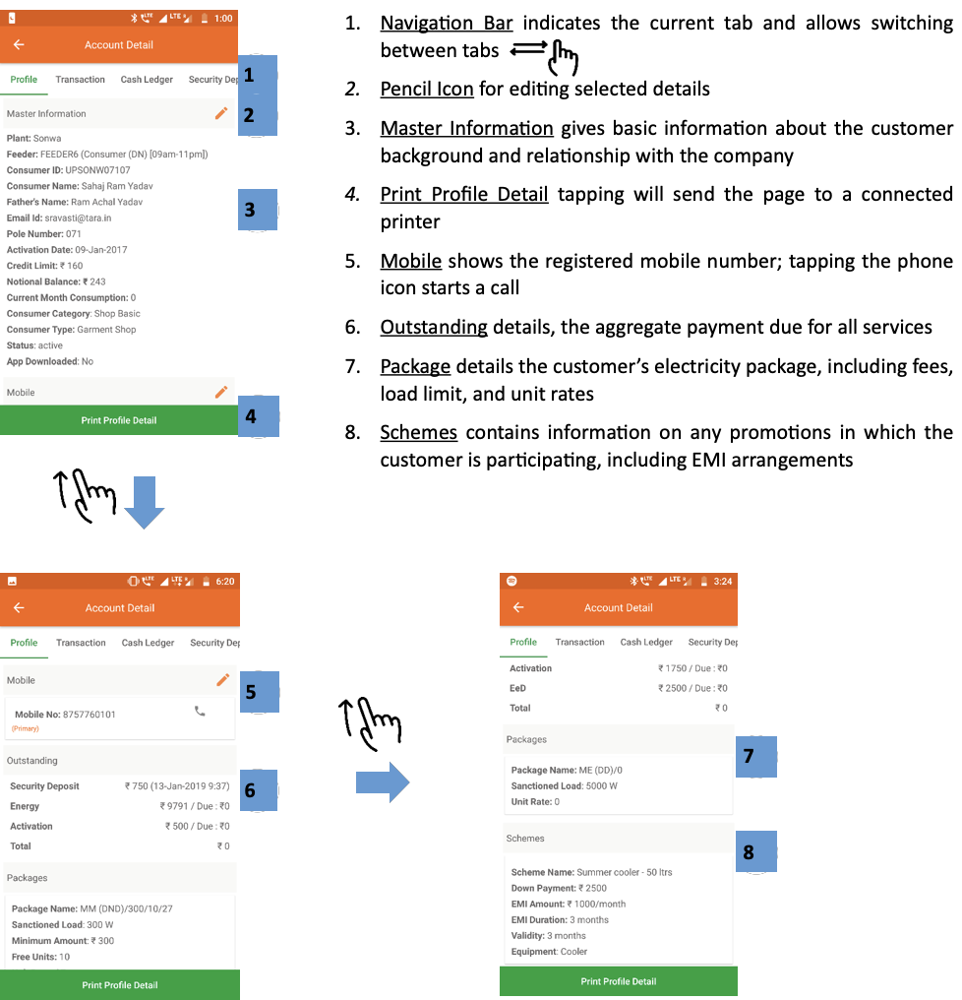 -->
Edits must be confirmed via an OTP from the customer.

### 3.5.2.2. Transaction tab
**Functionality**
* The Transaction page provides a historical account of each customer’s payments
* Updated in real time as payments are made and recorded

**Page Details**

 

<Clear>

1.  <u>Print Icon</u> to print a receipt, or, if not printer is connected, take a shareable screenshot
2.  <u>List of Payments</u> in chronological order, along with other relevant data
3.  <u>Navigation Bar</u> used swipe right across different panels of the account details

    

</Clear>
 

<!-- 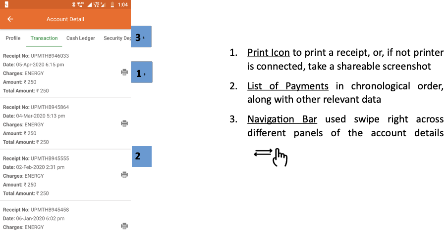 -->

### 3.5.2.3. Cash Ledger tab
**Functionality**
* Provides a running record of historical bills, payments, and outstanding dues for the selected customer.

**Page Details**

 

<Clear>

1.  <u>List of Transactions</u> including bills and payments/credits, along with the cumulative balance owed by the customer
2.  <u>Navigation Bar</u> indicates the current tab and allows switching between tabs

    

</Clear>

 

<!-- 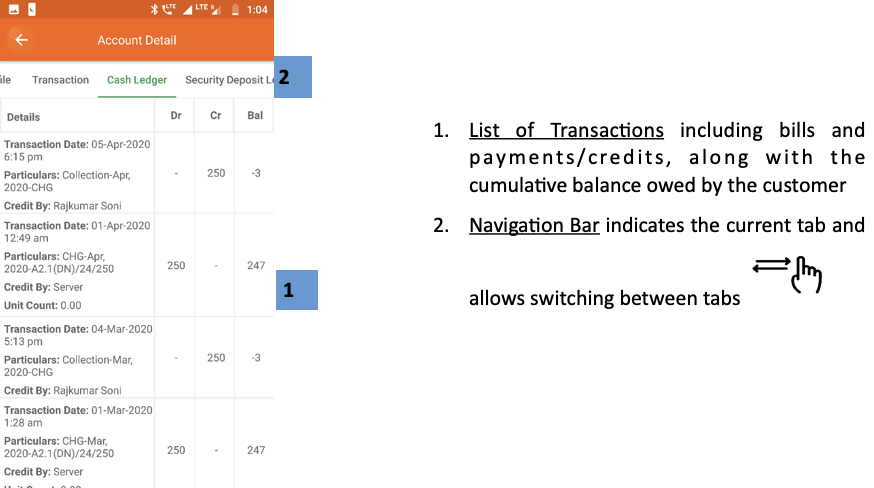  -->

### 3.5.2.4. Security Deposit Ledger tab
**Functionality**
* Provides a record of security deposits for the selected customer.

**Page Details**

 

<Clear>

1.  <u>List of Transactions</u> including bills and payments/credits, along with the cumulative balance owed by the customer
2.  <u>Navigation Bar</u> indicates the current tab and allows switching between tabs

    

</Clear>
 

<!-- 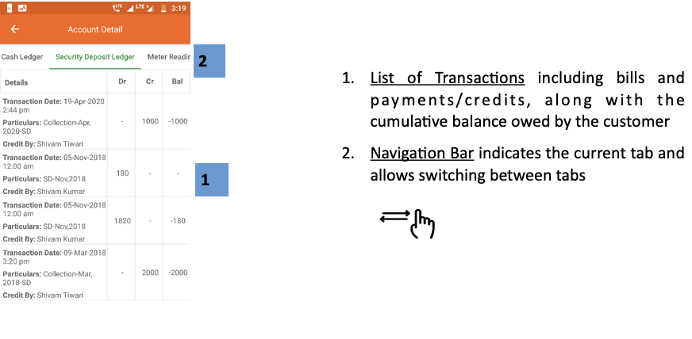 -->

### 3.5.2.5. Meter Reading Ledger tab
**Functionality**
* A chronological list of the customer’s energy meter readings.
* Only applies to metered customers.

**Page Details**

 

<Clear>

1.  <u>Meter Number Panel</u> is a drop-down list of meters associated with the customer
2.  <u>Daily Meter Readings</u> gives you important detail such as:

* Date of the reading
* Customer's electricity package
* Meter reading (kWh)
* Units consumed since the last reading (kWh)

3.  <u>Navigation Bar</u> indicates the current tab and allows switching between tabs

    

</Clear>
 

<!--  -->

### 3.5.2.6. Service tab
**Functionality**
* Provides a record of the service requests made by the customer, and the response by the field team.

**Page Details**

 

<Clear>

1.  <u>Service Issue</u> lists details about each service request made by the customer
2.  <u>Request Summary</u> shows the total number of requests, along with a break-down into pending and completed requests of each type. The average turnaround time is also recorded.
3.  <u>Search</u> allows the user to filter the list of requests by typing in specific information
4.  <u>Navigation Bar</u> indicates the current tab and allows switching between tabs

    

</Clear>
 

<!-- 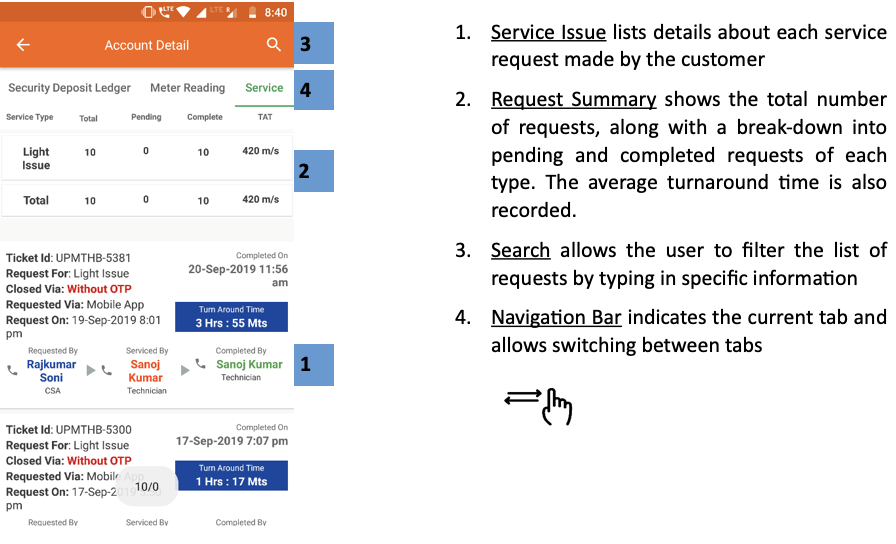 -->

## 3.5.3. Receivable
**Functionality**
* The receivables section displays customer balances and allows agents to register payments.

**Navigation**

This page is also accessible from the Main Menu. More details can be found in Section 3.4.6.

## 3.5.4. Consumer List
**Functionality**
* The Consumer List displays the current number of active and inactive customers at each plant.
* After selecting a particular plant, the user is shown the list of customers, along with records of unpaid bills.

**Key Users**
<table>
  <tr>
    <th>Designation</th>
    <th>Main Purpose</th>
    <th>Example Use Case</th>
  </tr>
  <tr>
    <td>Technician</td>
    <td>Access to the list of active members on the plant</td>
    <td>To check the consumer ID of a particular consumer</td>
  </tr>
  <tr>
    <td>CSA</td>
    <td>Same as Technician</td>
    <td>To check the number of active customer</td>
  </tr>
  <tr>
    <td>Cluster In-charge</td>
    <td>Summary of total number of customers in the cluster</td>
    <td>To create a report on the customers served at a cluster in a given time frame</td>
  </tr>
  <tr>
    <td>State In-charge</td>
    <td>Summary of the total number of customers in the state</td>
    <td>To create a report on the customers served in a state in a given time frame</td>
  </tr>
</table>

**Page Details**

 

<Clear>

1.  <u>List of Plants</u> showing the number of banned, active and total customers in every plant
2.  <u>Green Rows</u> show total amounts for each cluster of plants
3.  <u>Total Bar</u> shows the sum of each column 

**Tapping any plant will redirect you to the consumer list for that plant, as shown in the next screenshot**

</Clear>
 

 

<Clear>

1.  <u>Individual Customer</u> shown in each tab along with important information such as:

* Customer ID
* Package number
* Active/banned status
* Outstanding amount

2.  <u>Search Icon</u> to filter out the customer list by typing in the name or customer ID
3.  <u>Adding Consumer</u> explained in Section 3.5.9

**Tapping a consumer allows the user to add a transaction, as explained in the next screenshot**

</Clear>
 
 

<Clear>

Tapping on aconsumer allows the user to choose from three options:

* Profile — links to account detail which is explained in section 3.5.2
* Add Transaction — explained below
* Cancel —returns to the previous page

1.  <u>Customer Details</u> shown with important information
2.  <u>Outstanding Value</u> that displays the total amount of money owed and for which service it was charged
3.  <u>Adding Collection</u> to manually add any payments made by the customer, and for which service
4.  <u>Review Tab</u> to finalise the transaction

</Clear>
 

<!-- 

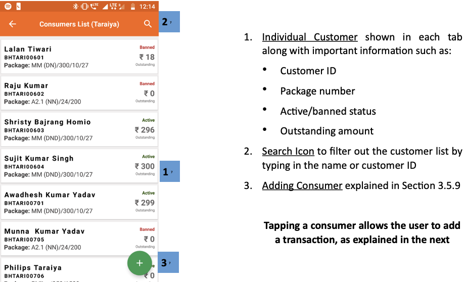

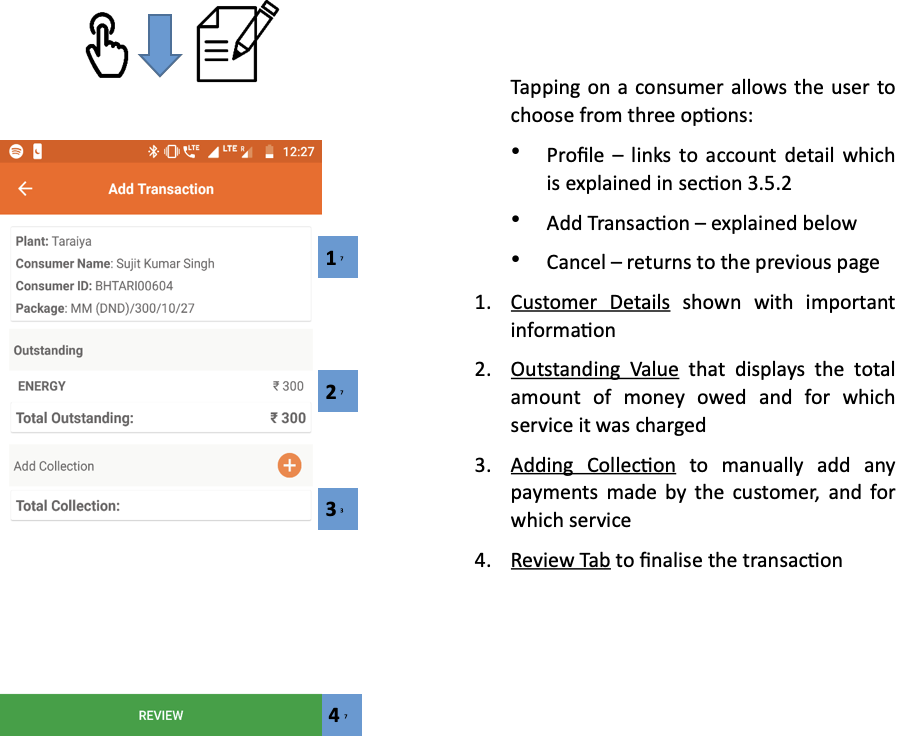 -->

## 3.5.5. Consumer Status
**Functionality**
* The Consumer Status section tracks progress towards connecting customers to the distribution network.
* Division of installation status is made into 4 parts namely – At Pole, House wire, Service Wire and Review
* The section also displays the number of denied package requests per plant 
* This functionality is only available for HCLF users

**Key Users**
<table>
  <tr>
    <th>Designation</th>
    <th>Main Purpose</th>
    <th>Example Use Case</th>
  </tr>
  <tr>
    <td>CSA</td>
    <td>Assessing the installation status of the meters for all the customers</td>
    <td>Reporting the number of pending meter reading reviews at the end of the month</td>
  </tr>
  <tr>
    <td>Cluster In-charge</td>
    <td>Same as CSA</td>
    <td>Reviewing the status of hardware installation for customers within the cluster</td>
  </tr>
  <tr>
    <td>State In-charge</td>
    <td>Same as CSA</td>
    <td>Launching an audit drive at a plant to improve customer service quality</td>
  </tr>
</table>

**Page Details**

 
 

<Clear>

1.  <u>Filter Bar</u> gives options for displaying results either cluster-wise or NTP-wise
2.  <u>List of Plants</u> with number of customers at each stage of connection
3.  <u>Total Bar</u> aggregates over plants
4.  <u>Information Icon</u> redirects to the Customer Status Trend page, explained in the next screenshot

</Clear>
 

 
 

<Clear>

**Tapping on the information icon redirects to the Customer Status Trend page**

1.  <u>Filter Bar</u> modifies result display according to:

* Cluster/NTP wise
* Month and Year
* Acquired/Active

2.  <u>List of Plants</u> with the number of new active customers over four months
3.  <u>Total Bar</u> aggregates over plants

</Clear>
 

<!-- 

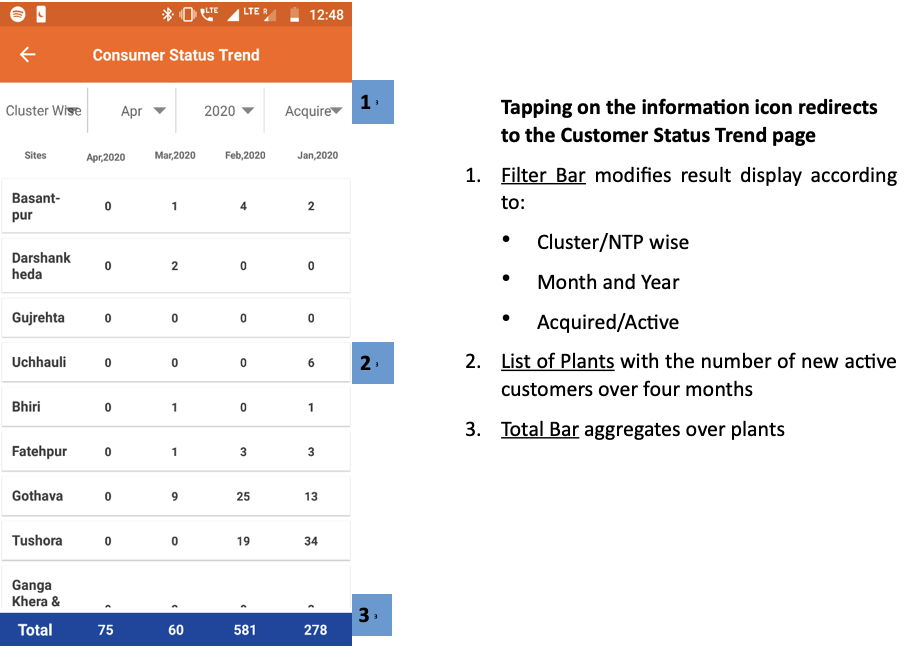 -->

## 3.5.6. Consumer Activity
**Functionality**
* Provides an interface for deactivating and reactivating customer electricity connections.
* Changes undergo a chain of approval before they are accepted.
* Activity changes are summarised for each plant. 

**Key Users**
<table>
  <tr>
    <th>Designation</th>
    <th>Main Purpose</th>
    <th>Example Use Case</th>
  </tr>
  <tr>
    <td>Technician</td>
    <td>To execute requested changes to customer status</td>
    <td>Reviewing which customers need to be de-/re-activated, and making the necessary changes to their connection</td>
  </tr>
  <tr>
    <td>CSA</td>
    <td>Same as Technician</td>
    <td>Same as Technician</td>
  </tr>
  <tr>
    <td>Cluster In-charge</td>
    <td>To register a change to customer status and assign to field personnel</td>
    <td>Using the app to check with a field agent whether they are available for executing the change</td>
  </tr>
  <tr>
    <td>State In-charge</td>
    <td>Approve customer status requests at plants in the state</td>
    <td>Checking how many status change requests are pending and at which plants</td>
  </tr>
</table>

**Page Details**
The Consumer Activity page is organised into several tabs, which follow the process of the account status change.

| Request| In Process| Review| Completed|
|---|---|---|---|
|Register a customer for de-/re-activation|List of customers whose connection requires attention|Confirming the action has been completed| Historical list of all customer de-/re-activation details|

### 3.5.6.1. Request tab

 

<Clear>

1.  <u>Information Icon</u> redirects to a plant-by-plant break-down of the number of customer de-activations and re-activations, as shown in a subsequent screenshot
2.  <u>Add Activity Icon</u> used to register a customer status change, as explained in the next screenshot
3.  <u>Request Tab</u> gives us more information on the requested customer request, this can be either rejected or approved
4.  <u>Navigation Bar</u> used to navigate between various sections of the section

    

</Clear>
 
 

<Clear>

1.  <u>Select Plant</u> dropdown list
2.  <u>Activity Type</u> dropdown list
3.  <u>Consumer Number</u> dropdown list of all eligible / relevant customers 
    Additional comments can be added at this point
4.  <u>Submit Button</u> completes the information submission

</Clear>
 
 

<Clear>

1.  <u>Filter Bar</u> used to select a date range
2.  <u>List_of plants</u> showing the number of banned and reactivated customers in the selected time interval
3.  <u>Total Bar</u> sums the values for all plants

</Clear>
 

<!-- 

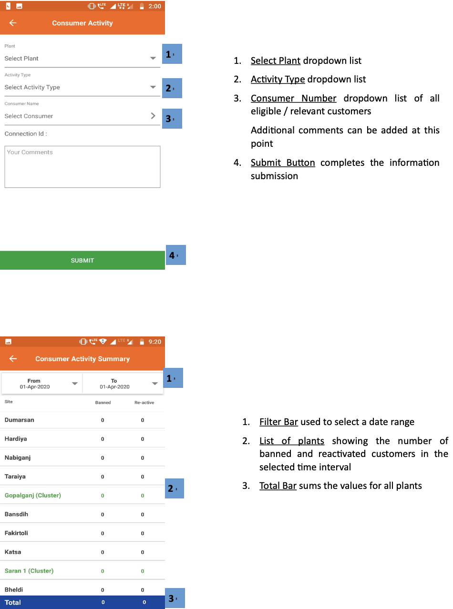 -->

### 3.5.6.2. In Process tab

 

<Clear>

1.  <u>Information Icon</u> redirects to a plant-by-plant break-down of the number of customer de-activations and re-activations
2.  <u>Request Tab</u> gives us more information on the in process customer request, including who registered the request and who is tasked with dealing with it

    The request can be either rejected, re- assigned to a different agent or executed (processed)

</Clear>
 

<!-- 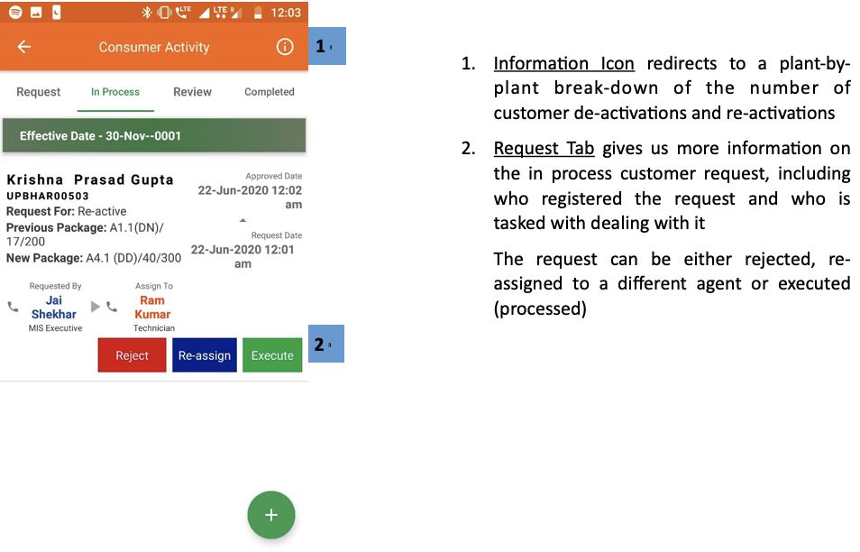 -->

### 3.5.6.3. Review tab

 

<Clear>

1.  <u>Information Icon</u> redirects to a plant-by-plant break-down of the number of customer de-activations and re-activations
2.  <u>Request Tab</u> gives us more information on the completed customer request being reviewed, this can be either rejected or marked completed (processed)

</Clear>
 

<!-- 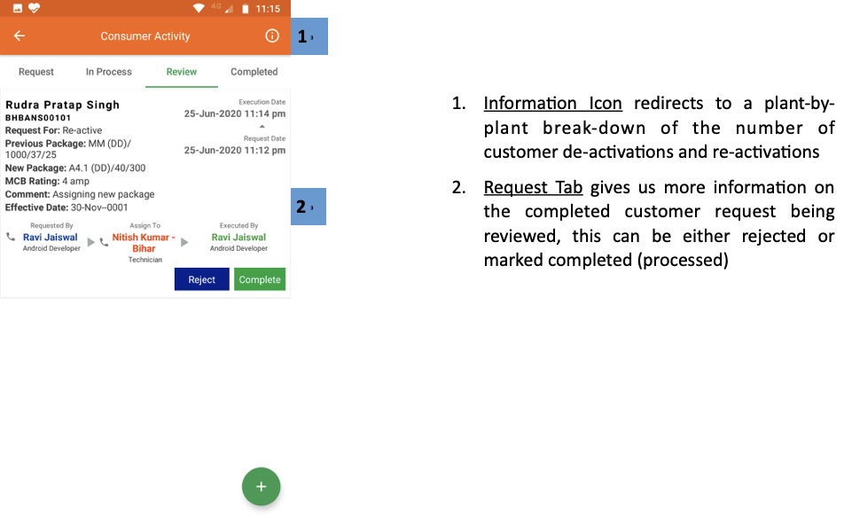 -->

### 3.5.6.4. Completed tab

 

<Clear>

1.  <u>Information Icon</u> redirects to a plant-by-plant break-down of the number of customer de-activations and re-activations
2.  <u>Request Details</u> includes information on historical customer requests in the time period in question, including the personnel responsible

</Clear>
 

<!-- 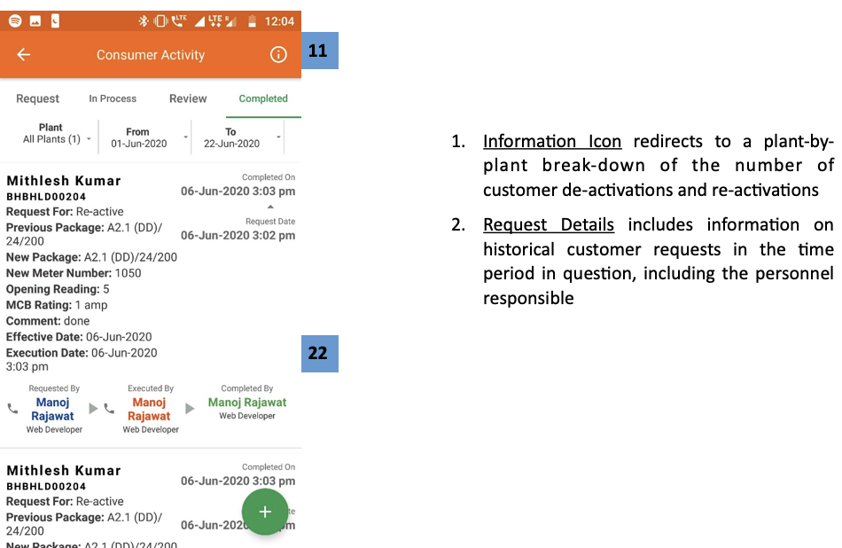 -->

## 3.5.7. Consumer Service
**Functionality**
* View existing customer service requests—both technical and non-technical--at different stages of completion
* Add new service requests
* Assign outstanding requests to field personnel for follow-up
* Close requests which have been resolved

**Key Users**
<table>
  <tr>
    <th>Designation</th>
    <th>Main Purpose</th>
    <th>Example Use Case</th>
  </tr>
  <tr>
    <td>Technician</td>
    <td>To review service requests assigned to them</td>
    <td>Prioritising pending requests, depending on when they were registered and the nature of the work</td>
  </tr>
  <tr>
    <td>CSA</td>
    <td>Same as Technician</td>
    <td>Phoning customers to understand what issue is being faced, and marking a request as complete when it has been resolved</td>
  </tr>
  <tr>
    <td>Cluster In-charge</td>
    <td>To view all requests from customers in the cluster</td>
    <td>Reviewing pending requests and assigning them to personnel for follow-up</td>
  </tr>
  <tr>
    <td>State In-charge</td>
    <td>To gain an overview of service request statistics in the state</td>
    <td>Tracking targets on personnel response time and customer satisfaction</td>
  </tr>
</table>

**Page Details**

| Report| Request| Completed|
|---|---|---|
|Overview statistics on completed and pending service requests| Detailed list of pending requests and personnel assignments| Record of all completed requests|

### 3.5.7.1. Report tab

 

<Clear>

1.  <u>Navigation Bar</u> indicates current tabs; user can switch tabs by tapping or swiping horizontally

    

2.  <u>Filter Bar</u> for selecting particular plants and changing the time interval
3.  <u>Pie Chart</u> summarises service request numbers:

* <Highlight color="#0000FF">Blue</Highlight> — Pending Requests
* <Highlight color="#008000">Green</Highlight> —Completed Requests

4.  <u>Total Service Request</u> is the number of requests registered in the selected time-frame
5.  <u>Average Completion Time</u> between the customer registering a request and marking it complete
6.  <u>Rating</u> of customer satisfaction
7.  <u>Add Service Requests</u> icon to register a new request; explained in the next screenshot

</Clear>
 
 

<Clear>

**Tapping the add service request Icon leads to the new service request page**

1.  <u>Add Service Information</u> to input details of the new service request, including

* Plant name (dropdown list)
* Consumer name
* Type of issue
* Other comments

2.  <u>Submit Icon</u> tapped when all information is complete

</Clear>
 

<!-- 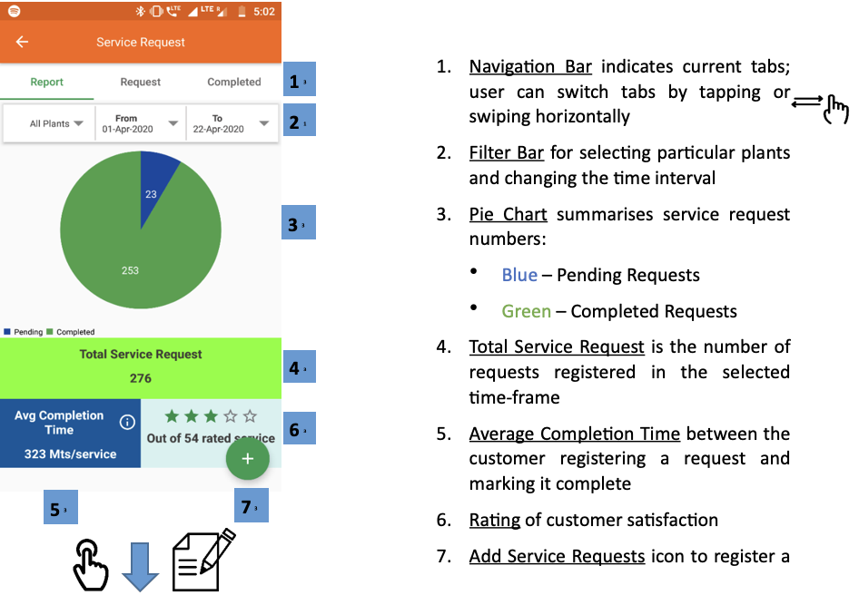

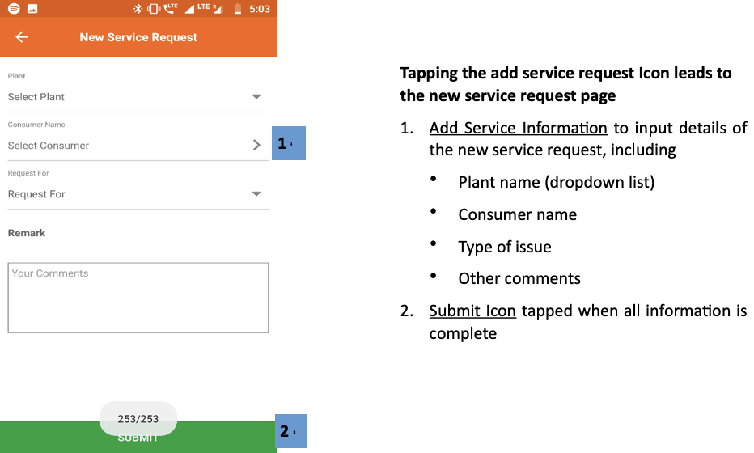 -->

### 3.5.7.2. Request tab

 

<Clear>

1.  <u>Navigation Bar</u> (same as previous tab)
2.  <u>Filter Bar</u> (same as previous tab)
3.  <u>Service Request List</u> where pending requests are shown chronologically, along with current personnel assignment.
    
    <u>Complete/Re-assign</u> Users may manually close the request or assign it to a different agent

    Tap an agent’s name to call them

4.  <u>Add Service Request</u> (same as previous tab)

</Clear>
 

<!-- 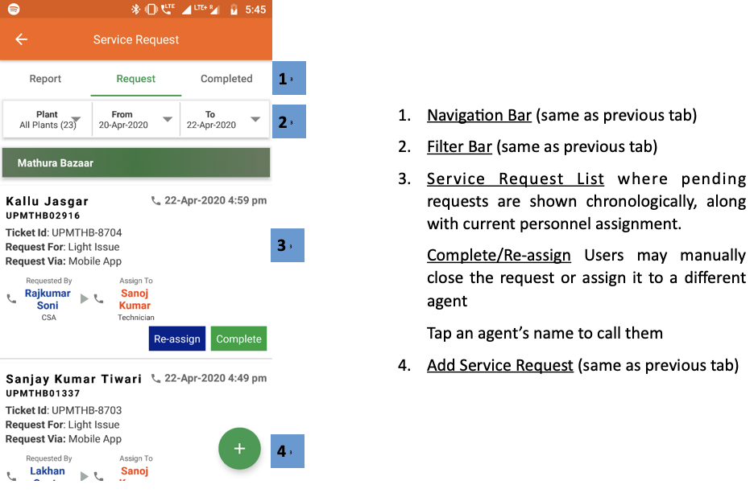  -->

### 3.5.7.3. Completed tab

 

<Clear>

1.  <u>Navigation Bar</u> (same as previous tab)
2.  <u>Filter Bar</u> (same as previous tab)
3.  <u>Completed Service Requests</u> shown chronologically, with specific details including the turnaround time along with the names of each agent handling the request
4.  <u>Add Service Request</u> (same as previous tab)
5.  <u>Search Icon</u> to filter the list according to customer name, field agent name, or any other relevant parameter

</Clear>
 

<!--  -->

## 3.5.8. Temporary Disconnect
**Functionality**
* Allows a user to remotely disconnect the supply of particular customers
* This functionality is only available for TaraUrja users

**Key Users**
<table>
  <tr>
    <th>Designation</th>
    <th>Main Purpose</th>
    <th>Example Use Case</th>
  </tr>
  <tr>
    <td>Technician</td>
    <td>Disconnecting specific customers at a plant</td>
    <td>Disconnecting high-load customers when a demand surge causes the plant to trip, until system stability is restored</td>
  </tr>
  <tr>
    <td>Cluster In-charge</td>
    <td>Disconnecting all customers at a plant</td>
    <td>Disconnecting all customers for safety during network maintenance</td>
  </tr>
</table>

**Page Details**

 

<Clear>

1.  <u>Plant Dropdown</u> to show customers of a particular plant
2.  <u>Plant Master Switch</u> used to temporarily disconnect all customers of the plant
3.  <u>Individual Customer Switch</u> displaying the customer name, customer ID, package, and meter number, along with the master power switch
4.  <u>Search</u> for specific customers by typing in their name, customer ID, package ID, or meter number

</Clear>
 

<!-- 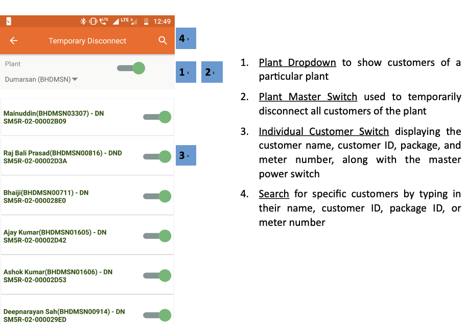 -->

## 3.5.9. Add Consumer
**Functionality**
* Create a new customer account in the MCOMS system

**Key Users**
<table>
  <tr>
    <th>Designation</th>
    <th>Main Purpose</th>
    <th>Example Use Case</th>
  </tr>
  <tr>
    <td>Technician</td>
    <td>To add a consumer into the company database</td>
    <td>Manual addition of a customer who cannot request an account through the customer smartphone app</td>
  </tr>
  <tr>
    <td>CSA</td>
    <td>Same as Technician</td>
    <td>Same as Technician</td>
  </tr>
  <tr>
    <td>Cluster In-charge</td>
    <td>Same as Technician</td>
    <td>Same as Technician</td>
  </tr>
  <tr>
    <td>State In-charge</td>
    <td>Same as Technician</td>
    <td>Same as Technician</td>
  </tr>
</table>

**Page Details**

 

<Clear>

1.  <u>Customer Information</u> required is specified line by line

</Clear>
 
 

<Clear>

2.  <u>Customer Information</u> continues, and includes which package they have selected
3.  <u>Next Button</u> completes the data submission

</Clear>
 

<!-- 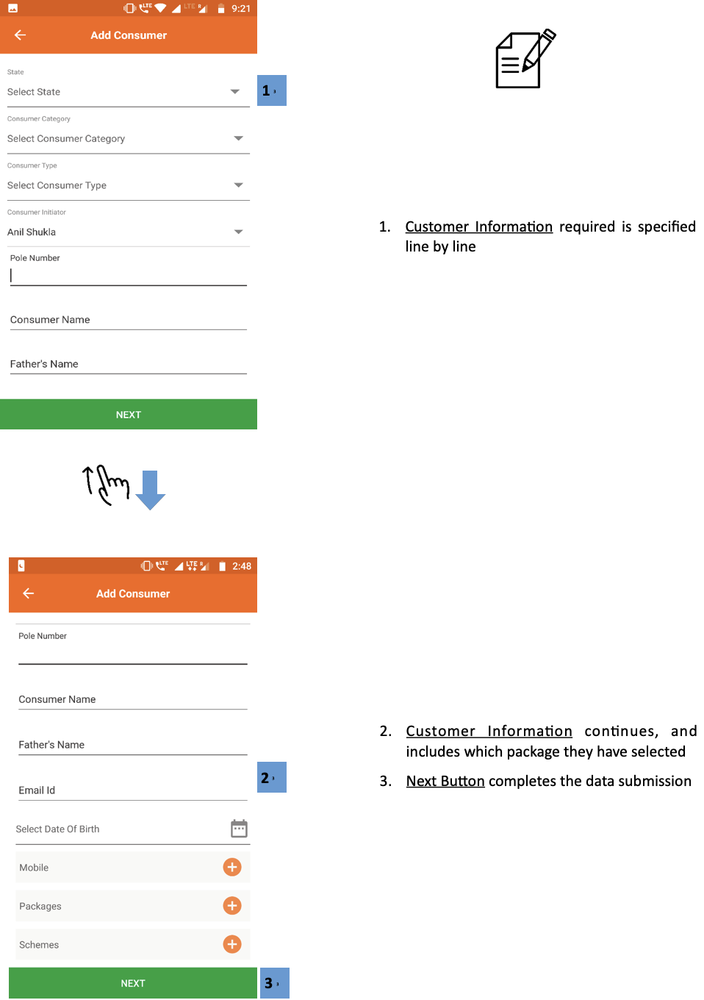 -->

## 3.5.10. Add Instant Consumer
**Functionality**
* Quickly create a new customer account in the MCOMS system, with only critical information recorded
* This functionality is only available for TaraUrja users

**Key Users**
<table>
  <tr>
    <th>Designation</th>
    <th>Main Purpose</th>
    <th>Example Use Case</th>
  </tr>
  <tr>
    <td>CSA</td>
    <td>To quickly add a new customer into the company database</td>
    <td>During a recruitment drive in a public place, many prospective customers may need registration in a short period of time</td>
  </tr>
  <tr>
    <td>Cluster In-charge</td>
    <td>Same as CSA</td>
    <td>Same as CSA</td>
  </tr>
  <tr>
    <td>State In-charge</td>
    <td>Same as CSA</td>
    <td>Same as CSA</td>
  </tr>
</table>

**Page Details**

 

<Clear>

1.  <u>Customer Information</u> to be added includes only the most critical data
2.  <u>Confirm</u> tapped once data has been reviewed for accuracy
3.  <u>Submit</u> tapped to complete the process

</Clear>
 

<!-- 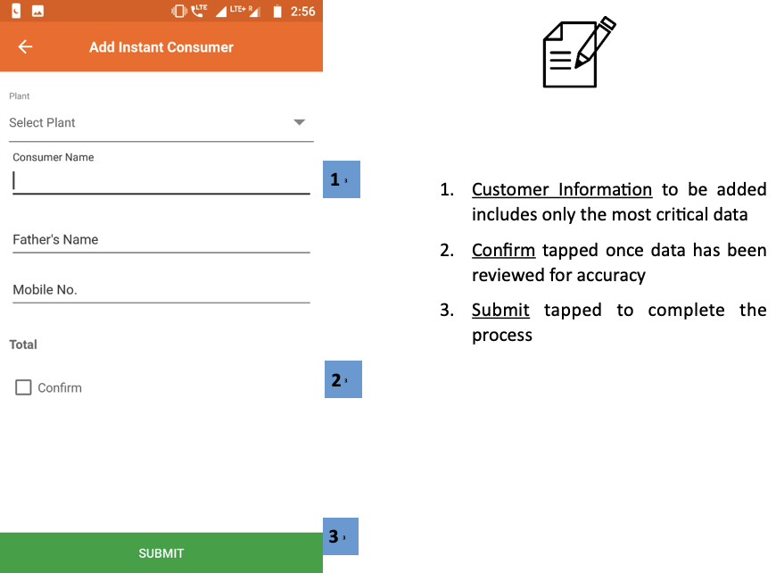 -->

## 3.5.11. Catchment Survey
**Functionality**
* The Catchment Survey Section showcases an overview of all the customers and potential customers present at a plant
* The ‘catchment’ created intends to assist in reviewing customer behaviour over a period of time
* It also gives a detailed list on the penetration made into the potential customer base

**Key Users**
<table>
  <tr>
    <th>Designation</th>
    <th>Main Purpose</th>
    <th>Example Use Case</th>
  </tr>
  <tr>
    <td>Operator</td>
    <td>To record survey responses of energy consumers</td>
    <td>Interviewing a local who comes to the plant to enquire about getting a connection</td>
  </tr>
  <tr>
    <td>Technician</td>
    <td>Same as Operator</td>
    <td>Updating an existing customer’s profile and contact information</td>
  </tr>
  <tr>
    <td>CSA</td>
    <td>Same as Operator</td>
    <td>Interviewing locals in the catchment area to understand energy needs and use patterns</td>
  </tr>
  <tr>
    <td>Cluster In-charge</td>
    <td>Same as Operator</td>
    <td>Reviewing the number of active, inactive, and prospective customers in the cluster</td>
  </tr>
</table>

**Page Details**

 

<Clear>

1.  <u>Filter Section</u> to show customer data Cluster Wise or NTP wise
2.  <u>List of Plants</u> shows the segregation between the status under’ which customers have been grouped, plant wise
3.  <u>Total Bar</u> aggregates the columnar data in the tabular column

**Tapping on a particular plant will redirect the user to its consumer list page**

</Clear>
 
 

<Clear>

1.  <u>Filter Bar</u> used to narrow down the results
2.  <u>List of Consumers</u> showing their activity status, and whether their profile has been updated / survey administered

    The green tick validates the completion

3.  <u>Update Profile</u> option will allow the user to update the profile of any consumer (both active customers and others)
4.  <u>Tapping</u> a consumer will allow the user to:
    * Update Profile
    * Complete Survey

**Tapping any of these options will redirect you to either the update profile page or he survey page, both of which have been explained in the following screenshots**

</Clear>
 
 

<Clear>

**Update Profile**

1.  <u>Consumer Profile</u> Information to be filled by the field agent

</Clear>
 
 

<Clear>

2.  <u>Submit</u> tapped to complete the update

</Clear>
 
 

<Clear>

The Survey page allows the user to record information about an existing/prospective customer's energy usage needs

1.  <u>Survey Information</u> to be filled by the agent

</Clear>
 
 

<Clear>

2.   <u>Submit</u> tapped to complete the survey

</Clear>
 

<!-- 

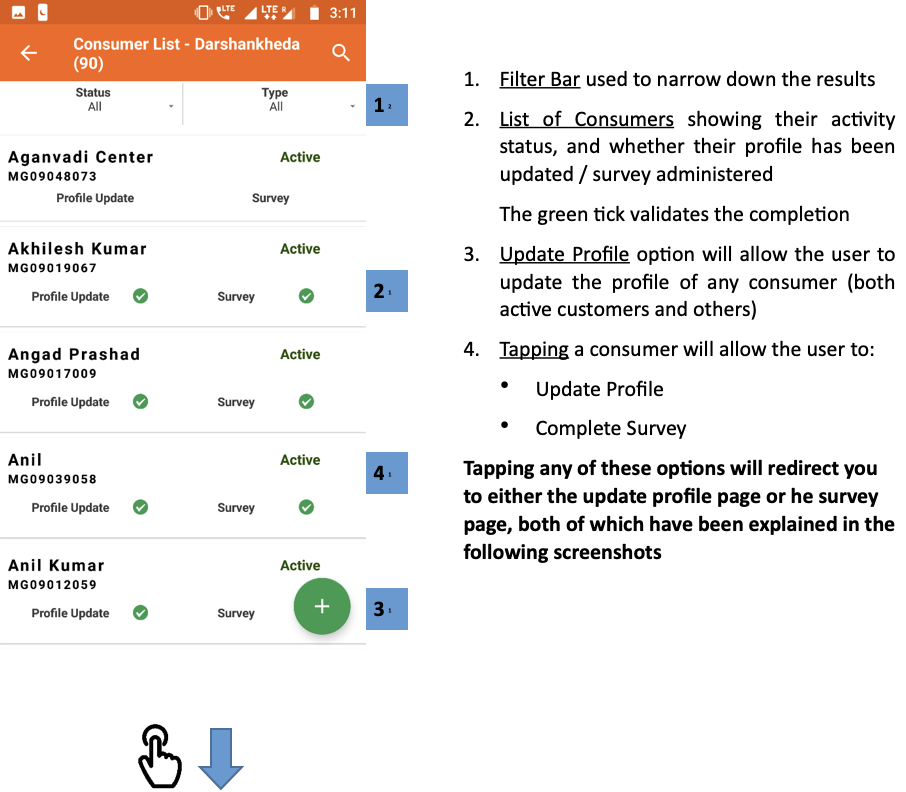

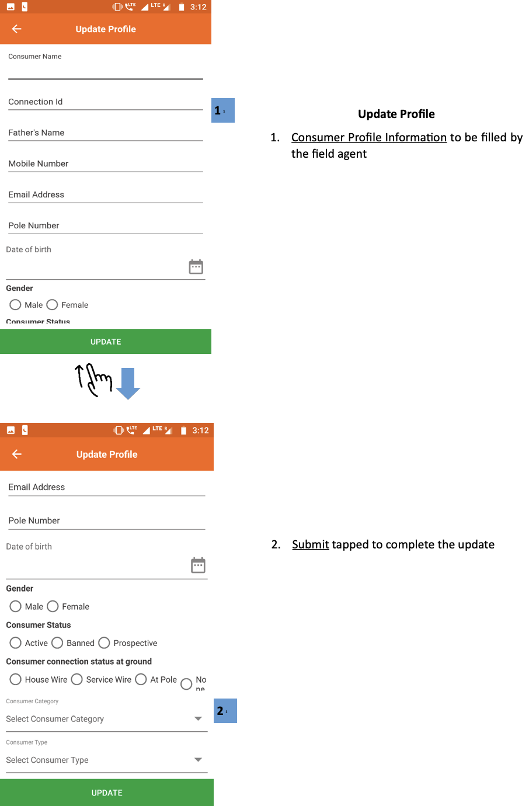

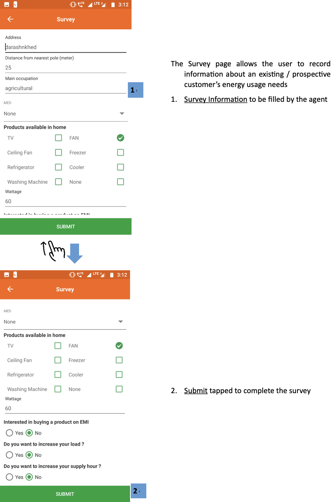 -->

## 3.5.12. Theft Complaint
**Functionality**
* Used to register possible pilferage from the mini-grid, for follow-up investigation
* This functionality is only available for HCLF users

**Key Users**
<table>
  <tr>
    <th>Designation</th>
    <th>Main Purpose</th>
    <th>Example Use Case</th>
  </tr>
  <tr>
    <td>Operator</td>
    <td>To register a possible theft for follow-up</td>
    <td>Registering a complaint from a customer who visits the plant</td>
  </tr>
  <tr>
    <td>Technician</td>
    <td>To view pending theft complaints</td>
    <td>Checking the distribution network cables as directed by the Cluster In-charge</td>
  </tr>
  <tr>
    <td>CSA</td>
    <td>Same as Operator</td>
    <td>Registering a complained after noticing new unsanctioned cables</td>
  </tr>
  <tr>
    <td>Cluster In-charge</td>
    <td>To review logged theft complaints and assign them to field agents for investigation</td>
    <td>Reviewing the total number of theft complaints within a given time frame</td>
  </tr>
</table>

**Page Details**

<table>
    <tr>
        <th>Pending</th>
        <th>In Process</th>
        <th>Completed</th>
    </tr>
    <tr>
         <td>The theft reports that are reported</td>
         <td>Theft reports that are currently being investigated</td>
         <td>Theft reports that have been appropriately dealt with</td>
    </tr>
</table>

### 3.5.12.1. Pending tab

 

<Clear>

1.  <u>Information Icon</u>tapped for plant-wise overview of complaints, as explained in the next screenshot
2.  <u>Navigation Bar</u> indicates the current tab and allows switching between tabs

    

3.  <u>Filter Bar</u> allows the user to restrict attention to a specific plant and time frame
4.  <u>Complaint Tab</u> contains relevant information regarding the theft complaint lodged by a user
5.  <u>Add Complaint Button</u> redirects the user to the New Theft Report page, detailed below

</Clear>
 
 

<Clear>

**Theft Complaint Summary**

1.  <u>Filter Bar</u> allows the user to produce results between a given period of time at a plant
2.  <u>Tabular Information</u> on the theft complaints at various plants is shown
3.  <u>Total Bar</u> gives the user a representation of the aggregated columnar data

</Clear>
 
 

<Clear>

**New Theft Report**

1.  <u>Plant Selection</u> must be made before filling in the form
2.  <u>Complaint Information</u> itemised line by line, including possibility of adding a photograph
3.  <u>Submit</u> completes the registration process

</Clear>
 

<!-- 

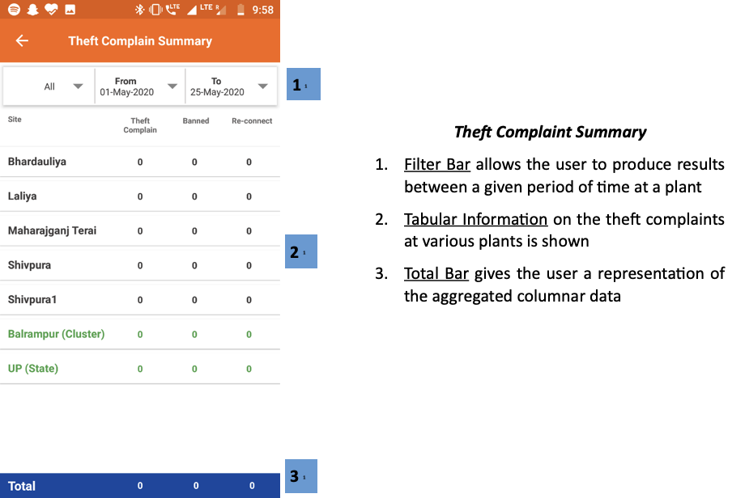

 -->

### 3.5.12.2. In Process tab

 

<Clear>

1.  <u>Information Icon</u> tapped for plant-wise overview of complaints
2.  <u>Complaint Tab</u> gives the user relevant information on a complaint request that is currently being investigated. It can either by rejected or completed

</Clear>
 

<!-- 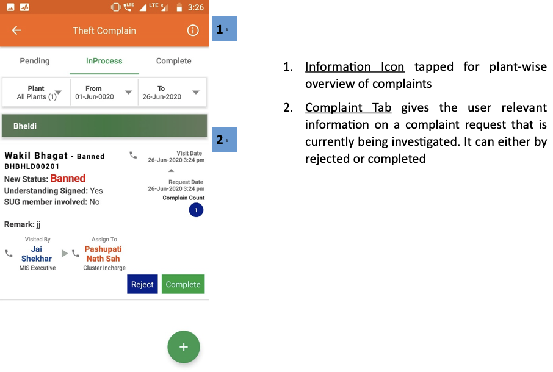 -->

### 3.5.12.3. Completed tab

 

<Clear>

1.  <u>Information Icon</u> tapped for plant-wise overview of complaints
2.  <u>Complaint Tab</u> gives the user relevant information on a complaint request that has been completed.

</Clear>
 

<!-- 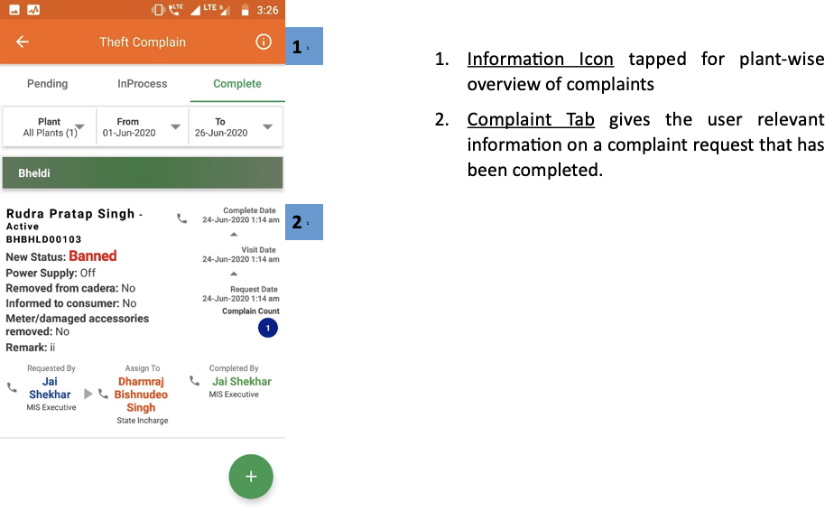  -->

## 3.5.13. Coupon Discount
**Functionality**
* Allows plant personnel to generate coupons for customers
* Tracks the number of redeemed coupons

**Key Users**
<table>
  <tr>
    <th>Designation</th>
    <th>Main Purpose</th>
    <th>Example Use Case</th>
  </tr>
  <tr>
    <td>Operator</td>
    <td>To generate coupon codes on behalf of customers</td>
    <td>Assisting a customer who doesn’t have a smartphone to avail a company promotion</td>
  </tr>
  <tr>
    <td>Technician</td>
    <td>Same as Operator</td>
    <td>Same as Operator</td>
  </tr>
  <tr>
    <td>CSA</td>
    <td>Same as Operator</td>
    <td>Same as Operator</td>
  </tr>
  <tr>
    <td>Cluster In-charge</td>
    <td>To track the customers whose coupons are going to expire</td>
    <td>Following up with customers who have generated coupons but not redeemed them</td>
  </tr>
  <tr>
    <td>State In-charge</td>
    <td>To monitor the results of coupon schemes at different plants</td>
    <td>Calculating the proportion of eligible customers who participated in the initiative</td>
  </tr>
</table>

**Page Details**

 

<Clear>

1.  <u>Filter Bar</u> narrows to a given time period
2.  <u>List of Plants</u> showing the number of coupons generated and redeemed at each plant
3.  <u>Total Bar</u> aggregates over all plants

    **Tapping on any plant will redirect the user to a list of customers at that plant, as explained in the next screenshot**

</Clear>
 
 

<Clear>

1.   <u>Search Icon</u> can be used to find a specific customer
2.   <u>Filter Bar</u> allows narrowing the results to a given time period and plant
3.  <u>Generate Coupon Code</u> allows an agent to enable the customer to generate a coupon code that could be redeemed

    The particular customer can be contacted by tapping on the phone icon present in every tab

</Clear>
 

<!-- 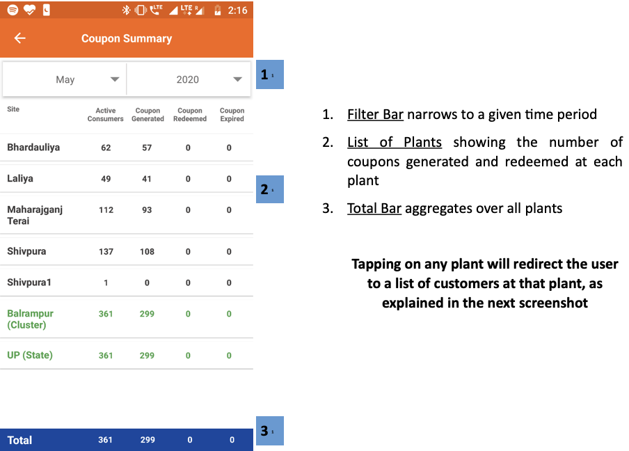

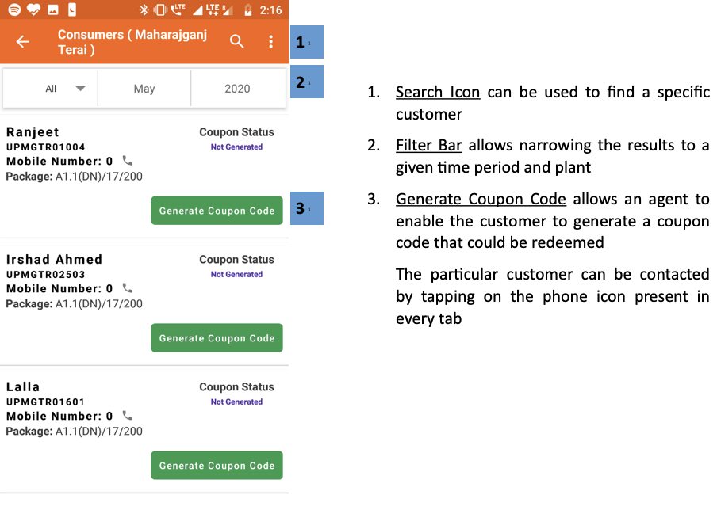  -->

