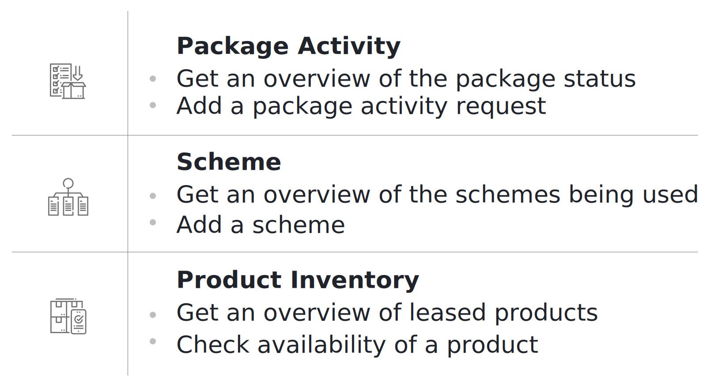
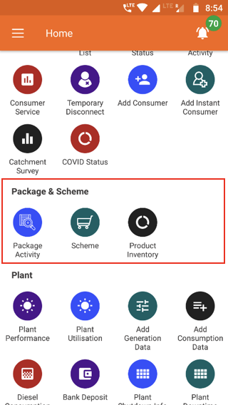

## 3.6.1. Overview

  

 
## 3.6.2. Package Activity
**Functionality**
* The Package Activity section is an interface for changing the package assigned to customers
* Changes undergo a chain of approval, with details passed to the relevant agent
* Package changes are summarised for each plant

**Key Users**
<table>
  <tr>
    <th>Designation</th>
    <th>Main Purpose</th>
    <th>Example Use Case</th>
  </tr>
  <tr>
    <td>Technician</td>
    <td>To implement package changes requested by customers</td>
    <td>Reviewing the list of customers who require up/downgrades to their connection</td>
  </tr>
  <tr>
    <td>CSA</td>
    <td>To register and view package change requests</td>
    <td>Registering a change on behalf of a customer who isn’t using the customer smartphone app</td>
  </tr>
  <tr>
    <td>Cluster In-charge</td>
    <td>To check the number of requests and assign to field personnel</td>
    <td>Notifying a field agent that they are responsible for following up with the customer</td>
  </tr>
  <tr>
    <td>State In-charge</td>
    <td>To check the number of requests at plants in the state</td>
    <td>Checking how many package change requests are pending and at which plants</td>
  </tr>
</table>

**Page Details**

| Request| In Process| Review| Completed|
|---|---|---|---|
| Information on package request| Lists requests that are being worked on| Completed requests that are awaiting approval| Details of historical package requests|

### 3.6.2.1. Request tab

### 3.6.2.2. In Process tab

### 3.6.2.3. Review tab

### 3.6.2.4. Completed tab

## 3.6.3. Scheme
**Functionality**
* List of customers who are participating in a promotional scheme which offers electrical appliances along with an electricity connection
* Option to add new customers to a scheme

**Key Users**
<table>
  <tr>
    <th>Designation</th>
    <th>Main Purpose</th>
    <th>Example Use Case</th>
  </tr>
  <tr>
    <td>CSA</td>
    <td>To check the list of participating customers</td>
    <td>Enrolling a customer in a scheme upon their request</td>
  </tr>
  <tr>
    <td>Cluster In-charge</td>
    <td>Same as CSA</td>
    <td>Checking which customers are falling behind on their scheme repayments</td>
  </tr>
  <tr>
    <td>State In-charge</td>
    <td>To assess the schemes ongoing within the state</td>
    <td>Assessing the popularity of different schemes</td>
  </tr>
</table>

**Page Details**

## 3.6.4. Product Inventory
**Functionality**
* Displays all the electrical appliances (for customer schemes) in the company’s warehouse

**Key Users**
<table>
  <tr>
    <th>Designation</th>
    <th>Main Purpose</th>
    <th>Example Use Case</th>
  </tr>
  <tr>
    <td>Operator</td>
    <td>To view available appliances in the company warehouse</td>
    <td>Checking on behalf of a customer whether a particular appliance is available as part of a scheme</td>
  </tr>
  <tr>
    <td>Technician</td>
    <td>Same as Operator</td>
    <td>Same as Operator</td>
  </tr>
  <tr>
    <td>CSA</td>
    <td>Same as Operator</td>
    <td>Same as Operator</td>
  </tr>
  <tr>
    <td>Cluster In-charge</td>
    <td>Same as Operator</td>
    <td>Requesting purchase of an appliance which in in demand</td>
  </tr>
  <tr>
    <td>State In-charge</td>
    <td>Same as Operator</td>
    <td>Checking inventory levels and whether new purchase orders are required</td>
  </tr>
</table>

**Page Details**

