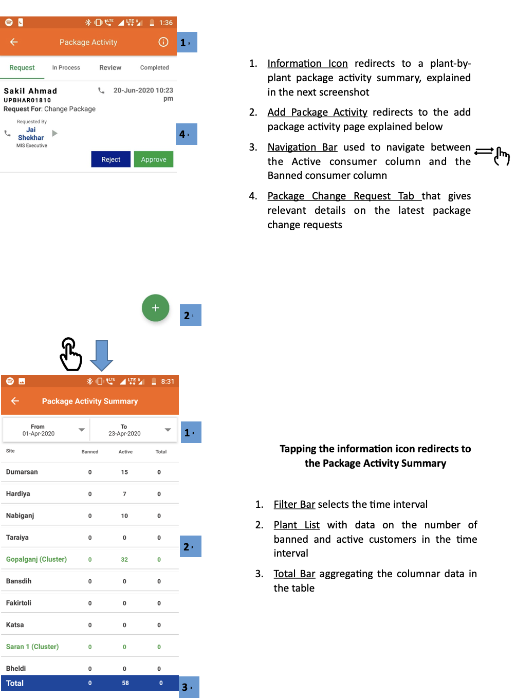
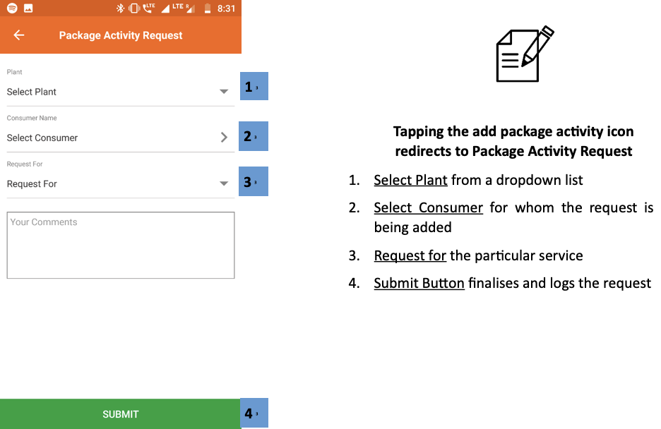
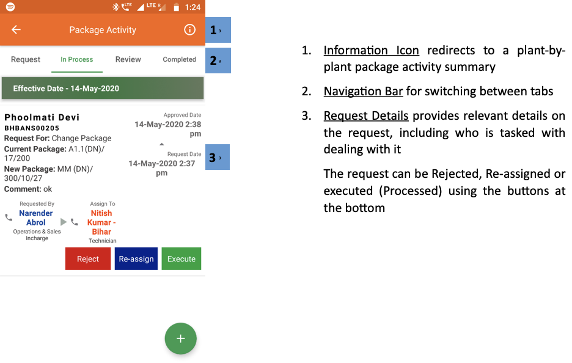
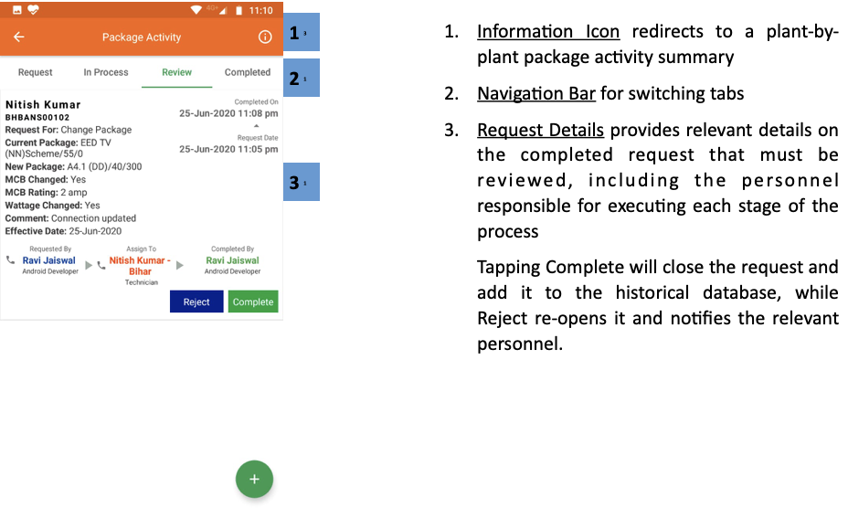
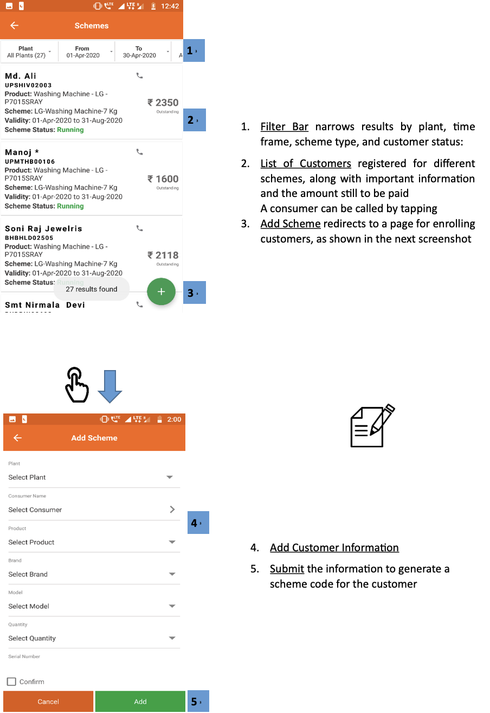
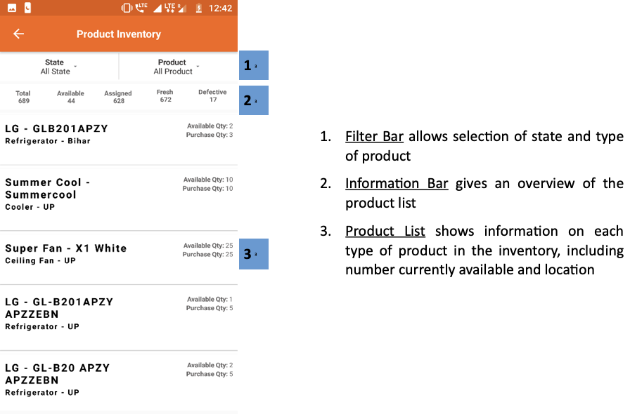

import useBaseUrl from '@docusaurus/useBaseUrl';
export const Highlight = ({children, color}) => (
  
    {children}
  
);

export const Clear = ({children}) => (
  

    {children}
  

);

## 3.6.1. Overview

 

 
 

## 3.6.2. Package Activity
**Functionality**
* The Package Activity section is an interface for changing the package assigned to customers
* Changes undergo a chain of approval, with details passed to the relevant agent
* Package changes are summarised for each plant

**Key Users**
<table>
  <tr>
    <th>Designation</th>
    <th>Main Purpose</th>
    <th>Example Use Case</th>
  </tr>
  <tr>
    <td>Technician</td>
    <td>To implement package changes requested by customers</td>
    <td>Reviewing the list of customers who require up/downgrades to their connection</td>
  </tr>
  <tr>
    <td>CSA</td>
    <td>To register and view package change requests</td>
    <td>Registering a change on behalf of a customer who isn’t using the customer smartphone app</td>
  </tr>
  <tr>
    <td>Cluster In-charge</td>
    <td>To check the number of requests and assign to field personnel</td>
    <td>Notifying a field agent that they are responsible for following up with the customer</td>
  </tr>
  <tr>
    <td>State In-charge</td>
    <td>To check the number of requests at plants in the state</td>
    <td>Checking how many package change requests are pending and at which plants</td>
  </tr>
</table>

**Page Details**

| Request| In Process| Review| Completed|
|---|---|---|---|
| Information on package request| Lists requests that are being worked on| Completed requests that are awaiting approval| Details of historical package requests|

### 3.6.2.1. Request tab

 

<Clear>
 

1.  <u>Information Icon</u> redirects to a plant-by-plant package activity summary, explained in the next screenshot
2.  <u>Add Package Activity</u> redirects to the add package activity page explained below
3.  <u>Navigation Bar</u> used to navigate between the Active consumer column and the Banned consumer column

    

4.  <u>Package Change Request Tab</u> that gives relevant details on the latest package change requests

</Clear>
 
 

<Clear>

**Tapping the information icon redirects to the Package Activity Summary**

1.  <u>Filter Bar</u> selects the time interval
2.  <u>Plant List</u> with data on the number of banned and active customers in the time interval
3.  <u>Total Bar</u> aggregating the columnar data in the table

</Clear>
 
 

<Clear>

 
**Tapping the add package activity icon redirects to Package Activity Request**

1.  <u>Select Plant</u> from a dropdown list
2.  <u>Select Consumer</u> for whom the request is being added
3.  <u>Request</u> for the particular service
4.  <u>Submit Button</u> finalises and logs the request

</Clear>
 

<!-- 

 -->

### 3.6.2.2. In Process tab

 

<Clear>

1.  <u>Information Icon</u> redirects to a plant-by-plant package activity summary
2.  <u>Navigation Bar</u> for switching between tabs
3.  <u>Request Details</u> provides relevant details on the request, including who is tasked with dealing with it

    The request can be Rejected, Re-assigned or executed (Processed) using the buttons at the bottom

</Clear>
 

<!--  -->

### 3.6.2.3. Review tab

 

<Clear>

1.  <u>Information Icon</u> redirects to a plant-by-plant package activity summary
2.  <u>Navigation Bar</u> for switching tabs
3.  <u>Request Details</u> provides relevant details on the completed request that must be reviewed, including the personnel responsible for executing each stage of the process

    Tapping Complete will close the request and add it to the historical database, while Reject re-opens it and notifies the relevant personnel.

</Clear>
 

<!--  -->

### 3.6.2.4. Completed tab

 

<Clear>

1.  <u>Information Icon</u> redirects to a plant-by-plant package activity summary
2.  <u>Navigation Bar</u> for switching tabs
3.  <u>Request Details</u> provides relevant details on each historical completed request in the time period in question

</Clear>
 

<!--  -->

## 3.6.3. Scheme
**Functionality**
* List of customers who are participating in a promotional scheme which offers electrical appliances along with an electricity connection
* Option to add new customers to a scheme

**Key Users**
<table>
  <tr>
    <th>Designation</th>
    <th>Main Purpose</th>
    <th>Example Use Case</th>
  </tr>
  <tr>
    <td>CSA</td>
    <td>To check the list of participating customers</td>
    <td>Enrolling a customer in a scheme upon their request</td>
  </tr>
  <tr>
    <td>Cluster In-charge</td>
    <td>Same as CSA</td>
    <td>Checking which customers are falling behind on their scheme repayments</td>
  </tr>
  <tr>
    <td>State In-charge</td>
    <td>To assess the schemes ongoing within the state</td>
    <td>Assessing the popularity of different schemes</td>
  </tr>
</table>

**Page Details**

 

<Clear>

1.  <u>Filter Bar</u> narrows results by plant, time frame, scheme type, and customer status:
2.  <u>List of Customers</u> registered for different schemes, along with important information and the amount still to be paid 

    A consumer can be called by tapping

3.  <u>Add Scheme</u> redirects to a page for enrolling customers, as shown in the next screenshot

</Clear>
 
 

<Clear>

4.  <u>Add Customer</u> Information
5.  <u>Submit</u> the information to generate a scheme code for the customer

</Clear>
 

<!--  -->

## 3.6.4. Product Inventory
**Functionality**
* Displays all the electrical appliances (for customer schemes) in the company’s warehouse

**Key Users**
<table>
  <tr>
    <th>Designation</th>
    <th>Main Purpose</th>
    <th>Example Use Case</th>
  </tr>
  <tr>
    <td>Operator</td>
    <td>To view available appliances in the company warehouse</td>
    <td>Checking on behalf of a customer whether a particular appliance is available as part of a scheme</td>
  </tr>
  <tr>
    <td>Technician</td>
    <td>Same as Operator</td>
    <td>Same as Operator</td>
  </tr>
  <tr>
    <td>CSA</td>
    <td>Same as Operator</td>
    <td>Same as Operator</td>
  </tr>
  <tr>
    <td>Cluster In-charge</td>
    <td>Same as Operator</td>
    <td>Requesting purchase of an appliance which in in demand</td>
  </tr>
  <tr>
    <td>State In-charge</td>
    <td>Same as Operator</td>
    <td>Checking inventory levels and whether new purchase orders are required</td>
  </tr>
</table>

**Page Details**

 

<Clear>

1.  <u>Filter Bar</u> allows selection of state and type of product
2.  <u>Information Bar</u> gives an overview of the product list
3.  <u>Product List</u> shows information on each type of product in the inventory, including number currently available and location

</Clear>
 

<!--  -->
