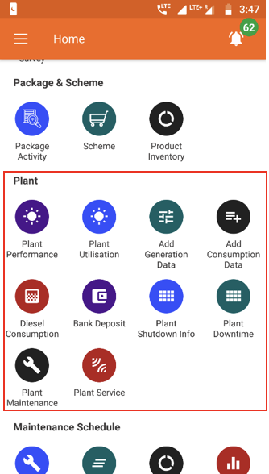

## Overview
The section consists of the following functionalities:

  

 
## Plant Performance
**Functionality**
* The Plant Performance Section summarises technical performance metrics for each plant

**Key Users**
<table>
  <tr>
    <th>Designation</th>
    <th>Main Purpose</th>
    <th>Example Use Case</th>
  </tr>
  <tr>
    <td>Operator</td>
    <td>To check data logs for a particular plant</td>
    <td>Ensuring that the database agrees with ground measurements</td>
  </tr>
  <tr>
    <td>Technician</td>
    <td>To assess the performance of the equipment at the plant</td>
    <td>Calculating in-plant and distribution efficiency</td>
  </tr>
  <tr>
    <td>CSA</td>
    <td>To check units sold in a particular timeframe</td>
    <td>Comparing units sold in one month with the previous month</td>
  </tr>
  <tr>
    <td>Cluster In-charge</td>
    <td>To compare technical performance of multiple plants</td>
    <td>Same as Technician</td>
  </tr>
  <tr>
    <td>State In-charge</td>
    <td>Same as Cluster In-charge</td>
    <td>Calculating the utilisation of the plant to inform whether more customers should be connected</td>
  </tr>
</table>

**Page Details**

**Generation Data**

**Consumption Data**

## Plant Utilisation
**Functionality**
* The Plant Utilisation Section summarises technical performance metrics and energy consumption for each plant
* This functionality is only available for HCLF agents

**Key Users**
<table>
  <tr>
    <th>Designation</th>
    <th>Main Purpose</th>
    <th>Example Use Case</th>
  </tr>
  <tr>
    <td>Technician</td>
    <td>To assess the performance of equipment at the plant</td>
    <td>Calculating in-plant and distribution efficiency</td>
  </tr>
  <tr>
    <td>Cluster In-charge</td>
    <td>To check units consumed by different user groups</td>
    <td>Comparing month-on-month electricity demand from micro-enterprises</td>
  </tr>
  <tr>
    <td>State In-charge</td>
    <td>To compare technical performance of multiple plants</td>
    <td>Calculating the utilisation of the plant to inform whether more customers can be connected</td>
  </tr>
</table>

**Page Details**

## Add Generation Data
**Functionality**
* The Add Generation Data module allows the user to input energy generation data into the company database

**Key Users**
<table>
  <tr>
    <th>Designation</th>
    <th>Main Purpose</th>
    <th>Example Use Case</th>
  </tr>
  <tr>
    <td>Operator</td>
    <td>To add generation data for a particular date</td>
    <td>Reading units generated at each solar MPPT daily, and recording in the app</td>
  </tr>
  <tr>
    <td>Technician</td>
    <td>Same as Operator</td>
    <td>Same as Operator</td>
  </tr>
  <tr>
    <td>Cluster In-charge</td>
    <td>Same as Operator</td>
    <td>Same as Operator</td>
  </tr>
  <tr>
    <td>State In-charge</td>
    <td>Same as Operator</td>
    <td>Same as Operator</td>
  </tr>
</table>

**Page Details**

## Add Consumption Data
**Functionality**
* The Add Consumption Data module allows the user to input energy dispatch data into the company database

**Key Users**
<table>
  <tr>
    <th>Designation</th>
    <th>Main Purpose</th>
    <th>Example Use Case</th>
  </tr>
  <tr>
    <td>Operator</td>
    <td>To add dispatch data for a particular date</td>
    <td>Reading units through each feeder daily, and recording in the app</td>
  </tr>
  <tr>
    <td>Technician</td>
    <td>Same as Operator</td>
    <td>Same as Operator</td>
  </tr>
  <tr>
    <td>Cluster In-charge</td>
    <td>Same as Operator</td>
    <td>Same as Operator</td>
  </tr>
  <tr>
    <td>State In-charge</td>
    <td>Same as Operator</td>
    <td>Same as Operator</td>
  </tr>
</table>

**Page Details**

## Diesel Consumption
**Functionality**
* The Diesel Consumption Section allows the user to input details on plant fuel expenses, along with photos of receipts
* Past expenses and DG usage data can also be reviewed
* Fuel bills are to be reimbursed by the Head Office

**Key Users**
<table>
  <tr>
    <th>Designation</th>
    <th>Main Purpose</th>
    <th>Example Use Case</th>
  </tr>
  <tr>
    <td>Cluster In-charge</td>
    <td>To maintain a record of diesel expenses and fuel use</td>
    <td>Adding a diesel purchase made at a particular plant within the cluster</td>
  </tr>
  <tr>
    <td>State In-charge</td>
    <td>To review diesel expenses and DG usage at different plants</td>
    <td>Checking for fuel pilferage by comparing fuel efficiencies at different plants / times</td>
  </tr>
</table>

**Page Details**

## Bank Deposit
**Functionality**
* Interface for registering a deposit of collected cash into the company bank account
* Record and summary of past deposits can be viewed, along with in-plant cash records

**Key Users**
<table>
  <tr>
    <th>Designation</th>
    <th>Main Purpose</th>
    <th>Example Use Case</th>
  </tr>
  <tr>
    <td>CSA</td>
    <td>To register new deposits</td>
    <td>Depositing cash collected from customers into the company bank account</td>
  </tr>
  <tr>
    <td>Cluster In-charge</td>
    <td>To view the cash flow for plants in the cluster</td>
    <td>Checking the amount of collected cash is still with filed agents and is yet to be deposited</td>
  </tr>
  <tr>
    <td>State In-charge</td>
    <td>To view the cash flow for plants in the state</td>
    <td>Ensuring bank deposits are going through correctly, and are happening on schedule</td>
  </tr>
</table>

**Page Details**

The page is organised into the following tabs.

| Bank Deposit| In Hand Cash Report| Bank Deposit Review|
|---|---|---|
| Detailed list of historical bank deposits| Plant-wise overview of collections and deposits| Overview of all the bank deposits made and confirmed|

### Bank Deposit tab

### In Hand Cash Report tab

### Bank Deposit Review tab

## Plant Shutdown Info
**Functionality**
* The Plant Shutdown Info allows the users to manually shutdown a particular feeder at a specific plant

**Key Users**
<table>
  <tr>
    <th>Designation</th>
    <th>Main Purpose</th>
    <th>Example Use Case</th>
  </tr>
  <tr>
    <td>Cluster In-charge</td>
    <td>To temporarily shut down electricity supply</td>
    <td>Shutting a feeder down for maintenance, for a specified time duration</td>
  </tr>
  <tr>
    <td>State In-charge</td>
    <td>Same as Cluster In-charge</td>
    <td>Same as Cluster In-charge</td>
  </tr>
</table>

**Page Details**

## Plant Maintenance
**Functionality**
* Allows the users to log technical maintenance activities which have happened at a plant

**Key Users**
<table>
  <tr>
    <th>Designation</th>
    <th>Main Purpose</th>
    <th>Example Use Case</th>
  </tr>
  <tr>
    <td>Cluster In-charge</td>
    <td>To register a plant maintenance activity</td>
    <td>Creating a log of DG servicing or PV panel repair</td>
  </tr>
  <tr>
    <td>State In-charge</td>
    <td>Same as Cluster In-charge</td>
    <td>Same as Cluster In-charge</td>
  </tr>
</table>

**Page Details**

## DG Log
**Functionality**
* The DG Log Section allows users to track diesel generator performance and runtime

**Key Users**
<table>
  <tr>
    <th>Designation</th>
    <th>Main Purpose</th>
    <th>Example Use Case</th>
  </tr>
  <tr>
    <td>Operator</td>
    <td>To log diesel generator runtime and units output</td>
    <td>Recording each time the DG is switched on and off</td>
  </tr>
  <tr>
    <td>Technician</td>
    <td>Same as Operator</td>
    <td>Same as Operator</td>
  </tr>
  <tr>
    <td>CSA</td>
    <td>Same as Operator</td>
    <td>Same as Operator</td>
  </tr>
  <tr>
    <td>Cluster In-charge</td>
    <td>To view generator usage at different plants</td>
    <td>Checking how reliance of different plants on backup generators changes over time</td>
  </tr>
  <tr>
    <td>State In-charge</td>
    <td>Same as Cluster In-charge</td>
    <td>Same as Cluster In-charge</td>
  </tr>
</table>

**Page Details**

