import useBaseUrl from '@docusaurus/useBaseUrl';
export const Clear = ({children}) => (
  

    {children}
  

);

## 3.7.1. Overview
The section consists of the following functionalities:

 

 

 
## 3.7.2. Plant Performance
**Functionality**
* The Plant Performance Section summarises technical performance metrics for each plant

**Key Users**
<table>
  <tr>
    <th>Designation</th>
    <th>Main Purpose</th>
    <th>Example Use Case</th>
  </tr>
  <tr>
    <td>Operator</td>
    <td>To check data logs for a particular plant</td>
    <td>Ensuring that the database agrees with ground measurements</td>
  </tr>
  <tr>
    <td>Technician</td>
    <td>To assess the performance of the equipment at the plant</td>
    <td>Calculating in-plant and distribution efficiency</td>
  </tr>
  <tr>
    <td>CSA</td>
    <td>To check units sold in a particular timeframe</td>
    <td>Comparing units sold in one month with the previous month</td>
  </tr>
  <tr>
    <td>Cluster In-charge</td>
    <td>To compare technical performance of multiple plants</td>
    <td>Same as Technician</td>
  </tr>
  <tr>
    <td>State In-charge</td>
    <td>Same as Cluster In-charge</td>
    <td>Calculating the utilisation of the plant to inform whether more customers should be connected</td>
  </tr>
</table>

**Page Details**

 

<Clear>
 

1.  <u>Filter Bar</u> selects a time interval
2.  <u>List of Plants</u> and associated technical information, including:

* Plant PV capacity
* Units generated, dispatched, and billed
* Solar generation utilisation
* In-plant and distribution efficiencies

3.  <u>Total Bar</u> aggregates the columnar values

    Tapping a plant opens an option of viewing detailed generation or dispatch (“consumption”) data. This is explained in the next screenshots.

</Clear>
 
    

<!-- 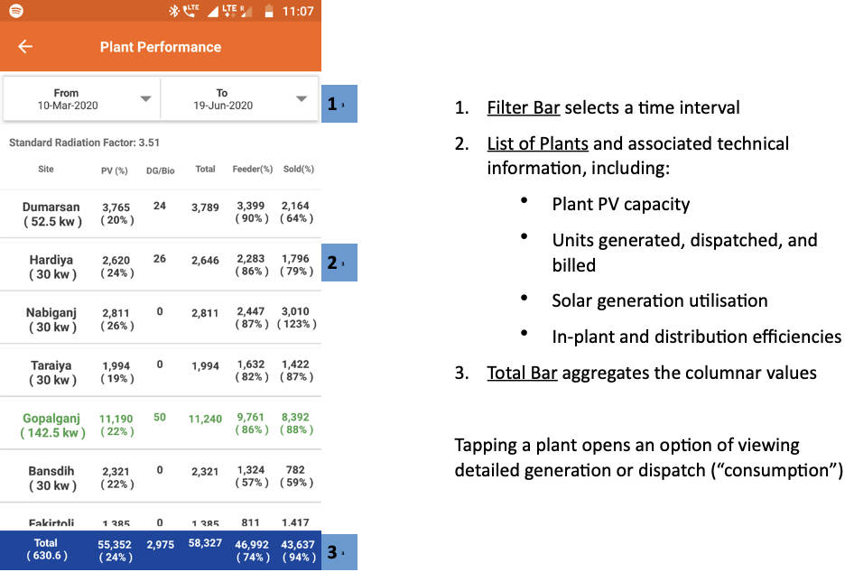 -->
    
**Generation Data**

 

<Clear>

> The energy generated at a particular plant is shown date-wise
>
> The number of PV MPPTs will differ from plant to plant

</Clear>
 

<!-- 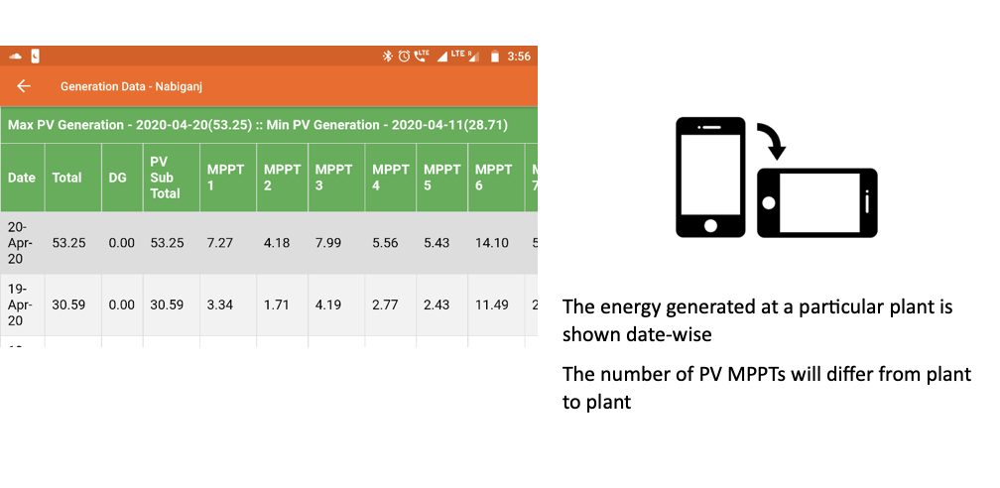 -->

**Consumption Data**

 

<Clear>

> The energy dispatched (“consumed”) froma particular plant is shown date-wise
>
> The number of feeders will differ from plant to plant

</Clear>
 

<!-- 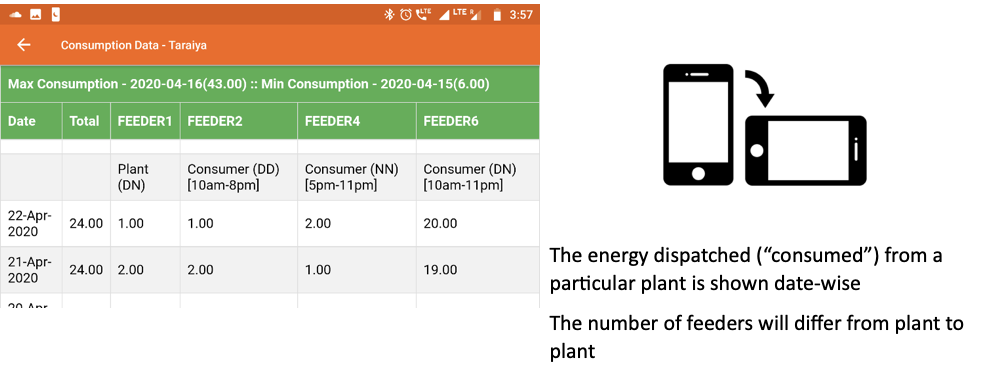 -->

## 3.7.3. Plant Utilisation
**Functionality**
* The Plant Utilisation Section summarises technical performance metrics and energy consumption for each plant
* This functionality is only available for HCLF agents

**Key Users**
<table>
  <tr>
    <th>Designation</th>
    <th>Main Purpose</th>
    <th>Example Use Case</th>
  </tr>
  <tr>
    <td>Technician</td>
    <td>To assess the performance of equipment at the plant</td>
    <td>Calculating in-plant and distribution efficiency</td>
  </tr>
  <tr>
    <td>Cluster In-charge</td>
    <td>To check units consumed by different user groups</td>
    <td>Comparing month-on-month electricity demand from micro-enterprises</td>
  </tr>
  <tr>
    <td>State In-charge</td>
    <td>To compare technical performance of multiple plants</td>
    <td>Calculating the utilisation of the plant to inform whether more customers can be connected</td>
  </tr>
</table>

**Page Details**

 

<Clear>

> The utilization data for each component and variable is showcased.
>
> The utilization percentage will differ from plant to plant

</Clear>
 

<!-- 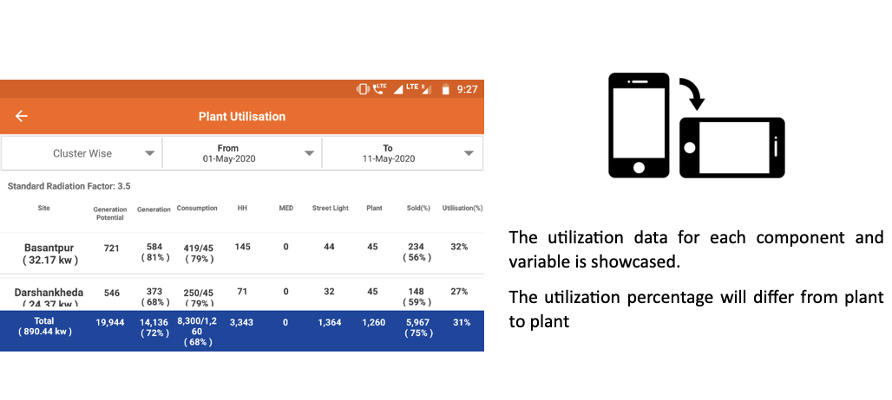 -->

## 3.7.4. Add Generation Data
**Functionality**
* The Add Generation Data module allows the user to input energy generation data into the company database

**Key Users**
<table>
  <tr>
    <th>Designation</th>
    <th>Main Purpose</th>
    <th>Example Use Case</th>
  </tr>
  <tr>
    <td>Operator</td>
    <td>To add generation data for a particular date</td>
    <td>Reading units generated at each solar MPPT daily, and recording in the app</td>
  </tr>
  <tr>
    <td>Technician</td>
    <td>Same as Operator</td>
    <td>Same as Operator</td>
  </tr>
  <tr>
    <td>Cluster In-charge</td>
    <td>Same as Operator</td>
    <td>Same as Operator</td>
  </tr>
  <tr>
    <td>State In-charge</td>
    <td>Same as Operator</td>
    <td>Same as Operator</td>
  </tr>
</table>

**Page Details**

 

<Clear>

1.  <u>Plant Selection</u> must be done as the first step
2.  <u>Date Selection</u> for data input (only the dates with orange dots can be selected, and the oldest data must be entered first)

Tapping the desired date redirects to the data addition page shown in the next screenshot

</Clear>
 
 

<Clear>

1.  <u>Generation Data Entry</u> is done MPPT-wise
2.  <u>Data Header</u> consisting of the plant and date are given at the top of the page

</Clear>
 
 

<Clear>

1.  <u>Confirm and Submit</u> having checked the accuracy of the entered data

</Clear>
 

<!-- 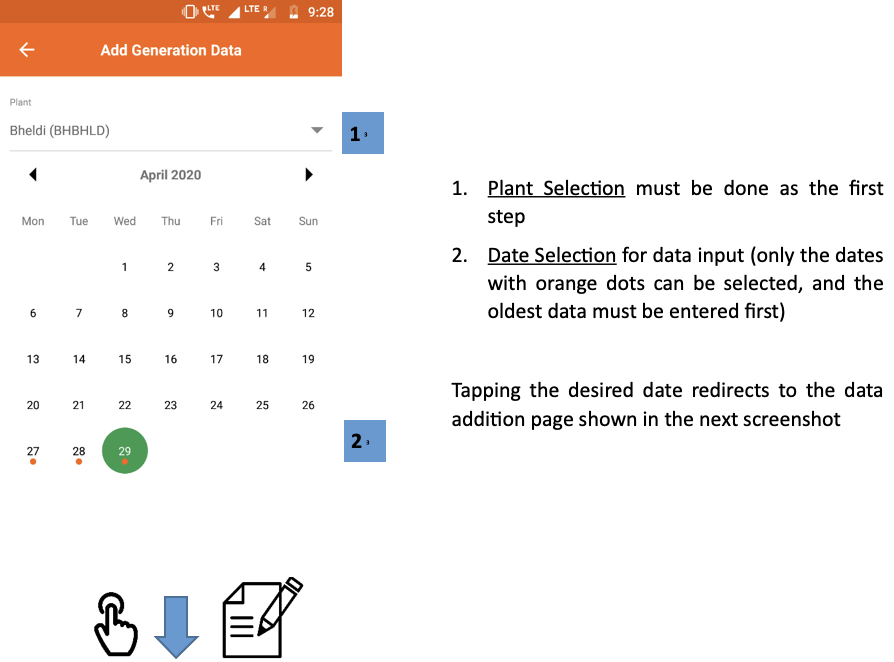

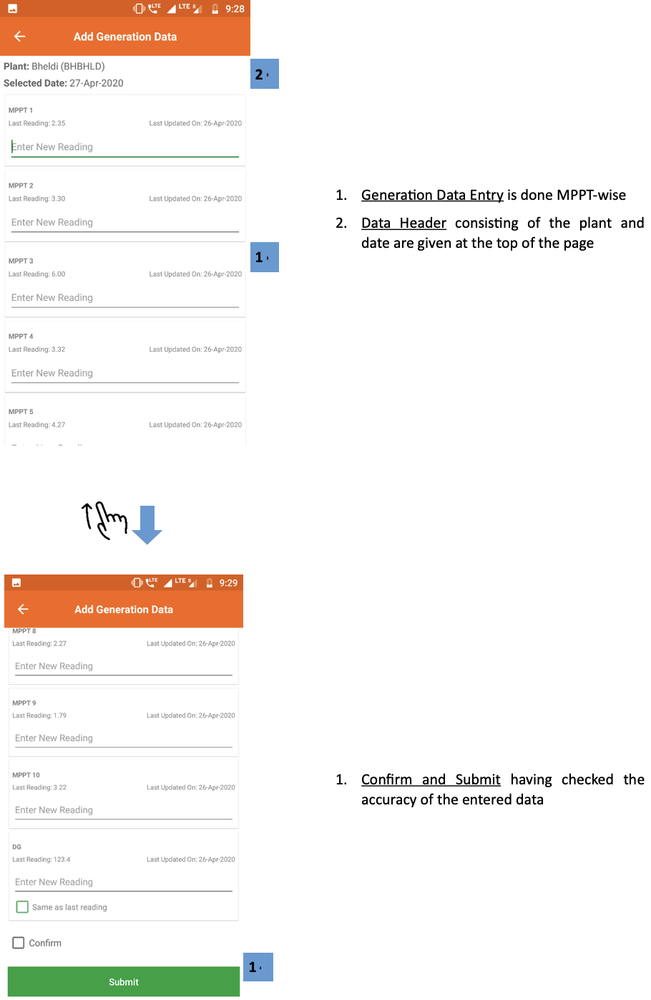 -->

## 3.7.5. Add Consumption Data
**Functionality**
* The Add Consumption Data module allows the user to input energy dispatch data into the company database

**Key Users**
<table>
  <tr>
    <th>Designation</th>
    <th>Main Purpose</th>
    <th>Example Use Case</th>
  </tr>
  <tr>
    <td>Operator</td>
    <td>To add dispatch data for a particular date</td>
    <td>Reading units through each feeder daily, and recording in the app</td>
  </tr>
  <tr>
    <td>Technician</td>
    <td>Same as Operator</td>
    <td>Same as Operator</td>
  </tr>
  <tr>
    <td>Cluster In-charge</td>
    <td>Same as Operator</td>
    <td>Same as Operator</td>
  </tr>
  <tr>
    <td>State In-charge</td>
    <td>Same as Operator</td>
    <td>Same as Operator</td>
  </tr>
</table>

**Page Details**

 

<Clear>

1.  <u>Plant Selection</u> must be done as the first step
2.  <u>Date Selection</u> for data input (only the dates with orange dots can be selected, and the oldest data must be entered first)

Tapping the desired date redirects to the data addition page shown in the next screenshot

</Clear>
 
 

<Clear>

1.  <u>Data Header</u> consisting of the plant and date are given at the top of the page
2.  <u>Consumption Data Entry</u> is done feeder-wise, with details of the previous reading shown for reference
3.  <u>Confirm and Submit</u> having checked the accuracy of the entered data

</Clear>
 

<!-- 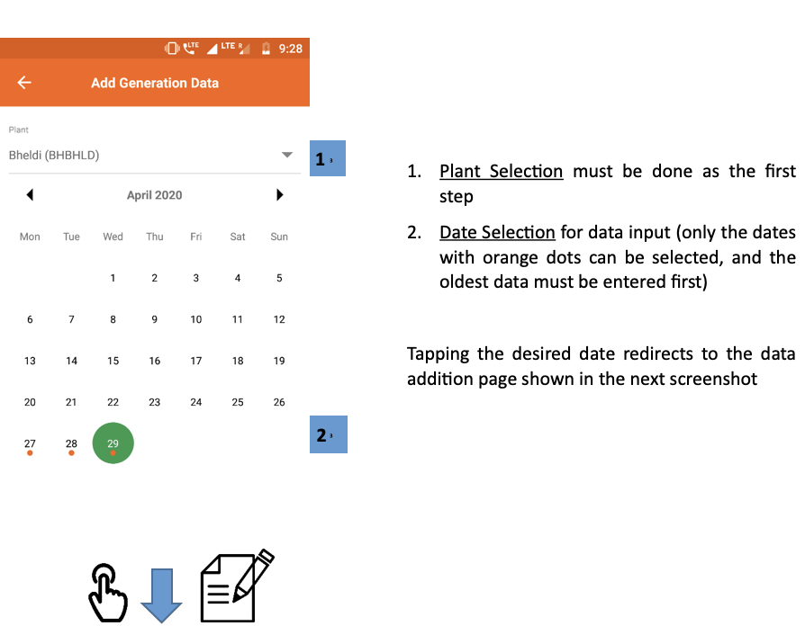

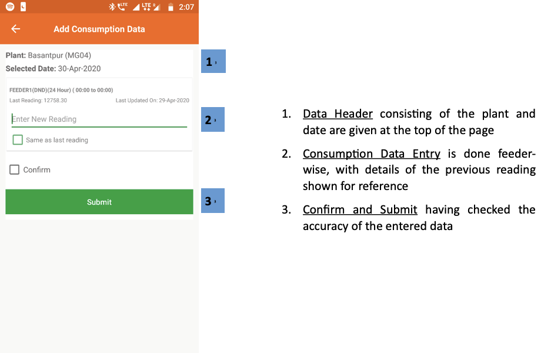 -->

## 3.7.6. Diesel Consumption
**Functionality**
* The Diesel Consumption Section allows the user to input details on plant fuel expenses, along with photos of receipts
* Past expenses and DG usage data can also be reviewed
* Fuel bills are to be reimbursed by the Head Office

**Key Users**
<table>
  <tr>
    <th>Designation</th>
    <th>Main Purpose</th>
    <th>Example Use Case</th>
  </tr>
  <tr>
    <td>Cluster In-charge</td>
    <td>To maintain a record of diesel expenses and fuel use</td>
    <td>Adding a diesel purchase made at a particular plant within the cluster</td>
  </tr>
  <tr>
    <td>State In-charge</td>
    <td>To review diesel expenses and DG usage at different plants</td>
    <td>Checking for fuel pilferage by comparing fuel efficiencies at different plants / times</td>
  </tr>
</table>

**Page Details**

 

<Clear>

1.  <u>Filter Bar</u> selects a time interval for reviewing fuel expenses and use
2.  <u>Summary</u> gives key data-points surrounding fuel use and expenses

    The information icon in the top right redirects to a plant-by-plant comparison, as explained in the next screenshot

3.  <u>List of Purchases</u> details diesel purchases
4.  <u>Add Consumption Data</u> button allows user to submit a new fuel expense, as explained in a subsequent screenshot
5.  <u>Filter Button</u> has the same functionality as the Filter Bar

</Clear>
 
 

<Clear>

The Add Diesel Consumption page allows the user to record new fuel expenses

3.  <u>Consumption Data</u> must be added for company records and for reimbursement
4.  <u>Invoice Number</u> can be found on the bill
5.  <u>Bill Picture</u> must be added as proof

</Clear>
 
 

<Clear>

4.  <u>Confirm</u> must be tapped after information is reviewed
5.  <u>Submit</u> tapped to complete data entry

</Clear>
 
 

<Clear>

This page allows user to view recent diesel expenses for each plant

1.  <u>Filter Bar</u> for specifying date of interest
2.  <u>List of Plants</u> with monthly data on fuel expenses
3.  <u>Green Rows</u> show aggregated cluster data
4.  <u>Total Bar</u> aggregates all plants

</Clear>
 

<!-- 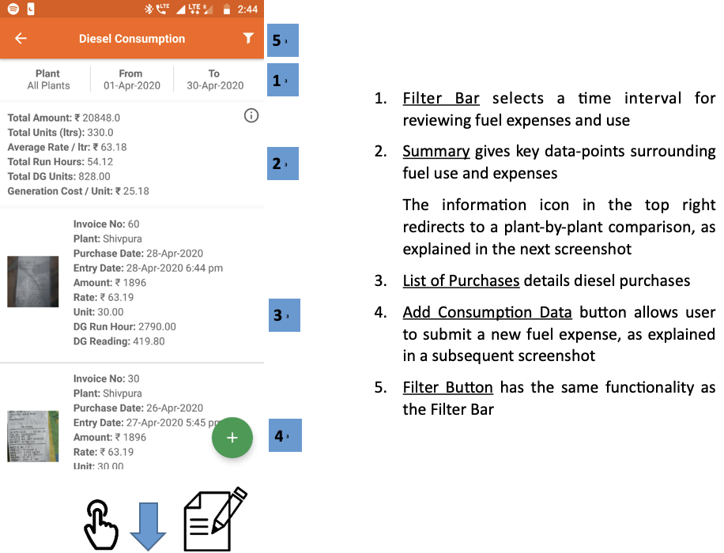

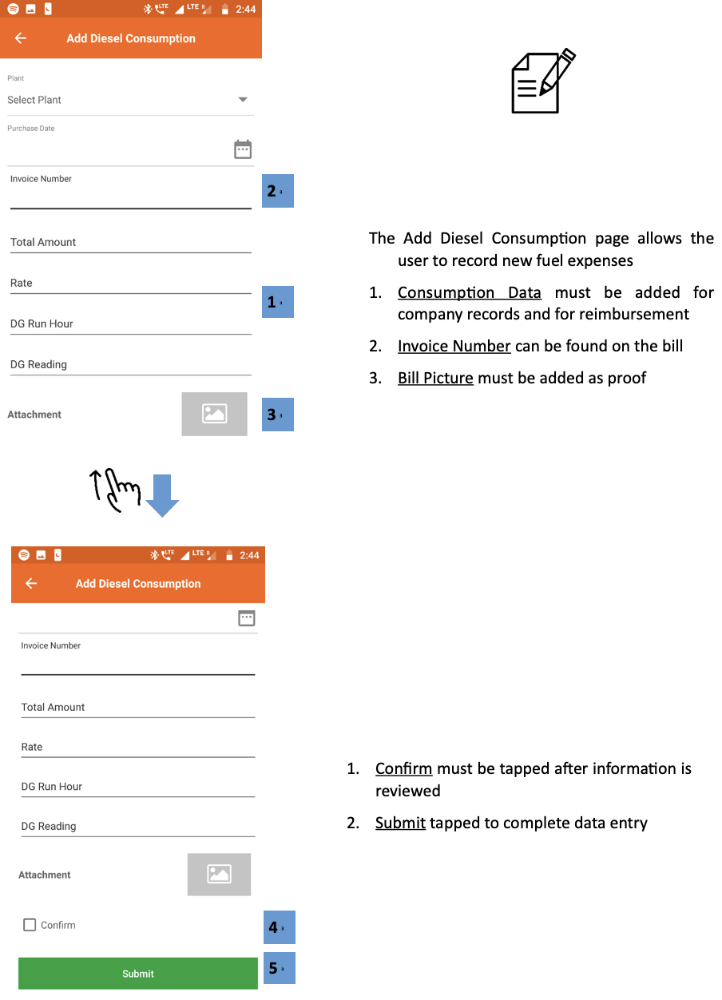

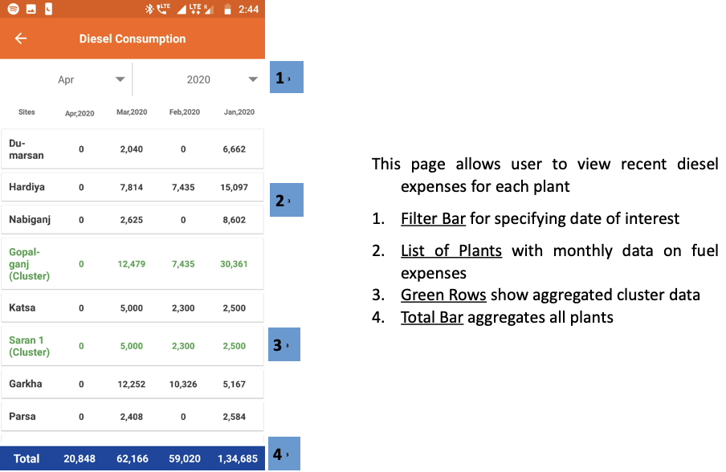 -->

## 3.7.7. Bank Deposit
**Functionality**
* Interface for registering a deposit of collected cash into the company bank account
* Record and summary of past deposits can be viewed, along with in-plant cash records

**Key Users**
<table>
  <tr>
    <th>Designation</th>
    <th>Main Purpose</th>
    <th>Example Use Case</th>
  </tr>
  <tr>
    <td>CSA</td>
    <td>To register new deposits</td>
    <td>Depositing cash collected from customers into the company bank account</td>
  </tr>
  <tr>
    <td>Cluster In-charge</td>
    <td>To view the cash flow for plants in the cluster</td>
    <td>Checking the amount of collected cash is still with filed agents and is yet to be deposited</td>
  </tr>
  <tr>
    <td>State In-charge</td>
    <td>To view the cash flow for plants in the state</td>
    <td>Ensuring bank deposits are going through correctly, and are happening on schedule</td>
  </tr>
</table>

**Page Details**

The page is organised into the following tabs.

| Bank Deposit| In Hand Cash Report| Bank Deposit Review|
|---|---|---|
| Detailed list of historical bank deposits| Plant-wise overview of collections and deposits| Overview of all the bank deposits made and confirmed|

### 3.7.7.1. Bank Deposit tab

 

<Clear>

1.  <u>Navigation Bar</u> indicates current tab and allows switching by tapping or swiping

    

2.  <u>Filter Bar</u> selects a particular plant and time duration
3.  <u>List of Deposits</u> details each bank deposit along with a receipt photo
4.  <u>Add Bank Deposit Data</u> redirects to a page that allows the user to input a new bank deposit, shown in the next screenshot
5.  <u>Search Icon</u> used to search for a particular record

</Clear>
 
 

<Clear>

1.  <u>Bank Deposit Details</u> to be filled by the agent
2.  <u>Submit</u> tapped to complete the form

</Clear>
 

<!-- 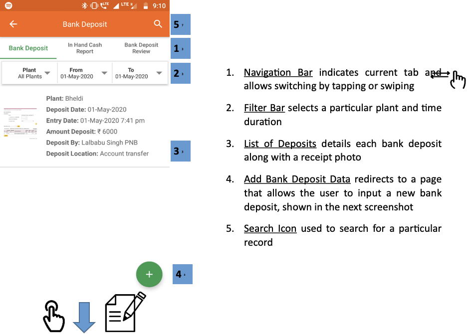

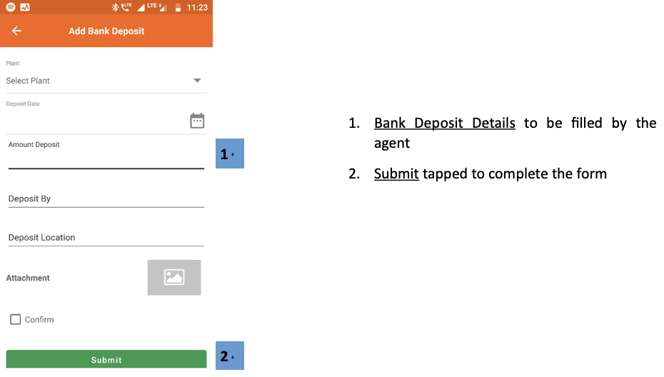 -->

### 3.7.7.2. In Hand Cash Report tab

 

<Clear>

1.  <u>Navigation Bar</u> indicates current tab and allows switching by tapping or swiping

    

2.  <u>Filter Bar</u> selects a particular time duration
3.  <u>List of Plants</u> with total collections, deposits, and amount of cash remaining at the plant
4.  <u>Total Bar</u> aggregates over all plants
5.  <u>Green Rows</u> aggregate over clusters

</Clear>
 

<!-- 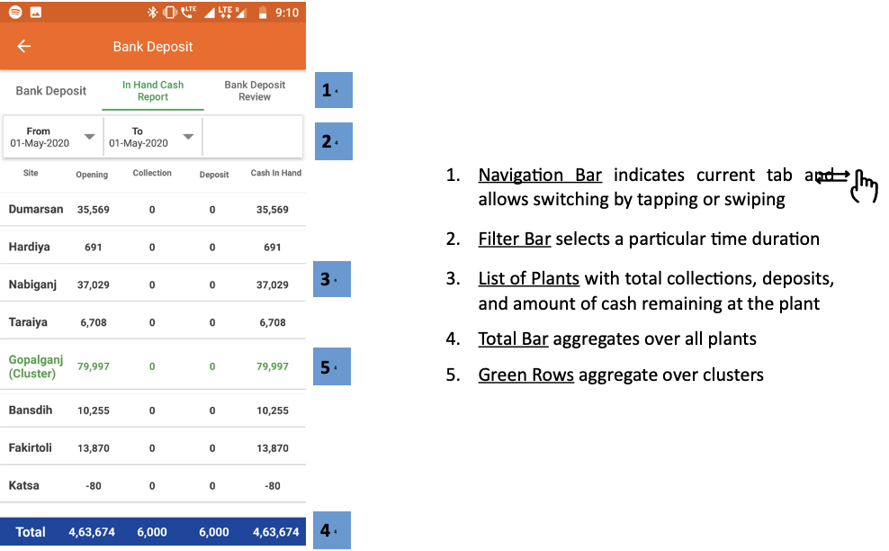 -->

### 3.7.7.3. Bank Deposit Review tab

 

<Clear>

1.  <u>Navigation Bar</u> indicates current tab and allows switching by tapping or swiping

    

2.  <u>Filter Bar</u> selects a particular time duration
3.  <u>List of Plants</u> with total deposits registered and deposits received, along with any anomalies
4.  <u>Total Bar</u> aggregates over all plants
5.  <u>Green Rows</u> aggregate over clusters

</Clear>
 

<!--  -->

## 3.7.8. Plant Shutdown Info
**Functionality**
* The Plant Shutdown Info allows the users to manually shutdown a particular feeder at a specific plant

**Key Users**
<table>
  <tr>
    <th>Designation</th>
    <th>Main Purpose</th>
    <th>Example Use Case</th>
  </tr>
  <tr>
    <td>Cluster In-charge</td>
    <td>To temporarily shut down electricity supply</td>
    <td>Shutting a feeder down for maintenance, for a specified time duration</td>
  </tr>
  <tr>
    <td>State In-charge</td>
    <td>Same as Cluster In-charge</td>
    <td>Same as Cluster In-charge</td>
  </tr>
</table>

**Page Details**

 

<Clear>

1.  <u>Plant Details</u> (plant name and feeder) selected from drop-down lists
2.  <u>Submit</u> must be tapped after filling in all the plant details

</Clear>
 
 

<Clear>

1.  <u>Date Filter</u> must be applied to view the plant status on a particular date
2.  <u>Plant Status</u> On tapping a particular date, the user will be redirected to the Plant Feeder Status page explained in the following screenshot
3.  <u>Submit</u> must be tapped after filling in all the plant details

</Clear>
 
 

<Clear>

1.  <u>Feeder Status</u> for a particular date is displayed, the feeders must be individually switched off by unchecking their corresponding checkboxes
2.  <u>Submit</u> to complete the process

</Clear>
 

<!-- 

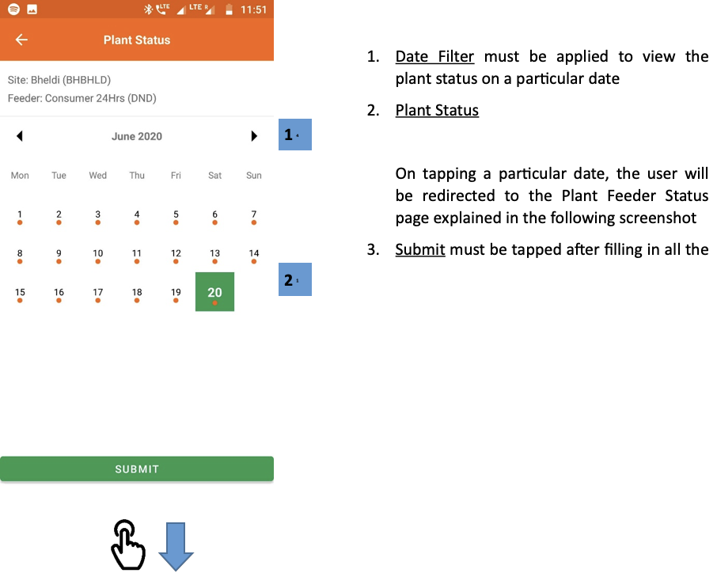

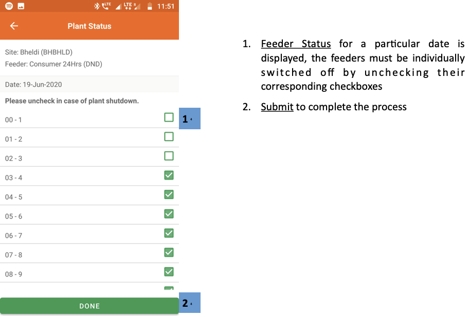 -->

## 3.7.9. Plant Maintenance
**Functionality**
* Allows the users to log technical maintenance activities which have happened at a plant

**Key Users**
<table>
  <tr>
    <th>Designation</th>
    <th>Main Purpose</th>
    <th>Example Use Case</th>
  </tr>
  <tr>
    <td>Cluster In-charge</td>
    <td>To register a plant maintenance activity</td>
    <td>Creating a log of DG servicing or PV panel repair</td>
  </tr>
  <tr>
    <td>State In-charge</td>
    <td>Same as Cluster In-charge</td>
    <td>Same as Cluster In-charge</td>
  </tr>
</table>

**Page Details**

 

<Clear>

1.  <u>Add Maintenance Activity</u> information (the form updates depending on the type of activity)

</Clear>
 
 

<Clear>

2.  <u>Remark</u> addition to be made by the user to give additional information regarding the issue
3.  <u>Attachment</u> photo must be added as a proof of issue

    On completion of the data input, confirm and submit to complete the process

</Clear>
 

<!-- 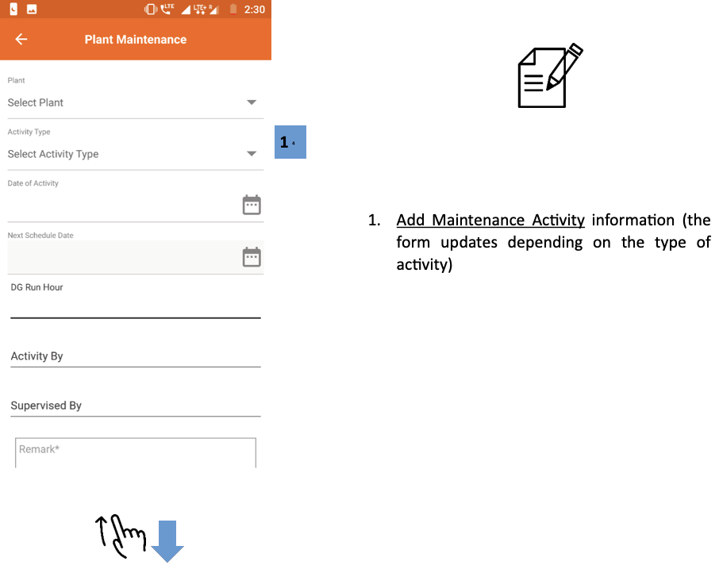

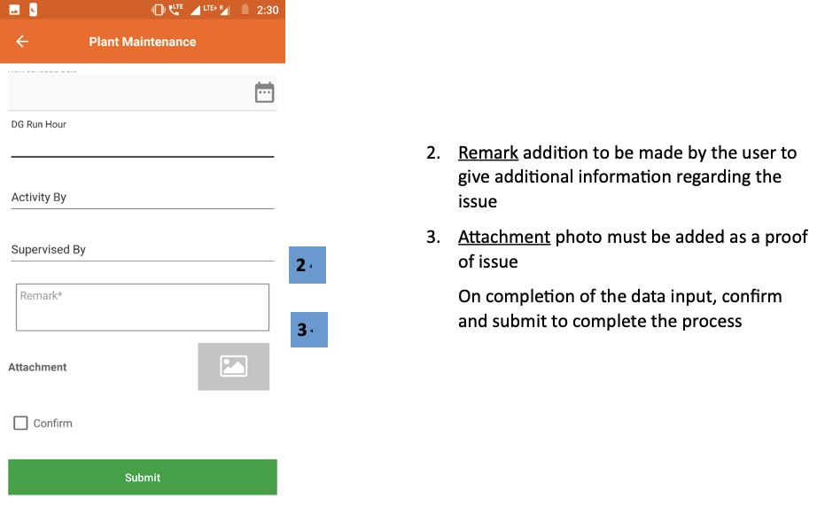 -->

## 3.7.10. DG Log
**Functionality**
* The DG Log Section allows users to track diesel generator performance and runtime

**Key Users**
<table>
  <tr>
    <th>Designation</th>
    <th>Main Purpose</th>
    <th>Example Use Case</th>
  </tr>
  <tr>
    <td>Operator</td>
    <td>To log diesel generator runtime and units output</td>
    <td>Recording each time the DG is switched on and off</td>
  </tr>
  <tr>
    <td>Technician</td>
    <td>Same as Operator</td>
    <td>Same as Operator</td>
  </tr>
  <tr>
    <td>CSA</td>
    <td>Same as Operator</td>
    <td>Same as Operator</td>
  </tr>
  <tr>
    <td>Cluster In-charge</td>
    <td>To view generator usage at different plants</td>
    <td>Checking how reliance of different plants on backup generators changes over time</td>
  </tr>
  <tr>
    <td>State In-charge</td>
    <td>Same as Cluster In-charge</td>
    <td>Same as Cluster In-charge</td>
  </tr>
</table>

**Page Details**

 

<Clear>

1.  <u>Filter Bar</u> for selecting the time period
2.  <u>List of Plants</u> showing run hours and units generated in the time interval
3.  <u>Total Bar</u> aggregates over all plants

</Clear>
 
 

<Clear>

Tapping a particular plant redirects to a detailed DG run log

1.  <u>DG Log</u> details all instances of DG being run
2.  <u>Add DG Log Entry</u> allows users to input DG runtime data, explained in the next screenshot

</Clear>
 
 

<Clear>

1.  <u>DG Logging</u> information added by the user
2.  <u>Submit</u> tapped to complete the entry

</Clear>
 

<!-- 

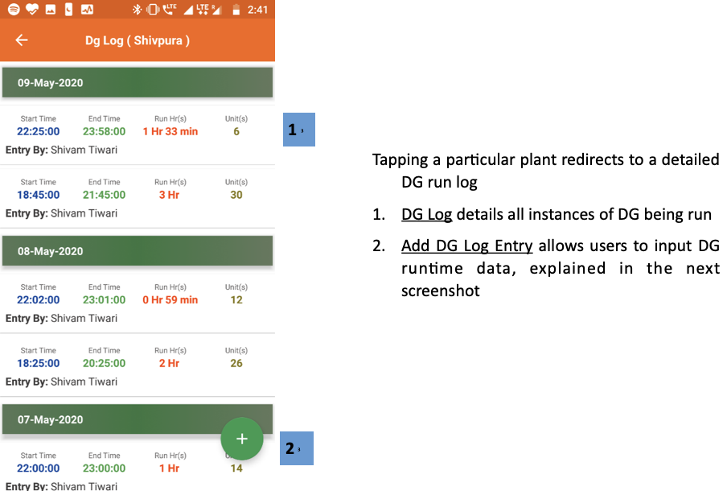

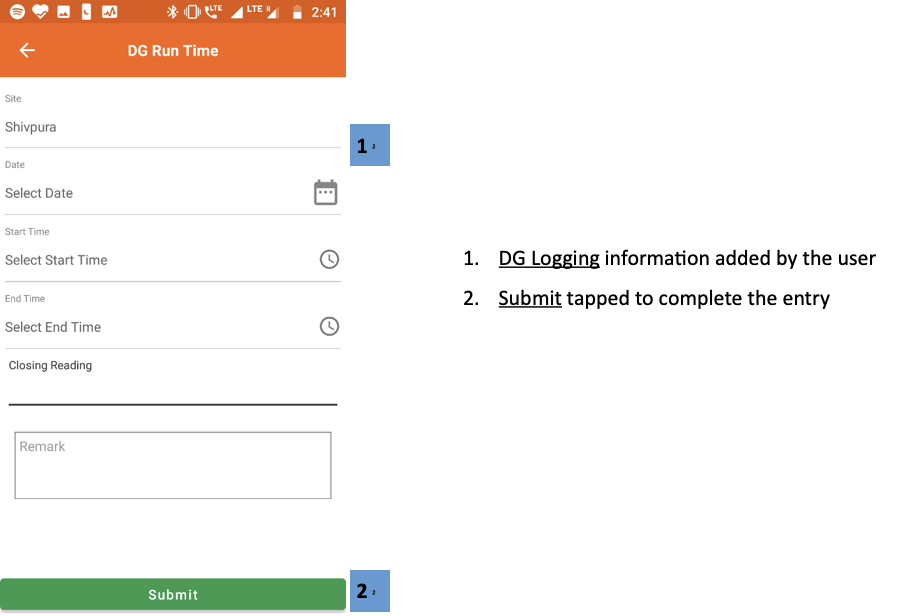 -->
