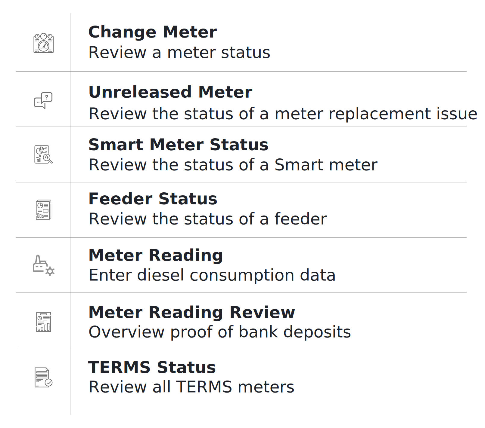
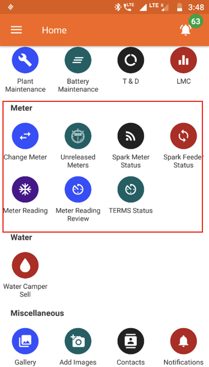

## Overview

  

 

## Change Meter
**Functionality**
* Allows users to request replacement of a customer’s energy meter

**Key Users**
<table>
  <tr>
    <th>Designation</th>
    <th>Main Purpose</th>
    <th>Example Use Case</th>
  </tr>
  <tr>
    <td>Cluster In-charge</td>
    <td>To request a change of meter for a customer</td>
    <td>Registering and switching out a malfunctioning meter</td>
  </tr>
  <tr>
    <td>State In-charge</td>
    <td>Same as Cluster In-charge</td>
    <td>Same as Cluster In-charge</td>
  </tr>
</table>

**Page Details**

## Unreleased Meter
**Functionality**
* Tracks pending and completed meter change tasks
* These meters are to be unmounted, either because of a malfunction or expiry of the customer’s subscription
* The meter is then taken to the warehouse or assigned to a different customer’s subscription

**Key Users**
<table>
  <tr>
    <th>Designation</th>
    <th>Main Purpose</th>
    <th>Example Use Case</th>
  </tr>
  <tr>
    <td>Cluster In-charge</td>
    <td>To view pending meter change requests and assign to field agents</td>
    <td>Contacting the agent who worked on a particular meter assignment</td>
  </tr>
  <tr>
    <td>State In-charge</td>
    <td>To view and acknowledge meter changes</td>
    <td>Checking the number of pending meter assignments</td>
  </tr>
</table>

**Page Details**

The page is organised into the following tabs

|Pending| Review| Completed|
|---|---|---|
| View of pending meter requests, assign to agent, and mark completed| List of completed meter requests| List of historical completed and acknowledged meter requests|

### Pending tab

### Review tab

### Completed tab

## Spark Meter Status
**Functionality**
* Gives limited access to smart Spark meter data
* The user may remotely switch meters on and off from here 
* Refer to Section 3.4.5 for more information

## Spark Feeder Status
**Functionality**
* The Spark Feeder Status Section allows a user to reset or change configuration of a Spark Feeder through the application

**Key Users**
<table>
  <tr>
    <th>Designation</th>
    <th>Main Purpose</th>
    <th>Example Use Case</th>
  </tr>
  <tr>
    <td>Cluster In-charge</td>
    <td>Control the state of the meter for all customers on a particular feeder</td>
    <td>Shutting off a large number of meters in case of a technical emergency</td>
  </tr>
  <tr>
    <td>State In-charge</td>
    <td>Same as Cluster In-charge</td>
    <td>Shutting off the meter of a customer whose faulty appliance is impacting the whole distribution network</td>
  </tr>
</table>

**Page Details**

## Meter Reading
**Functionality**
* The Meter Reading Section shows the electricity meter readings which are required at each plant

**Key Users**
<table>
  <tr>
    <th>Designation</th>
    <th>Main Purpose</th>
    <th>Example Use Case</th>
  </tr>
  <tr>
    <td>Technician</td>
    <td>To view which customer meters need to be read</td>
    <td>Planning which customers to visit for metering before the end of the month</td>
  </tr>
  <tr>
    <td>CSA</td>
    <td>Same as Technician</td>
    <td>Same as Technician</td>
  </tr>
  <tr>
    <td>Cluster In-charge</td>
    <td>To check the number of pending meter readings</td>
    <td>Contacting field agents to remind them about incomplete meter readings</td>
  </tr>
  <tr>
    <td>State In-charge</td>
    <td>Same as Cluster In-charge</td>
    <td>Same as Cluster In-charge</td>
  </tr>
</table>

**Page Details**

## Meter Reading Review
**Functionality**
* The Meter Reading Review Section displays the number of pending meter readings reviews, plant wise
* The meter reading process is completed by agents at the beginning or end of a month to record the electricity consumption of households that do not have a smart meter

**Key Users**
<table>
  <tr>
    <th>Designation</th>
    <th>Main Purpose</th>
    <th>Example Use Case</th>
  </tr>
  <tr>
    <td>CSA</td>
    <td>To assess the number of consumers who are yet to undergo the meter reading</td>
    <td>Assessing the number of completed reading reviews in a month</td>
  </tr>
  <tr>
    <td>Cluster In-charge</td>
    <td>To conduct a review on the consumers whose meter readings are still pending</td>
    <td>Assessing the number of pending reviews within the cluster</td>
  </tr>
  <tr>
    <td>State In-charge</td>
    <td>Same as Cluster In-charge</td>
    <td>Assessing the number of pending reviews at a plant</td>
  </tr>
</table>

**Page Details**

## TERMS Status
**Functionality**
* Gives access to smart TERMS meter data
* The user may remotely switch customer meters on and off from here

**Key Users**
<table>
  <tr>
    <th>Designation</th>
    <th>Main Purpose</th>
    <th>Example Use Case</th>
  </tr>
  <tr>
    <td>Operator</td>
    <td>To access information about and control of a customer’s meter</td>
    <td>Investigating why a customer meter may have tripped off – e.g. they are deactivated</td>
  </tr>
  <tr>
    <td>Technician</td>
    <td>Same as Operator</td>
    <td>Switching a meter on or off</td>
  </tr>
  <tr>
    <td>CSA</td>
    <td>Same as Operator</td>
    <td>Same as Technician</td>
  </tr>
  <tr>
    <td>Cluster In-charge</td>
    <td>Same as Operator</td>
    <td>Same as Technician</td>
  </tr>
  <tr>
    <td>State In-charge</td>
    <td>Same as Operator</td>
    <td>Same as Technician</td>
  </tr>
</table>

**Page Details**

## Battery Maintenance
**Functionality**
* The Battery Maintenance Section gives an overview on the battery banks at every plant
* The section allows the user to switch the battery pack on or off

**Key Users**
<table>
  <tr>
    <th>Designation</th>
    <th>Main Purpose</th>
    <th>Example Use Case</th>
  </tr>
  <tr>
    <td>Technician</td>
    <td>To change the state of a battery bank</td>
    <td>Switching the battery status of a plant between on and off</td>
  </tr>
  <tr>
    <td>Cluster In-charge</td>
    <td>Same as Technician</td>
    <td>Same as Technician</td>
  </tr>
  <tr>
    <td>State In-charge</td>
    <td>To check which batteries are online</td>
    <td>Creating a report on the number of battery packs available at each plant</td>
  </tr>
</table>

**Page Details**

