import useBaseUrl from '@docusaurus/useBaseUrl';
export const Highlight = ({children, color}) => (
  
    {children}
  
);

export const Clear = ({children}) => (
  

    {children}
  

);

## 3.8.1. Overview

 

 

## 3.8.2. Change Meter
**Functionality**
* Allows users to request replacement of a customer’s energy meter

**Key Users**
<table>
  <tr>
    <th>Designation</th>
    <th>Main Purpose</th>
    <th>Example Use Case</th>
  </tr>
  <tr>
    <td>Cluster In-charge</td>
    <td>To request a change of meter for a customer</td>
    <td>Registering and switching out a malfunctioning meter</td>
  </tr>
  <tr>
    <td>State In-charge</td>
    <td>Same as Cluster In-charge</td>
    <td>Same as Cluster In-charge</td>
  </tr>
</table>

**Page Details**

 

<Clear>

1.  <u>Customer Information</u> to be input
2.  <u>Meter Information</u> will automatically populate, along with option to select anew meter
3.  <u>Review</u> tapped to complete the process

</Clear>
 

<!-- 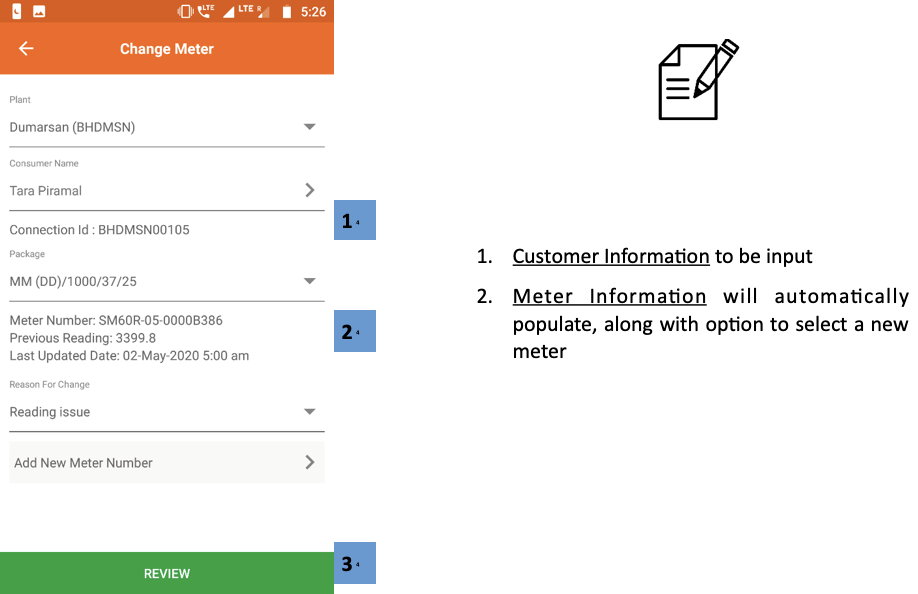 -->

## 3.8.3. Unreleased Meter
**Functionality**
* Tracks pending and completed meter change tasks
* These meters are to be unmounted, either because of a malfunction or expiry of the customer’s subscription
* The meter is then taken to the warehouse or assigned to a different customer’s subscription

**Key Users**
<table>
  <tr>
    <th>Designation</th>
    <th>Main Purpose</th>
    <th>Example Use Case</th>
  </tr>
  <tr>
    <td>Cluster In-charge</td>
    <td>To view pending meter change requests and assign to field agents</td>
    <td>Contacting the agent who worked on a particular meter assignment</td>
  </tr>
  <tr>
    <td>State In-charge</td>
    <td>To view and acknowledge meter changes</td>
    <td>Checking the number of pending meter assignments</td>
  </tr>
</table>

**Page Details**

The page is organised into the following tabs

|Pending| Review| Completed|
|---|---|---|
| View of pending meter requests, assign to agent, and mark completed| List of completed meter requests| List of historical completed and acknowledged meter requests|

### 3.8.3.1. Pending tab

 

<Clear>

1.  <u>Navigation Bar</u> indicates current tab and allows switching by tapping or swiping

    

2.  <u>Pending Meter List</u> with information on each meter. Agents can be called by tapping on their names
3.  <u>Task Buttons</u> are used to allocate tasks to field agents and register the new location of a meter

    The task can be either reassigned to a different agent or executed (processed) towards reviewing on completion

</Clear>
 

<!-- 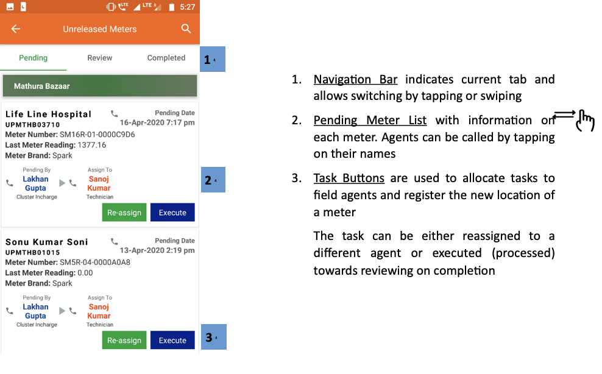 -->

### 3.8.3.2. Review tab

 

<Clear>

1.  <u>Navigation Bar</u> indicates current tab and allows switching by tapping or swiping

    

2.  <u>Review Meter List</u> with information on each completed meter activity that is pending review
3.  <u>Task Buttons</u> used to confirm completed tasks

</Clear>
 

<!-- 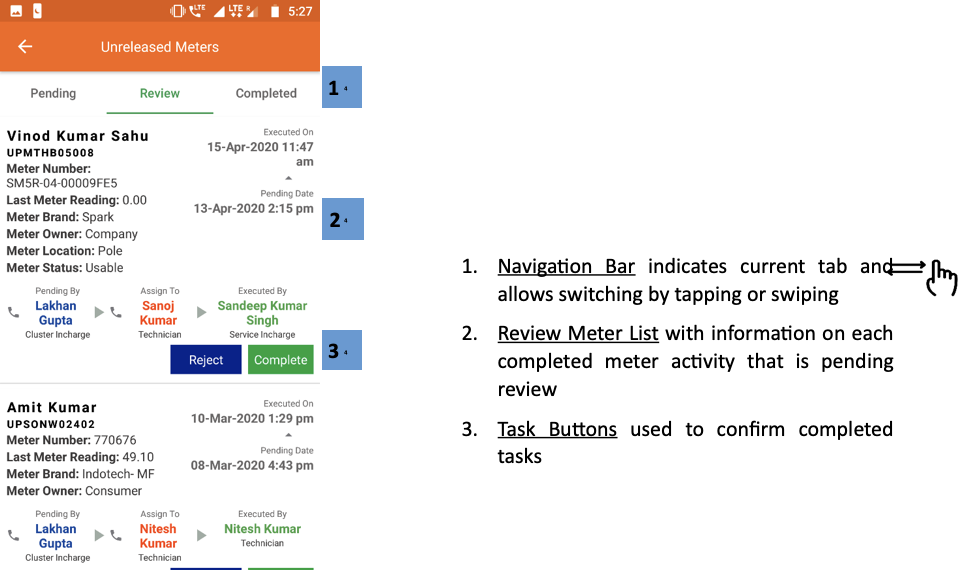 -->

### 3.8.3.3. Completed tab

 

<Clear>

1.  <u>Navigation Bar</u> indicates current tab and allows switching by tapping or swiping

    

2.  <u>Released Meter List</u> with information on each completed meter release activity
3.  <u>Filter Bar</u> to narrow results by plant and time interval

</Clear>
 

<!--  -->

## 3.8.4. Smart Meter Status
**Functionality**
* Gives limited access to smart Smart meter data
* The user may remotely switch meters on and off from here 
* Refer to Section 3.4.5 for more information

## 3.8.5. Smart Feeder Status
**Functionality**
* The Smart Feeder Status Section allows a user to reset or change configuration of a Smart Feeder through the application

**Key Users**
<table>
  <tr>
    <th>Designation</th>
    <th>Main Purpose</th>
    <th>Example Use Case</th>
  </tr>
  <tr>
    <td>Cluster In-charge</td>
    <td>Control the state of the meter for all customers on a particular feeder</td>
    <td>Shutting off a large number of meters in case of a technical emergency</td>
  </tr>
  <tr>
    <td>State In-charge</td>
    <td>Same as Cluster In-charge</td>
    <td>Shutting off the meter of a customer whose faulty appliance is impacting the whole distribution network</td>
  </tr>
</table>

**Page Details**

 

<Clear>

1.  <u>Enter Details</u> for plant and feeder number
2.  <u>Submit</u> to continue to the next page

    Note that the feeder entry tab will only show once the plant has been selected

</Clear>
 
 

    
<Clear>

1. <u>Feeder Information</u> shown
2. <u>Meter Status</u> can be chosen between:
   
* Off
* On
* Auto

The user can also reset the meter to its default state by tapping the reset button

</Clear>
 

<!-- 

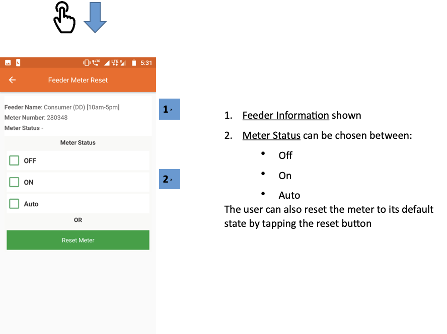 -->

## 3.8.6. Meter Reading
**Functionality**
* The Meter Reading Section shows the electricity meter readings which are required at each plant

**Key Users**
<table>
  <tr>
    <th>Designation</th>
    <th>Main Purpose</th>
    <th>Example Use Case</th>
  </tr>
  <tr>
    <td>Technician</td>
    <td>To view which customer meters need to be read</td>
    <td>Planning which customers to visit for metering before the end of the month</td>
  </tr>
  <tr>
    <td>CSA</td>
    <td>Same as Technician</td>
    <td>Same as Technician</td>
  </tr>
  <tr>
    <td>Cluster In-charge</td>
    <td>To check the number of pending meter readings</td>
    <td>Contacting field agents to remind them about incomplete meter readings</td>
  </tr>
  <tr>
    <td>State In-charge</td>
    <td>Same as Cluster In-charge</td>
    <td>Same as Cluster In-charge</td>
  </tr>
</table>

**Page Details**

 

<Clear>

1.  <u>List of Plants</u> along with number of manually read meters at each plant, and number of meters still pending reading
2.  <u>Green Rows</u> aggregates data for the cluster
3.  <u>Total Bar</u>aggregates over all plants

Tapping a particular plant shows the user a list of pending meters, as shown in the next screenshot (note that this functionality is only available after the 24th of the month)

</Clear>
 
 

<Clear>

1.  <u>Search Icon</u> allows the user to segregate the listed consumers at a plant
2.  <u>Consumer List</u> enables the agent to review the consumer consumption history in terms of the previous reading values and the units consumed

</Clear>
 

<!-- 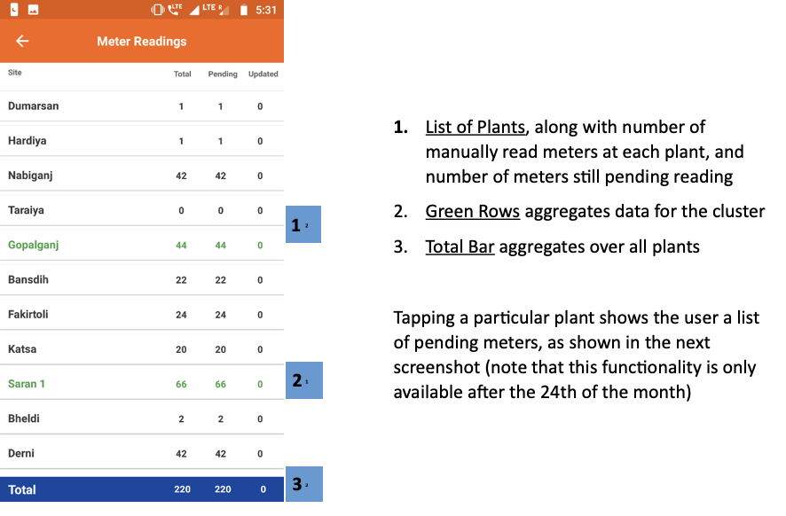

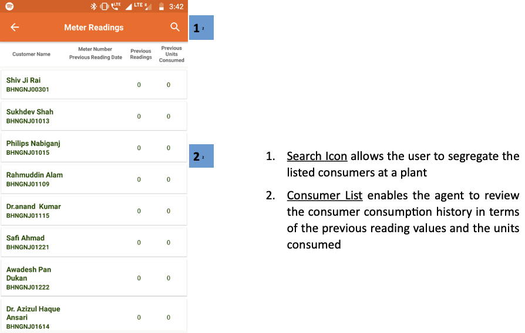 -->

## 3.8.7. Meter Reading Review
**Functionality**
* The Meter Reading Review Section displays the number of pending meter readings reviews, plant wise
* The meter reading process is completed by agents at the beginning or end of a month to record the electricity consumption of households that do not have a smart meter

**Key Users**
<table>
  <tr>
    <th>Designation</th>
    <th>Main Purpose</th>
    <th>Example Use Case</th>
  </tr>
  <tr>
    <td>CSA</td>
    <td>To assess the number of consumers who are yet to undergo the meter reading</td>
    <td>Assessing the number of completed reading reviews in a month</td>
  </tr>
  <tr>
    <td>Cluster In-charge</td>
    <td>To conduct a review on the consumers whose meter readings are still pending</td>
    <td>Assessing the number of pending reviews within the cluster</td>
  </tr>
  <tr>
    <td>State In-charge</td>
    <td>Same as Cluster In-charge</td>
    <td>Assessing the number of pending reviews at a plant</td>
  </tr>
</table>

**Page Details**

 

<Clear>

1.  <u>Meter Readings Approvals</u> are shown in a tabular column with relevant data given plant wise
2.  <u>Green Rows</u> aggregate the data for each cluster they represent
3.  <u>Total Bar</u> aggregates the columnar data

    Tapping onto a particular plant will give the user a functionality that is only available after the 24th of every month

</Clear>
 

<!-- 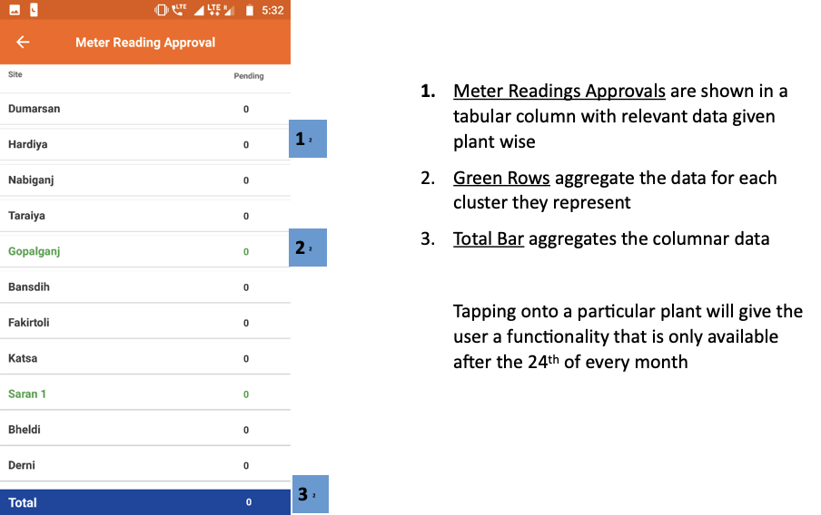 -->

## 3.8.8. TERMS Status
**Functionality**
* Gives access to smart TERMS meter data
* The user may remotely switch customer meters on and off from here

**Key Users**
<table>
  <tr>
    <th>Designation</th>
    <th>Main Purpose</th>
    <th>Example Use Case</th>
  </tr>
  <tr>
    <td>Operator</td>
    <td>To access information about and control of a customer’s meter</td>
    <td>Investigating why a customer meter may have tripped off – e.g. they are deactivated</td>
  </tr>
  <tr>
    <td>Technician</td>
    <td>Same as Operator</td>
    <td>Switching a meter on or off</td>
  </tr>
  <tr>
    <td>CSA</td>
    <td>Same as Operator</td>
    <td>Same as Technician</td>
  </tr>
  <tr>
    <td>Cluster In-charge</td>
    <td>Same as Operator</td>
    <td>Same as Technician</td>
  </tr>
  <tr>
    <td>State In-charge</td>
    <td>Same as Operator</td>
    <td>Same as Technician</td>
  </tr>
</table>

**Page Details**

 

<Clear>

1.  <u>Plant Selection</u> must be made for the customer list to show
2.  <u>Customer List</u> of a particular plant
    
* <Highlight color="#FF0000">Red</Highlight> - Inactive customer
* <Highlight color="#008000">Green</Highlight> - Active customer

3.  <u>Search Icon</u> used to filter the consumer list by typing in a name or meter number

Tapping a customer redirects to that meter’s meter control page, shown in the next screenshot

</Clear>
 
 

<Clear>

1.  <u>Customer Information</u> provides relevant information on the customer and the assigned TERMS meter
2.  <u>Meter Status</u> can be changed by tapping ON, OFF or the Reset button

</Clear>
 

<!-- 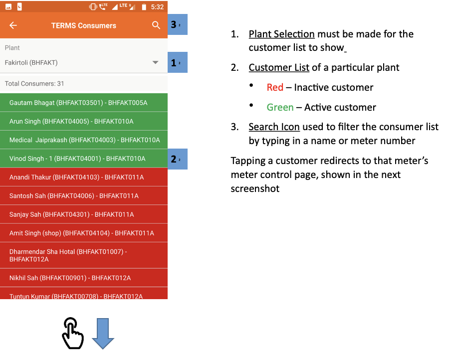

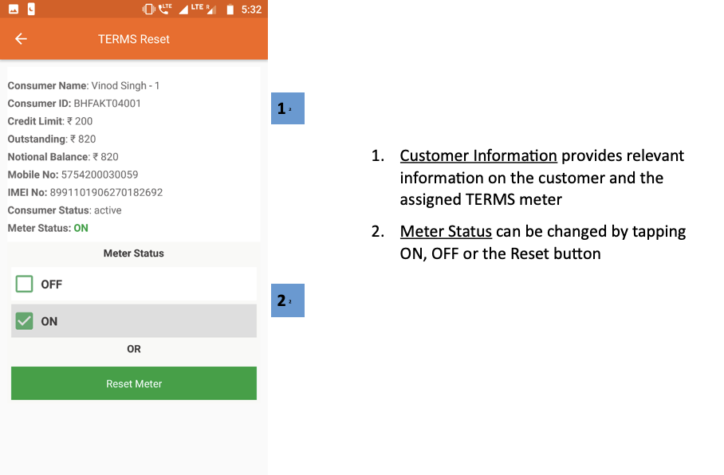 -->

## 3.8.9. Battery Maintenance
**Functionality**
* The Battery Maintenance Section gives an overview on the battery banks at every plant
* The section allows the user to switch the battery pack on or off

**Key Users**
<table>
  <tr>
    <th>Designation</th>
    <th>Main Purpose</th>
    <th>Example Use Case</th>
  </tr>
  <tr>
    <td>Technician</td>
    <td>To change the state of a battery bank</td>
    <td>Switching the battery status of a plant between on and off</td>
  </tr>
  <tr>
    <td>Cluster In-charge</td>
    <td>Same as Technician</td>
    <td>Same as Technician</td>
  </tr>
  <tr>
    <td>State In-charge</td>
    <td>To check which batteries are online</td>
    <td>Creating a report on the number of battery packs available at each plant</td>
  </tr>
</table>

**Page Details**

 

<Clear>

1.  <u>Search Icon</u> can be used to filter out the list of plants shown 
2.  <u>Filter Bar</u> selects a particular plant and time period 
3.  <u>Plant List</u> displays relevant information on the battery status of each plant

Tapping on a plant tab will redirect the user to the plant’s battery bank control page, explained in the next screenshot

</Clear>
 
 

<Clear>

1.  <u>Battery Bank Status</u> can be used to switch a battery bank at the plant on and off

</Clear>
 

<!-- 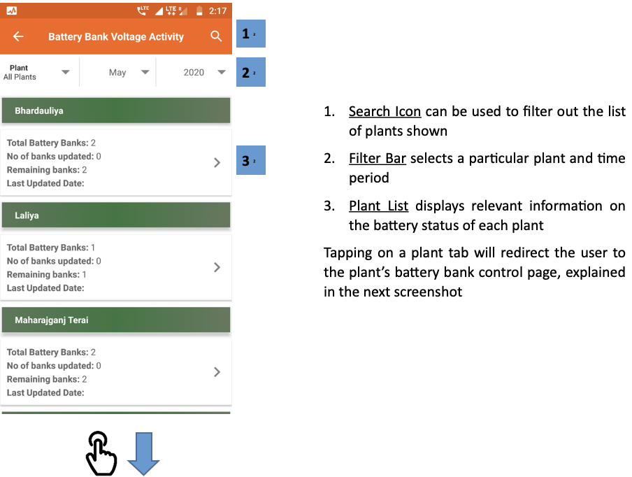

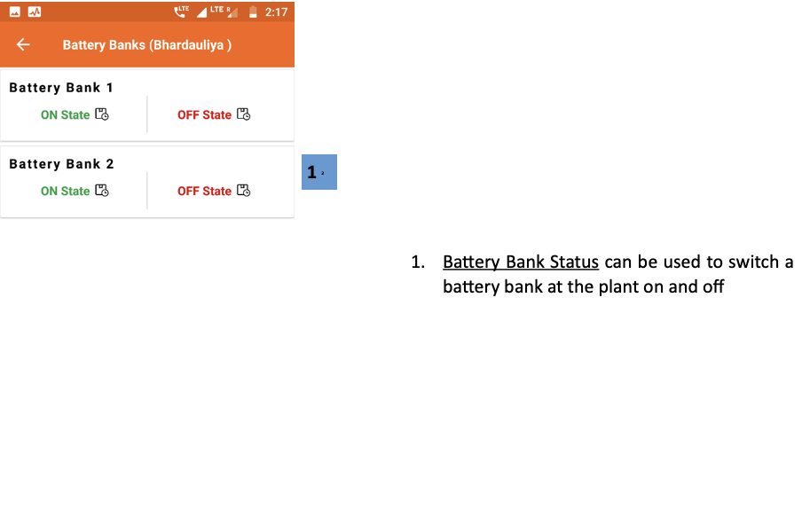 -->
