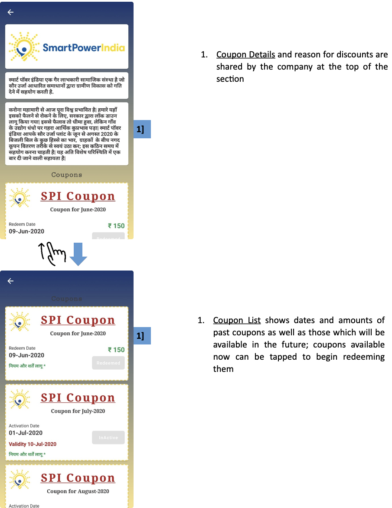

import useBaseUrl from '@docusaurus/useBaseUrl';
export const Clear = ({children}) => (
  

    {children}
  

);

**Functionality**
* The Schemes and Offers page allows customers to avail discount coupons.

**Page Details**

 

<Clear>

1.  <u>Coupon Details</u> and reason for discounts are shared by the company at the top of the section

</Clear>
 
 

<Clear>

1.  <u>Coupon List</u> shows dates and amounts of past coupons as well as those which will be available in the future; coupons available now can be tapped to begin redeeming them

</Clear>
 

<!--  -->