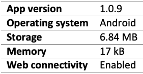
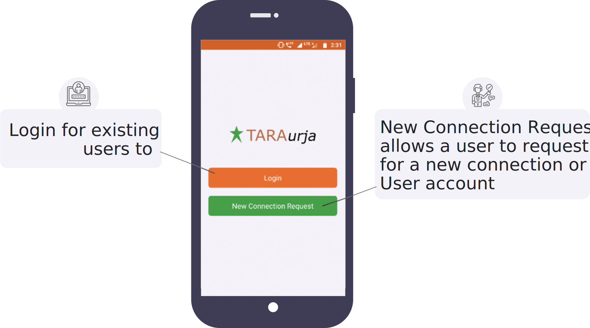
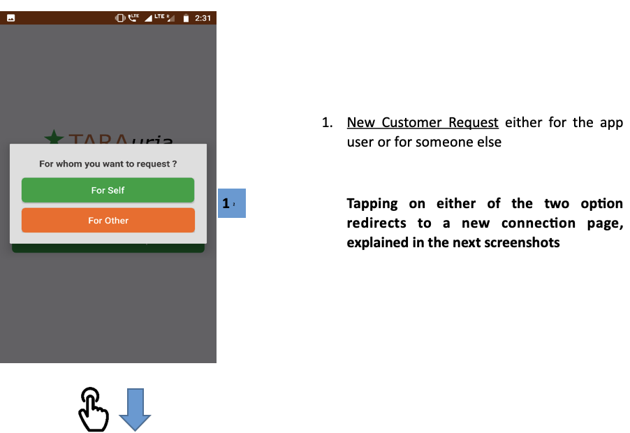
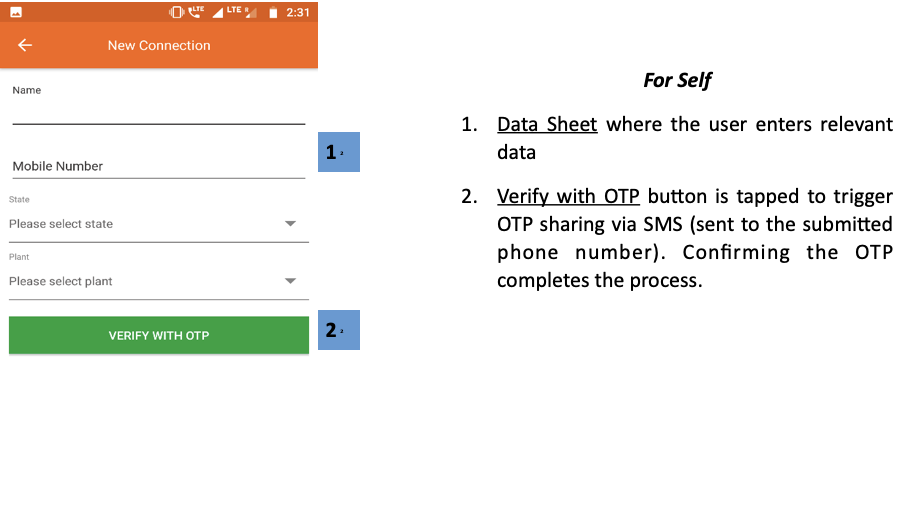
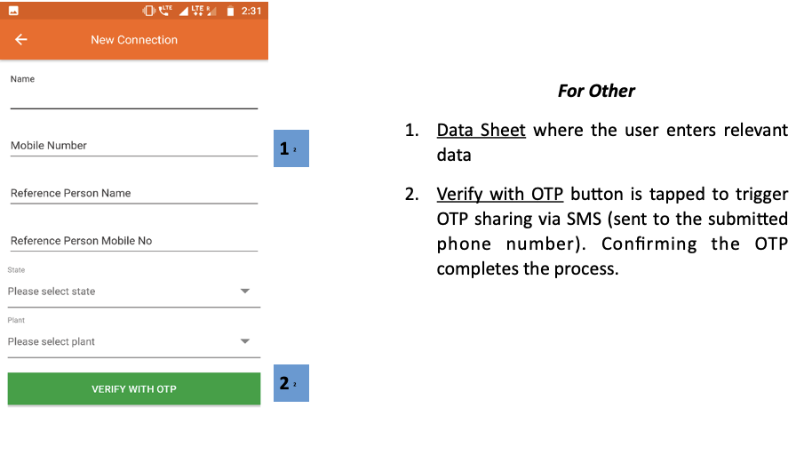
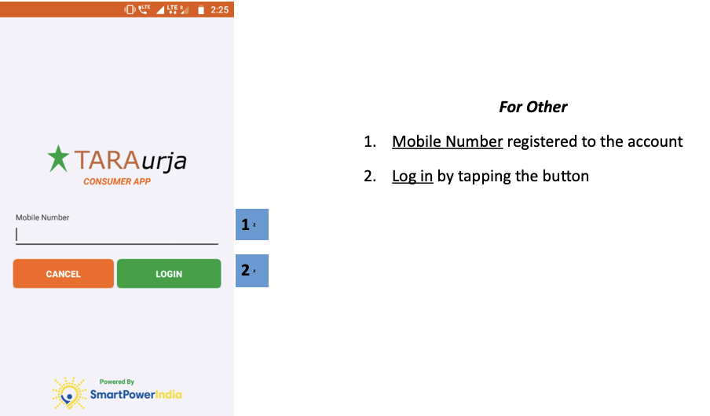

import useBaseUrl from '@docusaurus/useBaseUrl';
export const Clear = ({children}) => (
  

    {children}
  

);

* The field agent app runs on the Android operating system
* Hardware requirements are shown in Table.
	##### Table 2: Customer app hardware requirements.
	

* The app can be downloaded from the Google Play store and other app repositories.
	* To locate the app, the user can type “TARAurja” into the search bar.
		##### Figure: Customer app icon.
		
* Upon opening the application, the user is prompted for their login credentials, as shown in the screenshot below.
	

## 4.2.1. New Connection Request
**Functionality**
* Allows the app user to register a request for a new connection or account
* This can be done for the user or on behalf of another

**Page Details**

 

<Clear>

1.  <u>New Customer Request</u> either for the app user or for someone else

    **Tapping on either of the two option redirects to a new connection page, explained in the next screenshots**

</Clear>
 
 

<Clear>

**For Self**

1.  <u>Data Sheet</u> where the user enters relevant data
2.  <u>Verify with OTP</u> button is tapped to trigger OTP sharing via SMS (sent to the submitted phone number). Confirming the OTP completes the process.

</Clear>
 
 

<Clear>

**For Other**

1.  <u>Data Sheet</u> where the user enters relevant data
2.  <u>Verify with OTP</u> button is tapped to trigger OTP sharing via SMS (sent to the submitted phone number). Confirming the OTP completes the process.

</Clear>
 

<!-- 

 -->

## 4.2.2. Login
**Functionality**
*The login page allows existing users to securely access their account.

**Page Details**

 

<Clear>

**For Other**

1.  <u>Mobile Number</u> registered to the account
2.  <u>Log in</u> by tapping the button

</Clear>
 

<!--   -->

