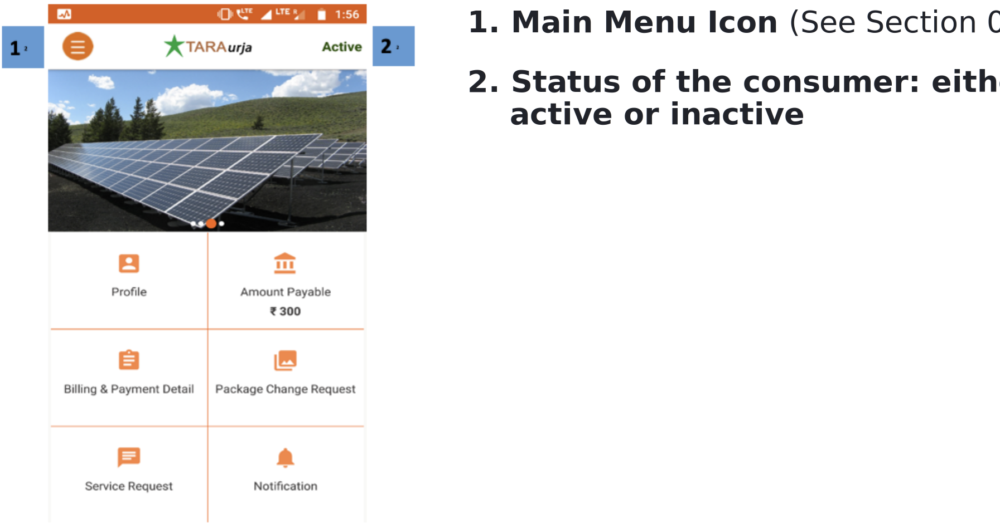
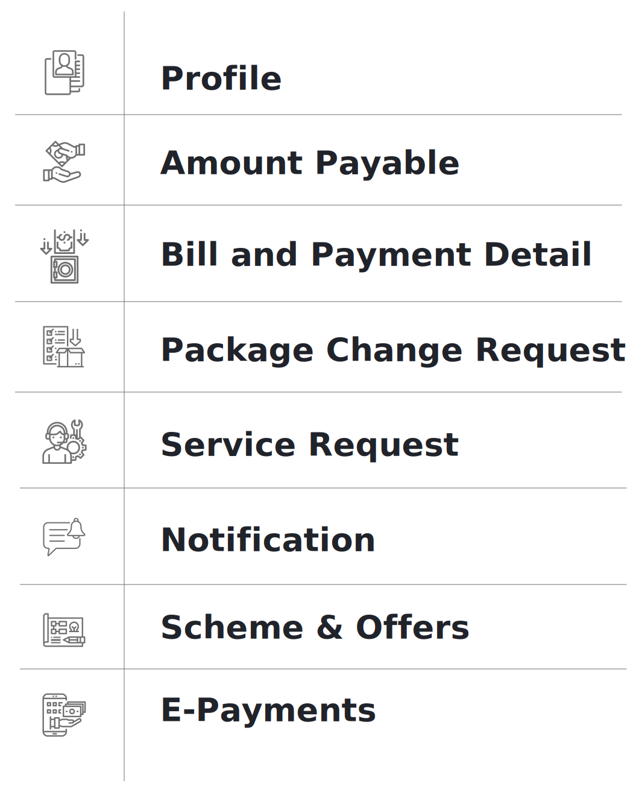

import useBaseUrl from '@docusaurus/useBaseUrl';

**Functionality**
* The Dashboard is the homes screen of the app.
* It lays out the various functionalities that can be used by the customer; these are discussed below.

**Page Details**

<!--  -->

 

  

1.  **Main Menu** icon (see Section 0)
2.  **Status** of the consumer: either active or inactive

 
  

