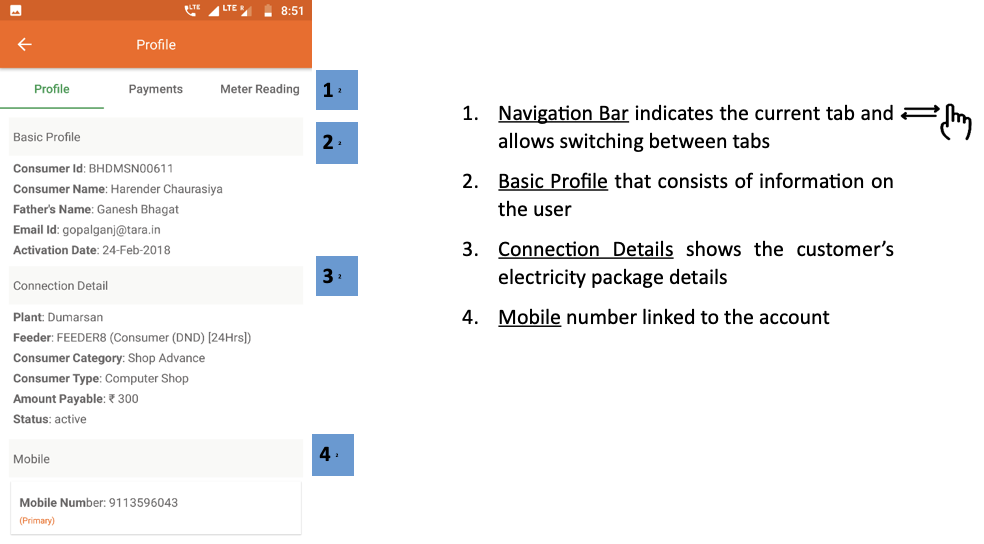
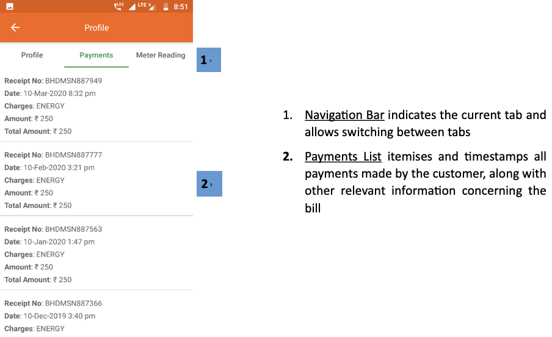
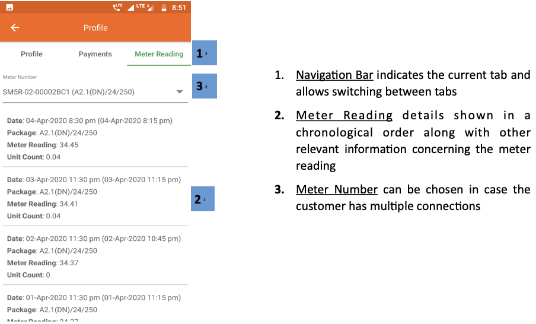

import useBaseUrl from '@docusaurus/useBaseUrl';

**Functionality**
* The Profile page gives the user access to their account details.
* This includes personal information, past payments, and energy consumption.

| Profile| Payments| Meter Readings|
|---|---|---|
| Consists of profile details of the consumer| Chronological list of individual payments| Chronological record of energy consumption|

## 4.5.1. Profile
**Functionality**
* The Profile section contains important profile information of the user

**Page Details**

 

1.  **Navigation Bar** indicates the current tab and allows switching between tabs

2.  **Basic Profile** that consists of information on the user
3.  **Connection Details** shows the customer's electricity package details
4.  **Mobile** number linked to the account

 

<!--  -->

## 4.5.2. Payments
**Functionality**
* The Payments page gives a chronological record of bills issued to the customer, and payments they have made

**Page Details**

 

  

1.  **Navigation Bar** indicates the current tab and allows switching between tabs
2.  **Payments List** itemises and timestamps all payments made by the customer, along with other relevant information concerning the bill

 

<!--  -->

## 4.5.3. Meter Readings
**Functionality**
* The Meter Reading page give a chronological list of the customer’s energy consumption.
* The frequency of meter readings will vary depending on their connection type.

**Page Details**

 

  

1.  **Navigation Bar** indicates the current tab and allows switching between tabs
2.  **Meter Reading** details shown in a chronological order along with other relevant information concerning the meter reading
3.  **Meter Number** can be chosen in case the customer has multiple connections

 

<!--  -->

