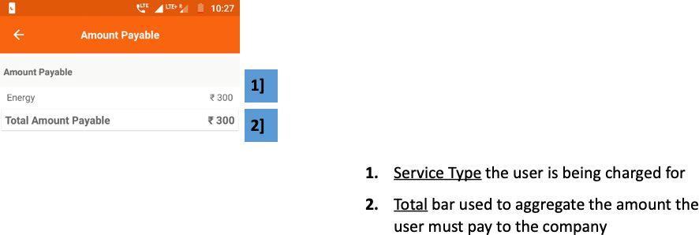

import useBaseUrl from '@docusaurus/useBaseUrl';

**Functionality**
* The Amount Payable section shows the total outstanding amount that the user must pay to the company
* The amount is broken up according to the type of service

**Page Details**

 

1.  **Service Type** the user is being charged for
2.  **Total bar** used to aggregate the amount the user must pay to the company

 

<!--  -->
