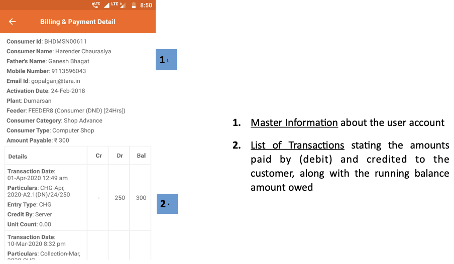

import useBaseUrl from '@docusaurus/useBaseUrl';
export const Clear = ({children}) => (
  

    {children}
  

);

**Functionality**
* The Billing and Payment Details page details each transaction (credits and debits) registered to the user account.
* The customer’s account information is also summarised.

**Page Details**

 

<Clear>

1.  <u>Master Information</u> about the user account
2.  <u>List of Transactions</u> stating the amounts paid by (debit) and credited to the customer, along with the running balance amount owed

</Clear>
 

<!--  -->