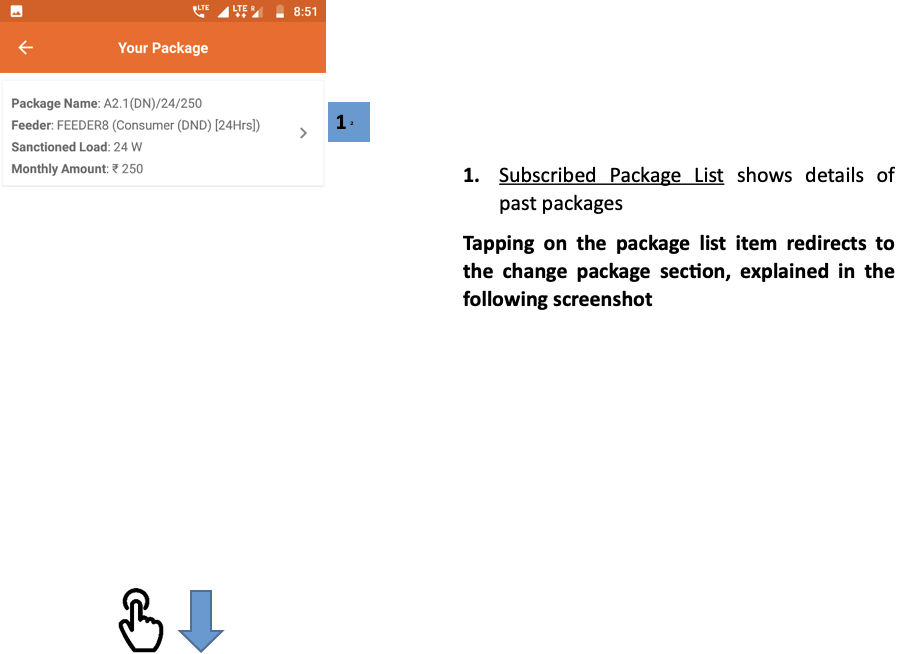
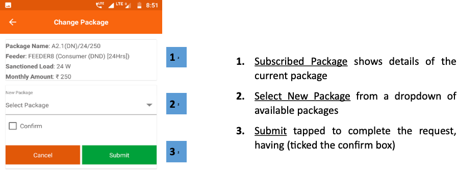

import useBaseUrl from '@docusaurus/useBaseUrl';

**Functionality**
* The Package Change Request section allows the customer to upgrade or downgrade their
electricity package.
* It also lists the customer’s past packages.

**Page Details**

 

1.  **Subscribed Package List** shows details of past packages

**Tapping on the package list item redirects to the change package section, explained in the following screenshot**

 
 

  

1.  **Subscribed Package** shows details of the current package
2.  **Select New Package** from a dropdown of available packages
3.  **Submit** tapped to complete the request, having (ticked the confirm box)

 

<!-- 

 -->
